## 1个页面4个进程
在开始之前，我们一起看下，Chrome 打开一个页面需要启动多少进程?你可以点击 Chrome 浏览器右上角的“选项”菜单，选
择“更多工具”子菜单，点击“任务管理 器”，这将打开 Chrome 的任务管理器的窗口，如下图:
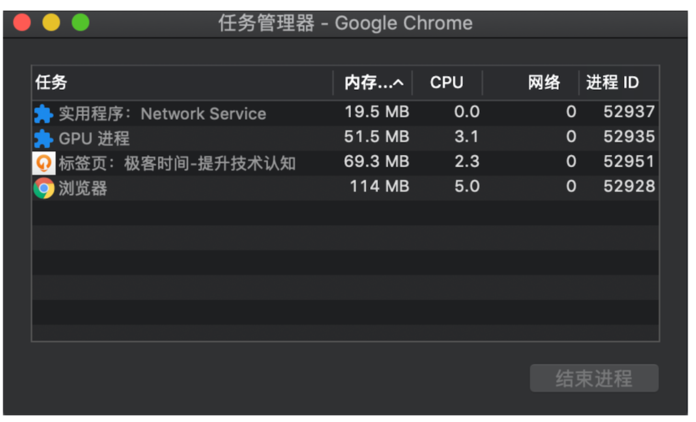
线程是不能单独存在的，它是由进程来启动和管理的,一个进程就是一个程序的运行实例。详细解释就是，启动一个程序的时候，操
作系统会为该 程序创建一块内存，用来存放代码、运行中的数据和一个执行任务的主线程，我们把这样的 一个运行环境叫进程。

- 当一个进程退出时，操作系统会回收该进程所申请的所有资源;即使其中任意线程因为操作不当导致内存泄漏，当进程退出时，这
些内存也会被正确回收;比如之前的 IE 浏览器，支持很多插件，而这些插件很容易导致内存泄漏，这意味着只要浏览器开着，内存
占用就有可能会越来越多，但是当关闭浏览器进程时，这些内存就都会被系统回收掉

- 进程之间的内容相互隔离,进程隔离是为保护操作系统中进程互不干扰的技术，每一个进程只能访问自己占有的数据，也就避免出
现进程 A 写入数据到进程 B 的情况。正是因为进程之间的数据是严格隔离的，所以一个进程如果崩溃了，或者挂起了，是不会影
响到其他进程的。如果进程之间需要进行 数据的通信，这时候，就需要使用用于进程间通信(IPC)的机制了

## chrome浏览器架构
早期单进程浏览器的架构是指浏览器的所有功能模块都是运行在同一个进程里，这些模块包含了网络、插件、JavaScript运行环
境、渲染引擎和页面等。其实早在2007年之前，市面上浏览器都是单进程的，如此多的功能模块运行在一个进程里，是导致单进
程浏览器不稳定、不流畅和不安全的一个主要因素

- 首先来说**不稳定**，早期浏览器需要借助于插件来实现诸如Web视频、Web游戏等各种强大的功能，但是插件是最容易出问题的模块，并
且还运行在浏览器进程之中，所以一个插件的意外崩溃会引起整个浏览器的崩溃。除了插件之外，渲染引擎模块也是不稳定的，通常一些
复杂的JavaScript代码就有可能引起渲染引擎模块的崩溃。和插件一样，渲染引擎的崩溃也会导致整个浏览器的崩溃

- 接下来说**不流畅**的问题，单进程浏览器由于所有页面的渲染模块、JavaScript执行环境以及插件都是运行在同一个线程中的，这就
意味着同一时刻只能有一个模块可以执行，试想假如有一个无限循环的js脚本，它会独占整个线程，这样导致其他运行在该线程中的模块
就没有机会被执行。因为浏览器中所有的页面都运行在该线程中，所以这些页面都没有机会去执行任务，这样就会导致整个浏览器失去响
应；变卡顿除了上述脚本或者插件会让单进程浏览器变卡顿外，页面的内存泄漏也是单进程变慢的一个重要原因。通常浏览器的内核都是
非常复杂的，运行一个复杂点的页面再关闭页面，会存在内存不能完全回收的情况，这样导致的问题是使用时间越长，内存占用越
高，浏览器会变得 越慢

- **不安全**是因为插件可以使用 C/C++ 等代码编写，通过插件可以获取到操作系统的任意资源，当你在页面运行一个插件时也就意味着
这个插件能完全操作你的电脑。如果是个恶意插件，那么它就可以释放病毒、窃取你的账号密码，引发安全性问题。至于页面脚本，它
可以通过浏览器的漏洞来获取系统权限，这些脚本获取系统权限之后也可以对你的电脑做一些恶意的事情，同样也会引发安全问题

最新的 Chrome 浏览器包括:1 个浏览器(Browser)主进程、1 个 GPU 进程、1 个网络(NetWork)进程、多个渲染进程和多个插件进程
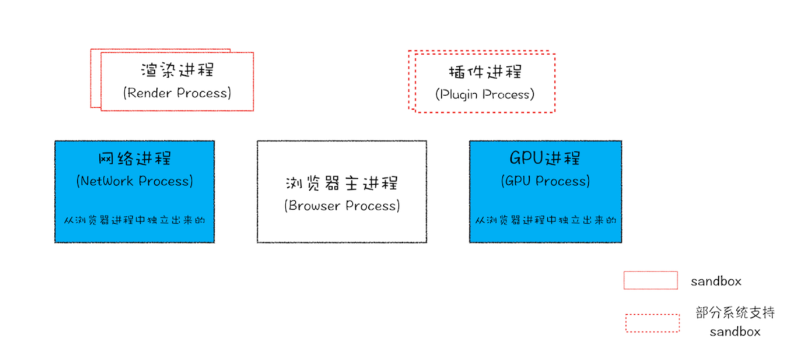
Chrome 的页面是运行在单独的渲染进程中的，同时页面里的插件也是 运行在单独的插件进程之中，而进程之间是
通过IPC机制进行通信,那么他是如何解决上述单进程浏览器的问题的呢？

- 由于进程是相互隔离的，所以当一个页面或者插件崩溃 时，影响到的仅仅是当前的页面进程或者插件进程，并不会影响到浏览器和
其他页面，这就 完美地解决了页面或者插件的崩溃会导致整个浏览器崩溃，也就是不稳定的问题

- JavaScript 也是运行在渲染进程中 的，所以即使 JavaScript 阻塞了渲染进程，影响到的也只是当前的渲染页面，而并不会
影响浏览器和其他页面，因为其他页面的脚本是运行在它们自己的渲染进程中的。所以当我们再在Chrome中运行上面那个死循环的脚
本时，没有响应的仅仅是当前的页面。对于内存泄漏的解决方法那就更简单了，因为当关闭一个页面时，整个渲染进程也会被关闭，之
后该进程所占用的内存都会被系统回收，这样就轻松解决了浏览器页面的内存泄漏问题。

- 采用多进程架构的额外好处是可以使 用安全沙箱，你可以把沙箱看成是操作系统给进程上了一把锁，沙箱里面的程序可以运行， 但
是不能在你的硬盘上写入任何数据，也不能在敏感位置读取任何数据，例如你的文档和桌 面。Chrome 把插件进程和渲染进程锁在沙箱
里面，这样即使在渲染进程或者插件进程里 面执行了恶意程序，恶意程序也无法突破沙箱去获取系统权限。


接下来我们来分析下几个进程的功能：
1. **浏览器进程**主要负责界面显示、用户交互、子进程管理，同时提供存储等功能
2. **渲染进程**核心任务是将HTML、CSS 和JavaScript转换为用户可以与之交互的网页， 排版引擎Blink和JavaScript引擎
V8都是运行在该进程中，默认情况下，Chrome会为每个Tab标签创建一个渲染进程。出于安全考虑，渲染进程都是运行在沙箱模式下
3. **gpu进程**Chrome 刚开始发布的时候是没有 GPU 进程的。而 GPU 的使用初衷 是为了实现 3D CSS 的效果，只是随后网
页、Chrome 的 UI 界面都选择采用GPU 来绘 制，这使得 GPU 成为浏览器普遍的需求。最后，Chrome在其多进程架构上也引入
了GPU进程
4. **网络进程**主要负责页面的网络资源加载，之前是作为一个模块运行在浏览器进程里面 的，直至最近才独立出来，成为一个单独的进程
5. **插件进程**主要是负责插件的运行，因插件易崩溃，所以需要通过插件进程来隔离，以保证插件进程崩溃不会对浏览器和页面造成影响

不过凡事都有两面性，虽然多进程模型提升了浏览器的稳定性、流畅性和安全性，但同样不可避免地带来了一些问题:
- 更高的资源占用。因为每个进程都会包含公共基础结构的副本(如 JavaScript 运行环 境)，这就意味着浏览器会消耗更多的内存资源
- 更复杂的体系架构。浏览器各模块之间耦合性高、扩展性差等问题，会导致现在的架构已 经很难适应新的需求了


注意通常情况下是一个页面使用一个进程，但是，有一种情况，叫"同一站点(sa me-site)"，具体地讲，我们将“同一站点”定义为根
域名(例如，geekbang.org)加上协议 (例如，https:// 或者http://)，还包含了该根域名下的所有子域名和不同的端口，比如
下面这 三个:

`https://time.geekbang.org`
`https://www.geekbang.org`
`https://www.geekbang.org:8080`

都是属于同一站点，因为它们的协议都是https，而根域名也都是geekbang.org。Chrome的默认策略是，每个标签对应一个渲染进
程。但是如果从一个页面打开了新页面，而新页面和当前页面属于同一站点时，那么新页面会复用父页面的渲染进程。官方把这个默认
策略叫pro cess-per-site-instance。直白的讲，就是如果几个页面符合同一站点，那么他们将被分配到一个渲染进程里面去。
所以，这种情况下，一个页面崩溃了，会导致同一站点的页面同时崩溃，因为他们使用了同一个渲染进程。

在一个渲染进程里面，他们就会共享JS的执行环境，也就是说A页面可以直接在B页面中执行 脚本。因为是同一家的站点，所以是有这个需求的


## TCP/IP协议
TCP/IP（Transmission Control Protocol/Internet Protocol，传输控制协议/网际协议）是指能够在多个不同网络间实现
信息传输的协议簇。TCP/IP协议不仅仅指的是TCP 和IP两个协议，而是指一个由FTP、SMTP、TCP、UDP、IP等协议构成的协议簇,只
是因为在TCP/IP协议中TCP协议和IP协议最具代表性，所以被称为TCP/IP协议。

TCP/IP协议中的四个层次，**应用层**应用层是TCP/IP协议的第一层，是直接为应用进程提供服务的
- 对不同种类的应用程序它们会根据自己的需要来使用应用层的不同协议，邮件传输应用使用了SMTP协议、万维网应用使用了HTTP协议、远程登录服务应用使用了有TELNET协议
- 应用层还能加密、解密、格式化数据
- 应用层可以建立或解除与其他节点的联系，这样可以充分节省网络资源

**运输层**作为TCP/IP协议的第二层，运输层在整个TCP/IP协议中起到了中流砥柱的作用。且在运输层中，TCP和UDP也同样起到了中流砥柱的作用

**网络层**网络层在TCP/IP协议中的位于第三层。在TCP/IP协议中网络层可以进行网络连接的建立和终止以及IP地址的寻找等功能

**网络接口层**在TCP/IP协议中，网络接口层位于第四层。由于网络接口层兼并了物理层和数据链路层所以，网络接口层既是传输数据的物理媒介，也可以为网络层提供一条准确无误的线路

完整传输流程如下图，这里的上层就是http协议等，接收端会按照 TCP 头中的序号为其排序，从而保证组成完整的数据,而一个完整的tcp连接
包含三次握手、四次挥手等
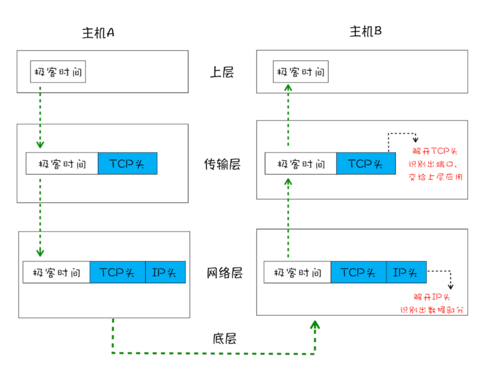

TCP 为了保证数据传输的可靠性，牺牲了数据包的传输速度，因 为“三次握手”和“数据包校验机制”等把传输过程中的数据包的数量提高了一倍


接下来我们来看下应用层的http协议是如何发送一个请求的，一个完整的请求主要经历一下八个阶段如图
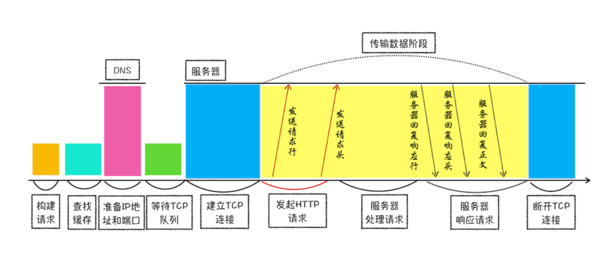
- 首先，浏览器构建请求行信息(如`GET /index.html HTTP1.1`)，构建好后，浏览器准备发起网络请求

- 在真正发起网络请求之前，浏览器会先在浏览器缓存中查询是否有要请求的文件。其中，浏览器缓存是一种在本地保存资源副本，以供下次请求时直接使用的技术

- 接下来在和服务器建立TCP连接之前，我们得获取ip地址和端口号，由于IP地址是数字标识，比如极客时间网站的IP是39.106.233.176难以
记忆，但使用极客时间的域名 (time.geekbang.org)就好记多了，所以基于这个需求又出现了一个服务，负责把域名和IP地址做一
一映射关系。这套域名映射为 IP 的系统就叫做“域名系统”，简称 DNS(Domain Name System)。所以，这样一路推导下来，你会
发现在第一步浏览器会请求DNS返回域名对应的IP。当 然浏览器还提供了DNS 数据缓存服务，如果某个域名已经解析过了，那么浏览
器会缓存解 析的结果，以供下次查询时直接使用，这样也会减少一次网络请求。拿到 IP 之后，接下来就需要获取端口号了。通常情
况下，如果 URL 没有特别指明端口 号，那么 HTTP 协议默认是 80 端口(Chrome有个机制，同一个域名同时最多只能建立6个TCP
连接，如果在同一个域名下同时有 10 个请求发生，那么其中 4 个请求会进入排队等待状态，直至进行中的请求完成。当然，如果当
前请求数量少于 6，会直接进入下一步，建立 TCP 连接)

- 接下来就是建立tcp连接，之后发送http请求，一个http请求以及返回值如下
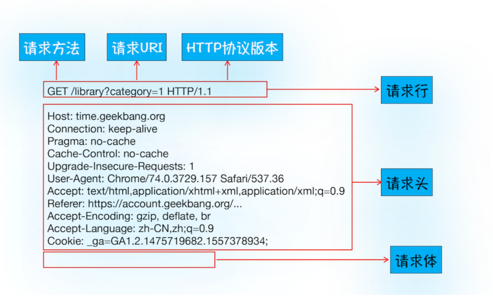
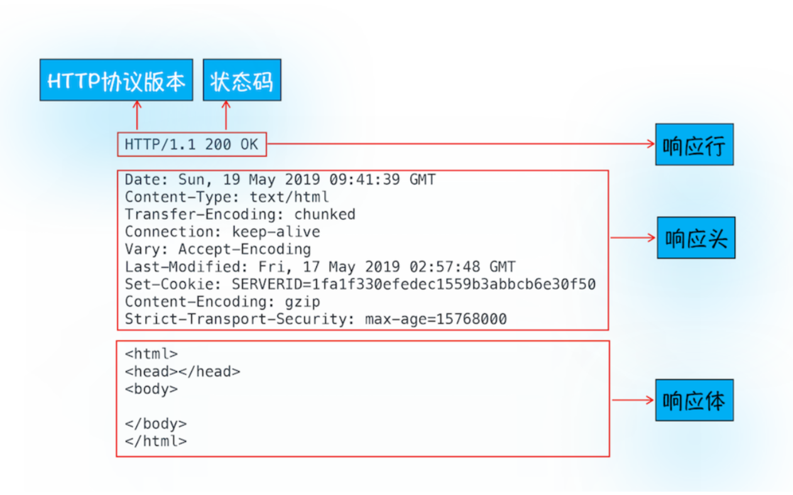

- 通常情况下，一旦服务器向客户端返回了请求数据，它就要关闭 TCP 连接。不过如果浏览器或者服务器在其头信息中加入了
`Connection:Keep-Alive`那么 TCP 连接在发送后将仍然保持打开状态，这样浏览器就可以继续通过同一个 TCP 连接发
送请求。保持 TCP 连接可以省去下次请求时需要建立连接的时间，提升资源加载速度。 比如，一个Web页面中内嵌的图片就
都来自同一个 Web 站点，如果初始化了一个持久连 接，你就可以复用该连接，以请求其他资源，而不需要重新再建立新的TCP连接。

- 响应行返回的状态码是 301，状态 301 就是告诉浏览器，我需要重定 向到另外一个网址，而需要重定向的网址正是包含在响应
头的 Location 字段中，接下来， 浏览器获取 Location 字段中的地址，并使用该地址重新导航，这就是一个完整重定向的执 行流程


### 接下来我们来简单说下从用户输入url到页面展示的过程
基本过程如下
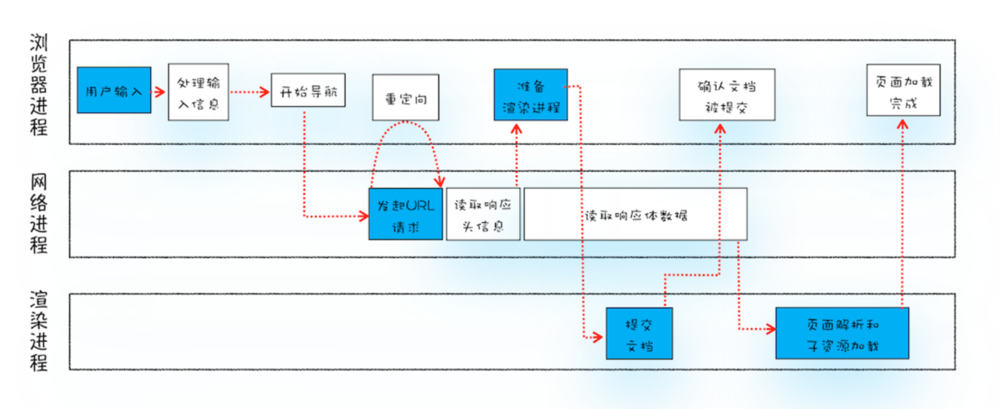
- 当用户在地址栏中输入一个查询关键字时，地址栏会判断输入的关键字是搜索内容，还是请求的 URL。 如果是搜索内容，地址栏
会使用浏览器默认的搜索引擎，来合成新的带搜索关键字的URL。如果判断输入内容符合 URL 规则，比如输入的是`time.geekbang.org`
那么地址栏会根据规则，把这段内容加上协议，合成为完整的URL`https://time.geekbang.org`;之后当你按下标签页上的图标便进
入了加载状态，但此时图中页面显示的依然是之前打开的页面内容，并没立即替换为极客时间的页面，因为需要等待提交文档阶段，页面内容才会被替换。

- 首先，用户从浏览器进程里输入请求信息;然后，网络进程发起 URL 请求;服务器响应 URL 请求之后，浏览器进程就又要开始准
备渲染进程了; 渲染进程准备好之后，需要先向渲染进程提交页面数据，我们称之为提交文档阶段;渲染进程接收完文档信息之后，便
开始解析页面和加载子资源，完成页面的渲染。 这其中，用户发出 URL 请求到页面开始解析的这个过程，就叫做导航

- 多个页面运行在同一个渲染进程中，我们将“同一站点”定义为根域名(例如，geekbang.org)加上协议(例如，https:// 或
者 http://)，还包含了该根域名下的所有子域名和不同的端口，比如下面这三个:
`https://time.geekbang.org`
`https://www.geekbang.org`
`https://www.geekbang.org:8080`
它们都是属于同一站点，因为它们的协议都是 HTTPS，而且根域名也都是 geekbang.org，Chrome 的默认策略是每个标签对应一个
渲染进程。但如果从一个页面打开了另一个新 页面，而新页面和当前页面属于同一站点的话，那么新页面会复用父页面的渲染进程。官
方 把这个默认策略叫 process-per-site-instance；总结来说，打开一个新页面采用的渲染进程策略就是: 通常情况下，打开新
的页面都会使用单独的渲染进程;如果从 A 页面打开 B 页面，且 A 和 B 都属于同一站点的话，那么 B 页面复用 A 页面的 渲染
进程;如果是其他情况，浏览器进程则会为 B 创建一个新的渲染进程


- 渲染进程准备好之后，还不能立即进入文档解析状态，因为此时的文档数据还在网络进程中，并没有提交给渲染进程，所以下一步就进
入了提交文档阶段，首先要明确一点，这里的“文档”是指 URL 请求的响应体数据。“提交文档”的消息是由浏览器进程发出的，渲染
进程接收到“提交文档”的消息后，会 和网络进程建立传输数据的“管道”。等文档数据传输完成之后，渲染进程会返回“确认提交”的消
息给浏览器进程。 浏览器进程在收到“确认提交”的消息后，会更新浏览器界面状态，包括了安全状态、地址栏的 URL、前进后退的历
史状态，并更新 Web 页面。
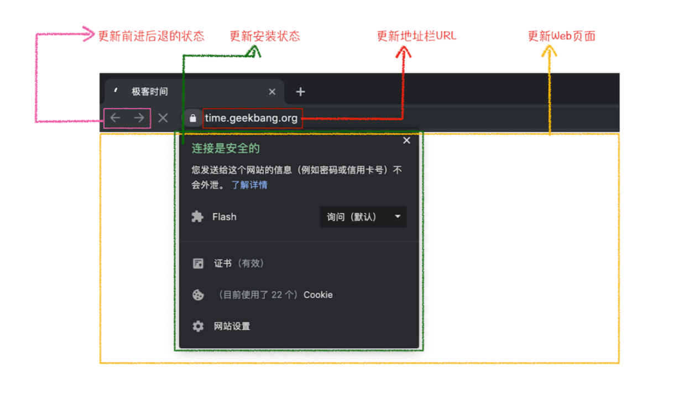

- 一旦文档被提交，渲染进程便开始页面解析和子资源加载了，关于这个阶段的完整过程，我会在下一篇文章中来专门介绍


## 渲染流程
按照渲染的时间顺序，流水线可分为如下几个子阶段:构建 DOM 树、样式计算、布局阶 段、分层、绘制、分块、光栅化和合成

构建 DOM 树的输入内容是一个非常简单的 HTML 文件，然后经由 HTML 解析器解析，最终输出树状结构的 DOM，为了更加
直观地理解 DOM 树，你可以打开 Chrome 的“开发者工具”，选 择“Console”标签来打开控制台，然后在控制台里面输
入“document”后回车，这样你 就能看到一个完整的 DOM 树结构
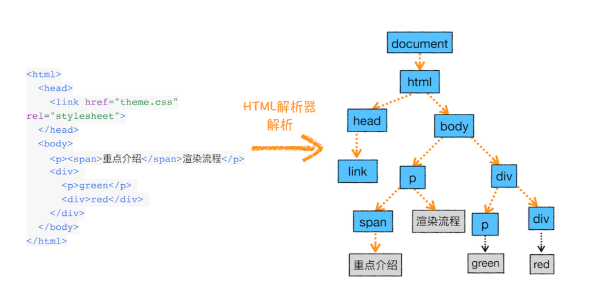
图中的 document 就是 DOM 结构，你可以看到，DOM 和 HTML 内容几乎是一样的，但 是和 HTML 不同的是，DOM 是保
存在内存中树状结构，可以通过 JavaScript 来查询或修 改其内容


样式计算的目的是为了计算出 DOM 节点中每个元素的具体样式，这个阶段大体可分为三步来完成
- 把 CSS 转换为浏览器能够理解的结构styleSheets为了加深理解，你可以在 Chrome 控制台中查看其结构，只需要在控制
台中输入 document.styleSheets这个样式表包含了很多种样式，已经把那三种来源(引用、内联、内嵌)的样式都包含进去了

- 转换样式表中的属性值，使其标准化
``` css
body { font-size: 2em }
p {color:blue;}
// 转换之后
body { font-size: 32px }
p {color: rgb(0,0,255);}
```

- 计算出 DOM 树中每个节点的具体样式,这就涉及到 CSS 的继承规则和层叠规则了

- 接着就是布局阶段
现在，我们有 DOM 树和 DOM 树中元素的样式，但这还不足以显示页面，因为我们还不 知道 DOM 元素的几何位置信息。那么接
下来就需要计算出 DOM 树中可见元素的几何位 置，我们把这个计算过程叫做布局，在布局阶段需要完成两个任务:创建布局树和布局计算

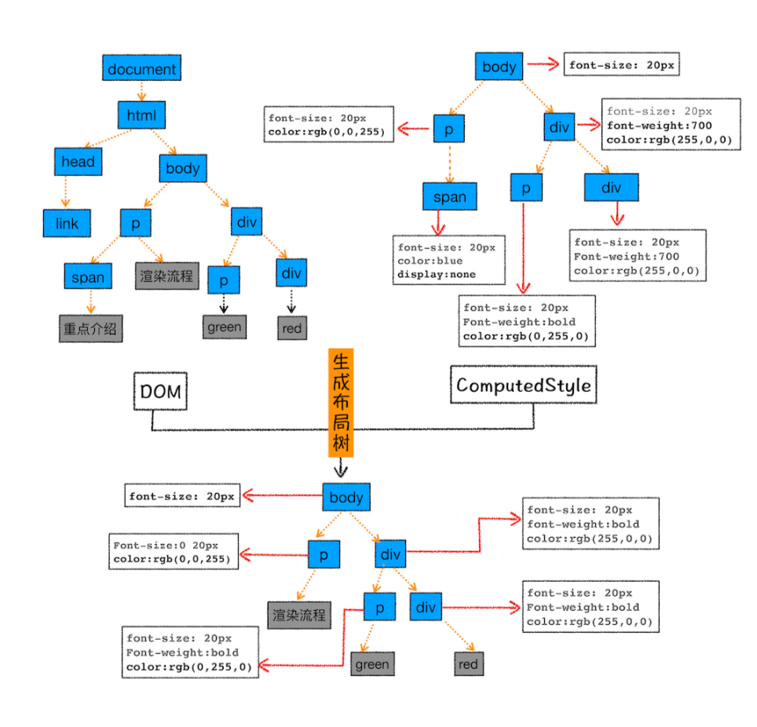
为了构建布局树，浏览器大体上完成了下面这些工作:遍历 DOM 树中的所有可见节点，并把这些节点加到布局中;而不可见的节点会
被布局树忽略掉，如 head 标签下面的全部内容，再比如 body.p.span 这个元素，因为它的属性包含 dispaly:none，所以
这个元素也没有被包进 布局树。

在执行布局操作的时候，会把布局运算的结果重新写回布局树中，所以布局树既是输入内容 也是输出内容，这是布局阶段一个不
合理的地方，因为在布局阶段并没有清晰地将输入内容 和输出内容区分开来。

- 分层
现在有了布局树，而且每个元素的具体文字和信息都计算出来了，因为页面中有很多复杂的效果，如一些复杂的 3D 变换、页面滚
动，或者使用 z-indexing 做 z 轴排序等，为了更加方便地实现这些效果，渲染引擎还需要为特定的节点生成专用的 图层，并
生成一棵对应的图层树(LayerTree)浏览器的页面实际上被分成了很多图层，这些图层叠加后合成了最终的页面

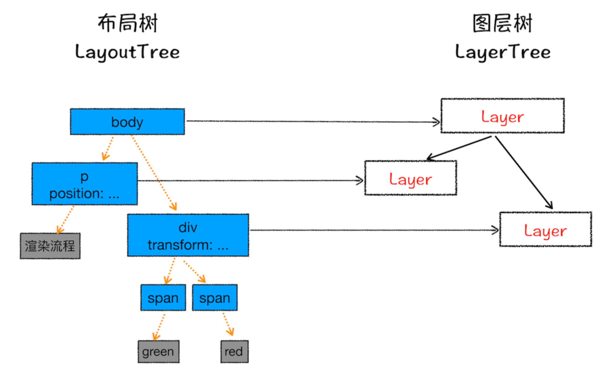
并不是布局树的每个节点都包含一个图层，如果一个节点没有对应的层，那么 这个节点就从属于父节点的图层，如上图中的span标
签没有专属图层，那么它们就从属于 它们的父节点图层。但不管怎样，最终每一个节点都会直接或者间接地从属于一个层

定位属性的元素、定义透明属性的元素、使用 CSS 滤镜的元素等，等拥有层叠上下文属性，拥有层叠上下文属性的元素会被提升为单独的一层
出现这种裁剪情况的时候，渲染引擎会为文字部分单独创建一个层，如果出现滚动条，滚动条也会被提升为单独的层

- 图层绘制
在完成图层树的构建之后，渲染引擎会对图层树中的每个图层进行绘制,会把一个图层的绘制拆分成很多小的绘制指令，然后再 把这些
指令按照顺序组成一个待绘制列表,绘制列表中的指令其实非常简单，就是让其执行一个简单的绘制操作，比如绘制粉色矩形或者黑色的线等

接下来进行栅格化(raster)操作,绘制列表只是用来记录绘制顺序和绘制指令的列表，当图层的绘制列表准备好之后，主线程会把该绘
制列表提交(commit)给合成线程,而实际上绘制操作是由渲染引擎中的合成线程来完成的

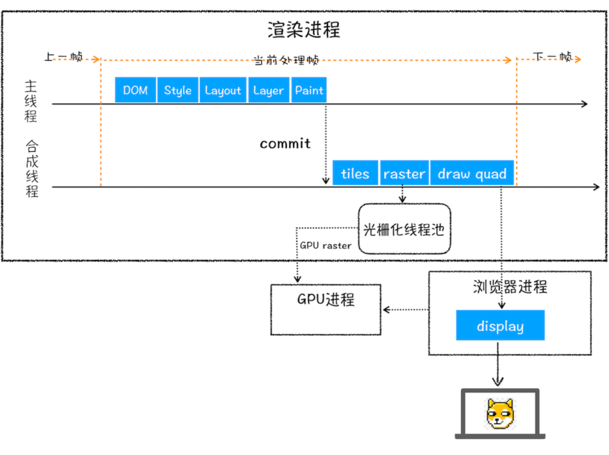
1. 合成线程会将图层划分为图块(tile)，这些图块的大小通常是 256x256 或者 512x512
2. 合成线程会按照视口(通常一个页面可能很大，但是用户只能看到其中的一部分，我们把用户可以看到的这个部分 叫做视口)附近的图块
来优先生成位图，实际生成位图的操作是由栅格化来执行的。所谓栅格化，是指将图块转换为位图,而图块是栅格化执行的最小单位。渲染
进程维 护了一个栅格化的线程池，所有的图块栅格化都是在线程池内执行的
3. 栅格化过程都会使用 GPU 来加速生成，使用 GPU 生成位图的过程叫快速栅格化， 或者 GPU 栅格化，生成的位图被保存在 GPU 内存中
4. 一旦所有图块都被光栅化，合成线程就会生成一个绘制图块的命令——“DrawQuad”， 然后将该命令提交给浏览器进程。浏览器进
程里面有一个叫 viz 的组件，用来接收合成线程发过来的DrawQuad命令，然后根据DrawQuad命令，将其页面内容绘制到内存中，最后再将内存显示在屏幕上


## JavaScript的变量提升,词法环境
变量提升问题如果变量和函数同名，那么在编译阶段，变量的声明会被忽略
函数调用自身，称为递归。如果尾调用自身，就称为尾递归
``` js
function factorial(n, total) {
  if (n === 1) return total;
  return factorial(n - 1, n + total);
}
```
上面就是尾递归优化,但是只在严格模式下开启，正常模式是无效的，会造成溢出，这是因为在正常模式下，函数内部有两个变量，
可以跟踪函数的调用栈
`func.arguments`：返回调用时函数的参数。
`func.caller`：返回调用当前函数的那个函数
尾调用优化发生时，函数的调用栈会改写，因此上面两个变量就会失真。严格模式禁用这两个变量，所以尾调用模式仅在严格模式下生效
那么只要减少调用栈，就不会溢出只能采用“循环”换掉“递归”，蹦床函数（trampoline）可以将递归执行转为循环执行
``` js
function trampoline(f) {
  while (f && f instanceof Function) {
    f = f();
  }
  return f;
}
function factorial(n, total) {
    if (n === 1) return total;
    return factorial.bind(null,n - 1, n + total);
}
trampoline(factorial(100000, 1));
```

es6中的const和let通过词法环境来实现块级作用域
``` js
function foo(){
  var a = 1
  let b = 2
  {
    let b = 3
    var c = 4
    let d = 5
    console.log(a)
    console.log(b)
  }
  console.log(b)
  console.log(c)
  console.log(d)
 }
foo()  // 1、3、2、4、'd is not defined'
```
函数执行的上下文如下，注意当作用域块执行结束之后，其内部定义的变量就会从词法环境的栈顶弹出
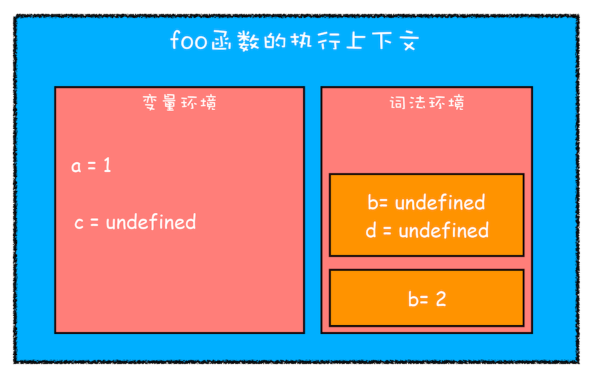


## 作用域链和闭包
其实在每个执行上下文的变量环境中，都包含了一个外部引用，用来指向外部的执行上下文，我们把这个外部引用称为outer。当一段
代码使用了一个变量时，JavaScript引擎首先会在“当前的执行上下文”中查找该变量，比如上面那段代码在查找 myName 变量
时，如果在当前的变量环境中没有查找到，那么 JavaScript 引擎会继续在 outer 所指向的执行上下文中查找，如图
``` js
function bar() {
  console.log(myName)
}
function foo() {
  var myName = "极客邦"
  bar()
}
var myName = "极客时间"
foo()
```
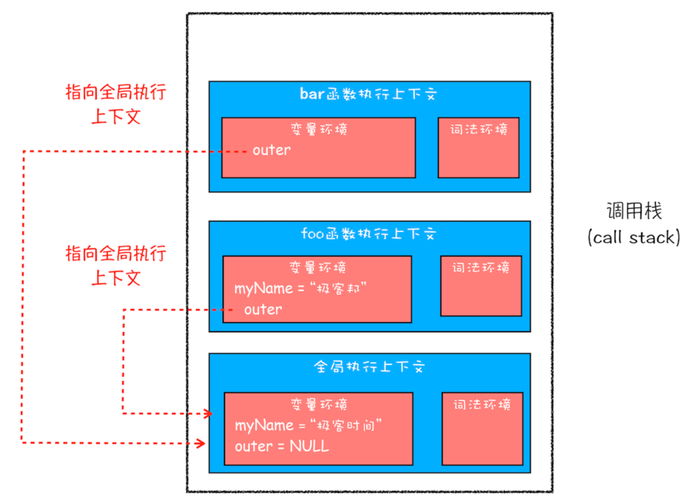
上面那个查找的链条就称为作用域链，其作用域链是由词法作用域决定的，**词法作用**域就是指作用域是由代码中函数声明的位置来决
定的，所以词法作用域是静态的作用域，通过它就能够预测代码在执行过程中如何查找标识符
``` js
let count = 1;
function main() {
  let count = 2;
  function bar() {
    let count = 3;
    function foo() {
      let count = 4;
    }
  }
}
```
词法作用域就是根据代码的位置来决定的，是代码阶段就决定好的，和函数是怎么调用的没有关系,其中 main 函数包含了 bar函
数，bar 函数中包含了 foo 函数，因为 JavaScript作用域链是由词法作用域决定的，所 以整个词法作用域链的顺序
是:foo 函数作用域—>bar 函数作用域—>main 函数作用域 —> 全局作用域


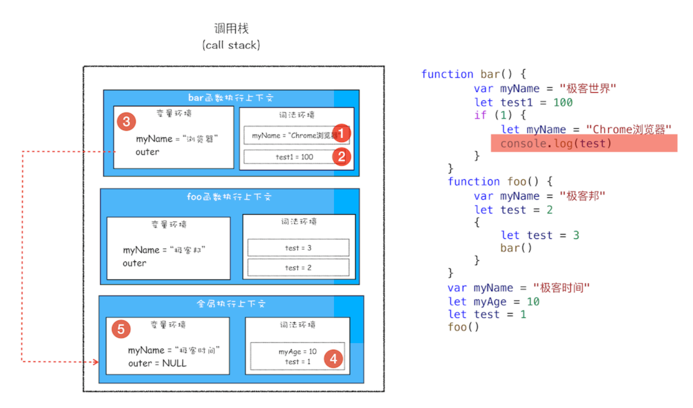
块级作用域中查找变量如上图，现在是执行到 bar 函数的 if 语块之内，需要打印出来变量 test，那么就需要查找到test变量的
值，其查找过程我已经在上图中使用序号 1、2、3、4、5 标记出来了

接下来我们来看看闭包
``` js
function foo() {
  var myName = " 极客时间 "
  let test1 = 1
  const test2 = 2
  var innerBar = {
    getName:function(){
        console.log(test1)
        return myName
    },
    setName:function(newName){
      myName = newName
    }
  }
  return innerBar
}
var bar = foo();
bar.setName(" 极客邦 ")
bar.getName()
console.log(bar.getName())
```
在 JavaScript 中，根据词法作用域的 规则，内部函数总是可以访问其外部函数中声明的变量，当通过调用一个外部函数返回一
个内部函数后，即使该外部函数已经执行结束了，但是内部函数引用外部函数的变量依然保存在内存中，我们就把这些变量的集合称
为闭包。比如外部函数是 foo，那么这些变量的集 合就称为 foo 函数的闭包。
上面函数会沿着`当前执行上下文–>foo 函数闭包–> 全局执行上下文`来查找
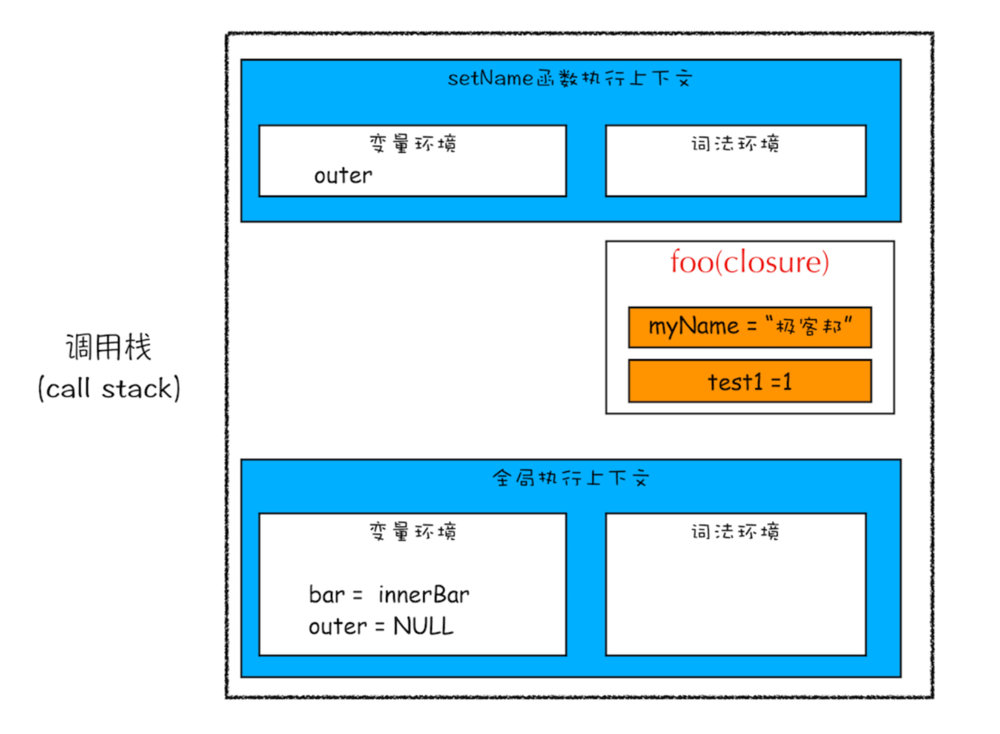
接下来我们就站在内存分析的角度分析这段代码的执行流程：
- 当 JavaScript 引擎执行到 foo 函数时，首先会编译，并创建一个空执行上下文。
- 在编译过程中，遇到内部函数 setName，JavaScript 引擎还要对内部函数做一次快速的词法扫描，发现该内部函数引用
了 foo 函数中的 myName 变量，由于是内部函数引 用了外部函数的变量，所以 JavaScript 引擎判断这是一个闭包，于
是在堆空间创建换 一个“closure(foo)”的对象(这是一个内部对象，JavaScript 是无法访问的)，用来 保存 myName 变量
- 接着继续扫描到 getName 方法时，发现该函数内部还引用变量 test1，于是 JavaScript 引擎又将 test1 添加
到“closure(foo)”对象中。这时候堆中 的“closure(foo)”对象中就包含了 myName 和 test1 两个变量了
- 由于 test2 并没有被内部函数引用，所以 test2 依然保存在调用栈中
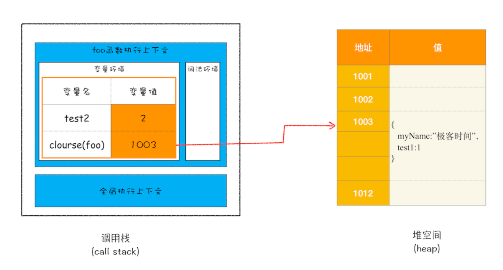
从上图你可以清晰地看出，当执行到 foo 函数时，闭包就产生了;当 foo 函数执行结束之 后，返回的 getName 和 setName 方
法都引用“clourse(foo)”对象，所以即使 foo 函数 退出了，“clourse(foo)”依然被其内部的 getName 和 setName 方法
引用。所以在下次 调用bar.setName或者bar.getName时，创建的执行上下文中就包含 了“clourse(foo)”

总的来说，产生闭包的核心有两步:第一步是需要预扫描内部函数;第二步是把内部函数引用的外部变量保存到堆中

## 执行上下文的视角讲清楚this以及堆栈
首先我们得明白作用域链和this是完全没有关系的两套系统，我们提到执行上下文中包含了变量环境、词法环境、外部环境，但其实
还有一个this没有提及，this是和执行上下文绑定的，也就是说每个执行上下文中都有一个this

首先抛出两个点：在全局环境中调用一个函数，函数内部的 this 指向的是全局变量 window;通过一个对象来调用其内部的一个
方法，该方法的执行上下文中的 this 指向对象本身;

``` js
var test = {
  name: 'fadf',
  showthis: function() {
    console.log(this);
    function bar() {
      console.log(this);
    }
    bar();
  }
}
```
嵌套函数中的this不会从外层函数中继承:你会发现函数bar中的this指向的是全局window对象，而函数showThis中的this指向
的是myObj对象;

- 当函数被正常调用时，在严格模式下，this 值是 undefined，非严格模式下 this 指向的是全局对象 window;
- 嵌套函数中的 this 不会继承外层函数的 this 值
- 下箭头函数，因为箭头函数没有自己的执行上下文，所以箭头函数的 this 就是它外层函数的 this

如下面的函数执行，由于 JavaScript 引擎判断右边的值是一个引用类型，JavaScript 引擎并不是直接将该对象存放到变量环境
中，而是将 它分配到堆空间里面，分配后该对象会有一个在“堆”中的地址，然后再将该数据的地址写进c的变量值
``` js
function foo(){
  var a = " 极客时间 "
  var b = a
  var c = {name:" 极客时间 "}
  var d = c
}
foo()
```
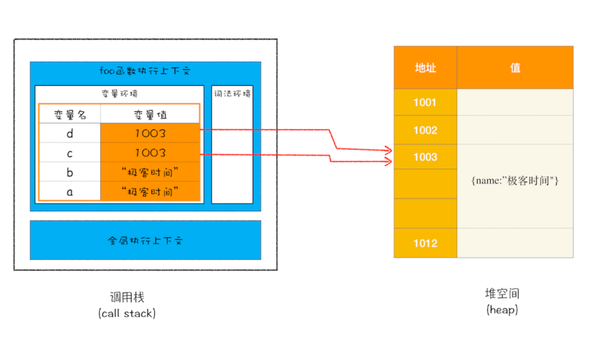


## 垃圾回收机制


