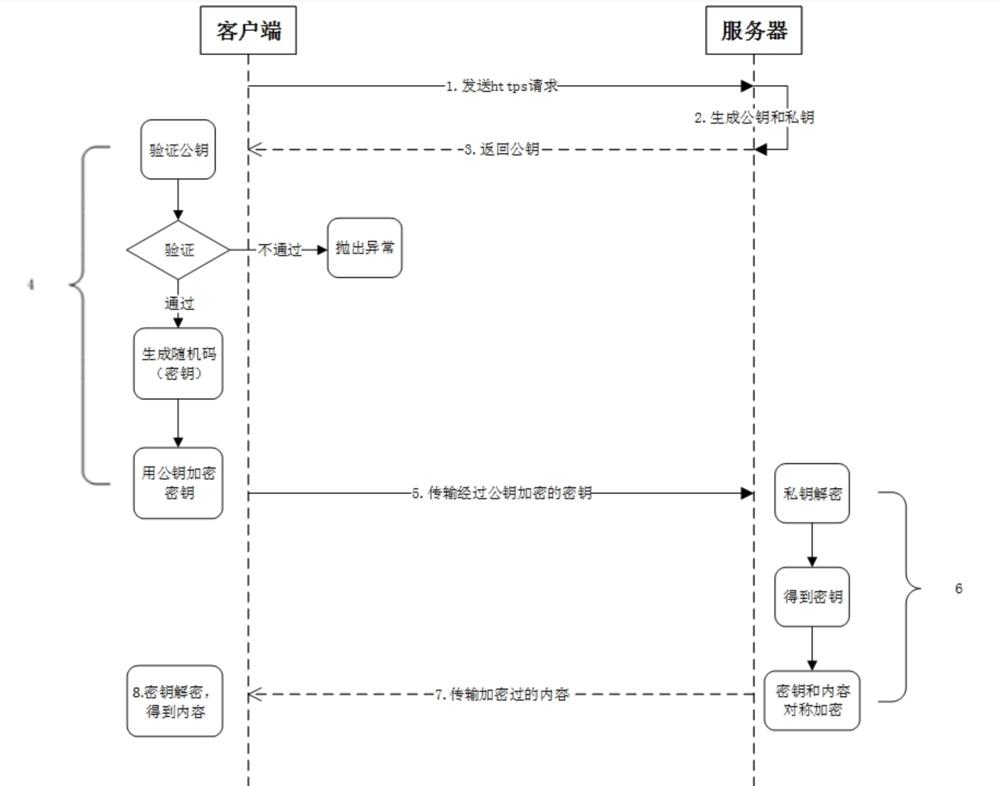
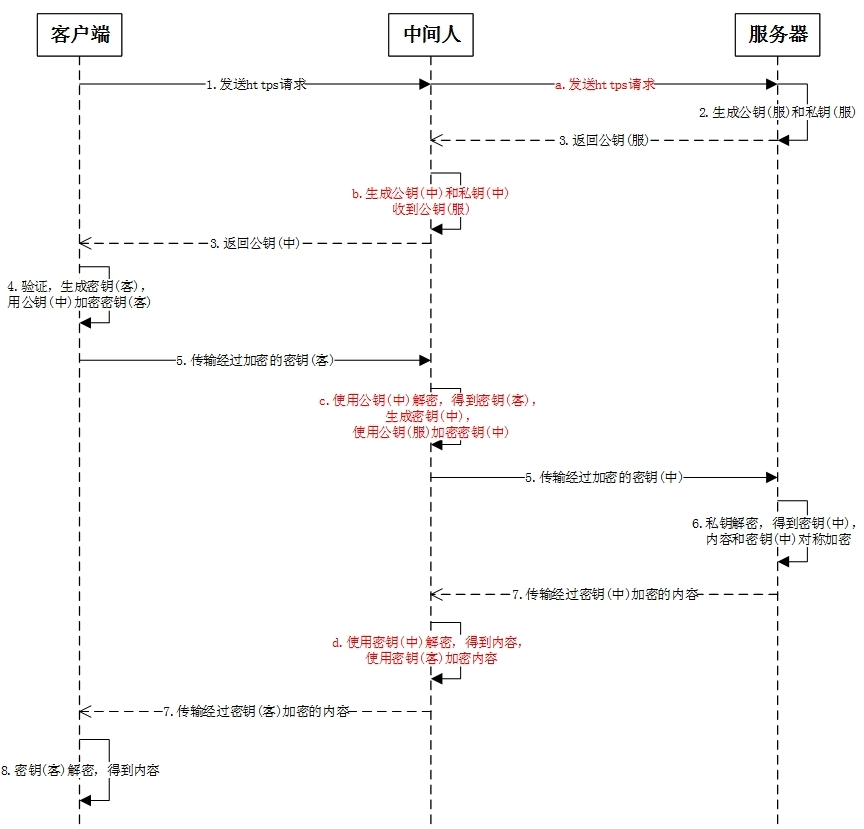
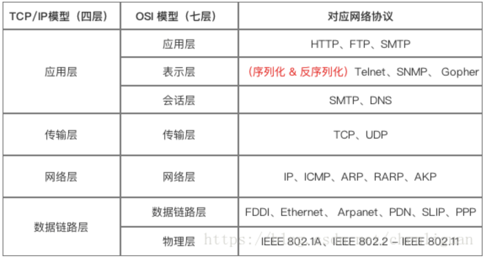
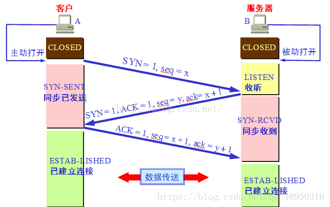

## http缓存
缓存可以说是性能优化中简单高效的一种优化方式了,接下来的内容中我们将通过缓存位置、缓存策略以及实际场景应用缓存策略来
探讨浏览器缓存机制

### 缓存位置
从缓存位置上来说分为四种，并且各自有优先级，当依次查找缓存且都没有命中的时候，才会去请求网络：Service Worker，
Memory Cache，Disk Cache，Push Cache

#### Service Worker
- Service Worker 是运行在浏览器背后的独立线程，一般可以用来实现缓存功能。使用 Service Worker的话，传输协议必须为
HTTPS。因为 Service Worker 中涉及到请求拦截，所以必须使用 HTTPS 协议来保障安全。Service Worker 的缓存与浏览器
其他内建的缓存机制不同，它可以让我们自由控制缓存哪些文件、如何匹配缓存、如何读取缓存，并且缓存是持续性的

- Service Worker 实现缓存功能一般分为三个步骤：首先需要先注册 Service Worker，然后监听到 install 事件以后就可以
缓存需要的文件，那么在下次用户访问的时候就可以通过拦截请求的方式查询是否存在缓存，存在缓存的话就可以直接读取缓存文件，否
则就去请求数据。其实就是一些js的api来写

- 当 Service Worker 没有命中缓存的时候，我们需要去调用 fetch 函数获取数据。也就是说，如果我们没有在 Service Worker
命中缓存的话，会根据缓存查找优先级去查找数据。但是不管我们是从 Memory Cache 中还是从网络请求中获取的数据，浏览器都会显
示我们是从 Service Worker 中获取的内容

- PWA就是渐进式web应用(Progressive Web App)。16年初Google便提出PWA，其弥补了web对比Native App急缺的几个能力，比
如离线使用、后台加载、添加到主屏和消息推送等，同时它还具备了小程序标榜的“无需安装、用完即走”的特性；虽然PWA技术已经被W3C
列为标准，但受到苹果的阻碍，原因在于PWA绕过Apple Store审核，直接推给用户。如果普及，这将威胁到苹果的平台权威，也就意味着苹果与
开发者的三七分成生意将会落空。所以一直以来safrai不支持mainfest以及service worker这两项关键技术，即使在18年开始支
持了，但是对PWA的支持力度也远远低于安卓，具体体现在service worker缓存无法永久保存，以及service worker的API支持不
够完善，一个最明显的不同在于安卓版本的PWA会保留你的登录状态，并且会系统级推送消息。而在苹果上，这两点都做不到。也就是
说，iPhone上的微博PWA，每次打开都要重新登录，而且不会收到任何推送信息；另外由于某些不可描述的原因，在国内无法使
用Service Worker的推送功能，虽然国内已经有两家公司做了service worker的浏览器推送，但是成熟度还有待调研；由于目前
各版本手机浏览器对service worker的支持度都不太相同，同一个接口也存在差异化还有待统一，之于我们来说，也只能用
Service Worker做一做PC浏览器的缓存了

#### Memory Cache
- Memory Cache 也就是内存中的缓存，主要包含的是当前中页面中已经抓取到的资源,例如页面上已经下载的样式、脚本、图片等。读
取内存中的数据肯定比磁盘快,内存缓存虽然读取高效，可是缓存持续性很短，会随着进程的释放而释放。 一旦我们关闭 Tab 页面，内存
中的缓存也就被释放了，计算机中的内存一定比硬盘容量小得多，操作系统需要精打细算内存的使用，所以能让我们使用的内存必然不多。
当我们访问过页面以后，再次刷新页面，可以发现很多数据都来自于内存缓存

- 内存缓存中有一块重要的缓存资源是preloader相关指令（例如`<link rel="prefetch">`）下载的资源。总所周知preloader
的相关指令已经是页面优化的常见手段之一，它可以一边解析js/css文件，一边网络请求下一个资源

- 需要注意的事情是，内存缓存在缓存资源时并不关心返回资源的HTTP缓存头Cache-Control是什么值，同时资源的匹配也并非仅仅是
对URL做匹配，还可能会对Content-Type，CORS等其他特征做校验

#### Disk Cache
- Disk Cache 也就是存储在硬盘中的缓存，读取速度慢点，但是什么都能存储到磁盘中，比之 Memory Cache 胜在容量和存储时效性上

- 在所有浏览器缓存中，Disk Cache 覆盖面基本是最大的。它会根据 HTTP Herder 中的字段判断哪些资源需要缓存，哪些资源可
以不请求直接使用，哪些资源已经过期需要重新请求。并且即使在跨站点的情况下，相同地址的资源一旦被硬盘缓存下来，就不会再次
去请求数据。绝大部分的缓存都来自 Disk Cache

#### Push Cache
Push Cache（推送缓存）是 HTTP/2 中的内容，当以上三种缓存都没有命中时，它才会被使用。它只在会话（Session）中存在，一
旦会话结束就被释放，并且缓存时间也很短暂，在Chrome浏览器中只有5分钟左右，同时它也并非严格执行HTTP头中的缓存指令
- 所有的资源都能被推送，并且能够被缓存,但是 Edge 和 Safari 浏览器支持相对比较差
- 可以推送 no-cache 和 no-store 的资源
- 一旦连接被关闭，Push Cache 就被释放
- 多个页面可以使用同一个HTTP/2的连接，也就可以使用同一个Push Cache。这主要还是依赖浏览器的实现而定，出于对性能的考虑，有的浏览器会对相同域名但不同的tab标签使用同一个HTTP连接。
- Push Cache 中的缓存只能被使用一次
- 浏览器可以拒绝接受已经存在的资源推送
- 你可以给其他域名推送资源

### 缓存策略
那么为了性能上的考虑，大部分的接口都应该选择好缓存策略，通常浏览器缓存策略分为两种：强缓存和协商缓存，并且缓存策略都是通过设置 HTTP Header 来实现的

#### 强缓存
强缓存：不会向服务器发送请求，直接从缓存中读取资源，在chrome控制台的Network选项中可以看到该请求返回200的状态码，并且
Size显示from disk cache或from memory cache。强缓存可以通过设置两种 HTTP Header 实现：Expires 和 Cache-Control

**Expires**缓存过期时间，用来指定资源到期的时间，是服务器端的具体的时间点。也就是说，Expires=max-age + 请求时间，需
要和Last-modified结合使用。Expires是Web服务器响应消息头字段，在响应http请求时告诉浏览器在过期时间前浏览器可以直接从浏
览器缓存取数据，而无需再次请求，Expires 是 HTTP/1 的产物，受限于本地时间，如果修改了本地时间，可能会造成缓存失效

在HTTP/1.1中，**Cache-Control**是最重要的规则，主要用于控制网页缓存。比如当Cache-Control:max-age=300时，则代表
在这个请求正确返回时间（浏览器也会记录下来）的5分钟内再次加载资源，就会命中强缓存, 可以在请求头或者响应头中设置，并且可
以组合使用多种指令，他的值大概介绍几个
- public所有内容都将被缓存（客户端和代理服务器都可缓存）。具体来说响应可被任何中间节点缓存，如Browser <-- proxy1 
<-- proxy2 <-- Server，中间的proxy可以缓存资源，比如下次再请求同一资源proxy1直接把自己缓存的东西给 Browser 而不再向proxy2要

- private所有内容只有客户端可以缓存，Cache-Control的默认取值。具体来说，表示中间节点不允许缓存，对于Browser <-- 
proxy1 <-- proxy2 <-- Server，proxy 会老老实实把Server 返回的数据发送给proxy1,自己不缓存任何数据。当下次Browser
再次请求时proxy会做好请求转发而不是自作主张给自己缓存的数据。

- no-cache客户端缓存内容，是否使用缓存则需要经过协商缓存来验证决定。表示不使用 Cache-Control的缓存控制方式做前置验证
，而是使用 Etag 或者Last-Modified字段来控制缓存。需要注意的是，no-cache这个名字有一点误导。设置了no-cache之后，并不
是说浏览器就不再缓存数据，只是浏览器在使用缓存数据时，需要先确认一下数据是否还跟服务器保持一致。

- no-store所有内容都不会被缓存，即不使用强制缓存，也不使用协商缓存

- max-agemax-age=xxx (xxx is numeric)表示缓存内容将在xxx秒后失效

- s-maxage（单位为s)：同max-age作用一样，只在代理服务器中生效（比如CDN缓存）。比如当s-maxage=60时，在这60秒中，即
使更新了CDN的内容，浏览器也不会进行请求。max-age用于普通缓存，而s-maxage用于代理缓存。s-maxage的优先级高于max-age
。如果存在s-maxage，则会覆盖掉max-age和Expires header


Expires 是http1.0的产物，Cache-Control是http1.1的产物，两者同时存在的话，Cache-Control优先级高于Expires；在某
些不支持HTTP1.1的环境下，Expires就会发挥用处。所以Expires其实是过时的产物，现阶段它的存在只是一种兼容性的写法。强缓存
判断是否缓存的依据来自于是否超出某个时间或者某个时间段，而不关心服务器端文件是否已经更新，这可能会导致加载文件不是服务器
端最新的内容，那我们如何获知服务器端内容是否已经发生了更新呢？此时我们需要用到协商缓存策略

### 协商缓存
协商缓存就是强制缓存失效后，浏览器携带缓存标识向服务器发起请求，由服务器根据缓存标识决定是否使用缓存的过程，协商缓存可以
通过设置两种 HTTP Header 实现：Last-Modified(HTTP/1.0)和 ETag

#### Last-Modified和If-Modified-Since
- 浏览器在第一次访问资源时，服务器返回资源的同时，在response header中添加 Last-Modified的header，值是这个资源在服务器
上的最后修改时间，浏览器接收后缓存文件和header

- 浏览器下一次请求这个资源，浏览器检测到有 Last-Modified这个header，于是添加If-Modified-Since这个header，值就是
Last-Modified中的值；服务器再次收到这个资源请求，会根据 If-Modified-Since 中的值与服务器中这个资源的最后修改时间
对比，如果没有变化，返回304和空的响应体，直接从缓存读取，如果If-Modified-Since的时间小于服务器中这个资源的最后修改
时间，说明文件有更新，于是返回新的资源文件和200

- 但是 Last-Modified 存在一些弊端，如果本地打开缓存文件，即使没有对文件进行修改，但还是会造成 Last-Modified 被修改，
服务端不能命中缓存导致发送相同的资源；因为 Last-Modified 只能以秒计时，如果在不可感知的时间内修改完成文件，那么服务端
会认为资源还是命中了，不会返回正确的资源

#### ETag和If-None-Match
在 HTTP / 1.1 出现了 ETag 和If-None-Match，Etag是服务器响应请求时，返回当前资源文件的一个唯一标识(由服务器生成)，
只要资源有变化，Etag就会重新生成。浏览器在下一次加载资源向服务器发送请求时，会将上一次返回的Etag值放到request header
里的If-None-Match里，服务器只需要比较客户端传来的If-None-Match跟自己服务器上该资源的ETag是否一致，就能很好地判断
资源相对客户端而言是否被修改过了。如果服务器发现ETag匹配不上，那么直接以常规GET 200回包形式将新的资源（当然也包括了
新的ETag）发给客户端；如果ETag是一致的，则直接返回304知会客户端直接使用本地缓存即可

#### 两者对比
- 首先在精确度上，Etag要优于Last-Modified；Last-Modified的时间单位是秒，如果某个文件在1秒内改变了多次，那么他们的
Last-Modified其实并没有体现出来修改，但是Etag每次都会改变确保了精度；如果是负载均衡的服务器，各个服务器生成的Last-Modified也有可能不一致

- 第二在性能上，Etag要逊于Last-Modified，毕竟Last-Modified只需要记录时间，而Etag需要服务器通过算法来计算出一个hash值

- 第三在优先级上，服务器校验优先考虑Etag

强制缓存优先于协商缓存进行，若强制缓存(Expires和Cache-Control)生效则直接使用缓存，若不生效则进行协商缓存
(Last-Modified / If-Modified-Since和Etag / If-None-Match)，协商缓存由服务器决定是否使用缓存，若协商缓存失效，那
么代表该请求的缓存失效，返回200，重新返回资源和缓存标识，再存入浏览器缓存中；生效则返回304，继续使用缓存；如果什么缓存
策略都没设置，浏览器会采用一个启发式的算法，通常会取响应头中的 Date 减去 Last-Modified 值的 10% 作为缓存时间


### 实际场景应用缓存策略
- 对于频繁变动的资源，首先需要使用Cache-Control: no-cache 使浏览器每次都请求服务器，然后配合 ETag 或者
Last-Modified 来验证资源是否有效。这样的做法虽然不能节省请求数量，但是能显著减少响应数据大小

- 不常变化的资源，给它们的 Cache-Control 配置一个很大的 max-age=31536000 (一年)，这样浏览器之后请求相同的 URL 会命
中强制缓存。而为了解决更新的问题，就需要在文件名(或者路径)中添加 hash， 版本号等动态字符，之后更改动态字符，从而达到更改
引用 URL 的目的，让之前的强制缓存失效 (其实并未立即失效，只是不再使用了而已)。在线提供的类库 
(如 jquery-3.3.1.min.js,lodash.min.js 等) 均采用这个模式

### 用户行为对浏览器缓存的影响
- 打开网页，地址栏输入地址： 查找 disk cache 中是否有匹配。如有则使用；如没有则发送网络请求。
- 普通刷新 (F5)：因为 TAB 并没有关闭，因此 memory cache 是可用的，会被优先使用(如果匹配的话)。其次才是 disk cache。
- 强制刷新 (Ctrl + F5)：浏览器不使用缓存，因此发送的请求头部均带有 Cache-control: no-cache(为了兼容，还带了 Pragma: no-cache),服务器直接返回 200 和最新内容

## 前端缓存
- webstorage网络存储就是讲 localstorage和sessionstorage 网络存储为每个域提供5MB简单的键值形式的存储空间，在ios上
网络存储可以存储utf-16格式的字符串文本，这意味着每个字符需要两倍多的字节，所以在ios上存储的实际上是2.5MB,从localStorage获
取数据比内存中慢得多，还不包括对json字符串解码增加的成本(localStorage只能存储字符串,而且它最终的值也是存储在本地内存)

- application storage应用缓存，也就是h5的离线缓存,在html标签中写上manifest="clock.manifest"，并在同级目录下面建
立clock.manifest文件，理论上随便什么后缀名都可以，但是一般写manifest文件的更新是它最大的难点，也是现在慎重使用的原因
自动更新浏览器除了在第一次访问Web应用时缓存资源外,只会在cache manifest文件本身发生变化时更新缓存，而cache manifest 
中的资源文件发生变化并不会触发更新。开发者也可以手动更新缓存。方法是检测 window.applicationCache.status的值，如果
是 UPDATEREADY，那么可以调用 window.applicationCache.update()
``` js
if (window.applicationCache.status == window.applicationCache.UPDATEREADY){
  window.applicationCache.update();
}
```

- Web SQL Database可以我完成复杂的关心型数据存储，就是通过建立本地内存中的一个数据库先介绍三个核心方法
1. openDatabase：这个方法使用现有数据库或创建新数据库创建数据库对象
2. transaction：这个方法允许我们根据情况控制事务提交或回滚
3. executeSql：这个方法用于执行真实的SQL查询

- http缓存也就是cookies的应用

### WebStorage与cookie
HTML5中与本地存储相关的两个重要内容：Web Storage与本地数据库。其中，Web Storage存储机制是对HTML4中cookie存储机制
的一个改善。由于cookie存储机制有很多缺点，HTML5不再使用它，转而使用改良后的Web Storage存储机制。本地数据库是HTML5中
新增的一个功能，使用它可以在客户端本地建立一个数据库，原本必须保存在服务器端数据库中的内容现在可以直接保存在客户端本地了
，这大大减轻了服务器端的负担，同时也加快了访问数据的速度

- WebStorage的目的是克服由cookie所带来的一些限制，当数据需要被严格控制在客户端时，不需要持续的将数据发回服务器
- 存储空间更大：cookie为4KB，而WebStorage是5MB；
- 存储位置：localStorage和sessionStorage都保存在客户端，不会像cookie一样美词请求都会传送到服务器，所以减少了客户端和服务
器端的交互，节省了网络流量,安全性相对于cookie来说比较高一些，不会担心截获，但是仍然存在伪造问题
- 存储内容类型：localStorage和sessionStorage只能存储字符串类型，对于复杂的对象可以使用ECMAScript提供的JSON对象的stringify和parse来处理
- 应用场景：localStoragese：常用于长期登录（+判断用户是否已登录），适合长期保存在本地的数据。sessionStorage：敏感账号一次性登录

### cookie和session对比
HTML4的本地存储 cookie浏览器的缓存机制提供了可以将用户数据存储在客户端上的方式，可以利用cookie,session等跟服务端进行数据交互

- 保持状态：cookie保存在浏览器端，session保存在服务器端
- cookie机制：如果不在浏览器中设置过期时间，cookie被保存在内存中，生命周期随浏览器的关闭而结束，这种cookie简称会话
cookie。如果在浏览器中设置了cookie的过期时间，cookie被保存在硬盘中，关闭浏览器后，cookie数据仍然存在，直到过期时间结束才消失
- Cookie是服务器发给客户端的特殊信息，cookie是以文本的方式保存在客户端，每次请求时都带上它
session机制：当服务器收到请求需要创建session对象时，首先会检查客户端请求中是否包含sessionid。如果有sessionid，服务器将
根据该id返回对应session对象。如果客户端请求中没有sessionid，服务器会创建新的session对象，并把sessionid在本次响应中返回
给客户端。通常使用cookie方式存储sessionid到客户端，在交互中浏览器按照规则将sessionid发送给服务器。如果用户禁用cookie，
则要使用URL重写，可以通过response.encodeURL(url) 进行实现；API对encodeURL的结束为，当浏览器支持Cookie时，url不做
任何处理；当浏览器不支持Cookie的时候，将会重写URL将SessionID拼接到访问地址后
- 存储内容：cookie只能保存字符串类型，以文本的方式；session通过类似与Hashtable的数据结构来保存，能支持任何类型的对象(session中可含有多个对象)
- 存储的大小：cookie：单个cookie保存的数据不能超过4kb；session大小没有限制
- 判断用户是否登陆过网站，以便下次登录时能够实现自动登录（或者记住密码）。如果我们删除cookie，则每次登录必须从新填写登录的相关信息
- Session用于保存每个用户的专用信息，变量的值保存在服务器端，通过SessionID来区分不同的客户

#### 安全性
cookie：针对cookie所存在的攻击：Cookie欺骗，Cookie截获；session的安全性大于cookie原因如下
1. sessionID存储在cookie中，若要攻破session首先要攻破cookie；
2. sessionID是要有人登录，或者启动session_start才会有，所以攻破cookie也不一定能得到sessionID；
3. 第二次启动session_start后，前一次的sessionID就是失效了，session过期后，sessionID也随之失效。
4. sessionID是加密的，综上所述，攻击者必须在短时间内攻破加密的sessionID

#### cookie的缺点
- cookie的大小被限制在4KB
- 用户可以操作（禁用）cookie，使功能受限
- 安全性较低
- 有些状态不可能保存在客户端。
- 每次访问都要传送cookie给服务器，浪费带宽。
- cookie数据有路径（path）的概念，可以限制cookie只属于某个路径下

#### session缺点
- Session保存的东西越多，就越占用服务器内存，对于用户在线人数较多的网站，服务器的内存压力会比较大。
- 依赖于cookie（sessionID保存在cookie），如果禁用cookie，则要使用URL重写，不安全
- 创建Session变量有很大的随意性，可随时调用，不需要开发者做精确地处理，所以，过度使用session变量将会导致代码不可读而且不好维护


## 前端安全

### XSS
XSS攻击：跨站脚本攻击(Cross-Site Scripting)，为了不和层叠样式表(Cascading Style Sheets, CSS)的缩写混淆，故将
跨站脚本攻击缩写为XSS。XSS是一种常见的web安全漏洞，它允许攻击者将恶意代码植入到提供给其它用户使用的页面中。不同于大多
数攻击(一般只涉及攻击者和受害者)，XSS涉及到三方，即攻击者、客户端与Web应用。XSS的攻击目标是为了盗取存储在客户端的cookie
或者其他网站用于识别客户端身份的敏感信息。一旦获取到合法用户的信息后，攻击者甚至可以假冒合法用户与网站进行交互,XSS通常可
以分为两大类：
- 存储型XSS，主要出现在让用户输入数据，供其他浏览此页的用户进行查看的地方，包括留言、评论、博客日志和各类表单等。应用程序
从数据库中查询数据，在页面中显示出来，攻击者在相关页面输入恶意的脚本数据后，用户浏览此类页面时就可能受到攻击。这个流程简单可以描述为：
`恶意用户的Html输入Web程序->进入数据库->Web程序->用户浏览器`
- 反射型XSS，主要做法是将脚本代码加入URL地址的请求参数里，请求参数进入程序后在页面直接输出，用户点击类似的恶意链接就可能受到攻击

比如说我写了一个网站，然后攻击者在上面发布了一个文章，内容是这样的`<script>alert(document.cookie)</script>`如果我没
有对他的内容进行处理，直接存储到数据库，那么下一次当其他用户访问他的这篇文章的时候，服务器从数据库读取后然后响应给客户端，浏
览器执行了这段脚本，就会将cookie展现出来，这就是存储型XSS

如何预防XSS
- 过滤特殊字符避免XSS的方法之一主要是将用户所提供的内容进行过滤(如上面的script标签)
- 使用HTTP头指定类型w.Header().Set("Content-Type","text/javascript")这样就可以让浏览器解析javascript代码，而不会是html输出


### SQL注入
攻击者成功的向服务器提交恶意的SQL查询代码，程序在接收后错误的将攻击者的输入作为查询语句的一部分执行，导致原始的查询逻辑
被改变，额外的执行了攻击者精心构造的恶意代码
举例：`' OR '1'='1`这是最常见的 SQL注入攻击，当我们输如用户名 admin ，然后密码输如`' OR '1'=1='1`的时候，我们在
查询用户名和密码是否正确的时候，本来要执行的是`SELECT * FROM user WHERE username='' and password=''`经过参数拼
接后，会执行`SQL语句SELECT * FROM user WHERE username='' and password='' OR '1'='1'`这个时候1=1是成立，自然就跳过验证了

如何预防SQL注入
- 在Java中，我们可以使用预编译语句(PreparedStatement)，这样的话即使我们使用 SQL语句伪造成参数，到了服务端的时候，这个伪造 SQL语句的参数也只是简单的字符，并不能起到攻击的作用
- 对进入数据库的特殊字符（'"\尖括号&*;等）进行转义处理，或编码转换
- 在应用发布之前建议使用专业的SQL注入检测工具进行检测，以及时修补被发现的SQL注入漏洞。网上有很多这方面的开源工具，例如sqlmap、SQLninja等
- 避免网站打印出SQL错误信息，比如类型错误、字段不匹配等，把代码里的SQL语句暴露出来，以防止攻击者利用这些错误信息进行SQL注入


### DDOS
DDOS：分布式拒绝服务攻击（Distributed Denial of Service），简单说就是发送大量请求是使服务器瘫痪。DDos攻击是在DOS
攻击基础上的，可以通俗理解，dos是单挑，而ddos是群殴，因为现代技术的发展，dos攻击的杀伤力降低，所以出现了DDOS，攻击者
借助公共网络，将大数量的计算机设备联合起来，向一个或多个目标进行攻击

在技术角度上，DDoS攻击可以针对网络通讯协议的各层，手段大致有：TCP类的SYN Flood、ACK Flood，UDP类的Fraggle、Trinoo，
DNS Query Flood，ICMP Flood，Slowloris类等等。一般会根据攻击目标的情况，针对性的把技术手法混合，以达到最低的成本最
难防御的目的，并且可以进行合理的节奏控制，以及隐藏保护攻击资源

下面介绍一下TCP协议中的SYN攻击以及预防

- 在三次握手过程中，服务器发送 SYN-ACK 之后，收到客户端的 ACK 之前的 TCP 连接称为半连接(half-open connect)。此时
服务器处于 SYN_RCVD 状态。当收到 ACK 后，服务器才能转入 ESTABLISHED 状态;SYN攻击指的是，攻击客户端在短时间内伪造大
量不存在的IP地址，向服务器不断地发送SYN包，服务器回复确认包，并等待客户的确认。由于源地址是不存在的，服务器需要不断的重
发直至超时，这些伪造的SYN包将长时间占用未连接队列，正常的SYN请求被丢弃，导致目标系统运行缓慢，严重者会引起网络堵塞甚至系统瘫痪

- 阿里巴巴的安全团队在实战中发现，DDoS 防御产品的核心是检测技术和清洗技术。检测技术就是检测网站是否正在遭受 DDoS 攻击，而
清洗技术就是清洗掉异常流量。而检测技术的核心在于对业务深刻的理解，才能快速精确判断出是否真的发生了 DDoS 攻击。清洗技术对检
测来讲，不同的业务场景下要求的粒度不一样

### CSRF
CSRF跨站点请求伪造(Cross—Site Request Forgery)，跟XSS攻击一样，存在巨大的危害性，你可以这样来理解：攻击者盗用了你
的身份，以你的名义发送恶意请求，对服务器来说这个请求是完全合法的，但是却完成了攻击者所期望的一个操作，比如以你的名义发送
邮件、发消息，盗取你的账号，添加系统管理员，甚至于购买商品、虚拟货币转账等。 如下：其中Web A为存在CSRF漏洞的网站，
Web B为攻击者构建的恶意网站，User C为Web A网站的合法用户，CSRF攻击攻击原理及过程如下：
1. 用户C打开浏览器，访问受信任网站A，输入用户名和密码请求登录网站A；
2. 在用户信息通过验证后，网站A产生Cookie信息并返回给浏览器，此时用户登录网站A成功，可以正常发送请求到网站A；
3. 用户未退出网站A之前，在同一浏览器中，打开一个TAB页访问网站B；
4. 网站B接收到用户请求后，返回一些攻击性代码，并发出一个请求要求访问第三方站点A；
5. 浏览器在接收到这些攻击性代码后，根据网站B的请求，在用户不知情的情况下携带Cookie信息，向网站A发出请求。网站A并不知道
该请求其实是由B发起的，所以会根据用户C的Cookie信息以C的权限处理该请求，导致来自网站B的恶意代码被执行

目前防御 CSRF 攻击主要有三种策略：验证 HTTP Referer 字段；在请求地址中添加 token 并验证；在 HTTP 头中自定义属性并验证
- 根据 HTTP 协议，在 HTTP 头中有一个字段叫 Referer，它记录了该 HTTP 请求的来源地址。在通常情况下，访问一个安全受限页面
的请求来自于同一个网站，比如需要访问`http://bank.example/withdraw?account=bob&amount=1000000&for=Mallory`用户
必须先登陆 bank.example，然后通过点击页面上的按钮来触发转账事件。这时，该转帐请求的 Referer 值就会是转账按钮所在的页面
的 URL，通常是以 bank.example 域名开头的地址。而如果黑客要对银行网站实施 CSRF 攻击，他只能在他自己的网站构造请求，当用
户通过黑客的网站发送请求到银行时，该请求的 Referer 是指向黑客自己的网站。因此，要防御 CSRF 攻击，银行网站只需要对于每一
个转账请求验证其 Referer 值，如果是以 bank.example 开头的域名，则说明该请求是来自银行网站自己的请求，是合法的。如果 
Referer 是其他网站的话，则有可能是黑客的 CSRF 攻击，拒绝该请求,然而，这种方法并非万无一失。Referer 的值是由浏览器提
供的，虽然 HTTP 协议上有明确的要求，但是每个浏览器对于 Referer 的具体实现可能有差别，并不能保证浏览器自身没有安全漏洞

- CSRF 攻击之所以能够成功，是因为黑客可以完全伪造用户的请求，该请求中所有的用户验证信息都是存在于 cookie 中，因此黑客可
以在不知道这些验证信息的情况下直接利用用户自己的 cookie 来通过安全验证。要抵御 CSRF，关键在于在请求中放入黑客所不能伪造的
信息，并且该信息不存在于 cookie 之中。可以在 HTTP 请求中以参数的形式加入一个随机产生的 token，并在服务器端建立一个拦截
器来验证这个 token，如果请求中没有 token 或者 token 内容不正确，则认为可能是 CSRF 攻击而拒绝该请求

- 这种方法也是使用 token 并进行验证，和上一种方法不同的是，这里并不是把 token 以参数的形式置于 HTTP 请求之中，而是把
它放到 HTTP 头中自定义的属性里。通过 XMLHttpRequest 这个类，可以一次性给所有该类请求加上 csrftoken 这个 HTTP 头属
性，并把 token 值放入其中。这样解决了上种方法在请求中加入 token 的不便，同时，通过 XMLHttpRequest 请求的地址不会被
记录到浏览器的地址栏，也不用担心 token 会透过 Referer 泄露到其他网站中去

token 也称作令牌，由`uid+time+sign[+固定参数]`
token 的认证方式类似于临时的证书签名, 并且是一种服务端无状态的认证方式, 非常适合于 REST API 的场景. 所谓无状态就是服
务端并不会保存身份认证相关的数据,token在客户端一般存放于localStorage，cookie，或sessionStorage中。在服务器一般存
于数据库中组成:
- uid: 用户唯一身份标识
- time: 当前时间的时间戳
- sign: 签名, 使用 hash/encrypt 压缩成定长的十六进制字符串，以防止第三方恶意拼接
- 固定参数(可选): 将一些常用的固定参数加入到 token 中是为了避免重复查库


### HTTPS 中间人攻击
https协议就是http+ssl协议，如下图所示为其连接过程：

https也不是绝对安全的，如下图所示为中间人劫持攻击，中间人可以获取到客户端与服务器之间所有的通信内容：

防范方法：服务端在发送浏览器的公钥中加入CA证书，浏览器可以验证CA证书的有效性;

如果中间人在会话建立阶段把双方交换的真实公钥替换成自己的公钥了，那么中间人还是可以篡改消息的内容而双方并不知情。为了解决
这个问题，需要找一个通信双方都信任的第三方来为双方确认身份。这就像大家都相信公证处，公证处拿着自己的公章为每一封信件都盖
上了自己的章，证明这封信确实是由本人发出的，这样就算中间人可以替换掉通信双方消息的签名，也无法替换掉公证处的公章。这个
公章，在二进制的世界里，就是数字证书，公证处就是 CA（数字证书认证机构）

数字证书就是申请人将一些必要信息（包括公钥、姓名、电子邮件、有效期）等提供给 CA，CA 在通过各种手段确认申请人确实是他所
声称的人之后，用自己的私钥对申请人所提供信息计算散列值进行加密，形成数字签名，附在证书最后，再将数字证书颁发给申请人，
申请人就可以使用 CA 的证书向别人证明他自己的身份了。对方收到数字证书之后，只需要用 CA 的公钥解密证书最后的签名得到加
密之前的散列值，再计算数字证书中信息的散列值，将两者进行对比，只要散列值一致，就证明这张数字证书是有效且未被篡改过的


## tcp
TCP是Tranfer Control Protocol的简称，TCP协议是一种面向连接的、可靠的、基于字节流的运输层通信协议。通过TCP协议传
输，得到的是一个顺序的无差错的数据流。发送方和接收方的成对的两个socket之间必须建立连接，以便在TCP协议的基础上进行通
信，当一个socket（通常都是server socket）等待建立连接时，另一个socket可以要求进行连接，一旦这两个socket连接起
来，它们就可以进行双向数据传输，双方都可以进行发送或接收操作

TCP Flags:TCP首部中有6个标志比特，它们中的多个可同时被设置为1，主要是用于操控TCP的状态机的，依次为URG，ACK，PSH，RST，SYN，FIN
- ACK：此标志表示应答域有效，就是说前面所说的TCP应答号将会包含在TCP数据包中；有两个取值：0和1，为1的时候表示应答域有效，反之为0
- SYN：表示同步序号，用来建立连接
- FIN： 表示发送端已经达到数据末尾，也就是说双方的数据传送完成，没有数据可以传送了，发送FIN标志位的TCP数据包后，连接
将被断开。这个标志的数据包也经常被用于进行端口扫描

当对网络通讯质量有要求的时候，比如：整个数据要准确无误的传递给对方，这往往用于一些要求可靠的应用，比如HTTP、HTTPS、FTP等传
输文件的协议，POP、SMTP等邮件传输的协议。在日常生活中，常见使用TCP协议的应用如下：浏览器，用的HTTPFlashFXP，用的
FTPOutlook，用的POP、SMTPPutty，用的Telnet、SSHQQ文件传输

### 三次握手
TCP是面向连接的，无论哪一方向另一方发送数据之前，都必须先在双方之间建立一条连接。在TCP/IP协议中，TCP协议提供可靠的连接
服务，连接是通过三次握手进行初始化的。三次握手的目的是同步连接双方的序列号和确认号并交换 TCP窗口大小信息

- 第一次握手：建立连接时，客户端发送syn包（syn=x）到服务器，并进入SYN_SENT状态，等待服务器确认；SYN：同步序
列编号（Synchronize Sequence Numbers）

- 第二次握手：服务器收到syn包，必须确认客户的SYN（ack=x+1），同时自己也发送一个SYN包（syn=y），即SYN+ACK包，此
时服务器进入SYN_RECV状态

- 第三次握手：客户端收到服务器的SYN+ACK包，向服务器发送确认包ACK(ack=y+1），此包发送完毕，客户端和服务器进入
ESTABLISHED（TCP连接成功）状态，完成三次握

通过三次握手可以防止已失效的连接请求报文段突然又传送到了服务端，因而产生错误;例如client发出的第一个连接请求报文段并没有
丢失，而是在某个网络结点长时间的滞留了，以致延误到连接释放以后的某个时间才到达server，本来这是一个早已失效的报文段。
但server收到此失效的连接请求报文段后，就误认为是client再次发出的一个新的连接请求，于是就向client发出确认报文段，同意
建立连接。假设不采用“三次握手”，那么只要server发出确认，新的连接就建立了。由于现在client并没有发出建立连接的请求，因
此不会理睬server的确认，也不会向server发送数据。但server却以为新的运输连接已经建立，并一直等待client发来数据。这样，
server的很多资源就白白浪费掉了。采用“三次握手”的办法可以防止上述现象发生。例如刚才那种情况，client不会向server的确
认发出确认；server由于收不到确认，就知道client并没有要求建立连接

### 四次挥手
1. 客户端进程发出连接释放报文，并且停止发送数据。释放数据报文首部，FIN=1，其序列号为seq=u（等于前面已经传送过来的数据
的最后一个字节的序号加1），此时，客户端进入FIN-WAIT-1（终止等待1）状态。 TCP规定，FIN报文段即使不携带数据，也要消耗一个序号
2. 服务器收到连接释放报文，发出确认报文，ACK=1，ack=u+1，并且带上自己的序列号seq=v，此时，服务端就进入了CLOSE-WAIT
（关闭等待）状态。TCP服务器通知高层的应用进程，客户端向服务器的方向就释放了，这时候处于半关闭状态，即客户端已经没有数据
要发送了，但是服务器若发送数据，客户端依然要接受。这个状态还要持续一段时间，也就是整个CLOSE-WAIT状态持续的时间
3. 客户端收到服务器的确认请求后，此时，客户端就进入FIN-WAIT-2（终止等待2）状态，等待服务器发送连接释放报文（在这
之前还需要接受服务器发送的最后的数据）
4. 服务器将最后的数据发送完毕后，就向客户端发送连接释放报文，FIN=1，ack=u+1，由于在半关闭状态，服务器很可能又发送了一些
数据，假定此时的序列号为seq=w，此时，服务器就进入了LAST-ACK（最后确认）状态，等待客户端的确认
5. 客户端收到服务器的连接释放报文后，必须发出确认，ACK=1，ack=w+1，而自己的序列号是seq=u+1，此时，客户端就进入了TIME-WAIT（时间等待）
状态。注意此时TCP连接还没有释放，必须经过2∗∗MSL（最长报文段寿命）的时间后，当客户端撤销相应的TCB后，才进入CLOSED状态
6. 服务器只要收到了客户端发出的确认，立即进入CLOSED状态。同样，撤销TCB后，就结束了这次的TCP连接。可以看到，服务器结束
TCP连接的时间要比客户端早一些


当Server端收到Client端的SYN连接请求报文后，可以直接发送SYN+ACK报文。其中ACK报文是用来应答的，SYN报文是用来同步的。
但是关闭连接时，当Server端收到FIN报文时，很可能并不会立即关闭SOCKET，所以只能先回复一个ACK报文，告诉Client端，
"你发的FIN报文我收到了"。只有等到我Server端所有的报文都发送完了，我才能发送FIN报文，因此不能一起发送。故需要四步握手

## http
1. http/1默认不支持长连接，需要设置keep-alive参数指定,强缓存expired、协商缓存last-modified\if-modified-since 有一定的缺陷
2. http 1.1默认长连接(keep-alive)，http请求可以复用Tcp连接，但是同一时间只能对应一个http请求(http请求
在一个Tcp中是串行的)增加了强缓存cache-control、协商缓存etag\if-none-match 是对http/1 缓存的优化
3. http/2多路复用，一个Tcp中多个http请求是并行的 (雪碧图、多域名散列等优化手段http/2中将变得多余),采用二进制格式编码
传输、header压缩、服务端推送

### http2多路复用
HTTP2采用二进制格式传输，取代了HTTP1.x的文本格式，二进制格式解析更高效。

多路复用代替了HTTP1.x的序列和阻塞机制，所有的相同域名请求都通过同一个TCP连接并发完成。在HTTP1.x中，并发多个请求需要多
个TCP连接，浏览器为了控制资源会有6-8个TCP连接都限制;HTTP2中
1. 同域名下所有通信都在单个连接上完成，消除了因多个 TCP 连接而带来的延时和内存消耗
2. 单个连接上可以并行交错的请求和响应，之间互不干扰
3. 在 HTTP/1 中，每次请求都会建立一次HTTP连接，也就是我们常说的3次握手4次挥手，这个过程在一次请求过程中占用了相当长的
时间，即使开启了 Keep-Alive ，解决了多次连接的问题，但是依然有两个效率上的问题：
- 第一个：串行的文件传输。当请求a文件时，b文件只能等待，等待a连接到服务器、服务器处理文件、服务器返回文件，这三个步骤。我
们假设这三步用时都是1秒，那么a文件用时为3秒，b文件传输完成用时为6秒，依此类推。（注：此项计算有一个前提条件，就是浏览器和服务器是单通道传输）
- 第二个：连接数过多。我们假设Apache设置了最大并发数为300，因为浏览器限制，浏览器发起的最大请求数为6，也就是服务器能承
载的最高并发为50，当第51个人访问时，就需要等待前面某个请求处理完成


HTTP/2的多路复用就是为了解决上述的两个性能问题；在 HTTP/2 中，有两个非常重要的概念，分别是帧（frame）和流（stream）帧
代表着最小的数据单位，每个帧会标识出该帧属于哪个流，流也就是多个帧组成的数据流；

多路复用，就是在一个 TCP 连接中可以存在多条流。换句话说，也就是可以发送多个请求，对端可以通过帧中的标识知道属于哪个请求，
通过这个技术，可以避免 HTTP 旧版本中的队头阻塞问题，极大的提高传输性能

