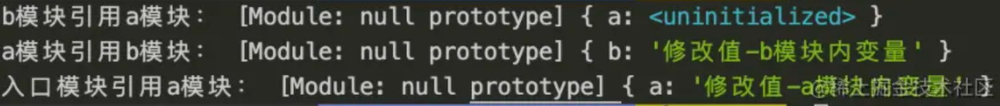

## js相等运算符==规则
`x == y`
- 如果x或者y不是正常值（比如抛出一个错误），中断执行
- 如果Type(x)与Type(y)相同，执行严格相等运算x === y
- undefined == null，返回true
- 如果是数字和字符串比较，则将字符串转换为数字之后进行比较(空字符串和"0"转化为数字时候都是0)
- 如果x和y其中有一个是布尔值，则把布尔值转换为数字，之后比较x == ToNumber(y)的结果
- 如果只有其中一个是对象，那就将对象转换为原始值之后进行比较x == ToPrimitive(y)

原始值转化规则为调用toString方法对于数组[],[0]都是变为"0"而[1,2,3]变为"1,2,3"，如果是对象则会转换为"[object Object]"
``` js
false==[]   //true
true==!![]   //true
alert(typeof NaN);   //弹出 'Number'
alert(NaN === NaN);  //为 false
```
可以出个简单的题目,下面代码中 a 在什么情况下会打印 1
``` js
var a = ?;
if(a == 1 && a == 2 && a == 3){
 	conso.log(1);
}
```
因为==会进行隐式类型转换会调用本类型toString或valueOf方法,重写他们即可
``` js
let a = {
  i: 1,
  toString () {
    return a.i++
  }
}
if(a == 1 && a == 2 && a == 3) {
  console.log('1');
}


let a = {
  i: 1,
  valueOf () {
    return a.i++
  }
}
if(a == 1 && a == 2 && a == 3) {
  console.log('1');
}

var a = [1,2,3];
a.join = a.shift;
if(a == 1 && a == 2 && a == 3) {
  console.log('1');
}

var str1 = String('11')
var str2 = new String('11')
str1 == str2 // true
str1 === str2 // false
typeof str1  // "string"
typeof str2 // "object"
// ==时做了隐式转换，调用了toString
// 2者类型不一样，一个是string，一个是object
```
注意如果是转换为数字则优先使用valueOf，没有定义则使用toString方法，如果是转换为字符串则优先使用toString方法，没有定义
则使用valueOf方法

## 正则表达式功能

正常情况下就是贪婪模式，就是直接按最多次匹配,如果在量词后面加上?就表示非贪婪模式，对应匹配到最小个数的值
``` js
'12345678'.replace(/\d{3,6}/g,'X')       //output: "X78"
'12345678'.replace(/\d{3,6}?/g,'X')       //output: "XX78"
'123456789'.match(/\d{3,5}?/g)       //output: ["123","456","789"]

'a1b2c3d4'.replace(/([a-z]\d){3}/g,"X")   //output: "Xd4"
// 量词最大作用是要给括号分组，这里没有括号的话就表示3个数字了
```

正则中或|的使用
``` js
'byroncasper'.replace(/byron|casper/g,"X")   //output:"XX"
'byronsperbyrcasper'.replace(/byr(on|ca)sper/g,"X")   //output:"XX"
```

分组中的反向引用
``` js
//没有括号的时候就表示$1这样的直接的字符串，有括号的时候就是会被捕获就是值，但是我们也可以在分组后面加?:就可以不被捕获
'2015-12-25'.replace(/(\d{4})-(\d{2})-(\d{2})/g,'$2/$3/$1')   //output:12/25/2015
'2015-12-25'.replace(/(?:\d{4})-(\d{2})-(\d{2})/g,'$2/$3/$1')  // output:25/$3/12
```

正向匹配?=和负向匹配?!
``` js
'a2cc'.replace(/\w(?=\d)/g,'X')     //output:'X2cc'
// 满足是字母而且后面是一个数字的情况，注意括号里面的不参与匹配，只有在前一个符合情况下才看匹配的那个后面是否符合

/^(?!\d+$)(?![a-zA-Z]+$)(?![!@#\$%\^\&\*+-]+$)[\w!@#\$%\^\&\*+-]{6,18}$/g
//开头结尾不全是数字出现一次多次,不全是字母出现一次多次,不全是特殊字符出现多次,且以字母数字特殊字符开头结尾的6到18位
```

lastIndex返回每次匹配的最后一个字符的下一位，以便下一次匹配（非全局模式下始终为0），最后没了的时候又重置为0.
所以为了使结果一样有时候这样写每一次都实例化一个正则，但是这耗内存(/\W/g).test('ab'),但是test只是为了检测用，所以
用这个方法的时候我们一般不用全局匹配
``` js
var reg1=/\w/;
var reg2=/\w/g;   //注意lastIndex是正则的属性
reg1.test('ab');  //无论执行多少次都是true,因为lastIndex值始终为0
console.log(reg1.lastIndex);      // 0
console.log(reg2.lastIndex);      // 0
console.log(reg2.test('ab'));     // true
console.log(reg2.lastIndex);      // 1
console.log(reg2.test('ab'));     // true
console.log(reg2.lastIndex);      // 2
console.log(reg2.test('ab'));     // false
console.log(reg2.lastIndex);      // 0
console.log(reg2.test('ab'));     // true
console.log(reg2.lastIndex);      // 1
console.log(reg2.test('ab'));     // true
console.log(reg2.lastIndex);      // 2
console.log(reg2.test('ab'));     // false
console.log(reg2.lastIndex);      // 0
while(reg2.test('ab')){
    console.log(reg2.lastIndex);   // 1 2
}
```

exec的用法
``` js
var reg3=/\d(\w)(\w)\d/;
var reg4=/\d(\w)(\w)\d/g;
var ts='$1ab2bb3cy4dd5ee';
var ret=reg3.exec(ts);
console.log(ret);             //["1ab2", "a", "b", index: 1, input: "$1ab2bb3cy4dd5ee"]
console.log(ret.index);       // 1
console.log(ret[0]);          // "1ab2"
console.log(ret.toString());  //"1ab2,a,b"    这是一个字符串
// 其中ret是一个对象数组，第一个表示匹配到的值，后面是对应的分组匹配到的值，有几个分组，就有几个这个值，index值对应
// 匹配到的字符串的开始位置，input对应你要查询的原字符串

while(reg4.exec(ts)){
    console.log(reg4.lastIndex + ret.index + ret.toString());
}
//"5 1 1ab2,a,b"     "11 7 3cy4,c,y"     注意全局模式下贪婪匹配到最后一个
```

search方法
``` js
'a1b2c3d1'.search('1')     //output:1
// search方法用于查找返回匹配到的字符串的开始位置没找到就返回-1,这个方法忽略/g标志
// 实际上对于字符串的像split,replace等方法最终都是隐式转换为正则表达式的
'a,b,c,d'.split(',')会被转换为'a,b,c,d'.split(/,/g)输出['a','b','c','d']
'a1b2c3d4'.split(/\d/g)以数字为分隔符输出数组['a','b','c','d']
```

match方法
``` js
var reg3=/\d(\w)\d/;
var reg4=/\d(\w)\d/g;
var ts='$1a2b3c4d5e';
var ret=ts.match(reg3);
console.log(ret);             //["1a2", "3c4",index: 1, input: "$1a2b3c4d5e"]
console.log(ret.index);       //  1
console.log(ret[0]);          // "1a2"
console.log(ret.toString());  //"1a2,3c4"    这是一个字符串
// match方法非全局模式下返回值和exec一样，没有匹配到的时候返回null
var ret2=ts.match(reg4);
console.log(ret2);             //["1a2", "3c4"]
console.log(ret2.index);       //  undefined
console.log(ret2[0]);          // "1a2"
// 全局模式下只是返回匹配值的对象数组，没有就返回null，这个功能比exec弱一些，但是速度快一些

// match代表匹配到的项，所以依次输出"1b2"  "3d4",最终返回的字符串是"a12c345e"
// group1,group2,group3代表匹配下的分组，没有分组的时候就没有几个分组值的参数
// index代表匹配到的开始位置，origin代表原始字符串
'a1b2c3d45e'.replace(/(\d)(\w)(\d)/g,function(match,group1,group2,group3,index,origin){
    console.log(match);
    return group1+group3;
})
```
还有一些其他小注意点
``` js
'a1b2c3d1'.search('1') //output:1
//search方法用于查找返回匹配到的字符串的开始位置没找到就返回-1,这个方法忽略/g标志
//实际上对于字符串的像split,replace等方法最终都是隐式转换为正则表达式的
'a,b,c,d'.split(',') ===> 'a,b,c,d'.split(/,/g)输出['a','b','c','d']
'a1b2c3d4'.split(/\d/g) ===> ['a','b','c','d']

// 任意字符12345678 通过正则转换成 12,345,678
n.toString().replace(/\B(?=(\d{3})+$)/g, ",");

var RegExp = /^(123)(456)\2\1$/; // 匹配 123456456123
var RegExp1 = /^(123)(456)\1$/; // 匹配 123456123
var RegExp1 = /^(123)(456)\2$/; // 匹配 123456456
```
[正则表达式库](https://github.com/any86/any-rule)

## 类型判断toString、instanceof、typeof
#### toString
每一个继承 Object 的对象都有toString方法，如果 toString 方法没有重写的话，会返回 [Object type]，其中 type 为
对象的类型。但当除了 Object 类型的对象外，其他类型直接使用 toString 方法时，会直接返回都是内容的字符串，所以我们需要
使用call或者apply方法来改变toString方法的执行上下文
``` js
const an = ['Hello','An'];
an.toString(); // "Hello,An"
Object.prototype.toString.call(an); // "[object Array]"
Object.prototype.toString.call('An') // "[object String]"
Object.prototype.toString.call(1) // "[object Number]"
Object.prototype.toString.call(Symbol(1)) // "[object Symbol]"
Object.prototype.toString.call(null) // "[object Null]"
Object.prototype.toString.call(undefined) // "[object Undefined]"
Object.prototype.toString.call(function(){}) // "[object Function]"
Object.prototype.toString.call({name: 'An'}) // "[object Object]"
```

#### typeof
主要用于检测基本数据类型，返回值为6个字符串，分别为string、Boolean、number、function、object、undefined,但
是在判断null、array、object以及函数实例（new + 函数）时，得到的都是object。这使得在判断这些数据类型的时候，得不到真
是的数据类型。由此引出instanceof

#### instanceof
instanceof 的内部机制是通过判断对象的原型链中是不是能找到类型的 prototype
``` js
function Foo(){}
function Bar(){}
Bar.prototype = new Foo()
let obj = new Bar()
obj instanceof Bar //true
obj instanceof Foo //true
// 注意当在比较的时候如果左操作数不是对象，则返回false
new String('foo') instanceof String; // true
new String('foo') instanceof Object; // true
'foo' instanceof String; // false
'foo' instanceof Object; // false

// 实现方法(有漏洞)
function _instanceof(L, R) { //L为instanceof左表达式，R为右表达式
  let Ro = R.prototype //原型
  L = L.__proto__ //隐式原型
  while (true) {
    if (L === null) { //当到达L原型链顶端还未匹配，返回false
      return false
    }
    if (L === Ro) { //全等时，返回true
      return true
    }
    L = L.__proto__
  }
}
```

## js和css加载阻塞
首先我们来了解下资源的加载方式有哪些
### prefetch、preload
preload 顾名思义就是一种预加载的方式，它通过声明向浏览器声明一个需要提交加载的资源，当资源真正被使用的时候立即执行，就
无需等待网络的消耗,它可以通过 Link 标签进行创建：
``` js
// 使用 link 标签静态标记需要预加载的资源
<link rel="preload" href="/path/to/style.css" as="style">

// 或使用脚本动态创建一个 link 标签后插入到 head 头部
<script>
const link = document.createElement('link');
link.rel = 'preload';
link.as = 'style';
link.href = '/path/to/style.css';
document.head.appendChild(link);
</script>
```
当浏览器解析到这行代码就会去加载 href 中对应的资源但不执行，待到真正使用到的时候再执行，另一种方式方式就是在 HTTP 响应头
中加上 preload 字段，兼容性看IE 和 Firefox 都是不支持的，兼容性覆盖面达到 73%

prefetch 跟 preload 不同，它的作用是告诉浏览器未来可能会使用到的某个资源，浏览器就会在闲时去加载对应的资源，若能预测
到用户的行为，比如懒加载，点击到其它页面等则相当于提前预加载了需要的资源。它的用法跟 preload 是一样的，prefetch 比 
preload 的兼容性更好，覆盖面可以达到将近 80%

当一个资源被 preload 或者 prefetch 获取后，它将被放在内存缓存中等待被使用，如果资源位存在有效的缓存极致（如 
cache-control 或 max-age），它将被存储在 HTTP 缓存中可以被不同页面所使用。正确使用 preload/prefetch 不会造
成二次下载，也就说：当页面上使用到这个资源时候 preload 资源还没下载完，这时候不会造成二次下载，会等待第一次下载并执
行脚本。对于 preload 来说，一旦页面关闭了，它就会立即停止 preload 获取资源，而对于 prefetch 资源，即使页面关
闭，prefetch 发起的请求仍会进行不会中断

### acync、defer
默认情况下，脚本的下载和执行将会按照文档的先后顺序同步进行。当脚本下载和执行的时候，文档解析就会被阻塞，在脚本下载和
执行完成之后文档才能往下继续进行解析,下面是async和defer两者区别：
- 当script中有defer属性时，脚本的加载过程和文档加载是异步发生的，等到文档解析完(DOMContentLoaded事件发生)脚本才开始执行。

- 当script有async属性时，脚本的加载过程和文档加载也是异步发生的。但脚本下载完成后会停止HTML解析，执行脚本，脚本解析完继续HTML解析。

- 当script同时有async和defer属性时，执行效果和async一致

对比加载方式：
1. 它相比于 preload 加载的优势在于浏览器兼容性好，从 caniuse 上看基本上所有浏览器都支持，覆盖率达到 93%，
2. 不足之处在于：defer 只作用于脚本文件，对于样式、图片等资源就无能为力了，并且 defer 加载的资源是要执行的，而 preload 只下载资源并不执行，待真正使用到才会执行文件。
3. 对于页面上主/首屏脚本，可以直接使用 defer 加载，而对于非首屏脚本/其它资源，可以采用 preload/prefeth 来进行加载

### js阻塞原理
浏览器内核可以分成两部分：渲染引擎（Layout Engine 或者 Rendering Engine）和 JS 引擎。早期渲染引擎和 JS 引擎并没有
十分明确的区分，但随着 JS 引擎越来越独立，内核也成了渲染引擎的代称（下文我们将沿用这种叫法）。渲染引擎又包括了 HTML 解释
器、CSS 解释器、布局、网络、存储、图形、音视频、图片解码器等等零部件。

JS 引擎是独立于渲染引擎存在的。我们的 JS 代码在文档的何处插入，就在何处执行。当 HTML 解析器遇到一个 script 标签时，它
会暂停渲染过程，将控制权交给 JS 引擎。JS 引擎对内联的 JS 代码会直接执行，对外部 JS 文件还要先获取到脚本、再进行执行。
等 JS 引擎运行完毕，浏览器又会把控制权还给渲染引擎，继续 CSSOM 和 DOM 的构建。 因此与其说是 JS 把 CSS 和 HTML 阻
塞了，不如说是 JS 引擎抢走了渲染引擎的控制权。

当CSS后面跟着嵌入的JS的时候，该CSS就会出现阻塞后面资源下载的情况。而当把嵌入JS放到CSS前面，就不会出现css阻塞图片等
的情况了。 根本原因：因为浏览器会维持html中css和js的顺序，即在JS前面出现的CSS文件需要加载、解析完后才会执行后面的
内嵌JS，而内嵌JS又会阻塞后面的内容

外部样式会阻塞后面内联脚本的执行；外部样式不会阻塞外部脚本的加载，但会阻塞外部脚本的执行；对于具有async属性的脚本，外部css不会阻塞

## es6 module循环引入
ES module会根据import关系构建一棵依赖树，遍历到树的叶子模块后，然后根据依赖关系，反向找到父模块，将export/import指向同一地址

ES module导出的是一个索引——内存地址，它依赖的是“模块地图”和“模块记录”，模块地图在下面会解释，而模块记录是好比每
个模块的“身份证”，记录着一些关键信息——这个模块导出值的的内存地址，加载状态，在其他模块导入时，会做一个“连接”——根据模块记录，把导
入的变量指向同一块内存，这样就是实现了动态绑定

来看下面这个例子，和之前的demo逻辑一样：入口模块引用a模块，a模块引用b模块，b模块又引用a模块，这种ab模块相互引用就形成了循环
``` js
// index.mjs
import * as a from './a.mjs'
console.log('入口模块引用a模块：',a)

// a.mjs
let a = "原始值-a模块内变量"
export { a }
import * as b from "./b.mjs"
console.log("a模块引用b模块：", b)
a = "修改值-a模块内变量"

// b.mjs
let b = "原始值-b模块内变量"
export { b }
import * as a from "./a.mjs"
console.log("b模块引用a模块：", a)
b = "修改值-b模块内变量"
```

值得一提的是，import语句有提升的效果，实际执行可以看作这样：
``` js
// index.mjs
import * as a from './a.mjs'
console.log('入口模块引用a模块：',a)

// a.mjs
import * as b from "./b.mjs"
let a = "原始值-a模块内变量"
export { a }
console.log("a模块引用b模块：", b)
a = "修改值-a模块内变量"

// b.mjs
import * as a from "./a.mjs"
let b = "原始值-b模块内变量"
export { b }
console.log("b模块引用a模块：", a)
b = "修改值-b模块内变量"
```
总结一下：和上面一样，循环引用要解决的无非是两个问题，保证不进入死循环以及输出什么值。ES Module来处理循环使用一张模块间的依赖地图
来解决死循环问题，标记进入过的模块为“获取中”，所以循环引用时不会再次进入；使用模块记录，标注要去哪块内存中取值，将导入导出做连接，解
决了要输出什么值


## 杂物
undefined 在 ES5 中已经是全局对象的一个只读（read - only）属性了，它不能被重写。但是在局部作用域中，还是可以被重写的；
void 运算符能对给定的表达式进行求值，然后返回 undefined。也就是说，void 后面你随便跟上一个表达式，返回的都是 undefined，
如 void (2), void (‘hello’) 。并且void是不能被重写的。但为什么是void 0 呢，void 0 是表达式中最短的。用 void 0 代
替 undefined 能节省字节。不少 JavaScript压缩工具在压缩过程中，正是将 undefined 用 void 0 代替掉了
[什么时候不能使用箭头函数](https://juejin.cn/post/7103702621369663518)
[各种框架中文文档](https://docschina.org/)
[众多工具集合，包括时间戳转换，进制转换等](https://tool.lu/)


