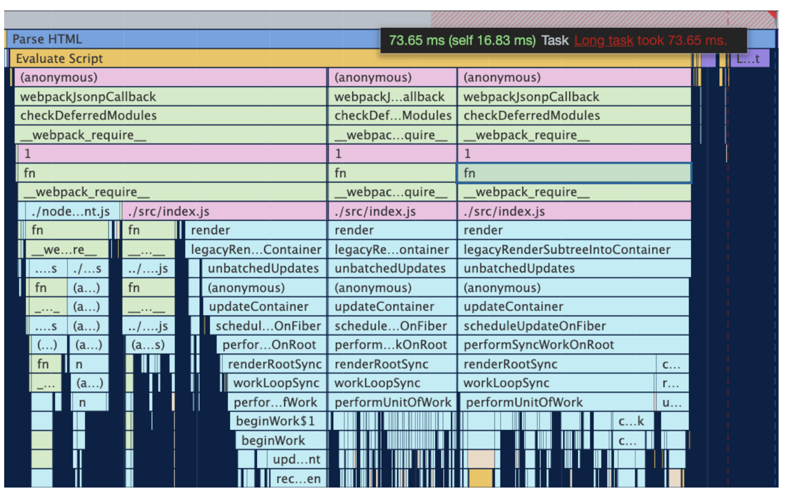
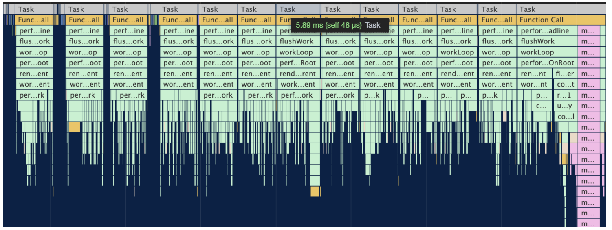
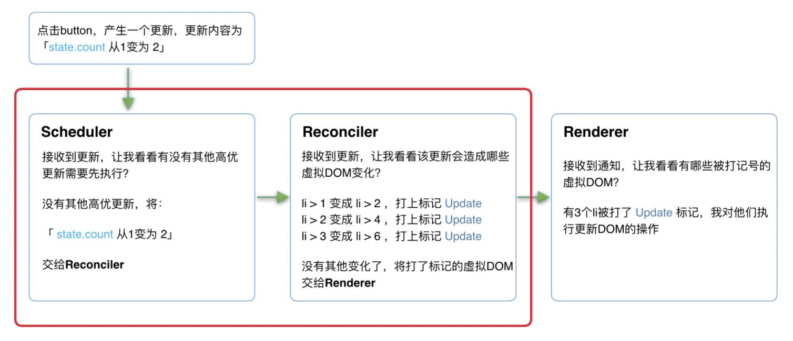
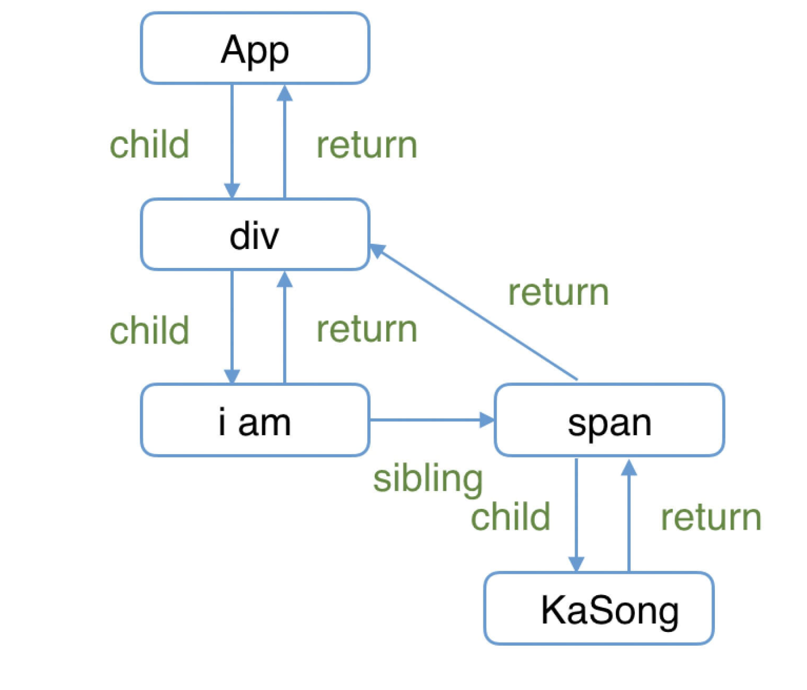
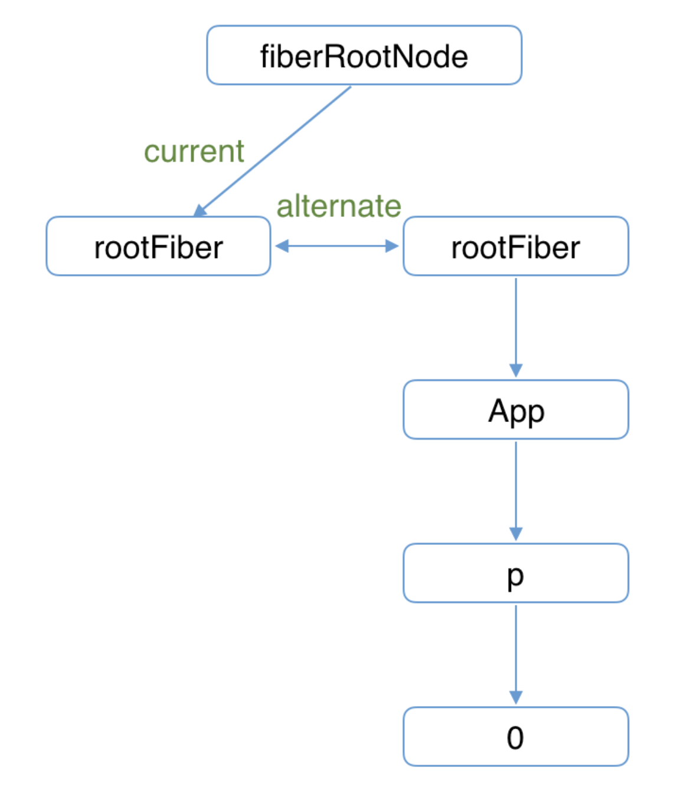
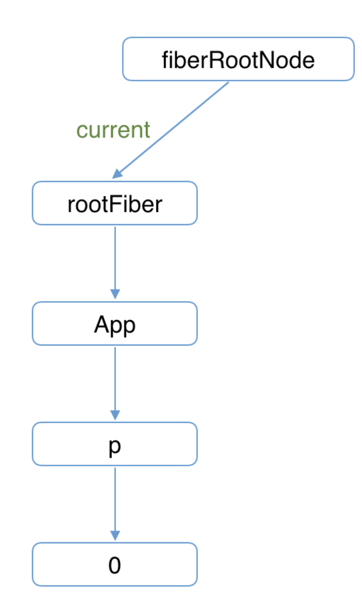
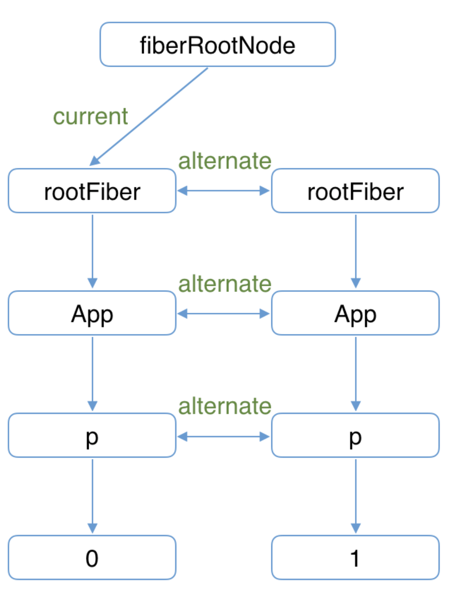
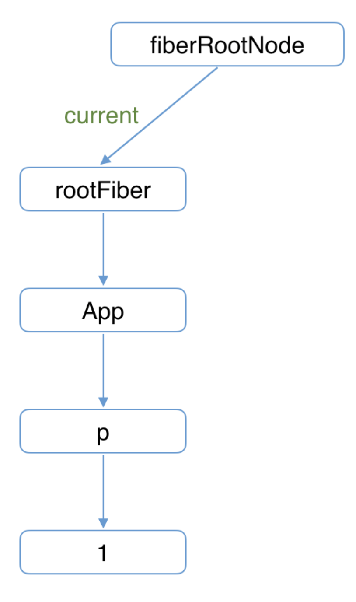

## react性能瓶颈
我们日常使用App，浏览网页时，有两类场景会制约快速响应
- CPU瓶颈：当遇到大计算量的操作或者设备性能不足使页面掉帧，导致卡顿
- IO瓶颈：发送网络请求后，由于需要等待数据返回才能进一步操作导致不能快速响应;我们可以通过加入loading来解决体验问题，
为此，React实现了Suspense (opens new window)功能及配套的hook——useDeferredValue

当项目变得庞大、组件数量繁多时，就容易遇到CPU的瓶颈，考虑如下Demo，向视图中渲染3000个li
``` js
function App() {
  const len = 3000;
  return (
    <ul>
      {Array(len).fill(0).map((_, i) => <li>{i}</li>)}
    </ul>
  );
}
const rootEl = document.querySelector("#root");
ReactDOM.render(<App/>, rootEl);
```
主流浏览器刷新频率为60Hz，即每（1000ms / 60Hz）16.6ms浏览器刷新一次。我们知道，JS可以操作DOM，GUI渲染线程与JS线程
是互斥的。所以JS脚本执行和浏览器布局、绘制不能同时执行,在每16.6ms时间内，需要完成如下工作：
``` js
JS脚本执行 -----  样式布局 ----- 样式绘制
```
当JS执行时间过长，超出了16.6ms，这次刷新就没有时间执行样式布局和样式绘制了。在Demo中，由于组件数量繁多（3000个），JS
脚本执行时间过长，页面掉帧，造成卡顿。可以从打印的执行堆栈图看到，JS执行时间为73.65ms，远远多于一帧的时间

react解决这个问题是通过，在浏览器每一帧的时间中，预留一些时间给JS线程，React利用这部分时间更新组件（源码中可查预留的
初始时间是5ms）当预留的时间不够用时，React将线程控制权交还给浏览器使其有时间渲染UI，React则等待下一帧时间到来继续被中
断的工作。总之就是：将同步的更新变为可中断的异步更新。
> 这种将长任务分拆到每一帧中，像蚂蚁搬家一样一次执行一小段任务的操作，被称为时间切片（time slice）

接下来我们开启Concurrent Mode（后续章节会讲到，当前你只需了解开启后会启用时间切片）
``` js
// 通过使用ReactDOM.unstable_createRoot开启Concurrent Mode
// ReactDOM.render(<App/>, rootEl);  
ReactDOM.unstable_createRoot(rootEl).render(<App/>);
```
此时我们的长任务被拆分到每一帧不同的task中，JS脚本执行时间大体在5ms左右，这样浏览器就有剩余时间执行样式布局和样式绘制，减少掉帧的可能性



## React15架构
React15架构可以分为两层：
- Reconciler（协调器）—— 负责找出变化的组件
- Renderer（渲染器）—— 负责将变化的组件渲染到页面上

我们知道，在React中可以通过this.setState、this.forceUpdate、ReactDOM.render等API触发更新，每当有更新发生
时，**Reconciler**会做如下工作
- 调用函数组件、或class组件的render方法，将返回的JSX转化为虚拟DOM
- 将虚拟DOM和上次更新时的虚拟DOM对比
- 通过对比找出本次更新中变化的虚拟DOM
- 通知Renderer将变化的虚拟DOM渲染到页面上

由于React支持跨平台，所以不同平台有不同的Renderer。我们前端最熟悉的是负责在浏览器环境渲染的Renderer —— ReactDOM
除此之外，还有：
- ReactNative (opens new window)渲染器，渲染App原生组件
- ReactTest (opens new window)渲染器，渲染出纯Js对象用于测试
- ReactArt (opens new window)渲染器，渲染到Canvas, SVG 或 VML (IE8)
在每次更新发生时，Renderer接到Reconciler通知，将变化的组件渲染在当前宿主环境

### React15架构的缺点
在Reconciler中，mount的组件会调用mountComponent (opens new window)，update的组件会调用
updateComponent (opens new window)。这两个方法都会递归更新子组件,由于递归执行，所以更新一旦开始，中途就无法
中断。当层级很深时，递归更新时间超过了16ms，用户交互就会卡顿。在上一节中，我们已经提出了解决办法——用可中断的异步更
新代替同步的更新，我们看下下面这个例子：
``` js
// 页面                 // 页面改变之后  
<li>1</li>             <li>2</li>
<li>2</li>     ====>   <li>4</li>
<li>3</li>             <li>6</li>
```
1. 点击button，state.count从1变成2
2. Reconciler发现1需要变为2，通知Renderer
3. Renderer更新DOM，1变为2
4. Reconciler发现2需要变为4，通知Renderer
5. Renderer更新DOM，2变为4
6. Reconciler发现3需要变为6，通知Renderer
7. Renderer更新DOM，3变为6
我们可以看到，Reconciler和Renderer是交替工作的，当第一个li在页面上已经变化后，第二个li再进入Reconciler，由于整个
过程都是同步的，所以在用户看来所有DOM是同时更新的

接下来，让我们模拟一下，如果中途中断更新会怎么样？
1. 点击button，state.count从1变成2
2. Reconciler发现1需要变为2，通知Renderer
3. Renderer更新DOM，1变为2;后续的4、5、6、7步骤被中断
当第一个li完成更新时中断更新，即步骤3完成后中断更新，此时后面的步骤都还未执行。用户本来期望123变为246。实际却看见更
新不完全的DOM！（即223）基于这个原因，React决定重写整个架构


## React16架构
React16架构可以分为三层：
- Scheduler（调度器）—— 调度任务的优先级，高优任务优先进入Reconciler
- Reconciler（协调器）—— 负责找出变化的组件
- Renderer（渲染器）—— 负责将变化的组件渲染到页面上
可以看到，相较于React15，React16中新增了Scheduler（调度器），让我们来了解下他

### Scheduler（调度器）
既然我们以浏览器是否有剩余时间作为任务中断的标准，那么我们需要一种机制，当浏览器有剩余时间时通知我们。其实部分浏览器已经
实现了这个API，这就是requestIdleCallback (opens new window)。但是由于以下因素，React放弃使用：
- 浏览器兼容性
- 触发频率不稳定，受很多因素影响。比如当我们的浏览器切换tab后，之前tab注册的requestIdleCallback触发的频率会变得很低
基于以上原因，React实现了功能更完备的requestIdleCallbackpolyfill，这就是Scheduler。除了在空闲时触发回调的功能外，
Scheduler还提供了多种调度优先级供任务设置

### Reconciler（协调器）
我们知道，在React15中Reconciler是递归处理虚拟DOM的。让我们看看React16的Reconciler (opens new window)。
我们可以看见，更新工作从递归变成了可以中断的循环过程。每次循环都会调用shouldYield判断当前是否有剩余时间。
``` js
/** @noinline */
function workLoopConcurrent() {
  // Perform work until Scheduler asks us to yield
  while (workInProgress !== null && !shouldYield()) {
    workInProgress = performUnitOfWork(workInProgress);
  }
}
```
在React16中，Reconciler与Renderer不再是交替工作。当Scheduler将任务交给Reconciler后，Reconciler会为变化的虚拟
DOM打上代表增/删/更新的标记，类似这样：
``` js
export const Placement = /*             */ 0b0000000000010;
export const Update = /*                */ 0b0000000000100;
export const PlacementAndUpdate = /*    */ 0b0000000000110;
export const Deletion = /*              */ 0b0000000001000;
```

### Renderer（渲染器）
Renderer根据Reconciler为虚拟DOM打的标记，同步执行对应的DOM操作,在React16架构中整个更新流程为

其中红框中的步骤随时可能由于以下原因被中断：
- 有其他更高优任务需要先更新
- 当前帧没有剩余时间
由于红框中的工作都在内存中进行，不会更新页面上的DOM，所以即使反复中断，用户也不会看见更新不完全的DOM


## Fiber架构
首先我们得知道**代数效应**是函数式编程中的一个概念，用于将副作用从函数调用中分离

代数效应与React关系最明显的例子就是Hooks，对于类似useState、useReducer、useRef这样的Hook，我们不需要关注
FunctionComponent的state在Hook中是如何保存的，React会为我们处理。我们只需要假设useState返回的是我们想要的
state，并编写业务逻辑就行
``` js
function App() {
  const [num, updateNum] = useState(0);
  return (
    <button onClick={() => updateNum(num => num + 1)}>{num}</button>  
  )
}
```
从React15到React16，协调器（Reconciler）重构的一大目的是：将老的同步更新的架构变为异步可中断更新。异步可中断更新可
以理解为：更新在执行过程中可能会被打断（浏览器时间分片用尽或有更高优任务插队），当可以继续执行时恢复之前执行的中间状态,
其实，浏览器原生就支持类似的实现，这就是Generator，但是Generator的一些缺陷使React团队放弃了他：
- 类似async，Generator也是传染性的，使用了Generator则上下文的其他函数也需要作出改变。这样心智负担比较重
- Generator执行的中间状态是上下文关联的

``` js
function* doWork(A, B, C) {
  var x = doExpensiveWorkA(A);
  yield;
  var y = x + doExpensiveWorkB(B);
  yield;
  var z = y + doExpensiveWorkC(C);
  return z;
}
```
- 每当浏览器有空闲时间都会依次执行其中一个doExpensiveWork，当时间用尽则会中断，当再次恢复时会从中断位置继续执行。
- 只考虑“单一优先级任务的中断与继续”情况下Generator可以很好的实现异步可中断更新。
- 但是当我们考虑“高优先级任务插队”的情况，如果此时已经完成doExpensiveWorkA与doExpensiveWorkB计算出x与y。时B组件接
收到一个高优更新，由于Generator执行的中间状态是上下文关联的，所以计算y时无法复用之前已经计算出的x，需要重新计算。如果
通过全局变量保存之前执行的中间状态，又会引入新的复杂度，所以react没有使用Generator

### Fiber架构实现原理
在React15及以前，Reconciler采用递归的方式创建虚拟DOM，递归过程是不能中断的。如果组件树的层级很深，递归会占用线程很多
时间，造成卡顿。为了解决这个问题，React16将递归的无法中断的更新重构为异步的可中断更新，由于曾经用于递归的虚拟DOM数据结
构已经无法满足需要,于是，全新的Fiber架构应运而生。

Fiber包含三层含义:

- 作为架构来说，之前React15的Reconciler采用递归的方式执行，数据保存在递归调用栈中，所以被称为stack Reconciler
React16的Reconciler基于Fiber节点实现，被称为Fiber Reconciler。

- 作为静态的数据结构来说，每个Fiber节点对应一个React element，保存了该组件的类型（函数组件/类组件/原生组件...）、对应的DOM节点等信息。

- 作为动态的工作单元来说，每个Fiber节点保存了本次更新中该组件改变的状态、要执行的工作（需要被删除/被插入页面中/被更新...）

Fiber的结构
``` js
function FiberNode(
  tag: WorkTag,
  pendingProps: mixed,
  key: null | string,
  mode: TypeOfMode,
) {
  // 作为静态数据结构的属性
  // Fiber对应组件的类型 Function/Class/Host...
  this.tag = tag;
  // key属性
  this.key = key;
  // 大部分情况同type，某些情况不同，比如FunctionComponent使用React.memo包裹
  this.elementType = null;
  // 对于 FunctionComponent，指函数本身，对于ClassComponent，指class，对于HostComponent，指DOM节点tagName
  this.type = null;
  // Fiber对应的真实DOM节点
  this.stateNode = null;

  // 用于连接其他Fiber节点形成Fiber树
  // 每个Fiber节点有个对应的React element，多个Fiber节点是如何连接形成树呢？靠如下三个属性
  this.return = null; // 指向父级Fiber节点
  this.child = null;  // 指向子Fiber节点
  this.sibling = null; // 指向右边第一个兄弟Fiber节点
  this.index = 0;
  this.ref = null;

  // 作为动态的工作单元的属性
  // 保存本次更新造成的状态改变相关信息
  this.pendingProps = pendingProps;
  this.memoizedProps = null;
  this.updateQueue = null;
  this.memoizedState = null;
  this.dependencies = null;
  this.mode = mode;
// 保存本次更新会造成的DOM操作
  this.effectTag = NoEffect;
  this.nextEffect = null;

  this.firstEffect = null;
  this.lastEffect = null;

  // 调度优先级相关
  this.lanes = NoLanes;
  this.childLanes = NoLanes;

  // 指向该fiber在另一次更新时对应的fiber
  this.alternate = null;
}
```
举个例子，如下代码会生成这个结构
``` js
function App() {
  return (
    <div>
      i am
      <span>KaSong</span>
    </div>
  )
}
```

> 这里需要提一下，为什么父级指针叫做return而不是parent或者father呢？因为作为一个工作单元，return指节点执行完
> completeWork（本章后面会介绍）后会返回的下一个节点。子Fiber节点及其兄弟节点完成工作后会返回其父级节点，所以用return指代父级节点

### Fiber架构工作原理
首先我们来了解下什么叫双缓存？

当我们用canvas绘制动画，每一帧绘制前都会调用ctx.clearRect清除上一帧的画面。如果当前帧画面计算量比较大，导致清除上一帧
画面到绘制当前帧画面之间有较长间隙，就会出现白屏。为了解决这个问题，我们可以在内存中绘制当前帧动画，绘制完毕后直接用当前
帧替换上一帧画面，由于省去了两帧替换间的计算时间，不会出现从白屏到出现画面的闪烁情况。这种在内存中构建并直接替换的技术叫
做双缓存 (opens new window)；React使用“双缓存”来完成Fiber树的构建与替换——对应着DOM树的创建与更新

**双缓存Fiber树**在React中最多会同时存在两棵Fiber树。当前屏幕上显示内容对应的Fiber树称为current Fiber树，正在内存
中构建的Fiber树称为workInProgress Fiber树。

current Fiber树中的Fiber节点被称为current fiber，workInProgress Fiber树中的Fiber节点被称为workInProgress fiber，他们通过alternate属性连接。
``` js
currentFiber.alternate === workInProgressFiber;
workInProgressFiber.alternate === currentFiber;
```
React应用的根节点通过current指针在不同Fiber树的rootFiber间切换来实现Fiber树的切换。当workInProgress Fiber树构
建完成交给Renderer渲染在页面上后，应用根节点的current指针指向workInProgress Fiber树，此时workInProgress Fiber
树就变为current Fiber树。每次状态更新都会产生新的workInProgress Fiber树，通过current与workInProgress的替换，完
成DOM更新。

接下来我们以具体例子讲解mount时、update时的构建/替换流程
``` js
function App() {
  const [num, add] = useState(0);
  return (
    <p onClick={() => add(num + 1)}>{num}</p>
  )
}
ReactDOM.render(<App/>, document.getElementById('root'));
```
1. 首次执行ReactDOM.render会创建fiberRootNode（源码中叫fiberRoot）和rootFiber。其中fiberRootNode是整个应用的根节
点，rootFiber是<App/>所在组件树的根节点。之所以要区分fiberRootNode与rootFiber，是因为在应用中我们可以多次调用
ReactDOM.render渲染不同的组件树，他们会拥有不同的rootFiber。但是整个应用的根节点只有一个，那就是fiberRootNode。

fiberRootNode的current会指向当前页面上已渲染内容对应对Fiber树，被称为current Fiber树
`fiberRootNode.current = rootFiber;`

由于是首屏渲染，页面中还没有挂载任何DOM，所以fiberRootNode.current指向的rootFiber没有任何子Fiber节点（即current Fiber树为空）

2. 接下来进入render阶段，根据组件返回的JSX在内存中依次创建Fiber节点并连接在一起构建Fiber树，被称为workInProgress Fiber树。（下图中右侧为内存中构建的树，左侧为页面显示的树）

在构建workInProgress Fiber树时会尝试复用current Fiber树中已有的Fiber节点内的属性，在首屏渲染时只有rootFiber存在对应的current fiber（即rootFiber.alternate）


3. 图中右侧已构建完的workInProgress Fiber树在commit阶段渲染到页面

此时DOM更新为右侧树对应的样子。fiberRootNode的current指针指向workInProgress Fiber树使其变为current Fiber 树



那么当我们**update**的时候流程如下
1. 接下来我们点击p节点触发状态改变，这会开启一次新的render阶段并构建一棵新的workInProgress Fiber 树

和mount时一样，workInProgress fiber的创建可以复用current Fiber树对应的节点数据
> 这个决定是否复用的过程就是Diff算法，后面章节会详细讲解
2. workInProgress Fiber 树在render阶段完成构建后进入commit阶段渲染到页面上。渲染完毕后，workInProgress Fiber 树变为current Fiber 树



