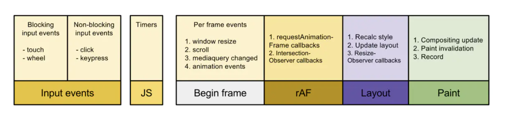
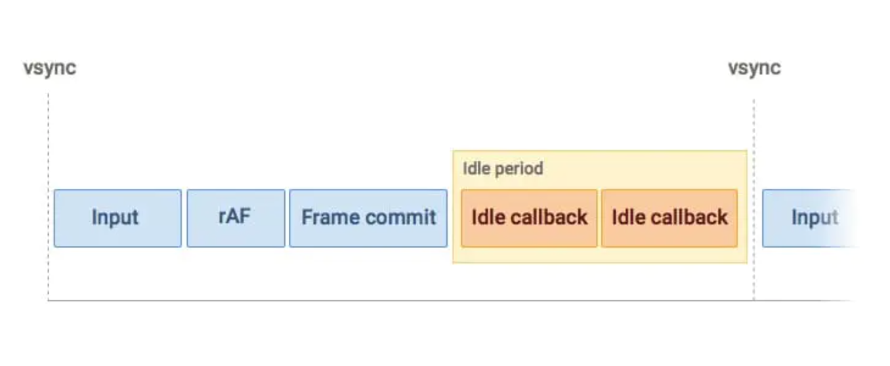
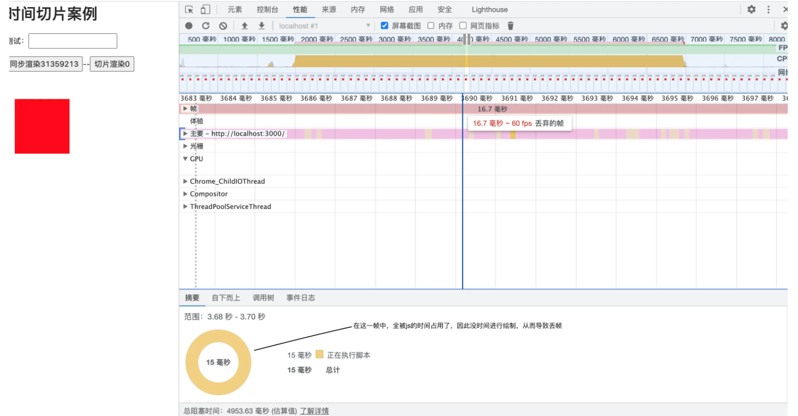
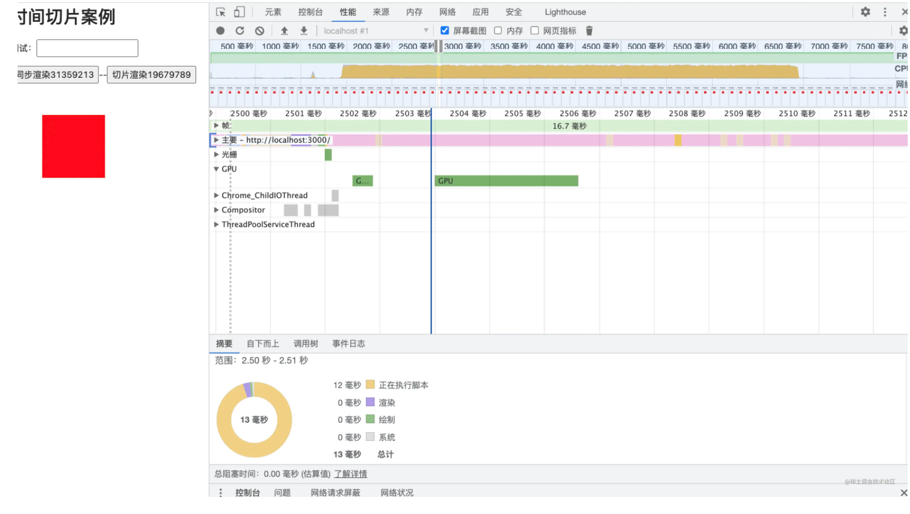

## render阶段
render阶段开始于performSyncWorkOnRoot或performConcurrentWorkOnRoot方法的调用。这取决于本次更新是同步更新还是
异步更新。我们现在还不需要学习这两个方法，只需要知道在这两个方法中会调用如下两个方法：
``` js
// performSyncWorkOnRoot会调用该方法
function workLoopSync() {
  while (workInProgress !== null) {
    performUnitOfWork(workInProgress);
  }
}
// performConcurrentWorkOnRoot会调用该方法
function workLoopConcurrent() {
  while (workInProgress !== null && !shouldYield()) {
    performUnitOfWork(workInProgress);
  }
}
```
可以看到，他们唯一的区别是是否调用shouldYield。如果当前浏览器帧没有剩余时间，shouldYield会中止循环，直到浏览器有空闲
时间后再继续遍历；workInProgress代表当前已创建的workInProgress fiber；performUnitOfWork方法会创建下一个Fiber节
点并赋值给workInProgress，并将workInProgress与已创建的Fiber节点连接起来构成Fiber树

我们知道Fiber Reconciler是从Stack Reconciler重构而来，通过遍历的方式实现可中断的递归，所以performUnitOfWork的工
作可以分为两部分：“递”和“归”

### 递阶段
首先从rootFiber开始向下深度优先遍历。为遍历到的每个Fiber节点调用beginWork方法 (opens new window)。该方法会根据
传入的Fiber节点创建子Fiber节点，并将这两个Fiber节点连接起来。当遍历到叶子节点（即没有子组件的组件）时就会进入“归”阶段

### 归阶段
在“归”阶段会调用completeWork (opens new window)处理Fiber节点。当某个Fiber节点执行完completeWork，如果其存在兄
弟Fiber节点（即fiber.sibling !== null），会进入其兄弟Fiber的“递”阶段。如果不存在兄弟Fiber，会进入父级Fiber的“归”阶段。
“递”和“归”阶段会交错执行直到“归”到rootFiber。至此，render阶段的工作就结束了

``` js
function App() {
  return (
    <div>
      i am
      <span>KaSong</span>
    </div>
  )
}
ReactDOM.render(<App />, document.getElementById("root"));

//render阶段会依次执行：
1. rootFiber beginWork
2. App Fiber beginWork
3. div Fiber beginWork
4. "i am" Fiber beginWork
5. "i am" Fiber completeWork
6. span Fiber beginWork
7. span Fiber completeWork
8. div Fiber completeWork
9. App Fiber completeWork
10. rootFiber completeWork
```
> 之所以没有 “KaSong” Fiber 的 beginWork/completeWork，是因为作为一种性能优化手段，针对只有单一文本子节点的Fiber，React会特殊处理
beginWork的工作是传入当前Fiber节点，创建子Fiber节点，我们从传参来看看具体是如何做的


## commit阶段
commitRoot方法是commit阶段工作的起点。fiberRootNode会作为传参`commitRoot(root)`

在rootFiber.firstEffect上保存了一条需要执行副作用的Fiber节点的单向链表effectList，这些Fiber节点的updateQueue中
保存了变化的props

这些副作用对应的DOM操作在commit阶段执行，除此之外，一些生命周期钩子（比如componentDidXXX）、hook（比如useEffect）
需要在commit阶段执行，commit阶段的主要工作（即Renderer的工作流程）分为三部分
- before mutation阶段（执行DOM操作
- mutation阶段（执行DOM操作）
- layout阶段（执行DOM操作后）

在before mutation阶段之前和layout阶段之后还有一些额外工作，涉及到比如useEffect的触发、优先级相关的重置、ref的绑定/解绑


## react的diff
由于Diff操作本身也会带来性能损耗，React文档中提到，即使在最前沿的算法中，将前后两棵树完全比对的算法的复杂程度为O(n 3 )，
其中n是树中元素的数量。如果在React中使用了该算法，那么展示1000个元素所需要执行的计算量将在十亿的量级范围。这个开销实在
是太过高昂，为了降低算法复杂度，React的diff会预设三个限制：
1. 只对同级元素进行Diff。如果一个DOM节点在前后两次更新中跨越了层级，那么React不会尝试复用他
2. 两个不同类型的元素会产生出不同的树。如果元素由div变为p，React会销毁div及其子孙节点，并新建p及其子孙节点
3. 开发者可以通过 key prop来暗示哪些子元素在不同的渲染下能保持稳定。考虑如下例子：
``` js
// 更新前
<div>
  <p key="ka">ka</p>
  <h3 key="song">song</h3>
</div>

// 更新后
<div>
  <h3 key="song">song</h3>
  <p key="ka">ka</p>
</div>
```
如果没有key，React会认为div的第一个子节点由p变为h3，第二个子节点由h3变为p。这符合限制2的设定，会销毁并新建。

但是当我们用key指明了节点前后对应关系后，React知道key === "ka"的p在更新后还存在，所以DOM节点可以复用，只是需要交换下顺序

### diff的实现
我们从Diff的入口函数reconcileChildFibers出发，该函数会根据newChild（即JSX对象）类型调用不同的处理函数
``` js
// 根据newChild类型选择不同diff函数处理
function reconcileChildFibers(
  returnFiber: Fiber,
  currentFirstChild: Fiber | null,
  newChild: any,
): Fiber | null {

  const isObject = typeof newChild === 'object' && newChild !== null;

  if (isObject) {
    // object类型，可能是 REACT_ELEMENT_TYPE 或 REACT_PORTAL_TYPE
    switch (newChild.$$typeof) {
      case REACT_ELEMENT_TYPE:
        // 调用 reconcileSingleElement 处理
      // // ...省略其他case
    }
  }

  if (typeof newChild === 'string' || typeof newChild === 'number') {
    // 调用 reconcileSingleTextNode 处理
    // ...省略
  }

  if (isArray(newChild)) {
    // 调用 reconcileChildrenArray 处理
    // ...省略
  }

  // 一些其他情况调用处理函数
  // ...省略

  // 以上都没有命中，删除节点
  return deleteRemainingChildren(returnFiber, currentFirstChild);
}
```
我们可以从同级的节点数量将Diff分为两类：
1. 当newChild类型为object、number、string，代表同级只有一个节点
2. 当newChild类型为Array，同级有多个节点

未完成待续............

[参考链接](https://react.iamkasong.com/)


## 时间切片
首先我们知道页面是一帧一帧绘制出来的，当每秒绘制的帧数（FPS）达到 60 时，页面是流畅的，小于这个值时，用户会感觉到
卡顿，而1s 60帧，所以每一帧分到的时间是 1000/60 ≈ 16 ms。所以我们书写代码时力求不让一帧的工作量超过 16ms

浏览器的一贞要完成如下工作才能保持流畅

通过上图可看到，一帧内需要完成如下六个步骤的任务：
- 处理用户的交互
- JS 解析执行
- 帧开始。窗口尺寸变更，页面滚去等的处理
- requestAnimationFrame(rAF)
- 布局
- 绘制

上面六个步骤完成后没超过 16 ms，说明时间有富余，此时就会执行`requestIdleCallback`里注册的任务

从上图也可看出，和 requestAnimationFrame 每一帧必定会执行不同，requestIdleCallback 是捡浏览器空闲来执行任务;
如此一来，假如浏览器一直处于非常忙碌的状态，requestIdleCallback 注册的任务有可能永远不会执行。此时可通过设置 timeout （
见下面 API 介绍）来保证执行
``` js
var handle = window.requestIdleCallback(callback[, options])
// callback：回调，即空闲时需要执行的任务，该回调函数接收一个IdleDeadline对象作为入参。其中IdleDeadline对象包含：
//   didTimeout，布尔值，表示任务是否超时，结合 timeRemaining 使用
//   timeRemaining()，表示当前帧剩余的时间，也可理解为留给任务的时间还有多少

// options：目前 options 只有一个参数
//   timeout。表示超过这个时间后，如果任务还没执行，则强制执行，不必等待空闲
```
超时的情况，其实就是浏览器很忙，没有空闲时间，此时会等待指定的 timeout 那么久再执行，通过入参 dealine 拿到的 didTmieout 会为
true，同时 timeRemaining () 返回的也是 0。超时的情况下如果选择继续执行的话，肯定会出现卡顿的，因为必然会将一帧的时间拉长
``` js
requestIdleCallback(myNonEssentialWork, { timeout: 2000 });
​
// 任务队列
const tasks = [
 () => {
   console.log("第一个任务");
 },
 () => {
   console.log("第二个任务");
 },
 () => {
   console.log("第三个任务");
 },
];
​
function myNonEssentialWork (deadline) {
 // 如果帧内有富余的时间，或者超时
 while ((deadline.timeRemaining() > 0 || deadline.didTimeout) && tasks.length > 0) {
   work();
 }
​
 if (tasks.length > 0)
   requestIdleCallback(myNonEssentialWork);
 }
​
function work () {
 tasks.shift()();
 console.log('执行任务');
}
```
那么对我们的调度器进行调整，首先将 setTimeout 换成更好的 MessageChannel。那么为什么要使用 MessageChannel，而不是 requestAnimationFrame 呢？raf 的调
用时机是在渲染之前，但这个时机不稳定，导致 raf 调用也不稳定，所以不适合。其实 MessageChannel 也是 React 调度使用的方案，如果浏览器不支持，才会降级到 setTimeout
``` js
const schduler = (tasks) => {
    const DEFAULT_RUNTIME = 16;
    const { port1, port2 } = new MessageChannel();
    
    let sum = 0;
    let isAbort = false;
    
    const promise = new Promise((resolve, reject) => {
        // 运行器
        const runner = () => {
            const prevTime = performance.now();
            do {
                if (isAbort) {
                    return reject();
                }
                // 如果任务队列已经空了
                if (tasks.length === 0) {
                    return resolve(sum);
                }
                const task = tasks.shift();
                const value = task();
                sum += value;
            } while (performance.now() - prevTime < DEFAULT_RUNTIME);
            // 当前分片执行完成后开启下一个分片
            port2.postMessage('');
        };
        
        port1.onmessage = function () {
            runner();
        };
        
        port2.postMessage('');
    });
    
    promise.abort = () => {
        isAbort = true;
    };
    
    return promise;
};
```
但从火焰图上可以看到当前每个 Task 都保持在 16ms 左右的耗时，FPS 基本稳定在60左右
### react的应用
在react15包括之前的时候，从根节点往下调和的过程中，是采用递归的方式进行的，这种方式是不可中断的，由于是同步进行的，而 js 线程和 GUI 线程是互斥的，因此当
项目越来越大的时候，就会造成用户能够明显觉察到这个过程会比较卡顿，操作的时候（例如用户输入时）没有效果。其实就是 js 同步任务过长，导致浏览器掉帧了；而 react
团队花了两年时间进行重构，启用了fiber架构；才最终解决了这个问题, 这其中就采用了时间切片的思想;

所谓**时间切片**简单来讲就是将同步任务切成一个一个小片；在保证浏览器不掉帧的情况下去执行这一片一片的任务；最终达到既能够将这个大任务执行完毕，又能够让浏览器
有时间进行绘制；在用户的感知下，就是比较流畅的

先模拟一个同步渲染，写一个必须执行 5 秒钟的同步任务；并且为了更好的展示 js 的阻塞效果，我们写一个动画，如果在同步渲染的过程中我们的动画出现了故障，那么就能
够明显的感受到 js 线程和 GUI 线程是互斥的这一说法；
``` js
import React, { PureComponent } from "react";
import "./index.css";
class Home extends PureComponent {
  state = {
    taskNum: 0,
    fiberNum: 0,
  };
  syncCalc = () => {
    let now = performance.now(), /* 开始时间*/
      index = 0; 
    while (performance.now() - now <= 5000) { // 必须执行5秒种，且是同步
      index++;
    }
    this.setState({ taskNum: index });
  };
  render() {
    return (
      <div>
        <h1>时间切片案例</h1>
        <p>
          <span>测试：</span>
          <input /> 
        </p>
        <button onClick={this.syncCalc}>同步渲染{this.state.taskNum}</button>
        <div className="box"></div>
      </div>
    );
  }
}
export default Home;
```
``` css
.box {
  width: 100px;
  height: 100px;
  background: red;
  animation: normal-animate 5s linear infinite;
  margin: 50px 0;
  position: absolute;
}

@keyframes normal-animate {
  0% {
    left: 0px;
  }
  50% {
    left: 100px;
  }
  100% {
    left: 0px;
  }
}
```
该页面当我们点击同步渲染的时候，你会发现动画会卡顿5秒钟，为了更好的说明这个问题，我用chrome的性能分析工具来进行说明；

我任意在这个过程中，截了一帧的运行过程，可以看到，在一帧的全部时间范围内，全部被js所占用，因此浏览器没有时间，或者说被迫
的进行了丢帧；并且这个丢帧的情况会持续大约5秒钟；

上面的 css 动画，大家可以看到我的命名是 normal-animate，是为了区分 css3 动画；大家可以把动画换成 css3 动画；
``` css
.box {
  width: 100px;
  height: 100px;
  background: red;
  animation: css3-animate 5s linear infinite;
  margin: 50px 0;
  position: absolute;
}

@keyframes css3-animate {
  0% {
    transform: translateX(0px);
  }
  50% {
    transform: translateX(100px);
  }
  100% {
    transform: translateX(0px);
  }
}
```
如果使用css3动画；阻塞效果没有了，其实这个是因为 css3 开启了硬件加速；我们看的动画在跑是因为 css3 动画由 GPU 控制，支持硬件加速，并
不需要软件方面的渲染；在这里也要倡导大家在平时的开发中尽量使用 css3，为我们的项目赋能；

下面的案例我们还是把动画切换为 normal-animate；因为虽说我们可以借助 css3 动画，解决一部分动画的问题，但是用户的操作，比
如在输入框中输入，依然是阻塞的，因此我们还是需要解决这一个问题；那怎么解决呢？至少在 react 中借助了requestIdleCallback这个 Api 的思想

``` js
import React, { PureComponent } from "react";
import "./index.css";
class Home extends PureComponent {
  state = {
    taskNum: 0,
    fiberNum: 0,
  };
  syncCalc = () => {
    let now = performance.now(),
      index = 0; // 当前时间；
    while (performance.now() - now <= 5000) {
      index++;
    }
    this.setState({ taskNum: index });
  };
  fiberCalc = () => {
    let now = performance.now(),
      index = 0;
    if (window.requestIdleCallback) {
      requestIdleCallback(func);
    }
    const _this = this;
    function func(handle) {
      // 这个边界条件特别重要；handle.timeRemaining() 的返回值反映了是否还可以继续执行任务；
      while (performance.now() - now <= 5000 && handle.timeRemaining()) {
        index++;
      }
      if (performance.now() - now <= 5000) {
        requestIdleCallback(func);
        _this.setState({ fiberNum: index });
      }
    }
  };
  render() {
    return (
      <div>
        <h1>时间切片案例</h1>
        <p>
          <span>测试：</span>
          <input />
        </p>
        <button onClick={this.syncCalc}>同步渲染{this.state.taskNum}</button>
        --
        <button onClick={this.fiberCalc}>切片渲染{this.state.fiberNum}</button>
        <div className="box"></div>
      </div>
    );
  }
}
export default Home;
```
如果这两个案例一起比较，大家就可以看到非常明显的变化了；同步渲染阻塞动画，不能进行输入等操作；但切片渲染不阻塞动画，可以进行输入等操作；
还是一样，为了更好的说明问题，我再次使用性能分析工具，进行查看；

我依然截了一帧的过程，可以看到，在几乎每一帧中，渲染和绘制都是有在做的，因此才导致我们看到的相对流畅的效果，为什么可以这样呢？那是因
为我们的循环条件中，只有当浏览器还有空余时间时，也就是handle.timeRemaining()为true时，我们才进行同步任务的执行，当为false的
时候，就达到了中断同步任务的效果。在这个空档时期浏览器就有时间进行绘制了，然后我们有向浏览器请求了一个新的任务处理请求，周而复始，直
到将任务做完！

### 浏览器兼容性
我们似乎实现了切片渲染，但是查阅 MDN 文档，可以发现requestIdleCallback这个 api 的兼容性并不好，因此考虑到这个问题，我们可能并不
能堂而皇之就直接使用这个api；事实上，react 团队也并没有直接使用这个 api 去解决问题，而是运用另外的方式进行了 polyfill；今天先不
跟各位介绍具体的方式；其实时间切片的本质就是中断函数的执行，如果在恰当的时候能够中断同步任务的执行，是否是个正确的方向呢？ 在 js 当中
其实 generater 函数就可以中断函数的执行呀？那在什么时候中断呢？ 要想不阻塞渲染，我们可以使用宏任务，因为根据事件循环机制，每一次的新
事件循环并不会阻塞 GUI 线程的绘制，因此我们可以利用第一个主线程去执行任务。可能只能处理一个任务，但是我们可以在下一次事件循环中去唤醒
新的任务的执行。周而复始；
``` js
import React, { PureComponent } from "react";
import "./index.css";
class Home extends PureComponent {
  state = {
    taskNum: 0,
    fiberNum: 0,
  };
  syncCalc = () => {
    let now = performance.now(),
      index = 0; // 当前时间；
    while (performance.now() - now <= 5000) {
      index++;
    }
    this.setState({ taskNum: index });
  };
  fiberCalc = async () => {
    function* fun() {
      let now = performance.now(),
        index = 0;
      while (performance.now() - now <= 5000) {
        console.log(index);
        yield index++;
      }
    }
    let itor = fun(); // 得到一个迭代器；
    let slice = async (data) => {
      const { done, value } = itor.next();
      await new Promise((resolve) => setTimeout(resolve));
      if (!done) {
        return slice(value);
      }
      return data;
    };

    const res = await slice();
    console.log(res, "res");
  };
  render() {
    return (
      <div>
        <h1>时间切片案例</h1>
        <p>
          <span>测试：</span>
          <input />
        </p>
        <button onClick={this.syncCalc}>同步渲染{this.state.taskNum}</button>
        --
        <button onClick={this.fiberCalc}>切片渲染{this.state.fiberNum}</button>
        <div className="box"></div>
      </div>
    );
  }
}

export default Home;
```
这里的宏任务我使用的是 setTimeout 去唤醒的；因此每一个事件循环都执行一个任务；下一个任务再在下一个事件循环中去执行；看一下效果在每一
帧的过程中都进行了渲染和绘制

### 切片优化渲染
但是似乎这种方式利用率不是很高；因为每个事件循环只执行一个任务；而每一帧的空闲事件就没有得到一个很好的利用；能不能像requestIdleCallback
那样完全利用浏览器的空余事件呢？

其实我们可以尽可能的提高每一帧过程中，同步代码的执行次数；来实现这个优化，但关键怎么控制呢？获取可以定一个标准的过期时间，每一个时间循
环中，我们只允许执行 10ms 的同步任务；而不是只执行一个同步任务；
``` js
betterCalc = async () => {
  function* fun() {
    let now = performance.now(),
      index = 0;
    while (performance.now() - now <= 5000) {
      console.log(index);
      yield index++;
    }
  }
  let itor = fun(); // 得到一个迭代器；

  let slice = (time = 10) => {
    let start = performance.now(),
      index = 0,
      isFinish = false;
    while (!isFinish && performance.now() - start <= time) {
      index++;
      const { done } = itor.next();
      isFinish = done;
    }
    if (!isFinish) {
      setTimeout(() => {
        index = slice(time);
      });
    }
    return index;
  };
  slice();
};
```


