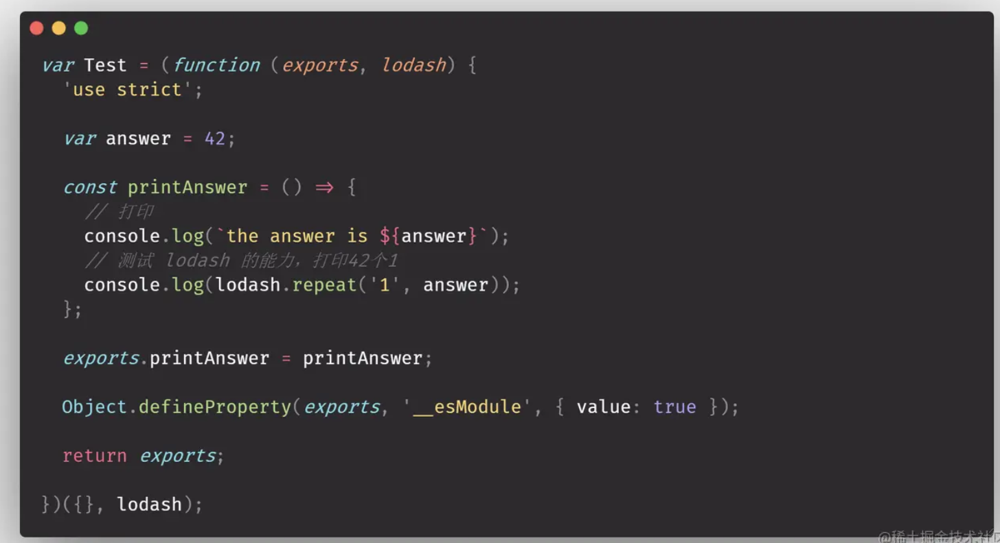
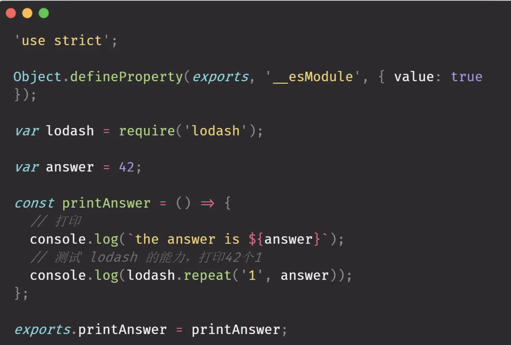
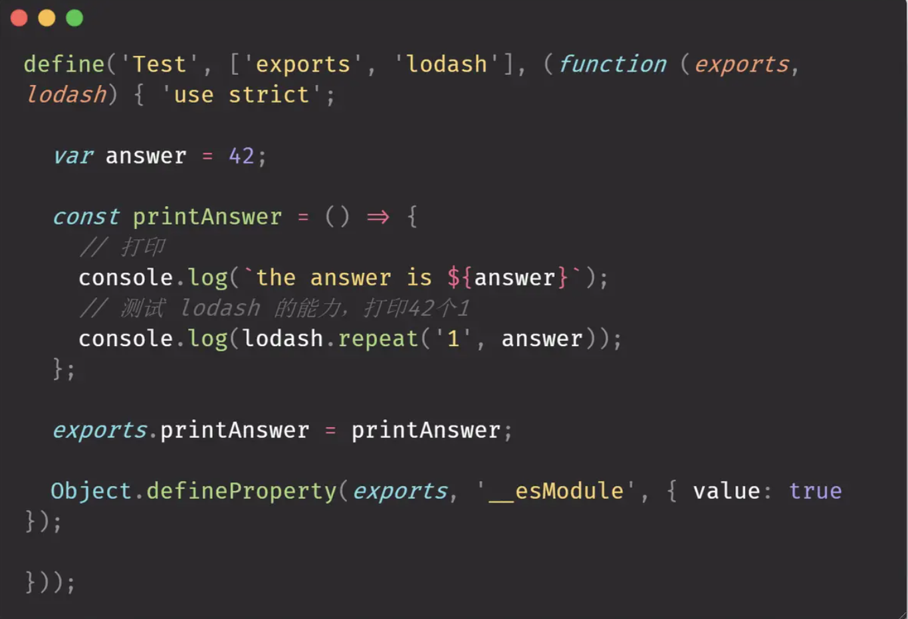
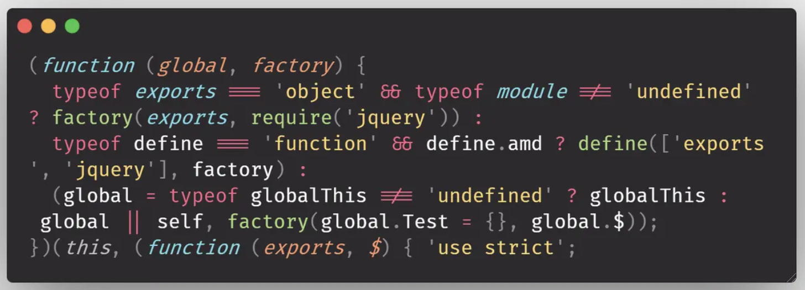

## rollup输出格式
我们首先构建一个简单的demo如下
``` js
├── answer.js
├── index.js
├── out
├── package.json
├── rollup.config.js
└── yarn.lock
```
其中 index.js 和 answer.js 属于业务代码，是需要被打包的对象。在 index.js 中依赖了 answer.js。如下：
``` js
// answer.js
export default 42

// index.js
import answer from "./answer";
import { repeat } from 'lodash'
// 定义一个无用变量, 测试 tree-shaking
const unusedVar = 'May the 4th'

export const printAnswer = () => {
  // 打印
  console.log(`the answer is ${answer}`)
  // 测试 lodash 的能力，打印42个1
  console.log(repeat('1', answer))
}
```
rollup.config.js 是 rollup 的配置文件，在此文件中我们分别指定其输出`amd , cjs , esm , iife , umd , system`六种格式的文件
``` js
// rollup.config.js
export default {
  // 核心选项
  input: 'index.js',     // 必须
  plugins: [],
  output: [
    {
      file: 'out/amd/bundle.js',
      format: 'amd',
      amd: {
        id: 'Test'
      }
    },
    {
      file: 'out/cjs/bundle.js',
      format: 'cjs'
    },
    {
      file: 'out/esm/bundle.js',
      format: 'esm'
    },
    {
      file: 'out/iife/bundle.js',
      format: 'iife',
      name: 'Test',
      globals: {
        lodash: 'lodash'
      }
    },
    {
      file: 'out/umd/bundle.js',
      format: 'umd',
      name: 'Test',
      globals: {
        lodash: 'lodash'
      },
      amd: {
        id: 'Test'
      }
    },
    {
      file: 'out/system/bundle.js',
      format: 'system'
    }
  ],
  external: ['lodash']
};
```
输出的文件会被打包到 out 文件夹下,当我们执行 yarn build 或者 npm build 之后，会在 out 下产生如下格式的代码：
``` js
├── out
│   ├── amd
│   │   └── bundle.js
│   ├── cjs
│   │   └── bundle.js
│   ├── ems
│   │   └── bundle.js
│   ├── iife
│   │   └── bundle.js
│   ├── system
│   │   └── bundle.js
│   └── umd
│       └── bundle.js
```
为了弄清楚每种格式的 bundle.js 文件是如何运作的，我专门为它们订制添加了一些附属的小 demo

### IIFE 自执行函数
让我们先看看本 demo 的 iife 格式打出来的包长什么样。

对上述代码做一些简化：
``` js
var Test = (function (exports, lodash) {
  'use strict'; // 自带严格模式，避免一些奇怪的兼容性问题

  /**
   * 下面折行无用代码被 tree-shaking 掉了
   * const unusedVar = 'May the 4th'
   * */

  var answer = 42; // 业务中被单一引用的模块，被直接抹平了

  const printAnswer = () => {
    console.log(`the answer is ${answer}`);

    console.log(lodash.repeat('1', answer));
  };

  exports.printAnswer = printAnswer; // 把要export的属性挂在到exports上

  return exports;

})({}, $); // exports是第一个入参，依赖的jquery是第二个入参
```
IIFE 是前端模块化早期的产物，它的核心思路是:
1. 构建一个匿名函数
2. 立刻执行这个匿名函数，对外部的依赖通过入参的形式传入
3. 返回该模块的输出

IIFE 的运行其实很容易，如果它没有其他依赖，只需要去引入文件，然后在 window 上取相应的变量即可。如：
``` html
  <script src="http://cdn.bootcss.com/jquery/3.3.1/jquery.min.js"></script>
  <script> 
    // jquery 就是典型的自执行函数模式，当你引入后，他就会挂在到 window.$ 上
    window.$ // 这样就能取到 jquery 了
  </script>
```
但是如果你像本 demo 中那样依赖了其他的模块，那你就必须保证以下两点才能正常运行：
- 此包所依赖的包，已在此包之前完成加载。
- 前置依赖的包，和 IIFE 只执行入参的变量命名是一致的。

以本 demo 的 IIFE 构建结果为例：它前置依赖了 lodash，因此需要在它加载之前完成 lodash 的加载。此 IIFE 的第二个入参是 lodash，作为
前置条件，我们需要让 window.lodash 也指向 lodash。因此，运行时，代码如下
``` html
<head>
  <script src="https://cdn.bootcdn.net/ajax/libs/lodash.js/4.17.21/lodash.min.js"></script>
  <script>window.lodash = window._</script>  
  <script src="./bundle.js"></script>
</head>
<body>
  <script>
    window.Test.printAnswer();
  </script>
</body>
```
优点:
1. 通过闭包营造了一个“私有”命名空间，防止影响全局，并防止被从外部修改私有变量。
2. 简单易懂
3. 对代码体积的影响不大

缺点：
1. 输出的变量可能影响全局变量；引入依赖包时依赖全局变量。
2. 需要使用者自行维护 script 标签的加载顺序。

### CommonJS
先看看 CommonJs 打包的结果:

简化一下，就长这样了：
``` js
'use strict';

var lodash = require('lodash');

var answer = 42;

const printAnswer = () => {
  // 打印
  console.log(`the answer is ${answer}`);
  // 测试 lodash 的能力，打印42个1
  console.log(lodash.repeat('1', answer));
};

exports.printAnswer = printAnswer;
```
以上格式，就是 CommonJS 规范的写法。
``` js
// CommonJS 通过一个全局 require 方法进行模块的引入 
var lodash = require('lodash');
// CommonJS 进行模块内方法输出的方式
module.exports.printAnswer = printAnswer;
// 上面写法也等价于：
exports.printAnswer = printAnswer;
// 因为 exports 变量等价于 module.exports
```
为了解决 node.js 在模块化上的缺失， 2009年10月 CommonJS 规范首次被提出。CommonJS 并不是在浏览器环境运行的规范，而是
在 node.js 环境下运行的。

优点
- 完善的模块化方案，完美解决了 IIFE 的各种缺点。
缺点
- 不支持浏览器环境，因为这种同步的引入方式可能导致浏览器假死。

因此，前端界迫切地需要一种能在浏览器环境完美运行，完善的模块化方案。

### AMD 和 requirejs
amd 格式的打包结果如下：

可以看到，核心内容是一个全局方法 define 。define 方法有三个入参，分别是：
1. "Test", 模块名称
2. [exports, lodash] 分别表示模块的输出和外部依赖
3. 一个以 exports 和 lodash 作为入参的方法，代表模块的实际内容。

相比于 IIFE 和 CommonJs 而言，AMD 的写法无疑是复杂且别扭的。但它却实实在在是解决了 IIFE 和 CommonJS 所面临的问题，对“浏览
器里完善的JS模块方法” 提供了一套完善的方案。尤其是 amd 标准的实现方案：requirejs。requirejs 所实现的 AMD 不仅解决了 CommonJS 在
浏览器端的不适，通过异步的方式进行模块加载实现了不会导致假死的能力；更是完全弥补了 IIFE 存在的各类缺陷。requirejs 在使用时，一般情况下
是以下四步法：
1. 在浏览器内引入 require.js
2. 通过 requirejs.config 方法定义全局的依赖
3. 通过 requirejs.define 注册模块
4. 通过 requirejs() 完成模块引入。
``` html
<head>
  <!-- 1. 引入 require.js -->
  <script src="./require.js"></script>
  <!-- 2. 定义全局依赖 -->
  <script>
    window.requirejs.config({
      paths: {
        "lodash": "https://cdn.bootcdn.net/ajax/libs/lodash.js/4.17.21/lodash.min"
      }
    });
  </script>
  <!-- 3. 定义模块 -->
  <script src="./bundle.js"></script>
</head>
<body>
  <script>
    // 4. 开销模块
    window.requirejs(
      ['Test'],
      function   (test) {
        test.printAnswer()
      }
    );
  </script>
</body>
```
优点
1. 解决了 CommonJS 的缺点
2. 解决了 IIFE 的缺点
3. 一套完备的浏览器里 js 文件模块化方案

缺点
- 代码组织形式别扭，可读性差，但好在我们拥有了各类打包工具，浏览器内的代码可读性再差也并不影响我们写出可读性ok的代码。

### UMD伟大的整合
umd 格式构建出来的代码的可读性进一步降低了。我相信任何正常人看到下面这段代码都会感到一阵头大：

是的，整整一大段代码，只是在处理兼容性问题，判断当前应该使用 amd 亦或是 CommonJS。因此 umd 的代码和实现不在此进行过多分析，它所做的
无非便是让同一段代码兼容了 amd 和 CommonJS。
- 在浏览器端，它的运行方式和 amd 完全一致，可以完全参考 3.2 节的 demo
- 在node.js端，它则和 CommonJS 的运行方式完全一致，在此就不赘述了
- 优点是抹平了一个包在 AMD 和 CommonJS 里的差异
- 缺点是会为了兼容产生大量不好理解的代码。（理解难度与包体积）


