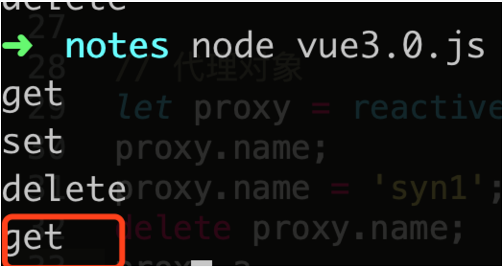
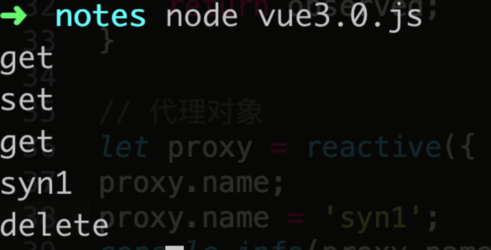
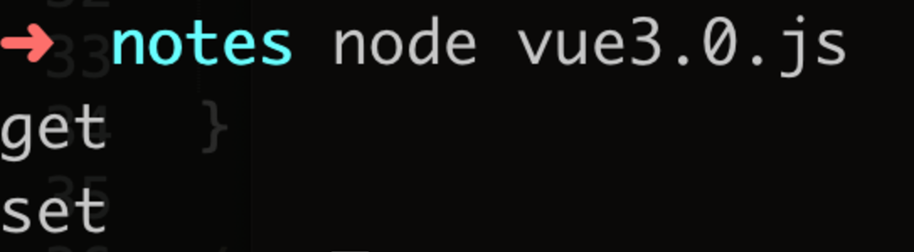
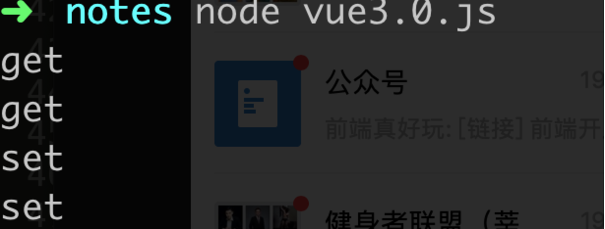
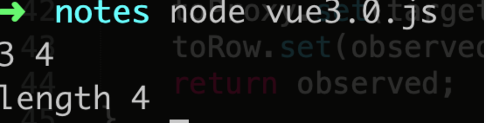
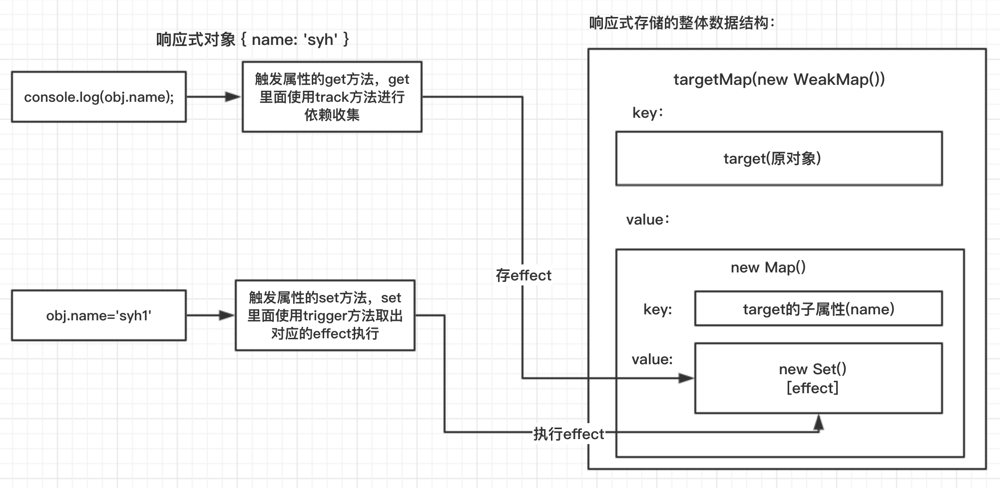
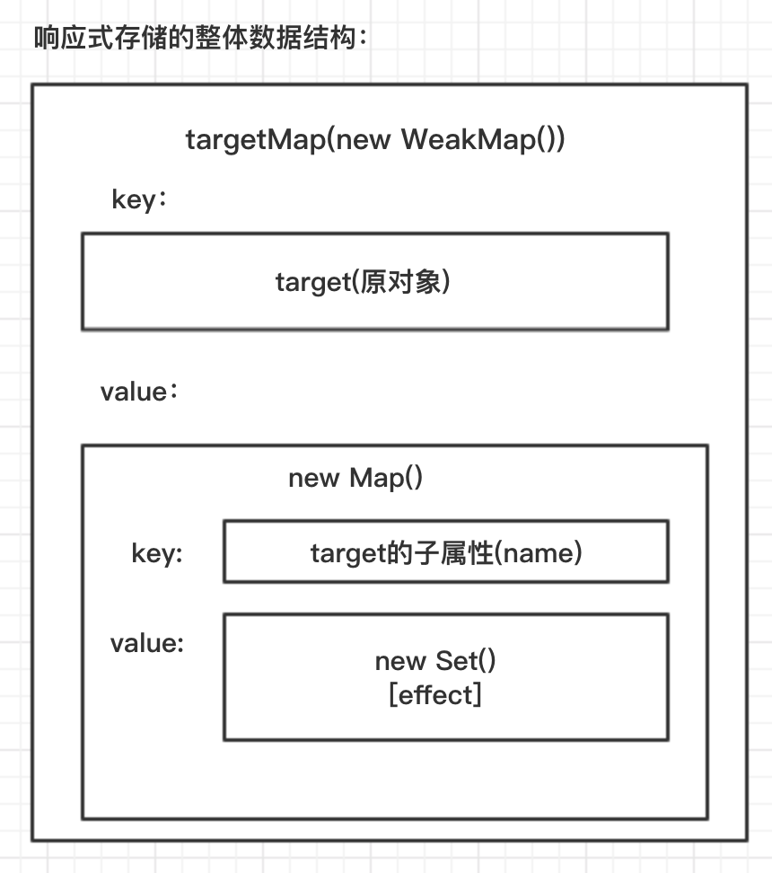

# Vue 3.0响应式自己实现

## 简单API介绍
vue3.0相比较于2.x版本，api的用途都是一致的，只不过我们写法变了。
github地址：https://github.com/vuejs/vue-next，下载安装依赖，我们先来用一个简单的例子介绍下新API：

``` js
function usePosition(){
  let position = Vue.reactive({x:0,y:0});
  function update(e){
      position.x = e.pageX;
      position.y = e.pageY;
  }
  Vue.onMounted(()=>{ // 生命周期函数
      window.addEventListener('mousemove',update)
  })
  Vue.onUnmounted(()=>{
      window.removeEventListener('mousemove',update)
  });
  return Vue.toRefs(position);
}
const App = {
  setup(props, context){ // 类似于created , 只会执行一次
    let state = Vue.reactive({name:'syh'}); // 响应式
    let position = usePosition();
    function change(){    // methods
      state.name = 'syh1'
    }
    return { // 这个对象会作为渲染的上下文
      state,
      change,
      ...position // 这个地方使用解构的方式获取值，所以上面要使用toRefs方法，保证结构出来的值也是响应式的
    }
  },
  template:`<div @click="change">{{state.name}} x:{{x}} y{{y}}</div>`
}
Vue.createApp().mount(App,container)  // 使用createApp方法
```

在上述例子中，usePosition方法是我们抽离出来的公共函数，里面的属性和setUp里面的一致，在vue2.x版本，我们只能通过mixin/高阶组件/插槽等方式来实现，但是均有问题，具体介绍可以参考：https://zhuanlan.zhihu.com/p/68477600

Vue3.0这种方式，更方便组件之间逻辑的抽取和复用。

>API更详细的使用方式，请看参考链接，这边就不一一 列举了


## vue2.x响应式原理
首先我们先复习下vue2.x的响应式原理(文字描述太费劲，直接上代码)：

``` js
// 对数组单独处理
let oldArrayPrototype = Array.prototype;
let proto = Object.create(oldArrayPrototype); // 继承
['push','shift','unshift', 'pop'].forEach(method=>{
  proto[method] = function(){ // 把函数进行重写 内部 继续调用老的方法
    updateView(); // AOP  更新视图
    oldArrayPrototype[method].call(this,...arguments) // 调用原始数组方法
  }
});
function observer(target){
  if(typeof target !== 'object' || target == null){
    return target;
  }
  if(Array.isArray(target)){ // 拦截数组 给数组的方法进行了重写
    Object.setPrototypeOf(target,proto); // 修改数组方法 target.__proto__ = proto;
    for(let i = 0; i< target.length ;i++){
        observer(target[i]);   // 循环数组每一项
    }
  }else{
    for(let key in target){
        defineReactive(target,key,target[key]);  // 给对象每一项添加get和set方法
    }
  }
}
function defineReactive(target,key,value){
  observer(value); // 递归
  Object.defineProperty(target,key,{
    get(){ // get 中会进行依赖收集
        return value;
    },
    set(newValue){
        if(newValue !== value){
            observer(newValue)  // 设置新属性的时候，也需要递归
            updateView();
            value = newValue
        }
    }
  });
}
function updateView(){
  console.log('更新视图')
}

let data = {name:'syh',age:[1,2,3]}
observer(data);
data.age.push(4);
```
**以上响应式过程有以下几个问题**：
1. 循环递归的地方很多，浪费性能
2. 数组需要独立处理，且数组改变length是无效的。
3. 获取对象不存在的属性会被拦截


## Vue3.0的响应式
### reactive
上面Vue3.0的例子中，`reactive`是用来实现响应式的，我们就从这个api开始，使用`Proxy`实现一个简单的数据劫持

``` js
function isObject(val) {
	return typeof val === 'object' && val !== null;
}

function reactive(target) {
	// 创建响应式对象
	return createReactiveObject(target);
}

function createReactiveObject(target) {
	if(!isObject(target)) { return target; } // 如果不是对象，直接返回
	// 数据劫持
	let observed = new Proxy(target, {
		get() {
			console.log('get');
		},
		set() {
			console.log('set');
		},
		deleteProperty() {   // 删除
			console.log('delete');
		}
	});
	return observed;
}

// 代理对象
let proxy = reactive({ name: 'syh' });
proxy.name;
proxy.name = 'syn1';
delete proxy.name;
proxy.a
```

以上，便是一个最简的利用proxy进行数据劫持的过程，打印结果如下：



分别触发了get、set、delete方法。
注意，get方法被触发了两次，最后一次调用`proxy.a`，也触发了get方法，但是proxy并没有a属性。说明**获取对象不存在的属性，也可以触发get方法**。


### get、set、deleteProperty
接下来我们来完善get、set、deleteProperty方法。
get方法有3个参数：
1. target--原对象
2. key--代理的key
3. receiver--代理后获得的对象，reactive的返回值proxy

``` js
get(target, key, receiver) {
	return target[key]
},
```

但是vue3.0版本并不是这样用，而是用了一个Reflect的API(http://es6.ruanyifeng.com/#docs/reflect)，set、delete方法中也一样。

``` js
let observed = new Proxy(target, {
	get(target, key, receiver) {
    console.info('get');
    let result = Reflect.get(target, key, receiver);
    return result;
  },
  set(target, key, value, receiver) {
    console.info('set')
    // Reflect.set方法会有一个返回值，为boolean类型，告诉你这个值是否设置成功
    let res = Reflect.set(target, key, value, receiver);
    return res;
  },
  deleteProperty(target, key) {   // 删除
    console.log('delete');
    let res = Reflect.deleteProperty(target, key);
    return res;
  }
});
return observed;
```



此时，数组也可被代理：

``` js
// 代理对象
let proxy = reactive([1,2,3]);
proxy.push(4);
console.log(proxy);
```
执行结果(触发次数过多的问题后面会解决，这边先不管)：


**如果当前代理的对象不是一层，是多层呢？**

``` js
// 代理对象
let proxy = reactive({ name: { firstName: 'syh' }});
proxy.name.firstName = 's';
```
打印结果：js


结果并没有打印set方法，但是我们看到，打印了get方法。因为我们获取firstName这个属性的时候，先调用了name，就触发了name的get。所以，我们可以在get方法里面，获取他子对象的代理。**总结来说，vue3.0的递归，不是在初始化的时候就将所有属性都递归一遍进行双向绑定，而是你取值的时候，再绑定**。

``` js
get(target, key, receiver) {
  console.info('get');
  let result = Reflect.get(target, key, receiver);
  // result 就是当前获取到的值，此时如果result是个对象，那对result再进行一次绑定
  return isObject(result) ? reactive(result) : result;   // 递归
},
```

打印结果：


### 解决重复代理问题
如果用户写了如下代码：

``` js
// 代理对象
let obj = { name: { firstName: 'syh' }};
let proxy = reactive(obj);
reactive(obj);
reactive(proxy);
```
会自然产生以下两个疑问：
1. 我们每调用一次reactive方法，都会new一个proxy对象，然后返回，如何避免重复代理同一个对象？
2. 如果reactive里面传入的是一个已代理过的对象呢？

我们使用两个映射表来解决这两个个问题

``` js
let toProxy = new WeakMap();  // 映射关系 原对象：代理后的对象
let toRow = new WeakMap();   // 映射关系 代理后的对象：原对象
.....
// 赋值
toProxy.set(target, observed);
toRow.set(observed, target);
return observed;
```

> weakMap具体内容，可参考：https://github.com/mqyqingfeng/Blog/issues/92

所以，在进行数据劫持之前，要看下weakmap里面是否有值：

``` js
let proxy = toProxy.get(target);
if (proxy) return proxy;  // 如果已经代理过了，直接将代理结果返回
if (toRow.has(target)) return target;  // 此时 target如果是observe，是一个已经代理过的对象，那就直接返回
```

### 解决数组的get和set多次触发问题

``` js
// 代理对象
let obj = [1, 2, 3];
let proxy = reactive(obj);
proxy.push(4);
```
打印结果如下：



打印了2次的get和set，我们先来看set函数，在set里面打印下key、value：

``` js
set(target, key, value, receiver) {
  // console.info('set')
  console.info(key, value);
  // Reflect.set方法会有一个返回值，为boolean类型，告诉你这个值是否设置成功
  let res = Reflect.set(target, key, value, receiver);
  return res;
},
```
打印结果为：



可以看见，key分别为3和length，第一次的key是数组下标3，value是值4；第二次修改数组的length属性。所以，触发了两次set。
我们需要屏蔽修改length的set，那就要区分当前数组是修改属性还是新增属性。如果是修改，那么target属性里面肯定会有对应的key：

``` js
function hasOwn(target, key) {
	return target.hasOwnProperty(key);
}
```
使用oldValue记录老值，value为新的值：
``` js
set(target, key, value, receiver) {
  const hasKey = hasOwn(target, key);
  let oldValue = target[key];  // 记录老值
  // Reflect.set方法会有一个返回值，为boolean类型，告诉你这个值是否设置成功
  console.info(target, key, value);
  let res = Reflect.set(target, key, value, receiver);
  // console.info(oldValue, value);
  if (!hasKey) { // 原有数组里面没这个属性，表示新增值
    console.info('新增');
  } else if (oldValue !== value) {  // 表示修改属性
    console.info('修改属性');
  }
  return res;
},
```

以上，数组重复调用的问题也解决了。下面我们来看依赖收集。

### 依赖收集
Vue3.0依赖收集的核心，依旧是发布订阅。我们先回顾下Vue2.0的依赖收集过程。

#### Vue2.0中的依赖收集
首先我们先写个简单的发布订阅：
``` js
function Dep() {
	this.dep = []; // 存放所有依赖
}

Dep.prototype.addSub = function(fn) {   // 这个fn添加的就是watcher
	this.dep.push(fn);
}

Dep.prototype.notify = function() {
	this.dep.forEach(fn => {
		fn.update();       //  触发页面元素更新。Dep的notify方法都是在数据劫持的set里面操作。update就是更新的方法
	})
}
```

vue2.0在模板编译的时候，会根据模板内容，动态生成Watcher的实例：
``` js
new Watcher(vm, RegExp, function(newValue) {
	// 数据变动后的回调，一般都是修改dom
})
```

Watcher类实现：

``` js
function Watcher(vm,exp,fn) {
	this.fn = fn;
	this.vm = vm;
	this.exp = exp;
	Dep.target = this;
	let val = vm;
	let arr = exp.split('.');
	arr.forEach(function(k) {  // 取值的时候，会调用get方法，在get方法里面完成依赖收集
		val = val[k]
	})
	Dep.target = null;
}
```
每一个watcher都有一个update方法，用户更新数据后，update方法先获取更新后的值，然后执行回调：
``` js
Watcher.prototype.update = function() {
	// 先获取更新后的值
	let val = this.vm;
	let arr = this.exp.split('.');
	arr.forEach(function(k) {
		val = val[k]
	})
	this.fn(val) // 执行更新dom的回调
}
```
在get方法里面进行依赖收集，在set方法里面触发更新：
``` js
let dep = new Dep();
Object.defineProperty(target,key,{
  get(){
    Dep.target&&dep.addSub(); // 完成依赖收集
    return value;
  },
  set(newValue){
    if(newValue !== value){
      value = newValue
      observer(newValue)  // 设置新属性的时候，也需要递归
      dep.notify(); // 让所有watcher的update方法执行
    }
  }
});
```
**总结**:
可以理解为vue2.0里面data的每一个属性以及它的子属性，都对应了一个watcher，修改属性的时候，就触发了本身的set方法，然后通知Dep的notify，然后执行相应的update方法。

Watcher主要做了以下操作：
1. 通过参数vm以及传过来的exp，获取newValue
2. 将当前对象对应的watcher实例赋值给Dep.target
3. 从vm获取newValue，会触发get方法，在get里面完成依赖收集
4. 将Dep.target = null; 当前属性依赖收集完毕。

Watcher的updata方法：
1. 通过new Watcher传过来的vm以及exp，获取最新的值
2. 将newVal最为参数，执行new Watcher传过来的回调方法，更新dom


#### Vue3.0中的依赖收集
总体结构图：


``` js
let obj = reactive({ name: 'syh' });
obj.name = 's';
```
我们需要做两件事情
1. 初始化依赖收集
2. 更新属性后执行update方法

Vue3.0新增一个effect方法，来实现这两个功能。
effect方法应该执行两次，第一次依赖收集，第二次更新属性
``` js
let obj = reactive({name：'syh'});
effect(() => {
	console.info(obj.name); // 会执行2次
})

obj.name = 's';
```
在vue2.0中，通过set方法触发所有watcher的回调，在3.0中，当属性值发生变动后，直接触发对应的effect方法：
``` js
function effect(fn) {
	// 需要将fn做成响应式的，当属性变动后，就执行函数
	let effect = createReactiveEffect(fn);
	// 创建完之后，要默认执行一次
	effect();
}
```

接下来，我们看createReactiveEffect的实现：

``` js
function createReactiveEffect(fn) {
	// 创建一个响应式effect
	let effect = function() {
		// run方法有两个目的 1. 执行fn 2. 将effect存到栈activeEffectStact中，数据更新后，重新执行该函数
		return run(effect，fn);
	}

	return effect;
}
```

``` js
function run(effect, fn) {
	activeEffectStact.push(effect);
	fn();
}
```
我们在run方法里面执行了fn()，fn里面获取了属性值，那就会触发属性的get方法，我们可以将当前属性名和对应的effect方法关联 `{name: [effect]}`，这样，某一个属性变化后，就可以直接执行它对应的effect方法

``` js
get(target, key, receiver) {
  // console.info('get');
  // console.info(key);
  let result = Reflect.get(target, key, receiver);
  // result 就是当前获取到的值，此时如果result是个对象，那对result再进行一次绑定

  // 依赖收集，将当前的属性和effect对应起来，如果这个key变化了，重新让数组中的effect执行
  track(target, key);

  return isObject(result) ? reactive(result) : result;   // 递归
},
```

在track方法里面，我们要生成这么一个对应关系：

``` js
target: {
	key: [effect1, effect2...]
}
```



整体是个weakMap，target为key，value值是一个Map，Map的key是普通属性，value是一个set，里面存放的就是对应的effect


``` js
let targetsMap = new WeakMap();
// 如果属性值变化，就执行activeEffectStact里面的effect方法
function track(target, key) {
	// 取数组最后一个
	let effect = activeEffectStact[activeEffectStact.length -1];
	if (effect) {
		// 先看这个target有没有
		let depsMap = targetsMap.get(target);
		if (!depsMap) {
			depsMap = new Map();
			targetsMap.set(target, depsMap);
		}
		// 再看这个key有没有
		let deps = depsMap.get(key);
		if (!deps) {
			deps = new Set();
			depsMap.set(key, deps);
		}
		// 将activeEffectStact中的effect放到deps里面
		// 先判断deps里面有没有effect
		if (!deps.hans(effect)) {
			deps.add(effect);
		}
	}
}
```

加完一个effect，就要从栈里面清掉一个

``` js
function run(effect, fn) {
	try {
		activeEffectStact.push(effect);
		fn(); // 加try catch是为了防止fn报错
	} finally {
		// 数组放完一个后，执行pop
		activeEffectStact.pop();
	}
}
```

更新的话，会调用set方法

``` js
set(target, key, value, receiver) {
  const hasKey = hasOwn(target, key);
  let oldValue = target[key];   // 记录老值
  // Reflect.set方法会有一个返回值，为boolean类型，告诉你这个值是否设置成功
  console.info(target, key, value);
  let res = Reflect.set(target, key, value, receiver);
  // console.info(oldValue, value);
  if (!hasKey) { // 原有数组里面没这个属性，表示新增值
    console.info('新增');
    // 执行更新操作
    trigger(target, 'add', key);
  } else if (oldValue !== value) {  // 表示修改属性
    console.info('修改属性');
    trigger(target, 'set', key);
  }
  return res;
},
```

``` js
// 取出属性对应的effect执行
function trigger(target, type, key) {
	let depsMap = targetsMap.get(target);
	if (depsMap) {
		let deps = depsMap.get(key);
		if (deps) {
			deps.forEach(effect => effect());   // 将属性对应的effect执行
		}
	}
}
```

以上，vue3.0依赖收集已全部完成。

## 参考文章
#### vue3.0 Api介绍：
1. https://zhuanlan.zhihu.com/p/68477600
2. https://github.com/xingbofeng/xingbofeng.github.io/issues/45
#### vue3.0源码介绍：
1. https://juejin.im/post/5d99be7c6fb9a04e1e7baa34#heading-6
2. https://juejin.im/post/5d977f47e51d4578453274b3
#### 其他：
1. https://github.com/mqyqingfeng/Blog/issues/92
2. https://github.com/coolriver/coolriver-site/blob/master/markdown/vue-mixin-hoc.md
