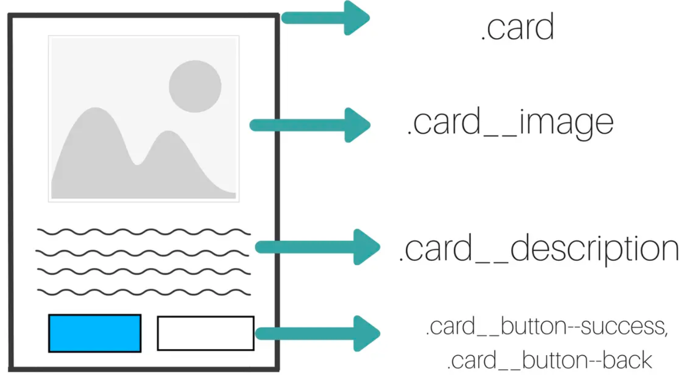

CSS 方法论是一种面向 CSS、由个人和组织设计、已被诸多项目检验且公认有效的最佳实践。这些方法论都会涉及结构化的命名约定，并且在组织 CSS 时可提供相
应的指南，从而提升代码的性能、可读性以及可维护性

根据 CSS 状态 2020 的调查结果显示，目前使用最多的五种分别为： BEM、ACSS、OOCSS、SMACSS、ITCSS
## BEM
BEM 全称为 Block Element Modifier，分别表示块（Block）、元素（Element）、修饰符（Modifier），它是由 Yandex 团队提出的一种 CSS 命名方法。这
种命名方法让 CSS 便于统一团队开发规范和方便维护。该方法论由以下三部分组成：
- Block： 尽量以元素的性质来命名对象，例如：.list、.card、.navbar；
- Element： 使用 __ 两个下划线来连接 Block 对象，例如：.list__item、.card__img、.navbar__brand；
- Modifier： 使用 -- 两个连字符连接 Block 或 Element 对象，例如：.list__item--active、.card__img--rounded、.navbar--dark

在 BEM 中并没有那些抽象的规则，它是基于功能为导向（Function-Oriented Programming, FOP）而设计的，不存在像是 .pl-3 这种难以理解的 class 名称，为
了保证 BEM 能够合理的将元素模块化，需要遵守以下规则：
1. 不能使用 class 以外的选择器来编写样式
2. 不要过度模块化，应该适当控制元素的模组化深度

### （1）Block 块
所谓的 Block 就是指应用中可独立存在的元素，类似于 SMACSS 中的 Layout 或 Module，这里称其为块。需要遵守以下规范：
- Block 名称需要清楚的表达其用途、功能、意义，且具有唯一性；
- Block 可以放在页面上的任何位置，也可以相互嵌套；
- 单词之间可以使用驼峰形式或者使用 - 将其分隔
``` css
.list { /* ... */ }

.card { /* ... */ }

.navbar { /* ... */ }

.header { /* ... */ }
```

### （2）Element 元素
如果把块描述为一个元素，那就可以将 Element 描述为此元素的子元素。参考以下规则：
- Element 名称需要清楚的表达元素的用途及意义；
- Element 和 Element 之间可以相互嵌套；
- Element 与Block 之间使用 __ 两个下划线连接；
- 单词之间可以使用驼峰式或者使用 - 将其分隔；
``` css
.list__item { /* ... */ }

.card__img { /* ... */ }

.navbar__brand { /* ... */ }

.header__title { /* ... */ }
```
这里需要注意，Element 无法独立于 Block 之外，其存在的目的就是子元素，元素既然不存在，那何来的子元素？如果使用 SCSS 来编写样式，可以改用 & 父选择器来
``` scss
.list {
  display: flex;

  &__item {
    flex: 0 0 25%;
  }
}
```

### （3）Modifier 修饰符
Modifier 就像 OOCSS 中的 Skin 与 SMACSS 中的 State，主要用来表示 Block 或 Element 的行为及样式。参考以下规范：
- Modifier 名称需要清楚的表达元素样式、状态或行为
- Modifier 与 Block 或 Element 之间使用 -- 两个连字符连接
- 单词之间可以使用驼峰式或者使用 - 将其分隔
``` scss
.list {
  display: flex;

  &__item {
    flex: 0 0 25%;

    &--active {
      color: #fffc3d;
    }
  }

  &--dark {
    color: #fff;
    background-color: #272727;
  }
}
```

## OOCSS
OOCSS 是 Object Oriented CSS 的缩写，意为面向对象的CSS。它是所有 CSS 方法论中最早提出的一个，由 Nicole Sullivan 提出。可以把它
理解为将 CSS 模块化,OOCSS 提倡样式可重用性，在编写 CSS 样式时需要遵循以下规则：
- 应尽量避免使用后代选择器(.navbar ul) 或 id 选择器(#list)
- 应尽量避免样式依赖于结构，尝试使用 class 替代标签选择器
- 结构与样式分离和容器与内容分离

平时我们可能习惯性的把全部样式都写在同一个class 中，此时如果我们需要新增一个主题为 success 的按钮呢？你可能会这样做：
``` scss
.btn-primary {
  display: inline-block;
  padding: 0.375rem 0.75rem;
  color: #fff;
  background-color: map-get($theme-colors, primary);
  border: 1px solid map-get($theme-colors, primary);
  border-radius: 0.25rem;
}

.btn-success {
  display: inline-block;
  padding: 0.375rem 0.75rem;
  color: #fff;
  background-color: map-get($theme-colors, success);
  border: 1px solid map-get($theme-colors, success);
  border-radius: 0.25rem;
}
```
这时，两个按钮就会有很多重复的样式，每增加一个主题的按钮，就需要增加一组样式，这就有点浪费时间了。而 OOCSS 中的结构与样式分离主要就是为了改善这
个问题，将以上代码根据 OOCSS 的规范进行改写：
``` scss
.btn {
  display: inline-block;
  padding: 0.375rem 0.75rem;
  color: black;
  background-color: transparent;
  border: 1px solid transparent;
  border-radius: 0.25rem;
}

.btn-primary {
  color: #fff;
  background-color: map-get($theme-colors, primary);
  border: 1px solid map-get($theme-colors, primary);
}
```
在 OOCSS 的概念中，表现型的 style 就属于样式，封装型的 style 就属于结构，如下所示：
- 样式(skin)：color、background-color、border-color
- 结构(structure)：display、box-sizing、padding

当然，也可以借助 Sass 中的 @each 来更快速地实现多种主题按钮的样式：
``` scss
$theme-colors: (
  primary: blue,
  success: green,
  danger: red,
);

.btn {
  display: inline-block;
  padding: 0.375rem 0.75rem;
  color: black;
  background-color: transparent;
  border: 1px solid transparent;
  border-radius: 0.25rem;
}

@each $key, $value in $theme-colors {
  .btn-#{$key} {
    color: #fff;
    background-color: $value;
    border: 1px solid $value;
  }
}
```

接下来看看容器与内容该如何分离。容器与内容之间就像 .card 与 .btn 的关系一样。来看例子：
``` css
.card {
  position: relative;
  display: flex;
  flex-direction: column;
  min-width: 0;
  word-wrap: break-word;
}

.card button {
  display: inline-block;
  padding: 0.375rem 0.75rem;
}
```
在编写 CSS 样式时，通常都是根据 HTML 的结构来编写。从上面的代码中可以看出，.card 里面有个 button。这样编写样式就会失去灵
活度，button 就完全被绑定在了 .card 里面，OOCSS 中的容器与内容分离主要就是用来改善这个问题的，将上面的代码根据 OOCSS 的规
范进行改写：
``` css
.card {
  position: relative;
  display: flex;
  flex-direction: column;
  min-width: 0;
  word-wrap: break-word;
}

.btn {
  display: inline-block;
  padding: 0.375rem 0.75rem;
}
```
容器与内容分离旨在将两个不同的父子元素给分离出来，借此达到父子元素不相互依赖的目的。且父子元素只存在名称上的关系，实际上两者都可以单
独存在并可以在不同的区域使用。这里的 .card 就属于容器，.btn 就属于内容，如下所示：
- 容器(container)：.container、.col-4、.header
- 内容(content)：.btn、.input、.dropdown

通过上面的例子，相信大家已经理解了 OOCSS 的基本思想。其实，Bootstrap 就是根据 OOCSS 规范实现的，来看例子：
``` html
<nav class="navbar navbar-light bg-light">
  <a class="navbar-brand">Navbar</a>
  <form class="form-inline">
    <input class="form-control mr-sm-2" type="search" placeholder="Search" aria-label="Search" />
    <button class="btn btn-outline-success my-2 my-sm-0" type="submit">Search</button>
  </form>
</nav>
```
可以看到，这段代码中包含了 .navbar、.navbar-light等 class，这些就属于 OOCSS 中的结构与样式分离，而.form-inline、.btn 等 class 就
属于容器与内容分离。如果对 OOCSS 方法论感兴趣，可以阅读一下 Bootstrap 的源码，其处理的细腻程度可以说是将 OOCSS 发挥的淋漓尽致

## SMACSS
SMACSS 全称为 Scalable and Moduler Architecture for CSS，意为可扩展的模块化 CSS 结构，由 Jonathan Snook 提出。SMACSS 不仅包含
了结构与样式分离的概念，还具有极具特色的结构化命名的概念。所谓的结构化命名，就是将元素做结构分类并限制其命名，以此达到易扩展和模块化的目的

SMACSS 相对于 OOCSS 更偏向于整体结构的分类及模组化 CSS，其中结构的分类包括：
- Base（基础）： 不需要特别的提供前缀，且不会使用到 class、id 选择器，目的在于设定元素基本样式。例如：html、*:before、img；
- Layout（布局）： 使用 l- 或 layout- 为次要布局样式提供前缀，目的在于将布局样式与其他样式做区分。例如：.l-header、.l-sidebar、.l-grid；
- Module（模块）： 使用块本身命名为子元素样式提供前缀，目的在于快速了解其相关性。例如：.card、.card-header、.card-body；
- State（状态）： 使用 is- 为状态样式提供前缀，通过语意化方式了解当前状态。例如：.is-active、.is-hidden、.is-collapsed；
- Theme（状态）： 不需要特别的提供前缀，使用对象本身的名称覆盖其原先的主题样式。例如：.l-header-dark、.card-dark。

### （1）Base 规则
Base 主要面向某些对象的基本及预设样式，也就是全局的初始化（重置）样式。在编写这些样式时应该遵循以下规则：
- 可以使用元素选择器、后代选择器、子选择器以及任何伪类将基本样式应用于元素
- 不应该使用 class、id 选择器来设置元素预设的样式
- 不应该使用 !important 来设置元素预设的样式（其权重过高，无法被覆盖）

### （2）Layout 规则
SMACSS 中的 Layout 根据重用性将页面划分成主要布局样式和次要布局样式，主要布局样式是指不发生重用的元素，而次要布局样式就是指会发生重
用的元素，在编写样式时应该遵守以下规则：
- 主要布局样式通常使用 id 选择器进行设置
- 次要布局样式通常使用 class 选择器进行设置
- 次要布局样式可提供 l- 或 layout- 前缀用以将布局样式与基本样式做区分
- 参考 OOCSS 中的容器与内容分离的概念
和 SMACSS 规则不同的是，在 Layout 规则中的主要布局样式是可以使用 id 选择器来定义的。如果想要在特定情况下更改其布局样式，可以与次要布局样式搭配使用：
``` css
#article {
  float: left;
}

#sidebar {
  float: right;
}

.l-flipped #article {
  float: right;
}

.l-flipped #sidebar {
  float: left;
}
```
### （3）Module 规则
Module 主要面向应用中的可重用元素的样式，与 Layout 不同的地方在于其元素更为准确。基于 Module 的元素都应该以独立元素的方式存在。在编写是需要遵循以下规则：
- 不应该使用元素选择器、id 选择器设置元素样式
- 仅使用 class 选择器设置元素样式
- 使用元素本身命名为子元素样式提供前缀
- 参考 OOCSS 中的结构与样式分离概念
``` css
.card-header {
  padding-left: 20px;
}

.card-footer {
  padding-left: 20px;
}
```
### （4）State 规则
State 主要面向 Layout 或 Module 在应用上的特效及动作，其概念类似于 BEM 中的Modifier，为了保证样式可以作用于对象，允许使用 @important。在编写时可以参照以下规则：
``` html
<ul class="nav">
  <li class="nav-item">
    <a class="nav-link is-active" href="#">Link</a>
  </li>
  <li class="nav-item">
    <a class="nav-link" href="#">Link</a>
  </li>
  <li class="nav-item">
    <a class="nav-link is-disabled" href="#">Link</a>
  </li>
</ul>
```
与上面介绍的子模块样式不同的地方在于，状态样式不需要继承于任何对象，而只是单纯的将样式应用于对象，可以参考 Bootstrap 中的 .active 或 .disabled 样式，作用就类似于
上面的 is-active 与 is-disabled，为了保证状态样式可以作用于指定对象，在 State 中允许使用 @important

### （5）Theme 规则
Theme 主要面向应用中为主视觉定义的 Layout 或 Module 样式，例如主题切换。在编写时需要遵循以下规则：
- 直接使用 Layout 或 Module 定义的 class 覆盖其样式
``` css
// index.css
.mod {
  border: 1px solid;
}

// themeA.css
.mod {
  border-color: blue;
}
```
这里需要注意，不需要使用独立的 class 去添加主题样式，在 Theme 的规则中建议使用与原来 Layout 或 Module 中相同的样式名称，而 themeA.css 样式会在 index.css 之后才
加载，这样就可以达到覆盖样式的目的，如果应用中有很多主题样式，也只需要新增像 themeB.css 这样的样式文件即可

## ITCSS
ITCSS 全称为 Inverted Triangle CSS，意为倒三角CSS，由 Harry Robers 开发。ITCSS 是一种可扩展和可管理的架构，独立于预处理器存在。它出现的主要目的是帮助组织项目
的 CSS 文件，从而解决由级联和选择器的特殊性引起的问题

ITCSS 的目标是通过分层组织 CSS 文件，实现了自下而上的特异性。它基于分层的概念把项目中的样式分为七层：

上层定义的代码比下层定义的代码影响更大。因此，上层会影响下层，下层不会影响上层。下层将继承上级的样式，越往下越具体,ITCSS 通过三个关键指标对 CSS 项目进行排序：
- 通用到显式（explicitness）： 在 ITCSS 的分层中，每一层的权重是越来越大，作用的范围越来越小。从通用的规则到非常明确的规则；
- 低特异性到高特异性（specificity）： 开始的时候选择器具有最低的特异性（优先级），随着层数的增加，特异性也在不断变大。因此，要尽量避免在低特异性选择器之前编写高特异性选择器；
- 深远到本地化（reach）： 上层定义的样式会影响很多HTML的表现，随着层数的增加，影响范围逐渐减小。

### （1）SETTINGS
第一层 SETTINGS 表示设置，这一层包含项目的所有全局设置。通常会定义一些全局变量，例如颜色、字体大小等，这一层不会生成实际的 CSS
``` scss
$main-color: #6834cb;
$main-font-size: 24px;
```

### （2）TOOLS
第二层 TOOLS 表示工具，如果使用了预处理器，可以在这一层定义 function 和 mixins。Tools 层位于 Settings 层之后，因为 mixin 可能需要全局设置中的一些变量来作为
默认参数。同样，这一层也不会生成实际的 CSS
``` scss
@function sum($numbers...) {
  $sum: 0;
  @each $number in $numbers {
    $sum: $sum + $number;
  }
  @return $sum;
}

@mixin sample-mixin () {
  ...
}
```

### （3）GENERIC
第三层 GENERIC 表示通用，可以在这一层来定义重置或者标准化浏览器的基本样式，这一层很少会被修改。这也是第一个实际会生成 CSS 的层
``` css
* {
  padding: 0;
  margin: 0;
}

*,
*::before,
*::after {
  box-sizing: border-box;
}
```

### （4）ELEMENTS
第四层 ELEMENTS 表示元素，通常用来定义影响 HTML 单个标签的样式，例如 h1、p 标签的默认样式：
``` scss
h1 {
  color: $main-color;
  font-size: $main-font-size;
}
```

### （5）OBJECTS
第五层 OBJECTS 表示对象，可以在这一层定义整个项目中可重用的页面结构类。与上一层相比，这一层对 DOM 的影响更小，具有更高的特异性（优先级），并且更加明
确，因为现在将 DOM 的部分作为目标来设置了样式
``` css
.grid-container {
  display: grid;
  grid-template-columns: auto auto auto auto;
}
```

### （6）COMPONENTS
第六层 COMPONENTS 表示 UI 组件，与对象不用，组件是页面的特定部分。比如搜索框的样式，为组件定义的样式只会影响到对应的组件。这一层比上一层更加明确，因
为现在为 DOM 设计了明确的样式
``` scss
.c-btn {
  display: flex;
  justify-content: center;
  align-items: center;
  ...

  &--primary {
    background-color: #ff5959;
    color: #fff;
  }

  &--large {
    font-size: 16px;
    padding: 16px 14px;
    ...
  }
}
```

### （7）TRUMPS
这一层也称为 Utilities，包含所有那些覆盖之前层中定义的任何其他规则的规则。它是唯一允许使用 !important 的层
``` css
.d-none {
  display: none!important;
}
```

### （8）项目结构
那这七层结构的 CSS 文件该如何组织呢？主要有两种方式：


