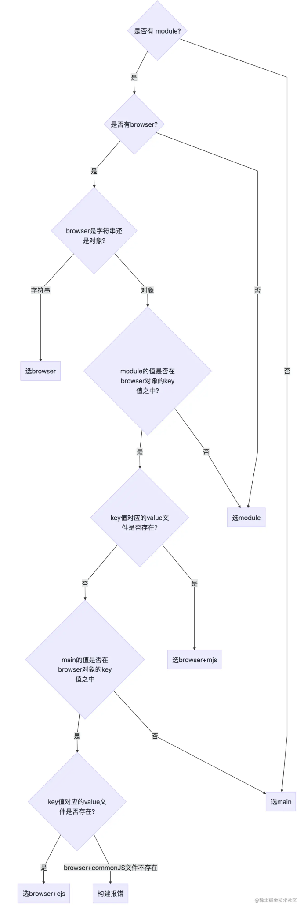

## packagejson入口
我们清楚 npm 包其实又分为：
- 只允许在客户端使用的
- 只允许造服务端使用的
- 浏览器/服务端都可以使用

如果我们需要开发一个 npm 包同时兼容支持 web端 和 server 端，需要在不同环境下加载npm包不同的入口文件，显然一个 main 字段已经不能够满足我们的需求，这就衍生出来了
module 与 browser 字段，本文就来说下 这几个字段的使用场景，以及同时存在这几个字段时，他们之间的优先级

#### 文件优先级
在说 package.json 之前，先说下文件优先级，由于我们使用的模块规范有 ESM 和 commonJS 两种，为了能在 node 环境下原生执行 ESM 规范的脚本文件，.mjs 文件就
应运而生，当存在 index.mjs 和 index.js 这种同名不同后缀的文件时`import  './index'`或者`require('./index')`是会优先加载 index.mjs 文件的。
也就是说，优先级 `mjs  >  js`

- main : 定义了 npm 包的入口文件，browser 环境和 node 环境均可使用
- module : 定义 npm 包的 ESM 规范的入口文件，browser 环境和 node 环境均可使用
- browser : 定义 npm 包在 browser 环境下的入口文件

``` lua
----- lib
   |-- index.browser.js
   |-- index.browser.mjs
   |-- index.js
   |-- index.mjs
```
其中 *.js 文件是使用 commonJS 规范的语法(require('xxx'))，*.mjs 是用 ESM 规范的语法(import 'xxx')
``` js
// 那么我们就有以下5种情况
  "main": "lib/index.js",  // main 
  "module": "lib/index.mjs", // module

  // browser 可定义成和 main/module 字段一一对应的映射对象，也可以直接定义为字符串
  "browser": {
    "./lib/index.js": "./lib/index.browser.js", // browser+cjs
    "./lib/index.mjs": "./lib/index.browser.mjs"  // browser+mjs
  },

  // "browser": "./lib/index.browser.js" // browser
```
接下来我们按使用场景进行区分
#### webpack + web + (ESM/commonJS)
这是我们最常见的使用场景，通过 webpack 打包构建我们的 web 应用，模块语法使用 ESM当我们加载`import test from 'test'`

实际上的加载优先级是`browser = browser+mjs > module > browser+cjs > main`也就是说 webpack 会根据这个顺序去寻找字段指定的文件，直到找到为止。
然而实际上的情况可能比这个更加复杂，具体可以参考流程图

事实上，构建 web 应用时，使用 ESM 或者 commonJS 模块规范对于加载优先级并没有任何影响，都是先看module,配合browser字段

#### webpack + node + ESM/commonJS
使用 webpack 构建项目的时候，有一个 target  选项，默认为 web，即进行 web 应用构建。当我们需要进行一些 同构项目，或者其他 node 项目的构建的时候，我们需
要将 webpack.config.js 的  target 选项设置为 node 进行构建
``` js
import test from 'test'
// 或者 const test = require('test')
```
优先级是： module > main(意思是直接看module字段，如果没有则看main字段，不用像上面一样还要看browser字段)

#### node + commonJS
通过 node test.js 直接执行脚本
``` js
const test = require('test')
// 只有 main 字段有效
```

#### node + ESM
通过 --experimental-modules 可以让 node 执行 ESM 规范的脚本(必须是 mjs 文件后缀)
`node --experimental-modules test.mjs`
``` js
import test from 'test'
// 只有 main 字段有效
```

## 框架设计
视图层的框架通常分为命令式(jquery)和声明式(vue),声明式的代码永远不可能优于命令式的性能，命令式我们总是人为的知道需要需改哪里，例如
```js
// $('#app').text('hello').on('click', () =>  { alert(1)})
// <div @click="() => {alert(1)}">hello</div>
```
如果使用的声明式的话需要diff改动的地方，然后再改动相应的dom

设计框架时候我们需要考虑三种选择：
1. 纯运行时
2. 运行时 + 编译时
3. 纯运行时

对于纯运行时候的框架类似于一个函数如render,你只要给其数据对象，他就可以渲染到页面上，这样做的坏处就是需要人为构造数据对象很麻烦且难以理解，如果
我们有个html模板，通过一个compiler函数编译成数据对象，再给render渲染就友好多了，这就是一个编译+运行时的框架；当然我们何不把模板直接编译成一个个
命令式的代码，那就不用render了，这就是纯编译代码如svelte

如果是一个纯运行时候的框架我们就没法做优化，编译时候我们可以标记出哪些是静态不会变的数据，提供给render，就能提升性能；而如果是个纯编译框架那就不够灵活，
即用户提供的内容必须编译后才能使用

#### 友好的错误提示
捕获框架全局错误，通过一个特定的方法输出错误，当然打印的值也应该更语意话，浏览器允许我们编写自定义的formatter,例如从vue3中你可以搜索initCustomFormatter函数，该
函数就是用来开发环境下自定义formatter的，我么可以打开chrome---devtools---console---enable custome formatters,此时我们打印ref数据就非常友好了

#### 控制框架的体积
框架的大小也是衡量框架的标准之一，我们在源码中经常看到
``` js
if(__DEV__ && !res){
    warn(`Failed to mount ......`)
}
```
vue使用的是rollup进行打包构建的，这里的__DEV__就是通过rollup的配置来定义的，其功能类似于webpack的DefinePlugin插件，所以vue打包的时候会输出两个版本，一个用于开发
环境vue.global.js一个用于生产环境vue.global.prod.js，在生产环境通过设置__DEV__为false来让代码成为dead code，在构建资源的时候就会被移除

#### 框架要做到tree-shaking
如果一个函数的调用时候会产生副作用，那就不能移除，静态分析js的代码哪些是副作用的非常困难，所以我们得告诉rollup这种类似工具哪些可以移除，例如
``` js
import { foo } from './utils'
// 告诉rollup这个函数无副作用，可以放心tree-shaking
/*#__PURE__*/ foo() 
```

#### 框架应该输出怎样的构建产物
首先用户可以直接在script中引入框架使用，那么就得打包出iife的格式，例如rollup中我们可以配置
``` js
const config = {
    input: 'input.js',
    ouput: {
        file: 'output.js',
        format: 'iife',
    },
}
export default config
```
我们也得支持直接引入esm格式的资源，例如vue3还会输出vue.esm-browser.js文件，用户可以直接通过,此时format格式是esm
``` js
<script type="module" src="/path/to/vue.esm-browser.js"></script>
```
vue3同时还会输出另一个文件vue.esm-bundler.js，我们知道无论是rollup还是webpack在使用资源时候，如果存在moudle字段会优先是用module字段来替代main字段，如果打开vuejs源码
可以看到packages/vue/package.json文件，也就是说工具会使用bundler资源
``` json
{
    "main": "index.js",
    "module": "dist/vue.runtime.esm-bundler.js",
}
```
我们知道开发环境和生产环境可以通过__DEV__来设置，但是提供给打包工具的esm格式的资源时，不能直接设置__DEV__，而是要使用(process.env.NODE_ENV !== 'production')替换__DEV__
常量，例如下面的代码:
``` js
if(__DEV__) {
    warn('fail to');
}
// 而在-bundler的资源中会变成
if(process.env.NODE_ENV !== 'production') {
    warn('fail to');
}
```
这样做的好处是用户可以通过webpack的配置自行决定构建资源的目标环境，但是最终效果其实一样，这段代码只会出现在开发环境中，用户除了可以直接使用script标签引入资源外，我们还可以在node中
通过require语句引入资源，例如
``` js
const vue = require('vue')
```
这么做是为了服务端渲染，当进行服务端渲染，vuejs代码是在node环境中运行的，那打包时候就需要输出格式为cjs

#### 特性开关
在设计框架时，框架会给用户提供诸多特性或功能，假设我们有A,B,C三个特性功能，同时也提供了a,b,c三个对应的特性开关，用户可以通过设置a,b,c三个的值来代表开启或者关闭对应的特性，好处是：
- 对于用户关闭的特性，我们可以利用tree-shaking机制让其不包含在最终的资源中
- 这种机制为框架带来了灵活性，可以通过特性开关为框架添加特性，而不必担心资源体积变大
- 当框架升级的时候，我们也可以通过特性开关来支持遗留api,这样用户可以选择不使用遗留api,从而是最终打包的资源体积最小

那么我们如何来实现这个功能呢，其实就是和__DEV__一样，通过设置变量来实现，例如在vue2中我们编写组件选项api
``` js
export default {
    data(),
    computed: {},
}
```
在vue3中我们推荐是composition api来编写代码例如
``` js
export default {
    setup() {}
}
```
但是为了兼容vue2,在vue3中仍然可以使用选项api来编写，但是如果明确不会使用选项api,我们可以使用__VUE_OPTIONS_API__来关闭该特性，从而保证打包的死后这部分代码不会被打包到里面

#### 错误处理
我们需要统一的错误处理接口例如
```js
let handleError = null;
export default {
    foo(fn) {
        callWithErrorHandling(fn)
    },
    // 
    registerErrorHandler(fn) {
       handleError = fn; 
    }
}
function callWithErrorHandling(fn) {
    try {
        fn && fn()
    } catch (e) {
        handleError(e)
    }
}
```

#### 良好的ts的支持
首先我们得明白使用ts编写框架和对ts类型友好是两件事，可以查看vuejs源码中runtime-core/src/apiDefineComponent.ts文件，整个文件几百行，只有三行是运行在浏览器中的，这些嗲吗都是在为类型支持服务，可见
框架要花很大力气做类型推倒，从而做到更好的类型支持外，还要考虑对tsx的支持

#### tips
首先得搞清楚html attributes 和 dom attributes他们并不都是名字一样一一映射的关系，例如我给一个input设置value，你会发现el.value可以获取当前input的值，然而el.getAttribute('value')只能获取初始
时候的value值，也就是el.defaultValue；html attributes的作用就是设置dom attributes的初始化值

还有一些特殊的例如disable的值，这个值只要设置上就会禁用，即便你使用el.setAttribute('disable',false)也是一样，因为setAttribute设置的值总是会被字符串化，当然我们也可以通过dom properties来解决
这个问题`el.disable=true`，但是会带来新的问题如果模板是这样
``` js
// <button disable>button</button>
const button = {
    type: 'button',
    props: {
        disable: '',
    }
}
// <input form="form1" />
```
经过编译的vnode对象中，disable变成空字符串，这时候设置el.disable就是变成空也就是false，不禁用，而用户是想禁用，所以对这些特殊字符串，我们必须做矫正，类型是空或者boolean时候使用el.disable，如果
要设置的属性没有dom properties就使用setAttribute

1. 还有对于一些只读的属性我们只能通过setAttribute来设置，例如form属性

2. 我们知道设置class有三种属性，el.className setAttribute classList，通过比较className性能最好，我们使用他设置class

3. 我们知道频繁的监听卸载事件很耗性能，例如可以给一个元素绑定事件的时候，我们可以让他触发一个指定的函数，每次修改时候，我们就只需要改这个函数即可，不用卸载重新绑定事件了

4. 事件冒泡和跟新时机的问题，假设有这么个例子
``` js
const { effect, ref } = VueReactivity
const bol = ref(false)
effect(() => {
    const vnode = {
        type: 'div',
        props: bol.value ? {
            onClick: () => {}
        } : {}
    },
    children: [{
        tyoe: 'p',
        props: {
            onClick: () => {
                bol.value = true;
            }
        },
        children: 'text'
    }]
})
```
大概流程点击p元素 --> p元素事件触发 --> 副作用函数执行 --> 渲染器 --> 为div绑定事件 --> 事件冒泡到div --> div点击事件触发,我们如何阻止触发div事件呢，可以根据当一个事件触发时，目标元素上
还没有绑定相关的事件处理函数，即加个变量，屏蔽所有绑定事件晚于事件触发时间的事件处理函数执行

5. 基础diff算法，双端diff算法，最快的是快速diff算法(寻找最长递增子序列)

#### 编写异步组件
如果要写一个异步组件我们需要思考
1. 组件加载或者失败时候是否需要渲染error组件
2. 组件加载时是否显示loadding占位内容
3. 组件加载快或者慢，是否设置延时时间来确定是否需要显示loadding组件
4. 组件加载失败后是否需要重试

可以大概实现一个参考
``` vue
<template>
  <AsyncComp />
</template>
<script>
export default {
    components: {
       AsyncComp: defineAsyncCompnent(() => import('CompA')) 
    }
}
</script>
```
``` js
function defineAsyncCompnent(loader) {
    let innerComp = null;
    return {
        name: 'AsyncComponentWrapper',
        setup() {
            const loaded = ref(false)
            loader().then(c =>{
                innerComp = c
                loaded.value = true
            })
            return () => {
                return loaded.value ? { type: innerComp } : { type: Text, children: '' }
            }
        }
    }
}
```
#### Teleport组件
一般来说虚拟dom的层级结构和真实dom树的层级结构是一样的，但是假如要写个遮照覆盖全屏幕，如果维持原来结构，遮照的dom只能在其父节点下面，如果父节点优先级较低，那遮照无法覆盖全屏幕，所以
必须让遮照的dom节点层级渲染到body且z-index层级最高下，才可以遮住全屏幕，可以用用
``` vue
<template>
<Teleport to="body">
<div>overlay</div>
</Teleport>
</template>
```

## 编译器
我们首先要做的是词法分析，将其分成一个个token，这里有个方法*有限状态自动机*，简单实现如下
``` js
// 定义状态机的状态
const State = {
    initial: 1, // 初始状态
    tagOpen: 2, // 标签开始状态
    tagName: 3, // 标签名称
    text: 4, // 文本状态
    tagEnd: 5, // 标签结束状态
    tagEndName: 6, // 结束标签名称状态
}
function isAlpha(char) {
    return char >= 'a' && char <= 'z' || char >= 'A' && char <= 'Z'
}
function tokenize(str) {
    let currentState = State.initial;
    const chars = []; // 用于缓存字符串
    const tokens = [];  // 生成的token会存储到tokens数组，
    while(str) {
        const char = str[0];
        switch(currentState) {
            case State.initial
                if(char === '<') {
                   currentState = State.tagOpen; // 遇到开始标签切换状态
                   str = str.slice(1); // 消费字符串
                } else if (isAlpha(char)) { // 遇到字母切换到文本状态
                    currentState = State.text;
                    chars.push(char); // 存储当前字母
                    str = str.slice(1); // 消费字符串
                }
                break;
            case State.tagOpen
                if (isAlpha(char)) {
                    currentState = State.tagName;
                    chars.push(char); // 存储当前字母
                    str = str.slice(1); // 消费字符串
                } else if(char === '/') {
                    currentState = State.tagEnd;
                    str = str.slice(1); // 消费字符串
                }
                break;
            case State.tagName
                if (isAlpha(char)) {
                    chars.push(char); // 存储当前字母
                    str = str.slice(1); // 消费字符串
                } else if(char === '>') {
                    currentState = State.initial;
                    tokens.push({
                        type: 'tag',
                        name: chars.join(''),
                    });
                    chars.length = 0;
                    str = str.slice(1); // 消费字符串
                }
                break;
            case State.text
                if (isAlpha(char)) {
                    chars.push(char); // 存储当前字母
                    str = str.slice(1); // 消费字符串
                } else if(char === '<') {
                    currentState = State.tagOpen;
                    tokens.push({
                        type: 'text',
                        content: chars.join(''),
                    });
                    chars.length = 0;
                    str = str.slice(1); // 消费字符串
                }
                break;
            case State.tagEnd
                if (isAlpha(char)) {
                    currentState = State.tagEndName;
                    chars.push(char); // 存储当前字母
                    str = str.slice(1); // 消费字符串
                }
                break;
            case State.tagEndName
                if (isAlpha(char)) {
                    chars.push(char); // 存储当前字母
                    str = str.slice(1); // 消费字符串
                } else if(char === '>') {
                    currentState = State.initial;
                    tokens.push({
                        type: 'tagEnd',
                        name: chars.join(''),
                    });
                    chars.length = 0;
                    str = str.slice(1); // 消费字符串
                }
                break;
        }
    }
}
// 如此则会解析成如下数组
// <div><p>vue</p><p>template</p></div>
// [
//     { type: 'tag', name: 'div' },
//     { type: 'tag', name: 'p' },
//     { type: 'text', content: 'vue' },
//     { type: 'tagEnd', name: 'p' },
//     { type: 'tag', name: 'p' },
//     { type: 'text', content: 'template' },
//     { type: 'tagEnd', name: 'p' },
//     { type: 'tagEnd', name: 'div' },
// ]
```
当然我们可以通过正则表达式来简化上述代码，之所以没有，是因为你写正则表达式本质就是有限自动机,有了上面词法分析token之后，我们来将它构造成树ast
``` js
function parse(str) {
    const tokens = tokenize(str);
    const root = {
        type: 'Root',
        children: [],
    }
    const elementStack = [root];
    while (tokens.length) {
        const parent = elementStack[elementStack.length - 1];
        const t = tokens[0];
        switch (t.type) {
            case 'tag'
                const elementNode = {
                    type: 'Element',
                    tag: t.name,
                    children: [],
                }
                parent.children.push(elementNode);
                elementStack.push(elementNode);
                break;
            case 'text'
                const textNode = {
                    type: 'Text',
                    content: t.content,
                }
                parent.children.push(textNode);
                break;
            case 'tagEnd'
                elementStack.pop();
                break;
        }
        tokens.shift();
    }
}
```
我们有了ast之后接下来需要对其进行转换，假设我们用了自定义的组件的tag，就需要进行转换等，所以有了这一步大概如下，我们把p标签换成h1标签
``` js
// 用上下文的好处就是防止臃肿，可以随意添加操作方法
function traverseNode(ast, context) {
    context.currentNode = ast;
    const exitFns = []; // 用来存储节点处理完毕时候，需要处理的方法
    const transform = context.nodeTransforms
    for(let i = 0; i<transform.length;i++) {
        // 处理当前节点，并返回该节点处理完毕后需要操作的回掉函数
        const onExit = transform[i](context.currentNode, context)
        if (onExit) {
            exitFns.push(onExit);
        }
        // 每一次处理节点都可能会删除节点，所以得加个判段
        if (!content.currentNode) return;
    }
    const child = context.currentNode.children;
    if (child) {
        for(let i = 0; i<child.length;i++) {
            context.parent = context.currentNode;
            context.childIndex = i ;       
            traverseNode(child[i], context)
        }
    }
    let i = exitFns.length;
    while(i--) {
        exitFns[i]();
    }
}
function transform(ast) {
    const context = {
        currentNode: null,
        parent: null,
        nodeTransforms: [
            transformElement,
        ],
        replaceNode(node) { // 替换节点
            context.currentNode = node;
            context.parent.children[context.childIndex] = node;
        },
        removeNode() { // 移除节点
            if (context.parent) {
                context.parent.children.splice(context.childIndex, 1)
                context.currentNode = null
            }
        },
    }
    traverseNode(ast, context)
}
function transformElement(node, context) {
    if (node.type === 'Element' && node.tag === 'p') {
        node.tag = 'h1'
    }
    return () => {
        // 退出节点逻辑,在这里处理转换js ast的代码，这里可以保证该标签子节点已经处理完毕
    }
}
```
接下来将模板ast转换成javascript ast
``` js
// 已该模板为例子，生成的render大概如下
// <div><p>vue</p><p>template</p></div>
// function render() {
//     return h('div', [
//         h('p', 'vue'),
//         h('p', 'template')
//     ])
// }

// 创建标示符Identifier节点
function createIdentifier(name) {
    return {
        type: 'Identifier',
        name,
    }
}
// 我们可以使用CallExpression来描述函数调用语句
function createCallExpression(callee, arguments) {
    return {
        type: 'CallExpression',
        callee: createIdentifier(callee)
        arguments,
    }
}
// h函数的第一个变量是字符串字面量，可以使用StringLiteral来描述
function createStringLiteral(value) {
    return {
        type: 'StringLiteral',
        value,
    }
}
// h函数第二个变量是数组,使用ArrayExpression来描述
function createArrayExpression(elements) {
    return {
        type: 'ArrayExpression',
        elements,
    }
}
```
此时我们可以完备transformElement函数的return值
``` js
function transformText(node, context) {
    if (node.type !== 'Text') {
        return;
    }
    // 字符串不需要放在回掉里面，直接创建即可，并保存到node.jsNode上
    node.jsNode = createStringLiteral(node.content)
}
function transformElement(node, context) {
    // ..........
    return () => {
        if (node.type !== 'Element') {
            return;
        }
        const callExp = createCallExpression('h',[
            createStringLiteral(node.tag)
        ])
        node.children.length === 1 ? callExp.arguments.push(node.children[0].jsNode) :
            callExp.arguments.push(createArrayExpression(node.children.map((item) => item.jsNode)))
        node.jsNode = callExp
    }
}
// 最后一步转换根节点，上面只能生产h函数，根生产render函数
function transformRoot(node) {
    return () => {
        if (node.type !== 'Root') {
            return;
        }
        // 根节点的第一个子节点就是模板根节点，暂时不考虑模板多个根节点
        const vnodejsast = node.children[0].jsNode;
        node.jsNode == {
            type: 'FunctionDecl',
            id: { type: 'Identifier', name: 'render' },
            params: [],
            body: [
                { type: 'ReturnStatement', return: vnodejsast }
            ]
        }
    }
}
```
接下来我们进行最后一步，通过js ast来生成代码，也就是render函数
``` js
function compile(template) {
    // 模板ast
    const ast = parse(template)
    // 模板ast转换js ast
    transform(ast)
    // 代码生成
    const code = generate(ast.jsNode)
    return code;
}
function generate(node) {
    const context = {
        code: '',
        push(code) {
            context.code += code
        },
        // 当前缩进的级别，为了让代码更好看
        currentIndent: 0,
        // 函数的换行并且缩进
        newLine() {
            context.node += '\n' + '  '.repeat(context.currentIndent)
        },
        indent() {
            context.currentIndent++
            context.newLine()
        },
        deIndent() {
            context.currentIndent--
            context.newLine()
        }
    }
    genNode(node, context)
    return context.code
}
// genNode就是匹配ast节点，调用对应的生成函数即可
function genNode(node, context) {
    switch(node.type) {
        case 'FunctionDecl'
            genFunctionDecl(node, context)
            break
        case 'ReturnStatement'
            genReturnStatement(node, context)
            break
        case 'CallExpression'
            genCallExpression(node, context)
            break
        case 'StringLiteral'
            genStringLiteral(node, context)
            break
        case 'ArrayExpression'
            genArrayExpression(node, context)
            break
    }
}
```
接下来我们来完善对应的处理函数
``` js
function genFunctionDecl(node, context) {
    const { push, indent, deIndent } = context;
    push(`function ${node.id.name}`)
    push('(')
    genNodeList(node.params, context)
    push(')')
    push('{')
    indent()
    node.body.foreach(n => genNode(n, context))
    deIndent()
    push('}')
}
function genNodeList(nodes, context) {
    const { push } = context;
    for (let i = 0; i<nodes.length;i++) {
        const node = nodes[i]
        genNode(node, context)
        if (i<nodes.length-1) {
            push(',')
        }
    }
}
function genArrayExpression(node, context) {
    const { push } = context
    push('[')
    genNodeList(node.elements, context)
    push(']')
}
function genReturnStatement(node, context) {
    const { push } = context
    push('return')
    genNodeList(node.return, context)
}
function genStringLiteral(node, context) {
    const { push } = context
    push(node.value)
}
function CallExpression(node, context) {
    const { push } = context
    const { callee, arguments: args } = node
    push(`${callee.name}(`)
    genNodeList(args, context)
    push(')')
}
// 如此最终生成如下结束
// function render() {
//     return h('div', [ h('p', 'vue'), h('p', 'template')])
// }
```
浏览器对html文本的解析是有规范的，WHATWG关于html实体解析的规范给出了完整的错误处理和状态机的状态迁移流程，包括一些特殊的状态例如DATA CDATA RCDATA
RAWTEXT等，解析器在不通的模式下会有不同的解析状态，其初始模式是DATA模式，vue的解析器在遇到script标签时候会进入到RAWTEXT模式，这些模式就是上面提到的状态

上面提到了构造ast的方法，是一步一步来的，其实可以同步进行，使用递归下降算法构造模板ast

#### vue3的编译优化
1. 构造vnode时候打补丁PatchFlags，并且除了children之外，加一个dynamicChildren用来存储所有的动态节点，每个节点有patchFlag属性会存下标志，告诉这是
class动态节点，文本动态节点，还是style动态节点等，我们把带有该属性的节点称为块(block)，一个block不仅能够收集他的直接动态子节点，也能收集所有动态子节点

2. 所有模板的根节点都会是一个block，所有里面有些openBlock() createBlock() closeBlock()等

3. v-if节点也必须是个block,如果不是会造成更新错误例如
``` js
// <div>
// <section v-if="foo">
//     <p>{{e}}</p>
// </section>
// <section v-else">
//     <p>{{e}}</p>
// </section>
// </div>

// foo是true的时候的动态节点为
const block = {
    tag: 'div',
    dynamciChildren: [{
        tag: 'p',
        children: ctx.e,
        patchFlags: 1
    }]
}
// foo是false的时候
const block = {
    tag: 'div',
    dynamciChildren: [{
        tag: 'p',
        children: ctx.e,
        patchFlags: 1
    }]
}
// 对比时候发现无更新,所以也必须变成block，这样才行
Block(div)
    Block(section v-if)
    Block(div v-else)
```
即使上面都是section标签也无法跟新，收集的动态虚拟节点是忽略dom层级的，而结构化指令会让模板结构不稳定，所以得把结构化指令也变成block，这样当我们diff时候比较block的key
不同并使用新的block来替换旧的block，这样就解决了dom结构不稳定引起的更新问题

4. 对于v-for我们使用新的fragment来创建
``` js
// <p v-for="item in list">{{item}}</p>
const preBlock = {
    tag: 'Fragment',
    dynamciChildren: [{
        tag: 'p',
        children: item, 1
    }, {
        tag: 'p',
        children: item, 2
    }]
}
// 更新后
const preBlock = {
    tag: 'Fragment',
    dynamciChildren: [{
        tag: 'p',
        children: item, 1
    }]
}
```
所谓结构不稳定，指的是更新前后一个block的dynamciChildren数组中收集的动态节点的数量或者顺序不一致，这种不一致会导致我们无法进行靶向更新，这种情况我们只能放弃使用dynamciChildren来
进行靶向更新，使用Fragment的children来进行传统diff操作，组件中存在多个根节点的时候就会使用Fragment

5. 静态提升
``` js
const host1 = createVNode('p', null, 'test')
// 动态节点上有静态属性，节点不会提升，但是属性可以静态提升
const hoistprop = { foo: 'brtydf', a: 'b' }
createVNode('p', hoistprop, ctx.text)
```

6. 预字符串化
大量连续纯静态字符串可以合并
``` js
const hoiststacivnode = createStaticVNode('<p>d</p><p>d</p><p>d</p><p>d</p><p>d</p>')
```
7. 缓存内连事件处理函数

8. v-once包裹的动态节点不会被父级block收集


## 服务端渲染
其实渲染来说主要有三种也代表着技术的进步，ssr服务端渲染，csr客户端渲染，同构渲染

在最早期时候浏览器发起页面请求，服务端会把数据和对应html都拼接好返回给前端页面这就是服务端渲染，他对seo非常友好也没有白屏问题，但是会占用更多的服务端资源，而且每次点击都会重新刷新页面
体验很差;随着ajax技术的出现，可以先获取静态页面之后再请求数据，点击通过路由无刷新页面，服务端资源占用少体验也好，但是会出现白屏且seo不好;

结合两者优点的就是同构渲染,同构渲染的首次访问或者刷新页面与ssr的流程是一样的，都是服务端直接给html，数据也以字符串形式拼接在html里面，之后的流程就是加载vue等和csr一样，只是当资源加载完成会
进行激活操作，也即是vue所说的hydration
1. vue在当前页面已经渲染的dom元素和自身组件虚拟dom建立关系，包括事件绑定等
2. vue从html页面中提取由服务端序列化后发送过来的数据，用以初始化整个vuejs应用程序

客户端渲染时候的流程 `beforCreate --> 初始化data/props --> 创建组件实例 --> setup执行 --> created --> 设置render effect完成渲染`
服务端渲染只需要获取组件要渲染的subtree即可，无需调用渲染器完成真实dom的渲染，因此在服务端渲染时候可以忽略最后一步设置render effect
所以其beforeMount和mounted钩子不会触发，而且由于不存在变更前后的数据更新逻辑，所以beforeUpdate和updated钩子也不会在服务端执行，同样beforeUnmounted和unmounted钩子也不会执行

当我们编写同构代码时候，webpack,vite等都会有类似的环境变量，例如vite我们可以编写只在客户端执行的代码
``` js
export default {
    created() {
        if (!import.meta.env.SSR) {
            // do something in custome
        }
    }
}
```
构建工具在客户端打包资源的时候，会在资源中排除import.meta.env.SSR包裹的代码

我们来介绍一个编写同构代码非常有用的组件，用它来包裹第三方可能不兼容的组件如下
``` js
// <ClientOnly>
//   <compnet></compont>
// </ClientOnly>
export const ClientOnly = defineComponent({
    setup(_, { slots }) {
        const show = ref(false)
        // 利用onMounted钩子只会在客户端渲染来解决
        onMounted(() => {
            show.value = true
        })
        return () => { (show.value && slots.default ? slots.default() : null) }
    }
})
```

