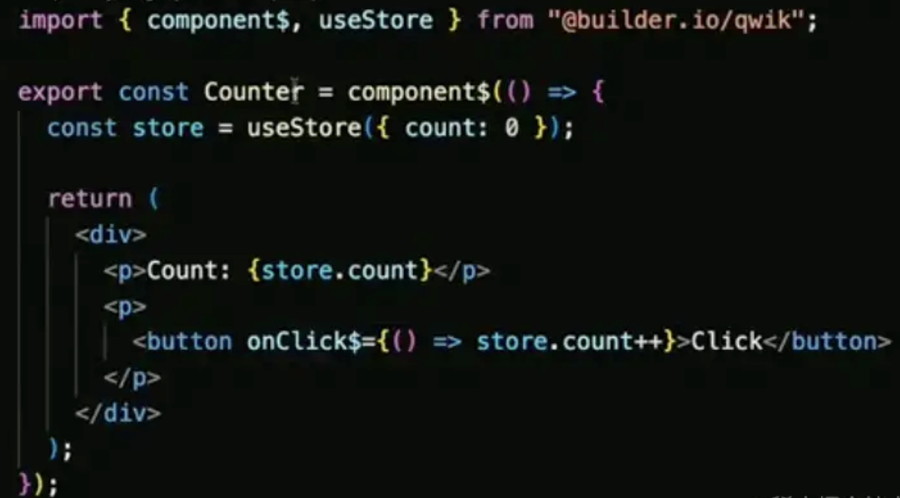
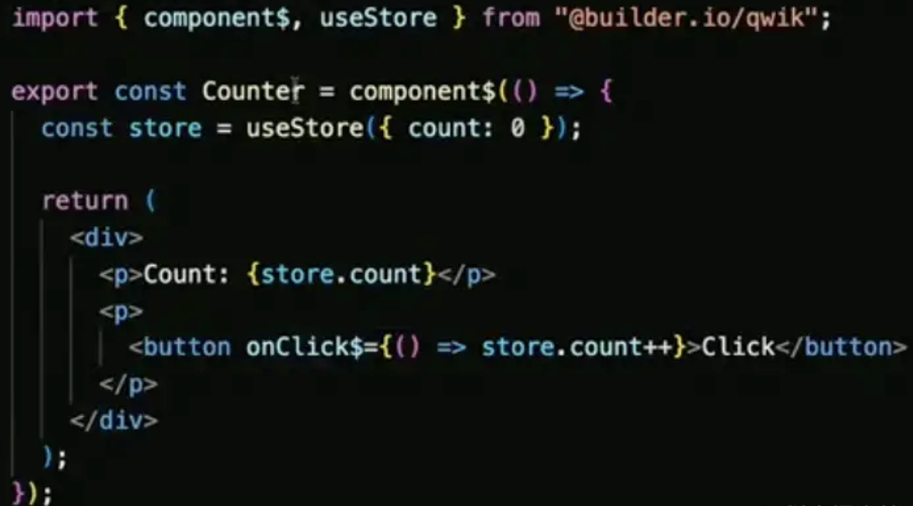
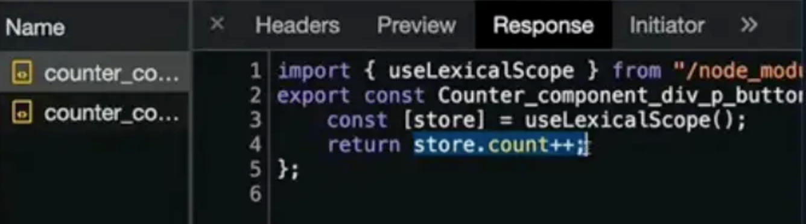
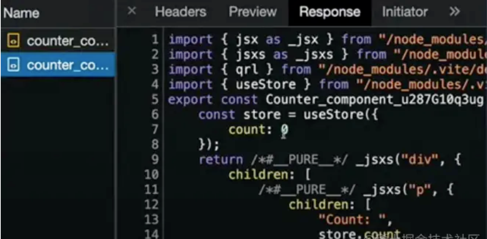
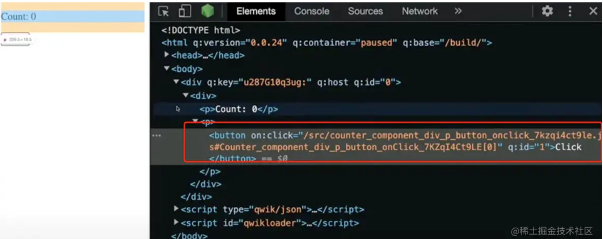
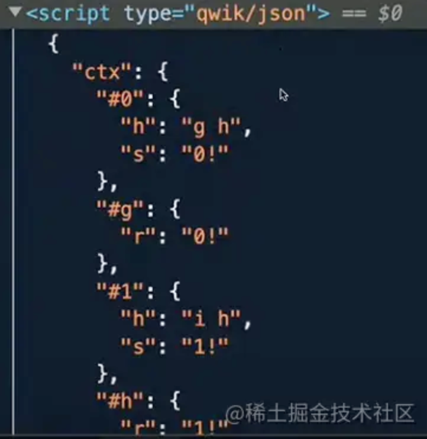
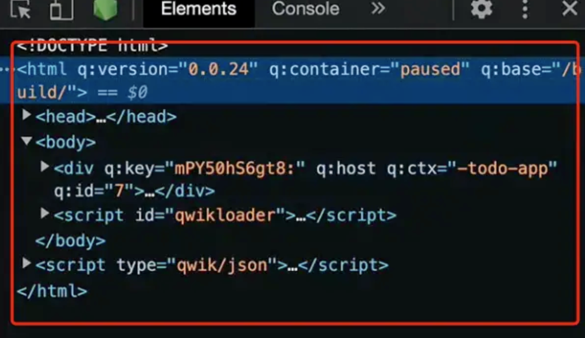
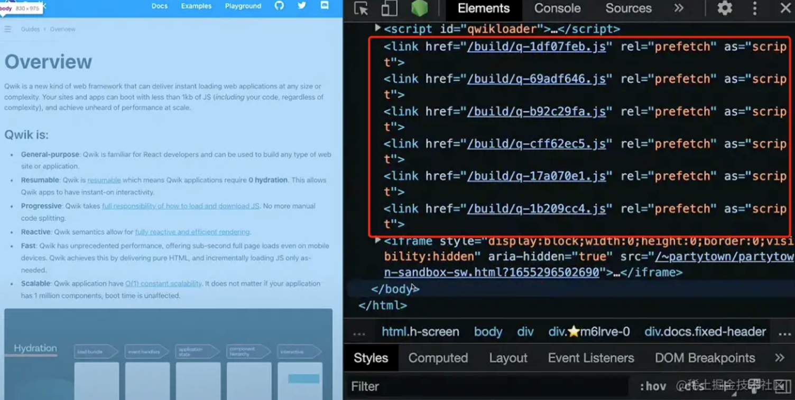

## Qwik
builder.io的CTO miško hevery（同时也是Angular/AngularJS的发明者),他介绍了一款全栈SSR框架 —— Qwik

Qwik的卖点是：将JS代码的拆分从常见的编译时（比如webpack分块）、运行时（比如dynamic import），变为交互时。
对JS代码的极致拆分，只为达到一个目的 —— 在首屏渲染时，移除你项目中99%的JS代码。

首先我们来看看前端两个性能指标，FCP和TTI

### 如何优化FCP
FCP（First Contentful Paint，首次内容绘制）测量页面从开始加载到页面内容的任何部分在屏幕上完成渲染的时间。
当前web应用普遍采用前端框架开发，这意味着会引入大量JS代码（框架本身代码、第三方依赖包的代码......）
从HTML开始解析到最终页面渲染，中间还要经历：
1. 下载框架JS代码
2. 执行框架JS代码
3. 由框架完成页面渲染

这就导致FCP指标的下降。为了优化FCP，框架作者提出了SSR（Server Side Render，服务端渲染），在服务端生成首屏所需HTML，这就为FCP省去了上述三个步骤所需时间

### 如何优化TTI
TTI（Time to Interactive，用户可交互时间）测量页面变得完全可交互所需时间。主要衡量的是从下述1到3所需时间：
1. 首先衡量FCP时间
2. 为页面中的元素绑定事件
3. 对元素产生交互后，事件响应时间在50ms内

使用SSR后，虽然FCP降低，但是框架hydrate（注水，即框架使页面能够响应交互）所需时间对TTI会有影响。可见，性能瓶颈的源头在JS代
码。React18的Selective Hydration通过让用户交互的部分优先hydrate来优化TTI指标。但是，Qwik更极端，他的目标是`干掉所有不必要的JS耗时，这里的耗时包括两部分`
1. JS作为静态资源加载的耗时
2. JS运行时的耗时

### 超超超细粒度hydrate
如果说传统SSR的粒度是整个页面

那么React18的Selective Hydration的粒度是产生交互的组件。那么Qwik的粒度是组件中的某个方法

举个例子，下面是HelloWorld组件（可以发现，Qwik采用类似React的语法）：

打开浏览器Network面板，这个页面会有多少JS请求呢？

由于这是个静态的组件，没有逻辑，所以答案是：没有JS请求。

再来看看经典的计数器Counter组件，相比HelloWorld，增加了点击按钮状态变化的逻辑，代码如下：


打开浏览器Network面板，这个页面会有多少JS请求呢？

答案还是：没有JS请求。

注意这两个组件的代码中，定义组件使用的是component$，有个$符号。在Counter中，onClick$回调也有个$符号。
在Qwik中，后缀带$的函数都是懒加载的。

hydrate的粒度有多细，就取决于$定义的多细。

比如在Counter中，onClick$带$后缀，那么点击回调是懒加载的，所以首屏渲染不会包含点击后的逻辑对应的JS代码。
在点击按钮后，会发起2个JS请求，第一个请求返回的是点击后的逻辑：

第2个JS请求返回的是组件重新render的逻辑：

审查元素会发现，点击前，button on:click属性中保存了逻辑所在的地址：

点击后，会从对应地址下载JS代码，执行对应逻辑

### 对数据hydrate
在传统SSR中，数据其实被初始化了两次：
1. 页面首次渲染，此时服务端导出的HTML中已经携带了首屏渲染的数据
2. 框架hydrate后，数据再转化为框架内的状态供后续渲染

在Qwik中，页面初始化时会存在type为qwik/json的script标签用于存储当前页面中被激活的状态对应数据：

什么叫被激活呢？比如，下面是一篇文章的评论区，这是首屏渲染后的样子：

这些评论数据会出现在qwik/json保存的数据中么？不会，因为没有交互激活他们。我们发现，有一条评论被折叠了，点击后会展开这条评论：

点击这个行为会请求：
1. 点击逻辑对应的JS代码
2. 这条评论对应组件的重新渲染逻辑

此时，评论数据才会出现在qwik/json中，因为点击交互激活了这个数据。所以在Qwik中，如无必要，数据不会被初始化两次。
HTML中存在未激活的数据，qwik/json的script标签中保存了激活的数据，这个特性会带来一个很有意思的效果：

复制调试工具中Elements面板下的DOM结构后，再在新页面中粘贴，就能复现页面当前的交互状态（比如，输入框内仍然保留之前输入的内容）,
换做其他框架，只能复现页面初始时的状态


### 交互时再请求JS不会卡么？
有同学可能会问，如果在网络不好的情况下，交互时再请求JS代码不会让交互变得卡顿么？

Qwik允许你指定哪些组件可能是用户大概率会操作的（比如电商应用中，购物车按钮被点击的概率高）。
这些组件逻辑对应JS代码会prefetch，在不影响首屏渲染的前提下被预请求：

并且这些组件prefetch的顺序是可以调整的。

这意味着可以追踪用户行为，以用户交互的频率为指标，作为组件prefetch优先级的依据，启发式提升应用性能。

这才是真正的以用户为导向的性能优化，而且是全自动的。

## 函数式编程
函数式编程是种编程方式，它将电脑运算视为函数的计算。函数编程语言最重要的基础是λ演算（lambda calculus），而且λ演算的函数可以接受函数
当作输入（参数）和输出（返回值）
- 和指令式编程相比，函数式编程强调函数的计算比指令的执行重要。
- 和过程化编程相比，函数式编程里函数的计算可随时调用。

在了解了函数编程语言的基本概念之后，我们再来看一下函数式编程语言所具备一些特性，理解这些特性将有助于我们更好的理解“什么是函数式编程”
#### 1. 函数是一等公民
函数是一等公民，它的意思就是函数与其他数据类型一样，可以把它们存在数组里，当做参数传递，赋值给变量，可以在任何地方定义，在函数内或函数外，可以作为函数的参数和返回值，也可以对函数进行组合
#### 2. 高阶函数
在函数式编程中，如果函数能满足下面任一要求就可以被称为高阶函数（higher-order function）
1. 接受至少一个函数作为参数
2. 返回的结果是一个函数
#### 3. 柯里化
所谓“柯里化” ，就是把一个多参数的函数 f，转换为单参数函数 g，并且这个函数的返回值也是一个函数
``` js
// 柯里化之前
function add(x, y) {
  return x + y;
}
add(1, 2) // 3
// 柯里化之后
function addX(y) {
  return function (x) {
    return x + y;
  };
}
addX(2)(1) // 3
```
#### 4. 副作用
所谓“副作用”，指的是函数内部与外部互动（最典型的情况，就是修改全局变量的值），产生运算以外的其他结果
#### 5. 纯函数
纯函数编程和函数编程的区别在于：是否允许在函数内部执行一些非函数式的操作，同时这些操作是否会暴露给系统中的其他地方？也就是是否存
在副作用。如果不存在副作用，或者说可以不用在意这些副作用，那么就将其称为纯粹的函数式编程
#### 6. 引用透明性
函数无论在何处、何时调用，如果使用相同的输入总能持续地得到相同的结果，就具备了函数式的特征。这种不依赖外部变量或“状态”，只依赖输
入的参数的特性就被称为引用透明性（referential transparency）。“没有可感知的副作用”（比如不改变对调用者可见的变量，进行I/O，不
抛出异常等）的这些限制都隐含着引用透明性
#### 7. 递归和迭代
对于函数式而言，循环体有一个无法避免的副作用，就是它会修改某些对象的状态，通常这些对象又是和其他部分共享的。而且也因为变量值是不
可变的，纯函数编程语言也无法实现循环。所以纯函数编程语言通常不包含像 while 和 for 这样的迭代构造器，而是采用的无需修改的递归。
下面是一段标准的基于循环的方式来计算阶乘：
``` java
static int factorialIterative(int n){
    int r = 1;
    for (int i = 1; i <= n; i++) {
        r *= 1;
    }
    return r;
}
// 而采用递归形式的方式如下：
static long factorialRecursive(long n){
    return n == 1 ? 1 : n * factorialRecursive(n-1)
}
```
RxJS 是函数式编程中的 lodash 库，它消除了“时序”而带来的困扰，它核心思想是：函数式 + 响应式。
本篇， 要讲的不是 RxJS，而是另外一个函数式编程库 Ramda.js ，它同样也可以与 loadsh 对比理解，不过它的设计思路又不同了，它最大的特点是：所有函数都可以柯里化传参！以此来践行函数式编程思想

### Point-free
Point实际上指的是函数的参数，Point-free是一种编程风格，这是一种在函数里面实际上没有写任何东西的函数编写方式，这种方式可以将一个函数与其他函数一起生成一个新的函数，而实际上并
没有定义这个新的函数的参数是什么。比如下面这个函数就是一个简单的Point-free风格的函数：
``` js
import * as R from "ramda";

const addOne = x => x + 1;
const square = x => x * x;

const addOneThenSquare = R.compose(square, addOne);

addOneThenSquare(1); // 4
```
由于JS不是一门严格的函数式编程语言，所以在这里我们引入了一个叫做“ramda”的第三方库来帮我们完成一些函数式编程的事情。首先我们有两个简单的函数，这两个函数的作用分别是对
传入的数进行加一和平方的操作，然后我将两个函数compose(compose是函数式编程里面的一种方法，该函数会将接收到的方法“从右到左”串联起来依次执行，将上一个函数的返回值作为
下一个函数的入参)起来得到一个新的函数，这个新函数的作用是讲传入的数先加一再平方。定义这个新函数的方法就是Point-free风格

当我们的函数中有参数时，我们的编程风格更像是命令式的，其实我们是在引导一个变量从输入值转换成输出值。但是当我们使用Point-free风格编程时，我们的编程就更偏向声明式。实
际上我们是将参数的转换过程隐藏了，其实当你去问别的程序员代码是显式的好还是隐式的好，可能大多数程序员都会告诉你显式的好，因为那可以让你看到代码里发生了什么。但是在有的
情况下代码可以是隐式的，比如在函数式编程中，那些一个个的“函数组件”能够给我们足够的信心处理好我们的输入输出，我们只需要关注在最后的输出是不是我们想要的，不用去关注它是
怎么去做转换的，因为这对于读你代码的人来说是一些不必要立马去了解的细节

#### 可读性
Point-free的定义很简单，看到这里说不定一些读者就会说到，我以前也这么玩过，只不过我不知道这个就叫做Point-free。是的Point-free的定义很简单，但是要用好它就没那么
简单了。设想一下，上面那个简单的例子，如果把他们的函数名改成xyz，你还能知道最后一个函数是在干嘛吗，当然这个例子比较极端，但是不妨试想下你在项目上看到过的同事起的各
种奇葩的命名，然后将这一堆看起来就不知道干嘛的函数全部compose在一起，那这对于维护代码的人来说将是灾难性的。这就与函数式编程能够提高代码可读性的结论背道而驰了。所以
要用好Point-free的第一件事情就是为你的函数“组件”起一个通俗易懂的好名字，让阅读者能够看着名字就知道函数在干嘛而不用去深入函数细节，还原函数式编程的初衷。

所以不要滥用Ponit-free，当项目中出现了过多的Point-free风格但又没有严格符合编程规范的话，很可能会让你的项目难以维护

但是其实compose只是Point-free中的一种应用，还有许许多多别的应用，只要你使用得当，你的代码依旧可以清晰可读，比如下面的这个例子：
``` js
const not = (fn) => {
    return function negated(...args) {
        return !fn(...args);
    }
}

const isOdd(v) = {
    return v % 2 === 1;
}

const isEven = not(isOdd);

isEven(4);
```
在这个例子中，我们当然可以将isEven的定义写成return v % 2 === 0，但是其实这样的定义是给代码的阅读者增加了额外的理解负担的，你当然可以说例子里面的代码很简单，你
可以一眼就看出来这个函数要做的事情，但是如果这是你公司项目中的一个复杂的判断函数呢，那是不是你就需要读两次几乎一样的代码来判断，最后发现这两个函数其实只是在做相反的事情

这样的定义方式并不是为了我们在写代码的时候可以少写几个字母，更重要的是让我们项目里面的各个”函数组件“之间有了联系，让读代码的人一眼就能看出来，这两个函数是相反的关
系，让他能够更容易的理解代码，说到底是为了提升代码的可读性

#### 函数的“形状”
可以注意到在使用Point-free这种编程风格时，组成最新那个函数的各个函数“组件”都是只接受一个参数并且只返回一个返回值，也就是说这里的函数都需要是数学中的一元函数。所
以在函数式编程中，保持你的所有函数是一元函数是及其重要的，这可以保证它们如同乐高玩具一样拥有相同的接口，可以相互连接在一起。

当然并不是所有的函数都可以是一元函数，所以在函数式编程中有一个极其重要的东西是柯里化，当你的函数不是一元函数但是你却又想将其作为组件组合在一起时就需要通过柯里化
的形式讲一个二元甚至是多元的函数转换成一个一元函数，然后再同其他函数组合在一起。也就是说在函数式编程中所有的函数都需要支持柯里化，这样才能保证各个函数之间能够正常工作。

#### Point-free的”高级“应用
其实Point-free的应用不仅仅是利用原本的函数来组合新的函数，更进一步的话，Point-free应该是使用一些函数的”通用组件“去组成你需要的”特殊组件“。我们还是以上面的两个函数为例：
``` js
const mod = (y) => {
    return function forX(x) {
        return x % y;
    }
}
const eq = (y) => {
    return function forX(x) {
        return x === y;
    }
}
const mod2 = mod(2);
const eq1 = eq(1);

const isOdd = (x) => eq1(mod2(x));
```
这样的定义其实已经从命令式慢慢过渡到声明式了，只不过还不能算是函数式的Point-free。不过这样直接传一个参数，计算后直接将返回值传给下一个函数作为入参，这在数学中
有一个名字叫做Composition（函数组合），其实compose函数也很简单，他只做了一件事：
``` js
const compose = (fn2, fn1) => {
    return function composed(v) {
        return fn2(fn1(v));
    }
}
// 所以我们的定义又会变成：
const isOdd = compose(eq1, mod2);
// 但是其实在函数式编程中一般情况下大家都不会去特意构造一个特殊的函数(mod2, eq1)，所以其实最后的Point-free定义就是：
const isOdd = compose(eq(1), mod(2));
```
其实乍一看上去，compose的参数也是反直觉的，人们通常习惯从左到右进行阅读，但其实这里的运行顺序是从右到左的。这当然是有原因的：
1. 我们回到之前提到的eq和mod函数中的第一个重要特点 — 参数顺序，我们假如他们的参数顺序是符合人类直觉的，那么他们就不可能像我们最终定义哪样进行定义；
2. 当然你也可以说，我可以改变compose函数的定义来让他们可以组合在一起呀。这就是我第二个原因，在数学中函数复合写作f o g（相当于compose(f, g))，意
思是一个函数接收一个参数x，并返回一个f(g(x))

所以其实compose的定义是严格遵循数学中的composition的，当然如果你是在觉得这有点反直觉，其实也有一个叫做pipe的函数，作用跟compose完全一样，只是参数的顺序完全相反

而且compose也是完全符合数学中的结合律的：
``` js
const associative = compose(f, compose(g, h)) === compose(compose(f , g), h); // true
```

### ramda
 Lodash、RxJS、ClojureScript、PureScript、Elm等有很多函数式编程库，反正都是编译到 js，这里就简单介绍一个常用的，ramda是一个非常优秀的js工具库，跟同类比 更函
 数式主要体现在以下几个原则
1. ramda里面的提供的函数全部都是curry的 意味着函数没有默认参数可选参数从而减轻认知函数的难度。
2. ramda推崇pointfree简单的说是使用简单函数组合实现一个复杂功能，而不是单独写一个函数操作临时变量。
3. ramda有个非常好用的参数占位符 R._  大大减轻了函数在pointfree过程中参数位置的问题
4. 如果细心的话会发现ramda里面的函数结合 ramda-fantasy  支持Functor Applicateive Functor这些概念 
[ramda](https://ramda.cn/)

### 案例
#### 案例一：属性计算 - 针对属性的格式化处理
在日常的工作当中，后端给我们返回的结果，不一定是我们要的，比如这个时候，我们要做一个 a_bc 转换成驼峰 aBc 的变化，如果少的话，好说，一个 if 就搞定，如果存
在很多个，不确定的情况，但是我们也要做类似的转换怎么办呢
``` js
// 非函数式写法
if (str === 'a_bc') {
    str = 'a_Bc'
}

// 函数式写法
function strTransform(str) {
    return str.replace(/_([a-z]{1})/g, (m, $1) => m.replace($1, $1.toLocaleUpperCase()))
}
```
这样使用起来，就很方便，而且随时都能用，可能很多朋友会说，这不是经常会使用到的方法吗，这算函数式吗？

算不算得根据情况，如果是你直接修改了传进来的参数，那不算；如果你是通过传进来的参数，做了计算后，返回了新的值，那这算，因为你不会修改原数据，这样也就没有了副作用

#### 案例二：功能组件 - 选项卡切换
选项卡，使我们日常工作当中，经常会用到功能，针对选项卡，我们要做一个 “纯” 组件：
``` vue
<template>
    <div v-for="(item, index) in arr" @click="switchTab($event, index)">
        {{item.name}}
    </div>
</template>
<script>
export {
    data: {
        arr:[]
    },
    mounted: fcuntion() {
        this.arr = ajaxResult;
        // ajaxResult 代表的是接口返回的结果
    },
    methods: {
        switchTab (e, index) {
            // 针对当前点击的处理
        }
    }
}
</script>
```
我们使用函数式编程的写法
``` vue
<!-- vue -->
<template>
    <div v-for="(item, index) in arr" @click="callback($event, index)">
        {{item.name}}
    </div>
</template>
<script>
export {
    props: ['arr', 'callback']
}
</script>
```
大家会发现使用函数式编程代码量写法会少很多，其实呢，真正的情况下，代码量并不会少，可能还会多一些，但不会多太多，但是这样写很符合函数式编程的
思想：“纯” 、 没有副作用、不修改状态,组件的内部，只会做两件事，渲染和执行点击对应按钮的回调，所以说，在哪里用，都不重要，只要符合该组件的数
据格式，就可以正常展示

#### 案例三：获取图表展示在页面上
这个需求我们主要分成4步骤
1. 根据特定搜索关键字构造 url
2. 向 flickr 发送 api 请求
3. 把返回的 json 转为 html 图片
4. 把图片放到屏幕上
上面提到了2个不纯的动作：从api获取数据和把图片放到屏幕上，我们先把不纯的动作写出来，以便分离开其他纯的动作
``` js
var Impure = {
  getJSON: _.curry(function(callback, url) {
    $.getJSON(url, callback);
  }),

  setHtml: _.curry(function(sel, html) {
    $(sel).html(html);
  })
};
var img = function (url) {
      return $('', { src: url });
    };

var trace = _.curry(function(tag, x) {
    console.log(tag, x);
    return x;
});

////////////////////////////////////////////
// 假设返回的数据格式{items: [{media: {m: 'http://testimgurl'}}]}

var url = function (t) {
    return 'https://api.flickr.com/services/feeds/photos_public.gne?tags=' + t + '&format=json&jsoncallback=?';
};
// 这里就是取些属性
var mediaUrl = _.compose(_.prop('m'), _.prop('media'));

var srcs = _.compose(_.map(mediaUrl), _.prop('items'));

var images = _.compose(_.map(img), srcs);

var renderImages = _.compose(Impure.setHtml("body"), images);

var app = _.compose(Impure.getJSON(renderImages), url);

app("cats");

```
其实函数式编程好还是命令式编程好，没有最好，只是最合适，大家从一开始到中级左右的时候，都会产生一个误区，就是面向对象的写法很好，很牛逼，比面向过程要
好用；其实呢，这是一个很严重的误区，当大家在往上走得时候，就会发现，其实好坏都是针对场景，没有谁敢说什么是最好的，假如我们要做一个专题页，这时候使
用 react 或者 vue 其实是最烂的方法，或者说什么我封装一个选项卡，我写的怎么怎么好，没那个必要

## Mpx如何做splitChunks
[MPX](https://mpxjs.cn/)是滴滴出品的一款增强型小程序跨端框架，其核心是对原生小程序功能的增强。具体的使用不是本文讨论的范畴，想了解更多可以去官网了解更多

回到正题，使用MPX开发小程序有一段时间了，该框架对不同包之间的共享资源有一套自己的构建输出策略，其官网有这样一段描述说明：

总结关键的两点：
- 纯js资源：主包引用则输出主包，或者分包之间共享也输出到主包
- 非js资源，包括wxml、样式、图片等：主包引用则输出主包，分包之间共享则输出到各自分包

首先简单介绍下MPX是怎么整合小程序离散化的文件结构，它基于webpack打包构建的，用户在Webpack配置中只需要配置一个入口文件app.mpx，它会基于依赖分析和动态添加entry的
方式来整合小程序的离散化文件，，loader会解析json配置文件中的pages域和usingComponents域中声明的路径，通过动态添加entry的方式将这些文件添加到Webpack的构建系统
当中，并递归执行这个过程，直到整个项目中所有用到的.mpx文件都加入进来

重点来了，MPX在输出前，其借助了webpack的SplitChunksPlugin的能力将复用的模块抽取到一个外部的bundle中，确保最终生成的包中不包含重复模块

### js资源模块的输出
`@mpxjs/webpack-plugin`插件是MPX基于webapck构建的核心，其会在webpack所有模块构建完成的finishMoudles钩子中来实现构建输出策略，主要是配置SplitChunks的
cacheGroup，后续webpack代码优化阶段会根据SplitChunks的配置来输出代码
``` js
apply(compiler) {
  ...
  // 拿到webpack默认配置对象splitChunks
  let splitChunksOptions = compiler.options.optimization.splitChunks
  // 删除splitChunks配置后，webpack内部就不会实例化SplitChunkPlugin
  delete compiler.options.optimization.splitChunks
  // SplitChunkPlugin的实例化由mpx来接管,这样可以拿到其实例可以后续对其options进行修正
  let splitChunksPlugin = new SplitChunksPlugin(splitChunksOptions)
  splitChunksPlugin.apply(compiler)
  ...

  compilation.hooks.finishModules.tap('MpxWebpackPlugin', (modules) => {
      // 自动跟进分包配置修改splitChunksPlugin配置
      if (splitChunksPlugin) {
        let needInit = false
        Object.keys(mpx.componentsMap).forEach((packageName) => {
          if (!splitChunksOptions.cacheGroups.hasOwnProperty(packageName)) {
            needInit = true
            splitChunksOptions.cacheGroups[packageName] = getPackageCacheGroup(packageName)
          }
        })
        if (needInit) {
          splitChunksPlugin.options = SplitChunksPlugin.normalizeOptions(splitChunksOptions)
        }
      }
  })
}
```
可以看出在所有模块构建完成时，针对不同的packageName来生成其对应的cacheGroups，主要体现在getPackageCacheGroup方法的实现
``` js
function isChunkInPackage (chunkName, packageName) {
  return (new RegExp(`^${packageName}\\/`)).test(chunkName)
}

function getPackageCacheGroup (packageName) {
  if (packageName === 'main') {
    return {
      name: 'bundle',
      minChunks: 2,
      chunks: 'all'
    }
  } else {
    return {
      test: (module, chunks) => {
        return chunks.every((chunk) => {
          return isChunkInPackage(chunk.name, packageName)
        })
      },
      name: `${packageName}/bundle`,
      minChunks: 2,
      minSize: 1000,
      priority: 100,
      chunks: 'all'
    }
  }
}
```
getPackageCacheGroup会为小程序的每个包生成一个代码分割组，也就是生成每个包对应的`cacheGroups`

例如一个小程序项目有主包和A、B两个分包，其生成的cacheGroups内容如下：
``` js
{
  default: {
    automaticNamePrefix: '',
    reuseExistingChunk: true,
    minChunks: 2,
    priority: -20
  },
  vendors: {
    automaticNamePrefix: 'vendors',
    test: /[\\/]node_modules[\\/]/,
    priority: -10
  },
  // 会抽取到主包的bundle文件的条件 :
  // 该模块至少被2个chunk引用（minChunks:2），这个chunk不区分主分包中的chunk
  main: { name: 'bundle', minChunks: 2, chunks: 'all' },
  A: {
    test: [Function: test],
    name: 'A/bundle',
    minChunks: 2,
    minSize: 1000,
    priority: 100,
    chunks: 'all'
  },
  B: {
    test: [Function: test],
    name: 'B/bundle',
    minChunks: 2,
    minSize: 1000,
    priority: 100,
    chunks: 'all'
  }
}
```
分包代码分割输出bundle的优先级是最高的（priority: 100），所以会优先处理分包中的打包；否则会执行main中的代码打包规则，它会处理所有包之间的共享模块的打包
以及主包中被复用的模块,下面来看分包和主包的打包规则

### 针对分包中的模块:
``` js
{
  test: (module, chunks) => {
    // 依赖当前模块的所有chunks是否都是当前分包下的chunk
    return chunks.every((chunk) => {
      return isChunkInPackage(chunk.name, packageName)
    })
  },
  name: `${packageName}/bundle`,
  minChunks: 2,
  minSize: 1000,
  priority: 100,
  chunks: 'all'
}
```
分包中的模块被抽离到当前分包下的bundle文件中，否则会被打到主包，需满足：
1. 该模块没有被其他包引用，包括主包和其他分包（test函数逻辑）
2. 至少被该分包下的2个chunk引用（minChunks:2）
3. 抽离后的bundle大小最少满足 约1kb（minSize: 1000）

### 组件和静态资源
对于组件和静态资源，MPX在webpack构建的thisCompilation钩子函数中会在compilation上挂载一个有关打包的__mpx__对象，包含静态资源、组件资源、页面资源
等属性，也包含静态的非js资源的输出处理等：
``` js
compiler.hooks.thisCompilation.tap('MpxWebpackPlugin', (compilation, { normalModuleFactory }) => {
    ...
    if (!compilation.__mpx__) {
        mpx = compilation.__mpx__ = {
             ...
             componentsMap: {
                main: {}
              },
              // 静态资源(图片，字体，独立样式)等，依照所属包进行记录，冗余存储，同上
              staticResourcesMap: {
                main: {}
              },
              ...
              // 组件和静态资源的输出规则如下：
              // 1. 主包引用的资源输出至主包
              // 2. 分包引用且主包引用过的资源输出至主包，不在当前分包重复输出
              // 3. 分包引用且无其他包引用的资源输出至当前分包
              // 4. 分包引用且其他分包也引用过的资源，重复输出至当前分包
          getPackageInfo: ({ resource, outputPath, resourceType = 'components', warn }) => {
            let packageRoot = ''
            let packageName = 'main'
            const { resourcePath } = parseRequest(resource)
            const currentPackageRoot = mpx.currentPackageRoot
            const currentPackageName = currentPackageRoot || 'main'
            const resourceMap = mpx[`${resourceType}Map`]
            const isIndependent = mpx.independentSubpackagesMap[currentPackageRoot]
            // 主包中有引用一律使用主包中资源，不再额外输出
            if (!resourceMap.main[resourcePath] || isIndependent) {
              packageRoot = currentPackageRoot
              packageName = currentPackageName
              ...
            }
            resourceMap[packageName] = resourceMap[packageName] || {}
            const currentResourceMap = resourceMap[packageName]

            let alreadyOutputed = false
            if (outputPath) {
              outputPath = toPosix(path.join(packageRoot, outputPath))
              // 如果之前已经进行过输出，则不需要重复进行
              if (currentResourceMap[resourcePath] === outputPath) {
                alreadyOutputed = true
              } else {
                currentResourceMap[resourcePath] = outputPath
              }
            } else {
              currentResourceMap[resourcePath] = true
            }

            return {
              packageName,
              packageRoot,
              outputPath,
              alreadyOutputed
            }
          },
          ...
        }
    }
}
```
这样webpack构建编译非js资源时会调用compilation.__mpx__.getPackageInfo方法返回非js的静态资源的输出路径, 下面以一个简单例子来说明

例如对项目中的图片会调用@mpxjs/webpack-plugin提供的url-loader进行处理，与webpack的url-loader类似，对于图片大小小于指定limit的进行base64处理，否
则使用file-loader来输出图片（此时需要调用getPackageInfo方法获取图片的输出路径），相关代码：
``` js
let outputPath

if (options.publicPath) { // 优先loader配置的publicPath
    outputPath = url
    if (options.outputPathCDN) {
        if (typeof options.outputPathCDN === 'function') {
            outputPath = options.outputPathCDN(outputPath, this.resourcePath, context)
        } else {
        outputPath = toPosix(path.join(options.outputPathCDN, outputPath))
        }
    }
} else {
    // 否则，调用getPackageInfo获取输出路径
    url = outputPath = mpx.getPackageInfo({
        resource: this.resource,
        outputPath: url,
        resourceType: 'staticResources',
        warn: (err) => {
            this.emitWarning(err)
        }
    }).outputPath
}
...
this.emitFile(outputPath, content);  
...
```
最终，图片资源会调用compilation.__mpx__.getPackageInfo方法来获取图片资源的输出路径进行产出

同样对于css资源、wxml资源以及json资源，mpx内部是通过创建子编译器来抽取的，这里就不做深入介绍


### splitChunks的用法
webpack的splitChunks插件是用来进行代码拆分的，通过上面的分析可以看出MPX内部是通过内置splitChunks的cacheGroups配置项来主动实现对小程序js模
块实现分割优化的。webpack常见的代码分割方式有三种：
1. 多入口分割：webpack的entry配置项配置的手动入口，也包括可以使用compilation.addEntry程序添加的入口
2. 动态导入：使用es module的import方法和wepack独有的require.ensure
3. 防止重复：使用splitChunks来去重和分离chunk

前两种在我们日常的开发中比较常见，第三种是通过webpack的optimization.splitChunks配置项来配置的

通常情况下，webpack配置项optimization.splitChunks会有默认配置来实现代码分割，上面我们说到MPX在为不同包生成cacheGroups时，细心的同学会发现
我们最终生成的包多了两个配置组：
``` js
{
  default: {
    automaticNamePrefix: '',
    reuseExistingChunk: true,
    minChunks: 2,
    priority: -20
  },
  vendors: {
    automaticNamePrefix: 'vendors',
    test: /[\\/]node_modules[\\/]/,
    priority: -10
  },
  ...
}
```
这是webpack为optimization.splitChunks.cacheGroups配置的默认组，除此之外optimization.splitChunks还有一些其他默认配置项，如下代码所示：
``` js
splitChunks: {
    chunks: "async",
    minSize: 30000,
    minChunks: 1,
    maxAsyncRequests: 5,
    maxInitialRequests: 3,
    automaticNameDelimiter: '~',
    name: true,
    cacheGroups: {
        vendors: {
            test: /[\\/]node_modules[\\/]/,
            priority: -10
        },
        default: {
            minChunks: 2,
            priority: -20,
            reuseExistingChunk: true
        }
    }
}
```
上面默认配置的实现的效果是：满足下面4个条件的模块代码会抽离成新的chunk
1. 来自node_modules中的模块，或者至少被2个chunk复用的模块代码
2. 分离出的chunk必须大于等于3000byte，约30kb
3. 按需异步加载chunk时，并行请求的最大数不超过5个
4. 页面初始加载时，并行请求的最大数不超过3个

下面来介绍下这些配置项的作用：
- chunks：表示webpack将对哪些chunk进行分割，可选值为async、all、initial
    1. async：对于异步加载的chunks进行分割
    2. initial：对非异步加载的初始chunks进行分割
    3. all：对所有chunks进行分割
- minSize: 分割后的chunk要满足的最小大小，否则不会分割
- minChunks: 表示一个模块至少应被minChunks个chunk所包含才能分割
- maxAsyncRequests: 表示按需加载异步chunk时，并行请求的最大数目；这个数目包括当前请求的异步chunk以及其所依赖chunk的请求
- maxInitialRequests: 表示加载入口chunk时，并行请求的最大数目
- automaticNameDelimiter: 表示拆分出的chunk的名称连接符，默认为~。如chunk~vendors.js
- name: 设置chunk的文件名，默认为true，表示splitChunks基于chunk和cacheGroups的key自动命名。
- cacheGroups: 通过它可以配置多个组，实现精细化分割代码；
    1. 该对象配置属性继承splitChunks中除cacheGroups外所有属性，可以在该对象重新配置这些属性值覆盖splitChunks中的值
    2. 该对象还有一些特有属性如test、priority和reuseExistingChunk等

- cacheGroups配置的每个组可以根据test设置条件，符合test条件的模块，就分配到该组。模块可以被多个组引用，但最终会根据priority来决定打包到哪个组中


