## 讨论
Svelte([中文文档](https://www.sveltejs.cn/tutorial/basics))作者是前端轮子哥 Rich Harris，同时也是 Rollup 的作者，他设计 Svelte 的核心思想在于
> 通过静态编译减少框架运行时的代码量

也就是说，vue 和 react 这类传统的框架，都必须引入运行时 (runtime) 代码，用于虚拟dom、diff 算法。Svelted完全溶入JavaScript，应用所有需要的运行时代码都包
含在bundle.js里面了，除了引入这个组件本身，你不需要再额外引入一个运行代码

当前的框架无论是 React Angular 还是 Vue，不管你怎么编译，使用的时候必然需要引入框架本身，也就是所谓的运行时 (runtime)。但是用 Svelte 就不一样，一个 Svelte
组件编译了以后，所有需要的运行时代码都包含在里面了，除了引入这个组件本身，你不需要再额外引入一个所谓的框架运行时

#### 优势 
React 和 Vue 都是基于运行时的框架，当用户在你的页面进行各种操作改变组件的状态时，框架的运行时会根据新的组件状态（state）计算（diff）出哪些DOM节点需要被更新，从
而更新视图;常用的框架中，最小的Vue都有58k，React更有97.5k。我们使用React开发一个小型组件，即使里面的逻辑代码很少，但是打包出来的bundle size轻轻松松都要100k起
步。对于大型后台管理系统来说，100k 不算什么，但是对于特别注重用户端加载性能的场景来说，一个组件100k 多，还是太大了,Svelte简直是神奇！竟然只有 9.7 KB ! 果然魔法
消失 UI 框架，无愧其名

Jacek Schae 在《A RealWorld Comparison of Front-End Frameworks with Benchmarks》中用主流的前端框架来编写 RealWorld 应用，使用 Chrome 的
Lighthouse Audit测试性能，得出数据是Svelte 略逊于Vue, 但好于 React

我个人觉得 Svelte 比较有优势的地方，就是用来编译可独立分发的 Web Components。传统框架和 Web Components 结合最大的问题就在于运行时：单独分发的 WC 里面直
接打包框架运行时，等于每个组件都要复制一份框架；不打包的话，又做不到开箱即用。但 Svelte 受这个问题的限制最小（依然存在重复代码问题，但取决于你用了多少功能），可以
说是最适合这个用例的框架

#### 劣势
- 虽然在简单的 demo 里面代码量确实非常小，但同样的组件模板，这样的 imperative 操作生成的代码量会比 vdom 渲染函数要大，多个组件中会有很多重复的代码（虽然 gzip 时候
可以缓解，但 parse 和 evaluate 是免不了的）；项目里的组件越多，代码量的差异就会逐渐缩小；同时，并不是真正的如宣传的那样 “没有 runtime“，而是根据你的代码按
需 import 而已；使用的功能越多，Svelte 要包含的运行时代码也越多，最终在实际生产项目中能有多少尺寸优势，其实很难说

- Svelte 在大型应用中的性能还有待观察，尤其是在大量动态内容和嵌套组件的情况下。它的更新策略决定了它也需要类似 React 的 shouldComponentUpdate 的机制来防止过度更新

- Svelte 的编译策略决定了它跟 Virtual DOM 绝缘（渲染函数由于其动态性，无法像模板那样可以被可靠地静态分析），也就享受不到 Virtual DOM 带来的诸多好处，比如基于
render function 的组件的强大抽象能力，基于 vdom 做测试，服务端/原生渲染亲和性等等

## 原理
Rich Harris 在设计 Svelte 的时候没有采用 Virtual DOM 是因为觉得Virtual DOM Diff 的过程是非常低效的，Virtual DOM 有时候会做很多无用功，这体现在很多组件会
被“无缘无故”进行重渲染（re-render），比如说，下面的例子中，React 为了更新掉message 对应的DOM 节点，需要做n多次遍历，才能找到具体要更新哪些节点
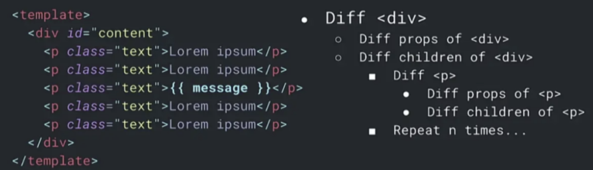
为了解决这个问题，React 提供pureComponent,shouldComponentUpdate，useMemo,useCallback让开发者来操心哪些subtree是需要重新渲染的，哪些是不需要重新渲染的。究其
本质，是因为 React 采用 jsx 语法过于灵活，不理解开发者写出代码所代表的意义，没有办法做出优化

所以，React 为了解决这个问题，在 v16.0 带来了全新的 Fiber 架构，Fiber 思路是不减少渲染工作量，把渲染工作拆分成小任务思路是不减少渲染工作量。渲染过程中，留出时间来处理
用户响应，让用户感觉起来变快了。这样会带来额外的问题，不得不加载额外的代码，用于处理复杂的运行时调度工作

#### 那么 Svelte 是如何解决这个问题的？ 
React 采用 jsx 语法本质不理解数据代表的意义，没有办法做出优化。Svelte 采用了Templates语法（类似于 Vue 的写法），更加严格和具有语义性，可以在编译的过程中就进行优化操作

关于 JSX 与 Templates ，可以看成是两种不同的前端框架渲染机制，两种各有优劣

jsx 具有 JavaScript 的完整表现力，非常具有表现力，可以构建非常复杂的组件，但是灵活的语法，也意味着引擎难以理解，无法预判开发者的用户意图，从而难以优化性能。你
很可能会写出下面的代码
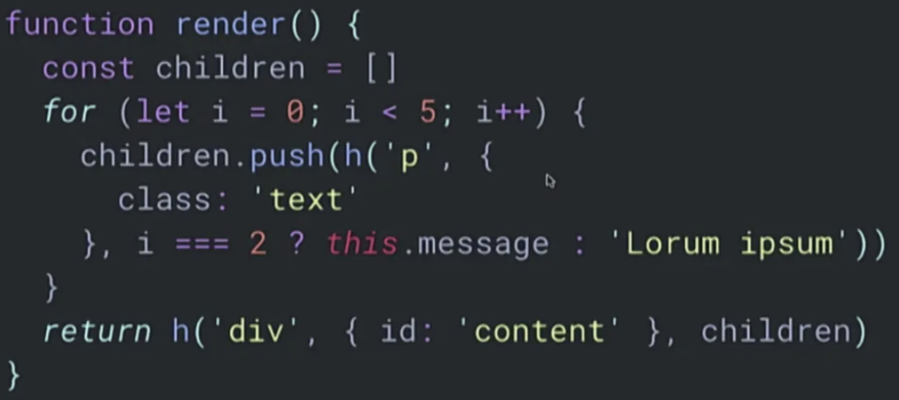
Template模板是一种非常有约束的语言，你只能以某种方式去编写模板。

例如，当你写出这样的代码的时候，编译器可以立刻明白：”哦！这些 p 标签的顺序是不会变的，这个 id 是不会变的，这些 class 也不会变的，唯一会变的就是这个“
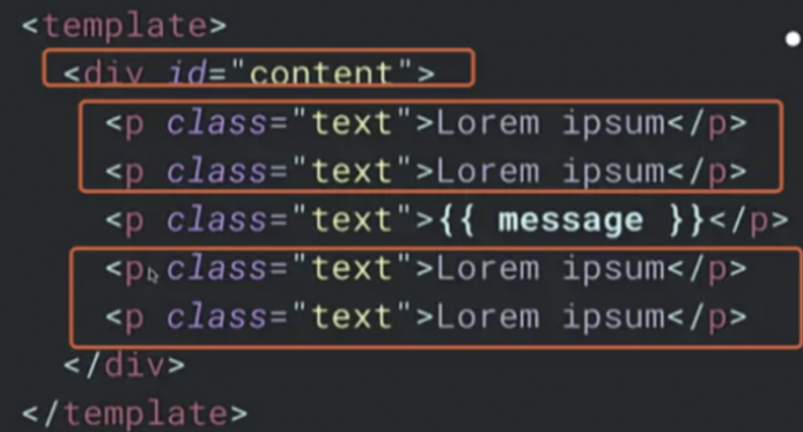
在编译时，编译器对你的意图可以做更多的预判，从而给它更多的空间去做执行优化。

我们看看svelte编译代码时，会把模板编译成可执行的js代码
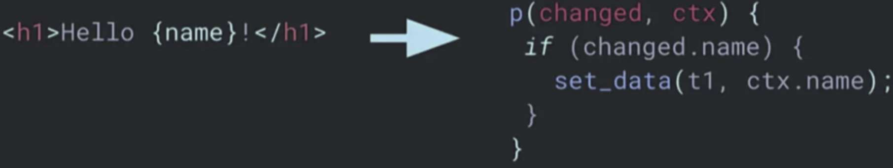
右侧 template 中，其他所有内容都是静态的，只有 name 可能会发生改变。右侧 p 函数是编译生成的最终的产物，是原生的js可以直接运行在浏览器里，会在有脏数据
时被调用。p 函数唯一做的事情就是，当 name 发生变更的时候，调用原生方法把 t1 这个原生DOM节点更新。这里的 set_data 可不是 React 的 setState 或者小程
序的 setData ，这里的set_data 就是封装的原生的 javascript 操作DOM 节点的方法。
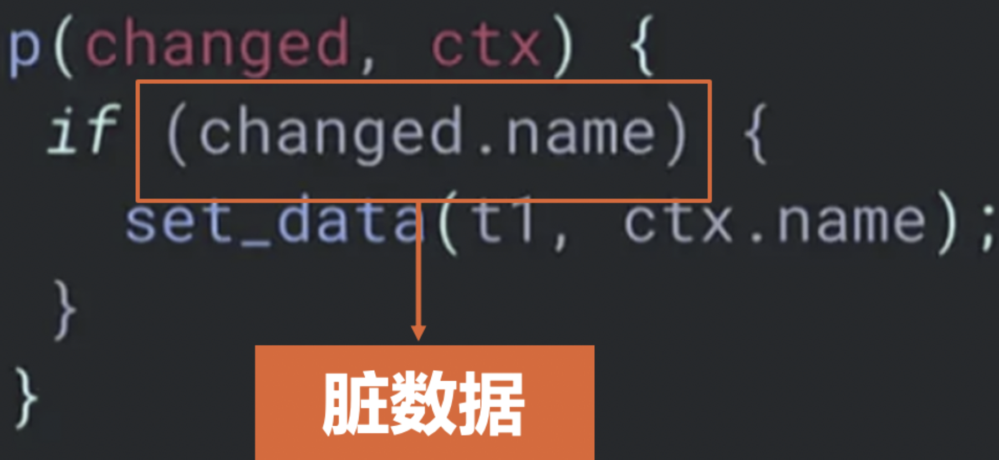
如果我们仔细观察上面的代码，发现问题的关键在于 if 语句的判断条件——changed.name， 表示有哪些变量被更新了，这些被更新的变量被称为脏数据。任何一个现代前
端框架，都需要记住哪些数据更新了，根据更新后的数据渲染出最新的DOM

#### Svelte 记录脏数据的方式：位掩码（bitMask）
Svelte使用位掩码（bitMask） 的技术来跟踪哪些值是脏的，即自组件最后一次更新以来，哪些数据发生了哪些更改。

位掩码是一种将多个布尔值存储在单个整数中的技术，一个比特位存放一个数据是否变化，一般1表示脏数据，0表示是干净数据
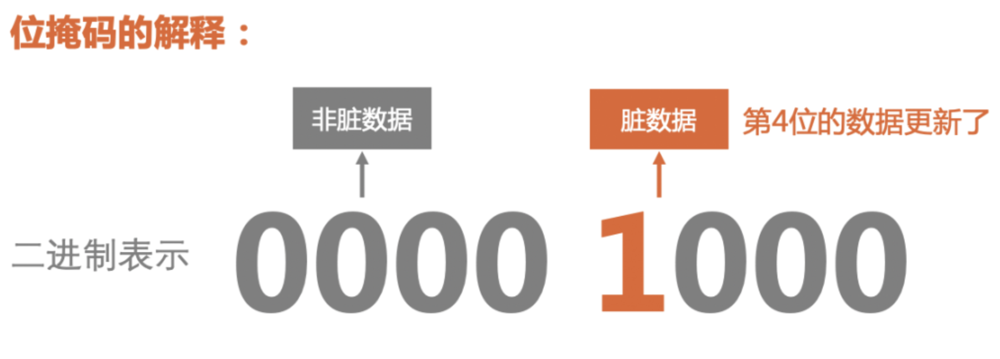
用大白话来讲，你有A、B、C、D 四个值，那么二进制0000 0001表示第一个值A发生了改变，0000 0010表示第二个值B发生了改变，0000 0100表示第三个值C发生了改
变，0000 1000表示第四个D发生了改变，这种表示法，可以最大程度的利用空间

比如说，十进制数字3就可以表示 A、B是脏数据。先把十进制数字3， 转变为二进制0000 0011。从左边数第一位、第二位是1，意味着第一个值A 和第二个值B是脏数
据；其余位都是0，意味着其余数据都是干净的

JS 的二进制有31位限制，number 类型最长是32位，减去1位用来存放符号。也就是说，如果 Svelte 采用二进制位存储的方法，那么只能存 31个数据，所以
Svelte 采用数组来存放，数组中一项是二进制31位的比特位。假如超出31个数据了，超出的部分放到数组中的下一项

这个数组就是component.$.dirty数组，二进制的1位表示该对应的数据发生了变化，是脏数据，需要更新；二进制的0位表示该对应的数据没有发生变化，是干净的

我们打印出每一次make_dirty之后的component.$.dirty， 为了方便演示，转化为二进制打印出来，如下面所示：
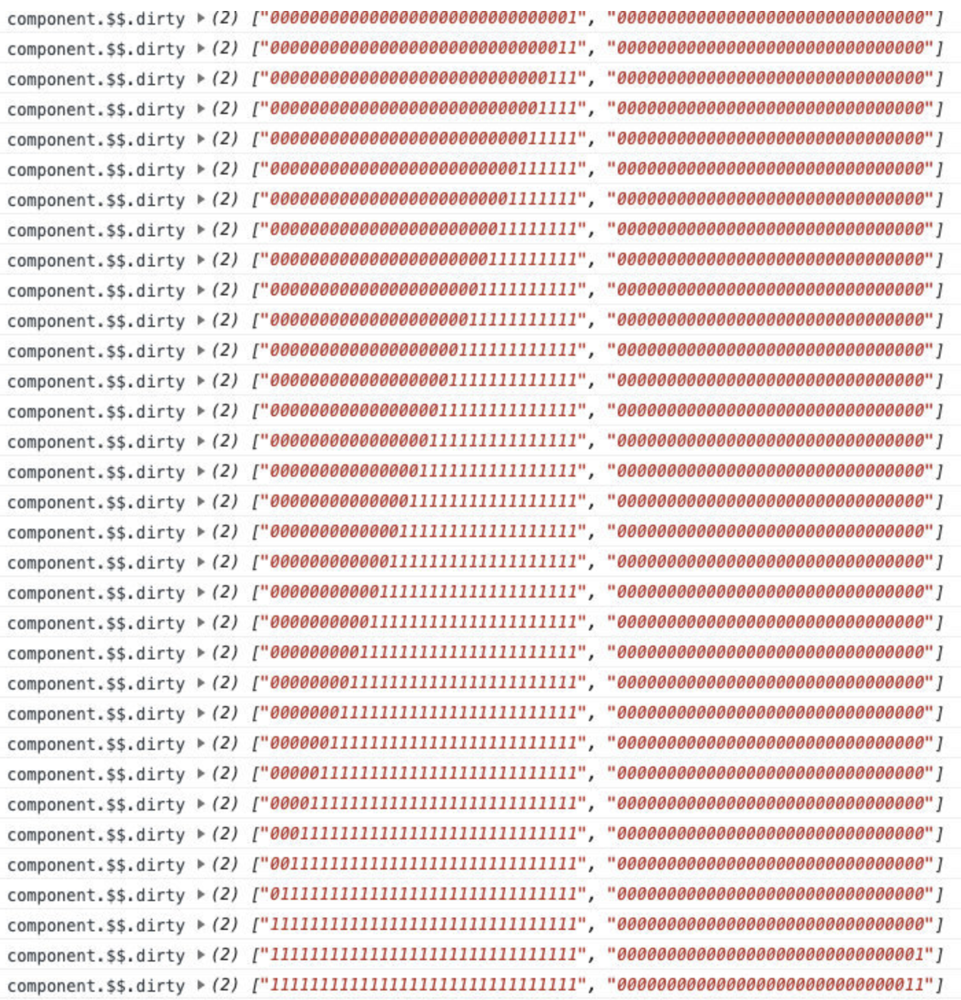
上面数组中的每一项中的每一个比特位，如果是1，则代表着该数据是否是脏数据。如果是脏数据，则意味着更新
- 第一行["0000000000000000000000000000001", "0000000000000000000000000000000"], 表示第一个数据脏了，需要更新第一个数据对应的dom节点
- 第二行["0000000000000000000000000000011", "0000000000000000000000000000000"], 表示第一个、第二个数据都脏了，需要更新第一个，第二个数据对应的dom节点

这样，我们就可以通过component.$.dirty这个数组，清楚的知道有哪些数据发生了变化。那么具体应该更新哪些DOM 节点呢？

#### 数据和DOM节点之间的对应关系
我们都知道， React 和 Vue 是通过 Virtual Dom 进行 diff 来算出来更新哪些 DOM 节点效率最高。Svelte 是在编译时候，就记录了数据 和 DOM 节点之间的对应关系，并且保存在 p 函数中
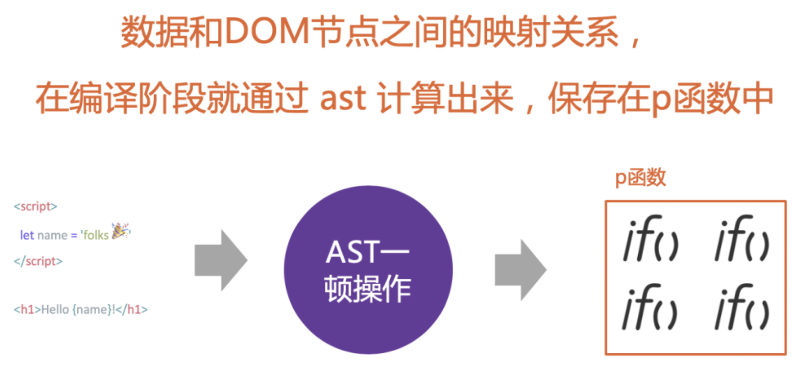
这里说的p 函数，就是 Svelte 的更新方法，本质上就是一大堆if判断，逻辑非常简单
``` js
if (b数据变了){
    更新b对应dom
}
if (c数据变了){
    更新c对应dom
}
```
为了更加直观的理解，我们模拟更新一下33个数据的组件，编译得到的p 函数打印出来，如：
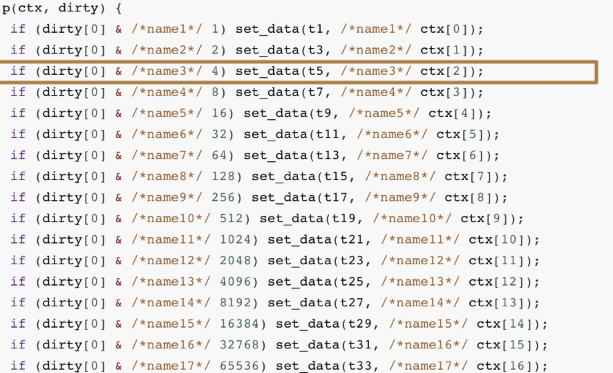
我们会发现，里面就是一大堆if判断，但是if判断条件比较有意思，我们从上面摘取一行仔细观察一下：
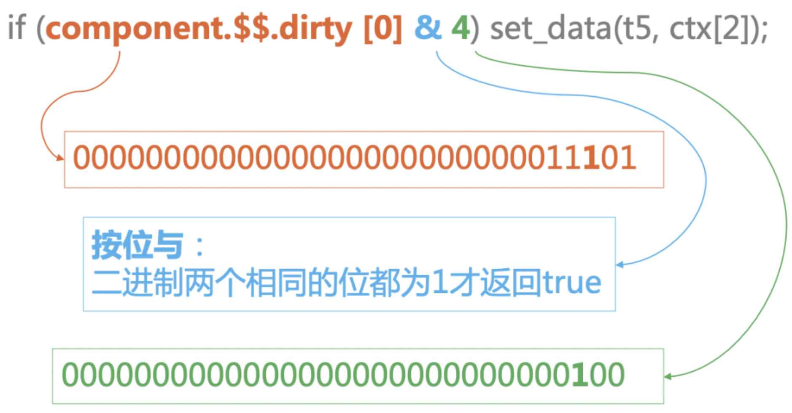
4是一个常量，转变为二进制是0000 0100， 第三位是1。那么也就是，只有dirty[0]的二进制的第三位也是1时, 表达式才会返回真。换句话来说，只有第三个数据是脏数据，才会走入到这
个if判断中，执行set_data(t5, ctx[2])， 更新t5这个 DOM 节点

当我们分析到这里，已经看出了一些眉目，让我们站在更高的一个层次去看待这 30多行代码：它们其实是保存了这33个变量 和 真实DOM 节点之间的对应关系，哪些变量脏了，Svelte 会走
入不同的if体内直接更新对应的DOM节点，而不需要复杂 Virtual DOM DIFF 算出更新哪些DOM节点

这 30多行代码，是Svelte 编译了我们写的Svelte 组件之后的产物，在Svelte 编译时，就已经分析好了，数据 和 DOM 节点之间的对应关系，在数据发生变化时，可以非常高效的来更新DOM节点

Vue 曾经也是想采取这样的思路，但是 Vue 觉得保存每一个脏数据太消耗内存了，于是没有采用那么细颗粒度，而是以组件级别的中等颗粒度，只监听到组件的数据更新，组件内部再通过 DIFF 算法计
算出更新哪些 DOM 节点。Svelte 采用了比特位的存储方式，解决了保存脏数据会消耗内存的问题

#### 整体流程
上面就是Svelte 最核心更新DOM机制，下面我们串起来整个的流程。下面是非常简单的一个 Svelte 组件，点击`<button>`会触发onClick事件，从而改变name 变量
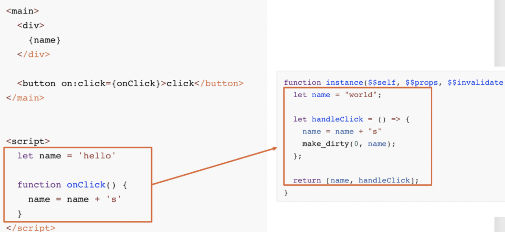
Svelte 会编译我们的代码，图中左边是我们的源码，右边是 Svelte 编译生成的,这里有一行代码 name 被重新赋值了，我要插入一条make_dirty的调用，于是当我们改写 name 变量的时候，就
会调用make_dirty方法把 name 记为脏数据,上面代码背后的整体流程如下图所示，我们一步一步来看：
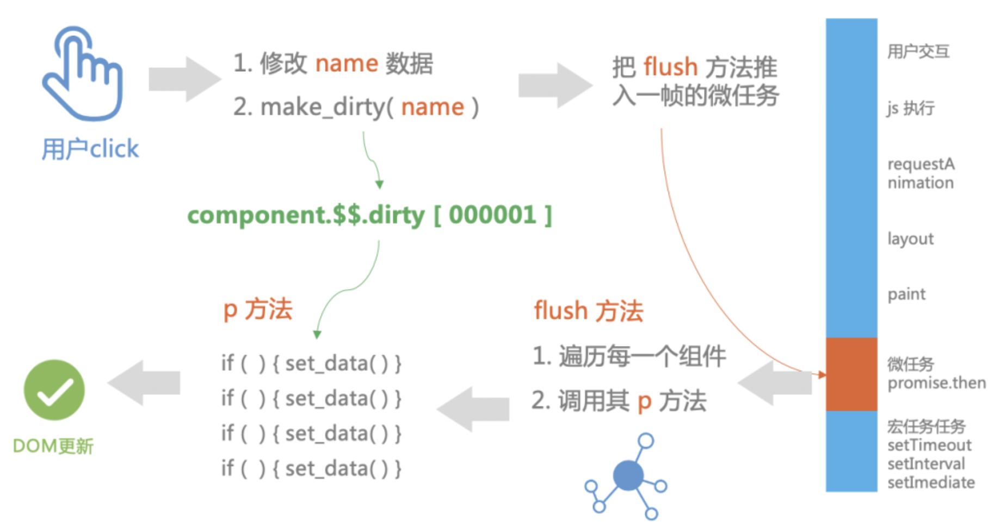
我们来看make_diry方法究竟做了什么事情:
1. 把对应数据的二进制改为1
2. 把对应组件记为脏组件，推入到 dirty_components 数组中
3. 调用schedule_update()方法把flush方法推入到一帧中的微任务阶段执行。因为这样既可以做频繁更新 的截流，又避免了阻塞一帧中的 layout， repaint 阶段的渲染
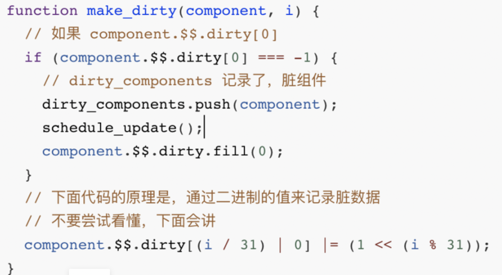
schedule_update 方法其实就是一个promise.then()
``` js
function schedule_update() {
    resolved_promise.then(flush)
}
```
一帧大概有 16ms, 大概会经历 layout, repaint的阶段后，就可以开始执行微任务的回调了。flush 方法做的事情也比较简单，就是遍历脏组件，依次调用update方法去更新对应的组件
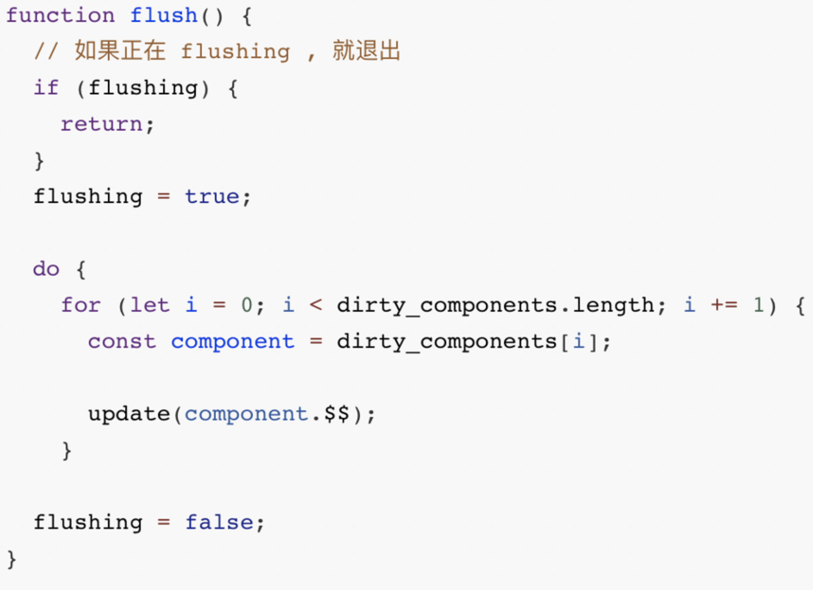
update方法除了执行一些生命周期的方法外，最核心的一行代码是调用p方法，p方法我们已经在上文中介绍过很熟悉了
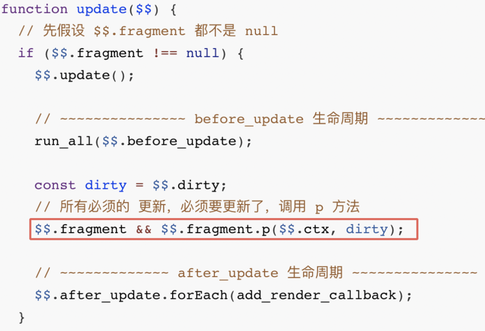
p 方法的本质就是走入到不同的if 判断里面，调用set_data原生的 javascript 方法更新对应的 DOM节点
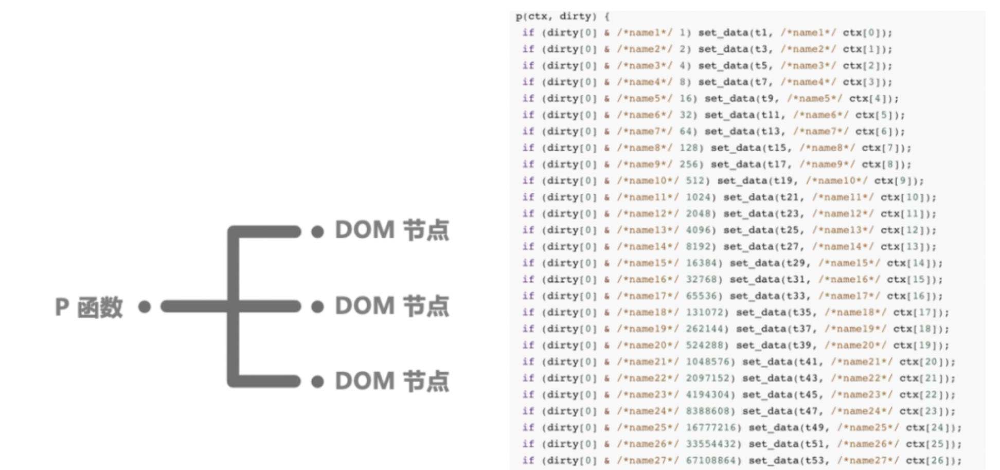
上面的代码均是剔除了分支逻辑的伪代码
> Svelte 在处理子节点列表的时候，还是有优化的算法在的。比如说[a,b,c,d] 变成 [d, a, b, c] ，但是只是非常简单的优化，简单来说，是
比较节点移动距离的绝对值，绝对值最小的节点被移动

所以，严格意义上来说，Svelte 并不是100%无运行时，还是会引入额外的算法逻辑，只是量很少罢了。

