## 骨架梳理
> `Vite` 是一种新型的前端构建工具，能够显著提升前端开发体验。

总结起来`vite` 通过 `connect` 库提供开发服务器，通过中间件机制实现多项开发服务器配置。而 `vite` 在本地开发时没有借助 `webpack` 或是 `rollup` 这样的
打包工具，而是通过调度内部 `plugin` 实现了文件的转译，从而达到小而快的效果

本文阅读的 `Vite` 源码版本是 `2.8.0-beta.3`，如果你想要和我一起阅读的话，你可以在这个地址下载 [Vite 源码](https://github.com/vitejs/vite)。

我们先来看看 `Vite` 这个包的项目目录
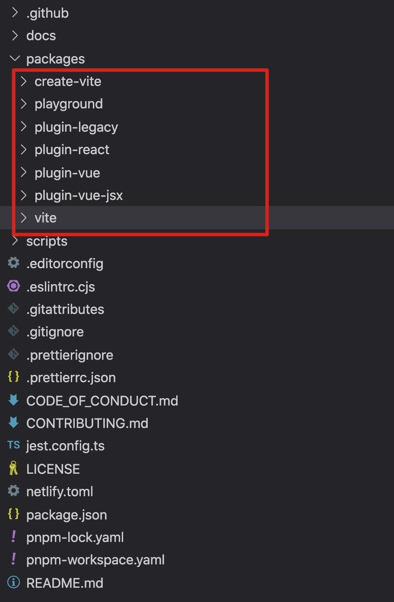

这是一个集成管理的项目，其核心就是在 `packages` 里面的几个包（如下）

| 包名             | 作用                                                                             |
| ---------------- | -------------------------------------------------------------------------------- |
| `vite`           | `Vite` 主库，负责 `Vite` 项目的本地开发（插件调度）和生产产物构建（Rollup 调度） |
| `create-vite`    | 用于创建新的 `Vite` 项目，内部存放了多个框架（如 `react、vue`）的初始化模板      |
| `plugin-vue`     | `Vite` 官方插件，用于提供 Vue 3 单文件组件支持                                   |
| `plugin-vue-jsx` | `Vite` 官方插件，用于提供 Vue 3 JSX 支持（通过 专用的 Babel 转换插件）。         |
| `plugin-react`   | `Vite` 官方插件，用于提供完整的 React 支持                                       |
| `plugin-legacy`  | `Vite` 官方插件，用于为打包后的文件提供传统浏览器兼容性支持                      |
| `playground`     | `Vite` 内置的一些测试用例及 Demo                                                 |

重点说下 `vite` 本地开发服务命令 —— `vite / vite dev / vite serve`。

### vite dev
`vite dev` 调用了内部的 `createServer` 方法创建了一个服务，这个服务利用中间件（第三方）支持了多种能力（如 
`跨域`、`静态文件服务器`等），并且内部创建了 `watcher` 持续监听着文件的变更，进行实时编译和热重载;而 `createServer` 做的
事情就是我们需要关注的核心逻辑

在 `createServer` 方法中，首先进行了对配置的收集工作 —— `resolveConfig`,可以直接参照 
[Vite 官方文档](https://cn.vitejs.dev/config/#root)查看支持的配置项

`resolveConfig` 的第一步就是加载项目目录的配置文件，如果没有指定配置文件位置，会自动在根目录下寻找 `vite.config.js`、
`vite.config.mjs`、`vite.config.ts`、`vite.config.cjs`,如果没有找到配置文件，则直接会中止程序

> `vite` 项目初始化时，会在项目根目录下自动生成 `vite.config.js` 配置文件。

在读取配置文件后，会将配置文件和初始化配置（优先级更高，有部分配置来自于命令行参数）进行合并，然后得到一份配置。（如下图）
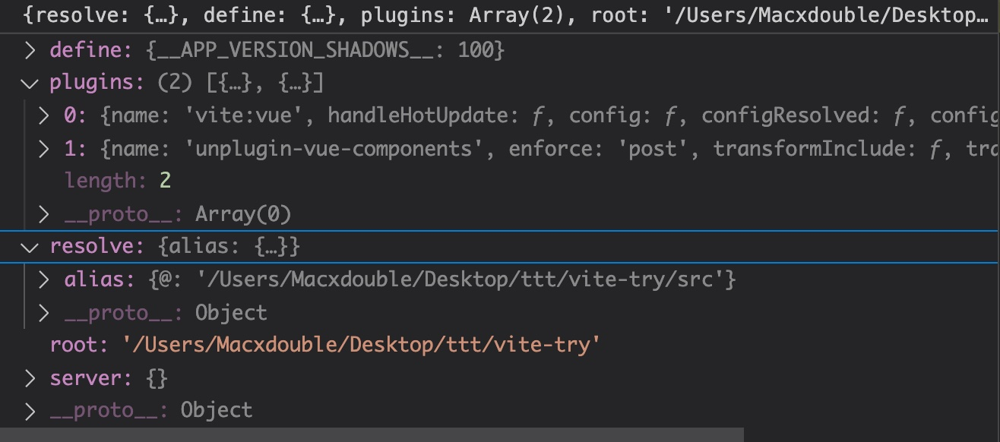

### 配置收集 - `resolveConfig`
在 `createServer` 的开头，调用了 `resolveConfig` 函数，进行配置收集

- 首先`resolveConfig` 内部处理了插件排序规则，对应下面的排序规则
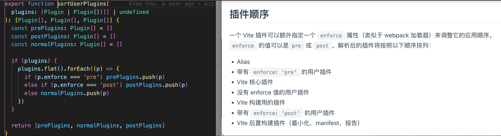
在后续处理的过程中，插件将按照对应的排序规则先后执行，这样能够让插件更好地工作在各个生命周期节点

#### 合并插件配置
在插件排序完成后，`vite` 的 `插件` 暴露了一个配置 `config` 字段，可以通过设置该属性，使插件能够新增或改写 `vite` 的一
些配置。（如下图）
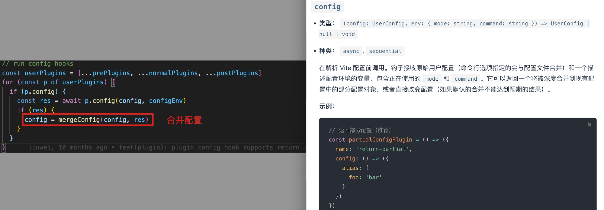

#### 处理 alias
然后，`resolveConfig` 内部处理了 `alias` 的逻辑，将指定的 `alias` 替换成对应的路径。
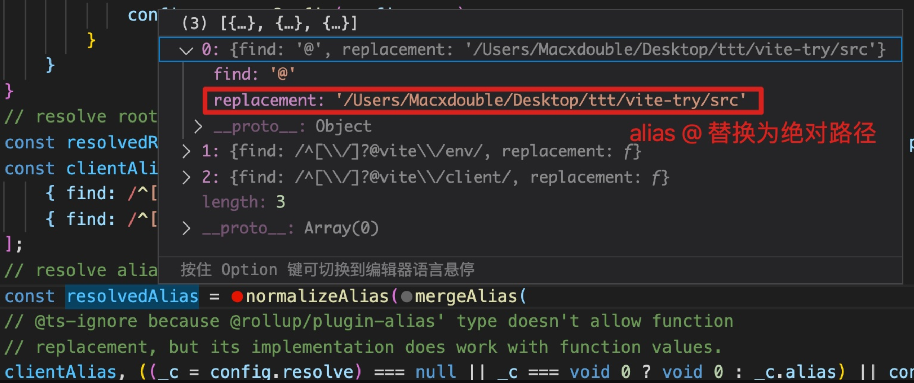

#### 读取环境变量配置
接下来，`resolveConfig` 内部找到 `env` 的配置目录（默认为根目录），然后在目录中读取对应的 `env` 环境变量配置文件。我们可以
看看内部的读取规则优先级（如下图）
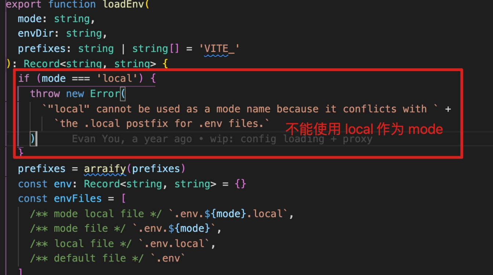
可以看出，读取的优先级分别是 `.env.[mode].local`、`.env.[mode]`。如果不存在对应 `mode` 的配置文件，则会尝试去寻
找 `.env.local`、`.env` 配置文件，读取到配置文件后，使用 `doteenv` 将环境变量写入到项目中；如果这些环境变量配置文
件都不存在的话，则会返回一个空对象,该环境变量配置文件并不影响项目运行，所以不配置也没有什么影响。

#### 导出配置
接下来，`vite` 初始化了构建配置，也就是文档中的 `build` 属性，详情可以参照
[构建选项文档](https://cn.vitejs.dev/config/#build-target)
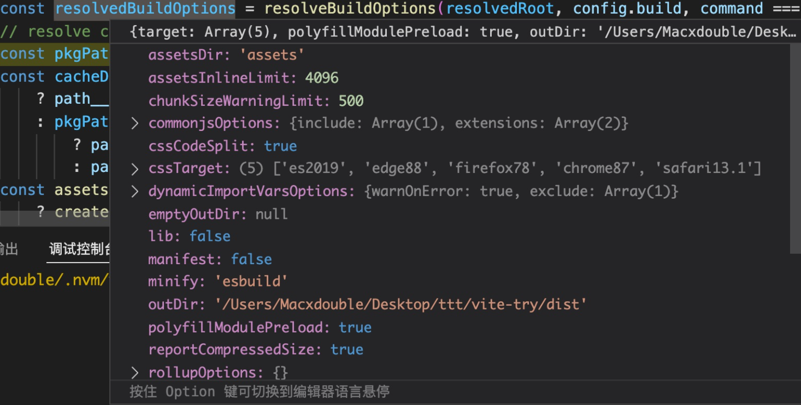
最后，`resolveConfig` 处理了一些 `publicDir`、`cacheDir` 目录后，导出了下面这份配置。
```ts
const resolved: ResolvedConfig = {
    ...config,
    configFile: configFile ? normalizePath(configFile) : undefined,
    configFileDependencies,
    inlineConfig,
    root: resolvedRoot,
    base: BASE_URL,
    resolve: resolveOptions,
    publicDir: resolvedPublicDir,
    cacheDir,
    command,
    mode,
    isProduction,
    plugins: userPlugins,
    server,
    build: resolvedBuildOptions,
    preview: resolvePreviewOptions(config.preview, server),
    env: {
      ...userEnv,
      BASE_URL,
      MODE: mode,
      DEV: !isProduction,
      PROD: isProduction
    },
    assetsInclude(file: string) {
      return DEFAULT_ASSETS_RE.test(file) || assetsFilter(file)
    },
    logger,
    packageCache: new Map(),
    createResolver,
    optimizeDeps: {
      ...config.optimizeDeps,
      esbuildOptions: {
        keepNames: config.optimizeDeps?.keepNames,
        preserveSymlinks: config.resolve?.preserveSymlinks,
        ...config.optimizeDeps?.esbuildOptions
      }
    },
    worker: resolvedWorkerOptions
  }
```
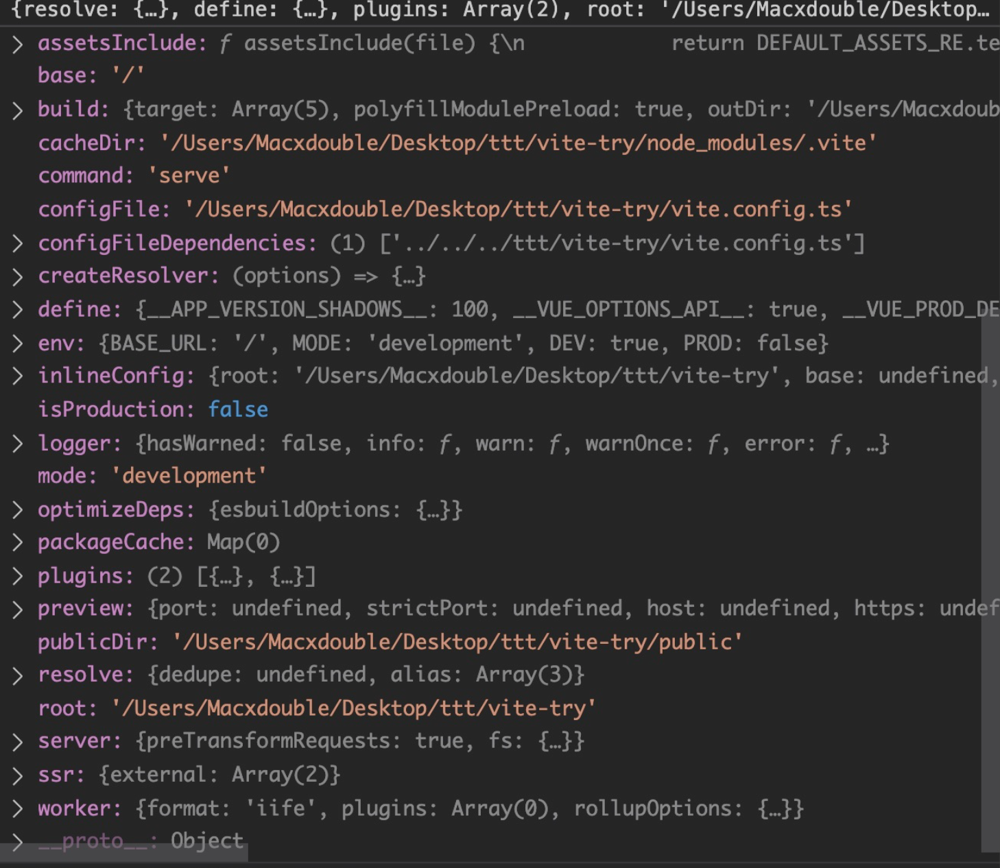
`resolveConfig` 内部还有一些额外的工作处理，主要是收集内部插件集合（如下图），还有配置一些废弃选项警告信息

### 本地开发服务 - `createServer`
回到 `createServer` 方法，该方法通过 `resolveConfig` 拿到配置后，第一时间处理了 `ssr`（服务端渲染）的逻辑。
如果使用了服务端渲染，则会通过别的方式进行本地开发调试;如果不是服务端渲染，则会创建一个 `http server` 用于本地开发
调试，同时创建一个 `websocket` 服务用于热重载。（如下图）
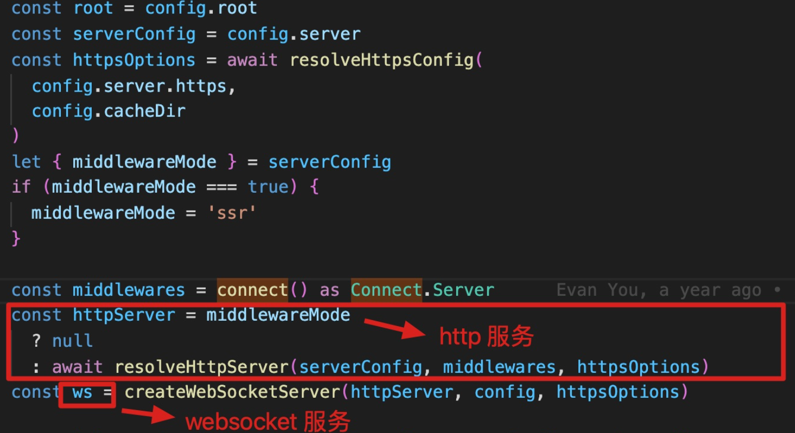

#### 文件监听 + 热重载
然后，`vite` 创建了一个 `FSWatcher` 对象，用于监听本地项目文件的变动。（这里使用的是 `chokidar` 库）
```ts
  const watcher = chokidar.watch(path.resolve(root), {
    ignored: [
      // 忽略 node_modules 目录的文件变更
      '**/node_modules/**',
      // 忽略 .git 目录的文件变更
      '**/.git/**',
      // 忽略用户传入的 `ignore` 目录文件的变更
      ...(Array.isArray(ignored) ? ignored : [ignored])
    ],
    ignoreInitial: true,
    ignorePermissionErrors: true,
    disableGlobbing: true,
    ...watchOptions
  }) as FSWatcher
```
然后，`vite` 将多个属性和方法组织成了一个 `server` 对象，该对象负责启动本地开发服务，也负责服务后续的开发热重载。

接下来，我们看看 `watcher` 是如何做页面热重载的吧，原理就是监听到文件变更后，重新触发插件编译，然后将更新消息发送给客户端。（如下图）
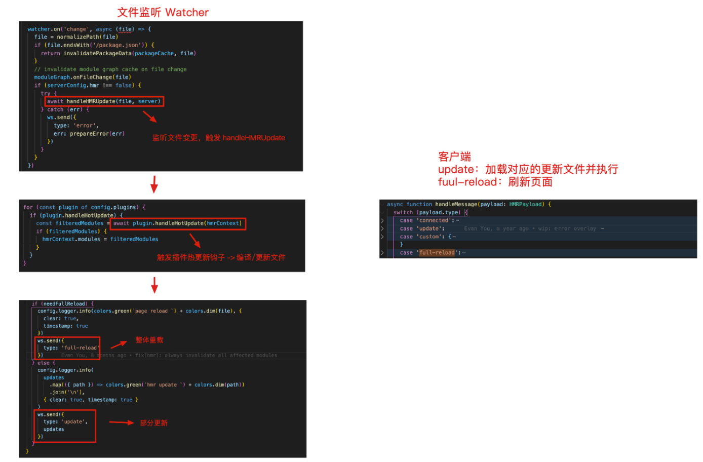

#### 插件容器
接下来，`vite` 创建了插件容器（`pluginContainer`），用于在构建的各个阶段调用插件的钩子。（如下图）
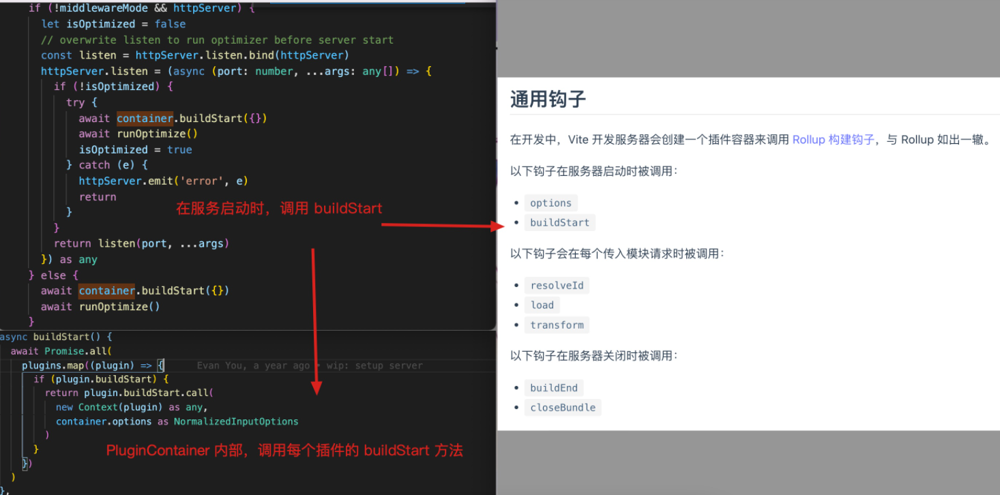
> 实际上插件容器是在热重载之前创建的，为了方便阅读，文章将热重载的内容都放在了一起。

#### 中间件机制
接下来是一些内部中间件的处理，当配置开发服务器选项时，`vite` 内部通过 `connect` 框架的中间件能力来提供支持。（如下图）
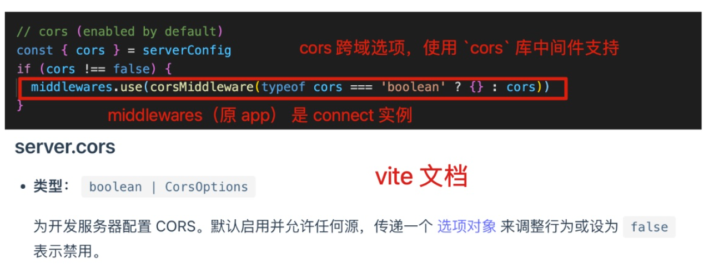
其中，对 `public` 目录、公共路径等多项配置都是通过 `connect` + 中间件实现的，充分地利用了第三方库的能力，而没有重复造轮子。

#### 预构建依赖
接下来，`vite` 内部对项目中使用到的依赖进行的预构建，一来是为了兼容不同的 ES 模块规范，二来是为了提升加载性能。（如下图）
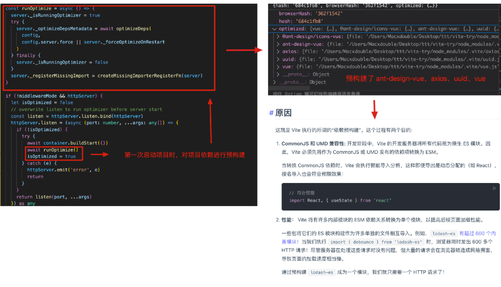
准备工作就绪后，`vite` 内部调用 `startServer` 启动本地开发服务器。（如下）
```ts
// ...
httpServer.listen(port, host, () => {
  httpServer.removeListener('error', onError)
  resolve(port)
})
```
可以看出，在本地开发时，`vite` 主要依赖 `插件 + 中间件体系` 来提供能力支持。因为本地开发时只涉及到少量编译工作，所以非常的快。只
有在构建生产产物时，`vite` 才用到了 `rollup` 进行构建。

我们用一张流程图来最后梳理一遍 `vite 本地开发服务` 内部的工作流程吧
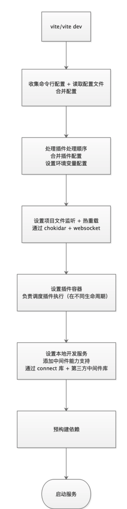

[vite build请参考这里](https://blog.csdn.net/qq_34621851/article/details/123130837)

## vite快还是慢
谈到 Vite，给人的第一印象就是 dev server 启动速度快。同样规模的项目，相比 Webpack 动辄十几秒甚至几十秒的的启动速度，Vite 简直是快到没朋友，往往数秒之内即可完成启动，虽然也出现了
一些诸如首屏、懒加载性能下降等负面效果，但整体来说依然利大于弊，开发幸福感提升非常明显
### vite的快
Vite 的快，主要体现在两个方面: 快速的冷启动和快速的热更新。而 Vite 之所以能有如此优秀的表现，完全归功于 Vite 借助了浏览器对 ESM 规范的支持，采
取了与 Webpack 完全不同的 unbundle 机制

首先要说的是webpack之所以能够大行其道，归功于它划时代的采用了 bundle 机制。通过这种 bundle 机制，Webpack 可以将项目中各种类型的源文件转化供浏览
器识别的 js、css、img 等文件，建立源文件之间的依赖关系，并将数量庞大的源文件合并为少量的几个输出文件

bundle 工作机制的核心部分分为两块：构建模块依赖图 - module graph 和将 module graph 分解为最终供浏览器使用的几个输出文件

#### 构建 module graph 的过程可以简单归纳为:
1. 获取配置文件中 entry 对应的 url (这个 url 一般为相对路径);
2. resolve - 将 url 解析为绝对路径，找到源文件在本地磁盘的位置，并构建一个 module 对象；
3. load - 读取源文件的内容;
4. transform - 使用对应的 loader 将源文件内容转化为浏览器可识别的类型；
5. parse - 将转化后的源文件内容解析为 AST 对象，分析 AST 对象，找到源文件中的静态依赖(import xxx from 'xxx') 和动态依赖(import('xx'))对应的 url, 并收集到 module 对象中；
6. 遍历第 5 步收集到的静态依赖、动态依赖对应的 url，重复 2 - 6 步骤，直到项目中所有的源文件都遍历完成。

#### 分解 module graph 的过程也可以简单归纳为:
1. 预处理 module graph，对 module graph 做 tree shaking；
2. 遍历 module graph，根据静态、动态依赖关系，将 module graph 分解为 initial chunk、async chunks；
3. 优化 initial chunk、 async chunks 中重复的 module；
4. 根据 optimization.splitChunks 进行优化，分离第三方依赖、被多个 chunk 共享的 module 到 common chunks 中；
5. 根据 chunk 类型，获取对应的 template；
6. 遍历每个 chunk 中收集的 module，结合 template，为每个 chunk 构建最后的输出内容；
7. 将最后的构建内容输出到 output 指定位置；

Webpack 的这种 bundle 机制，奠定了现代静态打包器(如 Rollup、Parcel、Esbuild)的标准工作模式

然而成也萧何败萧何，强大的 bundle 机制，也引发了构建速度缓慢的问题，而且项目规模越大，构建速度越是缓慢。其主要原因是构建 module graph 的过程中，涉及到大量的文
件 IO、文件 transfrom、文件 parse 操作；以及分解 module graph 的过程中，需要遍历 module graph、文件 transform、文件 IO 等。这些操作，往往需要消耗大量
的时间，导致构建速度变得缓慢

开发模式下，dev server 需要 Webpack 完成整个工作链路才可以启动成功，这就导致构建过程耗时越久，dev server 启动越久。为了加快构建速度，Webpack 也做了大量的优
化，如 loader 的缓存功能、webpack5 的持久化缓存等，但这些都治标不治本，只要 Webpack 的核心工作机制不变，那 dev server 启动优化，依旧是一个任重道远的过
程(基本上永远都达不到 Vite 那样的效果)

#### Vite 之所以在 dev server 启动方面，如此给力，是因为它采取了与 Webpack 截然不同的 unbundle 机制
1. 不需要构建、分解 module graph，源文件之间的依赖关系完全通过浏览器对 ESM 规范的支持来解析
2. dev server 端会通过 middlewares 对请求做拦截，然后对源文件做 resolve、load、transform、parse 操作，然后再将转换以后的内容发送给浏览器
3. 不对源文件做合并捆绑操作

webpack 启动以后，会 watch 源文件的变化。当源文件发生变化后，Webpack 会重新编译打包。这个时候，由于我们只修改了一个文件，因此只需要对这个源文件做 resolve、 load、 transfrom、parse 操作，依赖
的文件直接使用缓存，因此 dev server 的响应速度比冷启动要好很多;dev server 重新编译打包以后，会通过 ws 连接通知浏览器去获取新的打包文件，然后对页面做局部更新

Vite 采用 unbundle 机制，所以 dev server 在监听到文件发生变化以后，只需要通过 ws 连接通知浏览器去重新加载变化的文件，剩下的工作就交给浏览器去做了所以热更新速度很快

### vite的慢
由于 unbundle 机制，首屏期间需要额外做以下工作:
1. 不对源文件做合并捆绑操作，导致大量的 http 请求；
2. dev server 运行期间对源文件做 resolve、load、transform、parse 操作；
3. 预构建、二次预构建操作也会阻塞首屏请求，直到预构建完成为止；

和 Webpack 对比，Vite 把需要在 dev server 启动过程中完成的工作，转移到了 dev server 响应浏览器请求的过程中，不可避免的导致首屏性能下降。
不过首屏性能差只发生在 dev server 启动以后第一次加载页面时发生。之后再 reload 页面时，首屏性能会好很多。原因是 dev server 会将之前已经完成转换的内容缓存起来

同样的， Vite 在懒加载方面的性能也比 Webpack 差。此外，如果懒加载过程中，发生了二次预构建，页面会 reload，对开发体验也有一定程度的影响

## vite使用esbuild
我们提到过开发模式下使用 Vite 会有首屏性能下降的负面效果。之所以会造成首屏性能下降
- 一方面是 dev server 需要完成预构建才可以响应首屏请求；
- 另一方面是需要对请求文件做实时转换。
那么我们就从这两个方面来做优化，vite也是这么做的；Vite借助了 Esbuild 能快速完成项目打包、文件转换的能力来进行预构建、内容转换

Esbuild 是一款基于 Go 语言开发的 javascript 打包工具，最大的一个特征就是快，同样规模的项目，使用 Esbuild 可以将打包速度提升 10 - 100 倍，这对广大一直饱受 Webpack 缓慢打
包速度折磨的开发人员来说，简直就是福音，而 Esbuild 之所以能这么快，主要原因有两个:
- Go 语言开发，可以多线程打包，代码直接编译成机器码；Webpack 一直被人诟病构建速度慢，主要原因是在打包构建过程中，存在大量的 resolve、load、transform、parse 操作
而这些操作通常是通过 javascript 代码来执行的。要知道，javascript 并不是什么高效的语言，在执行过程中要先编译后执行，还是单线程并且不能利用多核 cpu 优势，和 Go 语言相比，效率很低
- 可充分利用多核 cpu 优势

#### 关键 API - transfrom & build
Esbuild 并不复杂。它对外提供了两个 API - transform 和 build，使用起来非常简单。
``` js
// transfrom将ts、jsx、tsx等格式的内容转化为js,只负责文件内容转换，并不生成一个新的文件
const res = await esbuild.transform(code, options) // 将 code 转换为指定格式的内容
// build根据指定的单个或者多个入口，分析依赖，并用loader将不同格式的内容转化为js内容，生成一个或多个 bundle 文件
esbuild.build(options) // 打包构建
```
和 Webpack、Rollup 等构建工具一样，Esbuild 也提供了供外部使用的 plugin，使得我们可以介入构建打包过程
``` js
let customerPlugin = {
    name: 'xxx',
    setup: (build) => {
        // 解析 url 时触发，可自定义 url 如何解析。如果 callback 有返回 path，后面的同类型 callback 将不会执行
        // 所有的 onResolve callback 将按照对应的 plugin 注册的顺序执行
        build.onResolve({ filter: '', namespace: '' }, args => { ...});
        // onLoad, 加载模块时触发，可自定义模块如何加载。 如果 callback 有返回 contents，后面的同类型 callback 将
        // 不会执行。所有的 onLoad callback 将按照对应的 plugin 注册的顺序执行
        build.onLoad({ filter: '', namespace: ''}, args => { ... });
        // onStart, 每次 build 开始时都会触发，没有入参，因此不具有改变 build 的能力。多个 plugin 的 onStart 并行执行
        build.onStart(() => { ... });
        // onEnd, 每次 build 结束时会触发，入参为 build 的结果，可对 result 做修改。所有的的 onEnd 将按照对应的 plugin 注册的顺序执行
        build.onEnd((result) => { ... });
    }
}
```
先来回顾一下为什么要做预构建,原因有两点:
- 将非 ESM 规范的代码转换为符合 ESM 规范的代码
- 将第三方依赖内部的多个文件合并为一个，减少 http 请求数量

要完成预构建，最关键的两点是找到项目中所有的第三份依赖和对第三方依赖做合并、转换。借助 Esbuild，Vite 很轻松的实现了这两个诉求

寻找第三方依赖的过程非常简单，分为两步:
1. 定义一个带 onResolve hook 和 onLoad hook 的 esbuild plugin；
2. 执行 esbuild 的 build 方法做打包构建；

和 Webpack、Rollup、Parcel 等构建工具一样，Esbuild 在做打包构建时也要构建模块依赖图 - module graph；在构建 module graph 时，
第一步就是解析模块的绝对路径，这个时候就会触发 onResolve hook。在 onResolve hook 触发时，会传入模块的路径。根据模块的路径，我们
就可以判断出这个模块是第三方依赖还是业务代码。
``` js
// main.tsx
import react from 'react';
import CustomeComponent from './components/CustomeComponent';
```
解析 react、CustomeComponent 时，会触发 onResolve hook，入参分别为 'react' 和 './components/CustomeComponent'。根据入参，我们
可以很清楚的区分 'react' 是第三方依赖，'./components/CustomeComponet' 是业务代码。这样，esbuild 完成构建，项目中的第三方依赖也就收集
完毕了。所有的第三方依赖会收集到一个 deps 列表中。

知道了项目中的第三方依赖以后，再做合并、转换操作就非常简单了。这一步， Vite 直接通过 esbuild 提供的 build 方法，指定 entryPoints 为收集
到的第三方依赖，format 为 esm，再做一次打包构建。这一次，会对第三方依赖做合并、转换操作。打包构建完成以后，再把构建内容输出到 /node_modules/.vite/deps 下。

#### middlewares 中内容转换
Vite 中源文件的转换是在 dev server 启动以后通过 middlewares 实现的。当浏览器发起请求以后，dev sever 会通过相应的 middlewares 对请求
做处理，然后将处理以后的内容返回给浏览器。middlewares 对源文件的处理，分为 resolve、load、transform、parser 四个过程：

1. resolve - 解析 url，找到源文件的绝对路径；
2. load - 加载源文件。如果是第三方依赖，直接将预构建内容返回给浏览器；如果是业务代码，继续 transform、parser。
3. transfrom - 对源文件内容做转换，即 ts -> js, less -> css 等。转换完成的内容可以直接返回给浏览器了。
4. parser - 对转换以后的内容做分析，找到依赖模块，对依赖模块做预转换 - pre transform 操作，即重复 1 - 4。
5. pre transform 是 Vite 做的一个优化点。预转换的内容会先做缓存，等浏览器发起请求以后，如果已经完成转换，直接将缓存的内容返回给浏览器。

Vite 在处理步骤 3 时，是通过 esbuild.transform 实现的，对比 Webpack 使用各个 loader 处理源文件，那是非常简单、快捷的

## 优化
在实际开发使用过程中，我们会发现一些问题和不足，这里做些记录

### 懒加载性能变差
性能差仅限于 dev server 启动以后首次打开应用的某一个页面，原因有两点：
- 大量的 http 请求
- dev server 实时对浏览器请求的文件做 transform

http 请求数量多这个问题，影响较小，因此只重点关注源文件实时处理这个问题。解决方案也很简单，就是在用户点击某个页面之前，提前向 dev server 发起请求，让 dev server 提前去
对请求文件做 transform,等到真正需要加载某个资源时，直接返回已经 transform 的资源。这种手段也就是我们常说的 prefetch。
``` js
// 用于提前获取首屏资源
<link ref="preload" href="xxxxx" as="script" />

// 用于提前获取非首屏资源
<link ref="prefetch" href="xxxx"  as="script" />

// 用于提前建立 http 连接
<link ref="preconnect" href="xxx" />
```
使用 prefetch 策略，有两个问题需要解决:
1. 找到项目中需要懒加载的 path；
2. 将 prefetch 链接添加到 html 文件中；

首先是找到项目需要懒加载的 path。要完成这一步，有简单的实现，也有复杂的实现。简单的方式，就是开发人员手动定义一个需要 prefetch 的懒加载 path 列表。这种方式简单易用,方便快捷，而且使用
灵活，但是会加重开发人员的维护成本;复杂的方式，是通过技术手段实现。这种方式，和预加载需要提前获取项目中所有的第三方依赖一样，通过对项目整个源文件做一个依赖分析，然后识别出其中需要懒加载
的 path。因此我们可以像预加载一样，借助 esbuild 实现。但是这种方式有一个很大的问题，那就是由于我们需要把识别的 path 添加到 html 中，导致识别过程必须在浏览器请求 html 之前完成，这
就存在阻塞浏览器首屏请求的可能，使得首屏性能下降。综合两种方式的优劣和实现成本，采用第一种方式

把 prefetch 链接添加到 html 文件中就非常简单了，我们可以通过 Vite 提供的 transformIndexHtml hook 实现。这个 hook 给我们提供了在 dev server 返回 html 文件之前修改 html 的机会
``` ts
// PrefetchLazyPathsPlugin.ts
export const PrefetchLazyPathsPlugin = (paths: string[] = []) => {
    return {
        name: 'prefetch-lazy-paths-plugin',
        async transformIndexHtml(html: string) {
            if (!paths.length) return html;
            let prefetchStr: string = '';
            paths.forEach((item) => {
                prefetchStr += `<link rel="prefetch" href="${item}" as="script" />`;
            });
            let newHtml = html.replace('</head>', `${prefetchStr}</head>`);
            return newHtml;
        },
    }
}

// vite.config.ts
const lazyPaths = [
    '/src/pages/order-manage/index.tsx',
    '/src/pages/customer-manage/index.tsx',
    '/src/pages/customer-group/index.tsx',
    ...
]

export default {
    ...
    plugins: [
        PrefetchLazyPathsPlugin(lazyPaths)
    ]
}
```
测试可以看到我们的优化策略是生效的，而且效果也非常不错，但是却带来一个很严重的问题,那就是首屏性能更差了。主要是 prefetch 策略使得 dev server 需要在首屏期间需要同时处理首屏资源 + 懒加载页面
资源，导致首屏资源的响应速度变慢，使得首屏性能下降。这样子的性能优化肯定是没有意义的，我们不能牺牲首屏性能去提升懒加载性能。后来考虑在首屏完成以后通过 fetch API去 prefetch


通过 Vite 提供的 transform hook 实现。这个 hook 给我们提供了在 dev server 返回 transform 以后的代码之前，修改代码的机会。通过这个 hook，我们可以在入口文件
 /src/index.tsx 完成 transform 以后、返回浏览器之前注入 fetch 代码
``` ts
// PrefetchLazyPathsPlugin.ts
export const PrefetchLazyPathsPlugin = (entry: string, paths: string[] = []) => {
    return {
        name: 'prefetch-lazy-paths-plugin',
        async transform(code, id) {
            // 只对入口文件做代码注入
            // onload 会在页面所有资源加载完毕以后触发，这样我们就可以在 onload 内部调用 fetch 去实现 prefetch
            if (id.includes(entry)) {
                return `
                    ${code};
                    window.onload = () => {
                        const lazyPages = ${JSON.stringify(paths)};
                        lazyPages.forEach(item => fetch(item));
                    }
                `
            }
            return code;
        },
    }
}
// vite.config.ts
const lazyPaths = [
    '/src/pages/order-manage/index.tsx',
    '/src/pages/customer-manage/index.tsx',
    '/src/pages/customer-group/index.tsx',
    ...
]

export default {
    ...
    plugins: [
        PrefetchLazyPathsPlugin('/src/index.tsx', lazyPaths);
    ]
}
```
这次优化以后，首屏性能不像上一次那么差，懒加载性能也非常优秀，但依然存在一个问题，那就是首个懒加载页面展示特别慢,我们还是简单做一下分析。整个首页的加载过程为:
1. 首屏加载；
2. prefetch 懒加载资源；
3. 根据当前路由懒加载 order-manage 页面

prefetch 导致 dev-server 需要同时处理 order-manage 页面资源 + 其他懒加载页面资源，导致 order-manage 资源响应速度变慢，使得 order-manage 页面渲染速度变慢。
最好的是在首页懒加载完成以后再去 prefetch
1. 如何量化懒加载已经完成 ？
2. 用户首页懒加载的页面无法确定，我们怎么注入 prefetch 代码 ？

针对这个问题，目前没有特别好的解决方案，只能给每个懒加载页面都注入 prefetch 代码；人为通过 setTimeout 延迟 1000 ms 去 prefetch 来防止首个懒加载页面资源响应速度变慢
``` ts
// PrefetchLazyPathsPlugin.ts
export const PrefetchLazyPathsPlugin = (paths: string[] = [], timeout: number = 1000) => {
    return {
        name: 'prefetch-lazy-paths-plugin',
        async transform(code, id) {
            if (paths.length) {
                for(let path of paths) {
                    if (id.includes(path)) {
                        return `
                            ${code};
                            const lazyPages = ${JSON.stringify(paths)};
                            setTimeout(() => {
                              lazyPages.forEach(item => fetch(item));
                            }, timeout);
                        `
                    }
                }
            }
            return code;
        }
    }
}
```


