## multirepo vs monorepo
随着功能和业务量级的飙升，前端代码量级也越来越大，管理运维的成本也进一步增加。代码仓库的运营管理挑战也浮出水面。
主流方案有两种：一是multirepo式的分散式的独立仓库，二是monorepo式的集中管理，各有千秋，下面就结合实际场景简单了解下

### 分散式管理：multirepo
即按照功能或者其他维度，将项目拆分为不同模块单独维护于各自仓库中,这样做的好处就是
1. 灵活: 不同模块独立维护，与其他模块天然隔离。各个模块可以选择适合自己的风格、工具等
2. 安全: 得益于模块的拆分，权限控制较为自然,开发时只关注相关部分，不会误操作其他内容,发布上线，对其他模块无感知

同样他也会带来一些问题
1. 管理成本较高，常见的项目交接时，每个人都负责了一堆项目、账号等，只能手动梳理，还存在漏掉的可能。我当初经历过几次
大的调整，交接的真是一脸懵逼和心痛。来个需求才发现还有个仓库一直处于遗忘的角落
2. 开发协作成本较高，涉及多个项目开发时，本地开发需要打开多个IDE在其中切换，对于本地调试等也是个繁琐的过程，虽然存在npm link等方式
3. 依赖升级，这种场景一般出现在依赖的核心模块上，特别是自行开发的基础依赖，不得不升级时简直一言难尽，数目直逼上百的项目，每个都要修改发布一次。
上面说的是业务模块，对于开源或者公司内部基础性工具，升级这里的问题更显著一些。对于程序员俩说，出现问题解决问题就是，因此集中式的管理模式就出现了

### 集中式管理：monorepo
monorepo 的核心观点是所有的项目在一个代码仓库中。严格的统一和收归，以利于统一的升级和管理，不过这并不是说代码没有组织的随意存放。相反，在
文件目录上体现出管理结构的要求更高，否则可维护性更低，例如Babel，每个模块都在指定的packages目录下

既然是基于问题的演进，其实优势比较明显，就是multirepo的局限的解决。例如协作、运营管理等成本降低，不过monorepo也不全是益处，相反其局限也比较明显
1. 随着项目的发展，体积会逐渐增大，甚至成为巨无霸项目体积几个G，自然带来一些问题：如如果每次还是全部编译的话，开发、部署时的等待时间会相当的长
2. 全部功能就这样暴露在所有开发者面前，安全性是个大问题。误操作的可能性，如果仅仅寄希望于开发者素质和codereview时的人工复检是不可靠的
3. 大量的数据（Large volumes of data）：单一代码库每天都要处理大量的数据和提交
4. Code reviews：通知可能会变得非常嘈杂。例如，GitHub有有限的通知设置，不适合大量的pull request和code review
5. 学习曲线（Learning curve）：如果代码库包含了许多紧密耦合的项目，那么新成员的学习曲线会更陡峭

当然目前也存在比较成熟的解决方案,针对复杂的项目模块，自然需要有贴合实际的管理工具

1. 例如lerna，自我定位就是: `A tool for managing JavaScript projects with multiple packages`
至于详细用法，大家可以通过官网查看

2. git稀疏检出, 针对开发者只关注相应内容的解决方案可以依托git来实现的。
Git在1.7版本后，已经支持只Checkout部分内容，即稀疏检出(sparse checkout);稀疏检出就是本地版本库检出时不检出全部，只将指定的文件从本地版本库检
出到工作区，而其他未指定的文件则不予检出（即使这些文件存在于工作区，其修改也会被忽略）,也就是我们可以在工作区只关注相关的模块，虽然文件全部pull了
下来，但展示和管理式会忽略其他文件，即使展示了其他文件并进行了修改，修改依然会被忽略。
``` js
// 例如babel中我们只展示 babel-cli 内容部分，操作如下：
// 创建文件夹
mkdir demo && cd demo
// 初始化git 
git init
git remote add origin https://github.com/babel/babel.git
// 打开 开关 
git config core.sparsecheckout true
// 指定目录
echo "packages/babel-cli/" >> .git/info/sparse-checkout
// 获取代码
git pull origin master
```
这样，我们ls可以查看到文件内容只有：`packages/babel-cli`


## 包管理器
目前主流的包管理器大概有三个npm、yarn，已经最新出来的pnpm

### npm/yarn install 原理
主要分为两个部分, 首先，执行 npm/yarn install之后，包如何到达项目 node_modules 当中。其次，node_modules 内部如何管理依赖

执行命令后，首先会构建依赖树，然后针对每个节点下的包，会经历下面四个步骤:
1. 将依赖包的版本区间解析为某个具体的版本号
2. 下载对应版本依赖的 tar 包到本地离线镜像
3. 将依赖从离线镜像解压到本地缓存
4. 将依赖从缓存拷贝到当前目录的 node_modules 目录
然后，对应的包就会到达项目的node_modules当中

在 npm1、npm2 中呈现出依赖树的的是嵌套结构，比如下面这样:
``` js
node_modules
└─ foo
   ├─ index.js
   ├─ package.json
   └─ node_modules
      └─ bar
         ├─ index.js
         └─ package.json
```
如果 bar 当中又有依赖，那么又会继续嵌套下去。试想一下这样的设计存在什么问题:
1. 依赖层级太深，会导致文件路径过长的问题，尤其在 window 系统下
2. 大量重复的包被安装，文件体积超级大。比如跟 foo 同级目录下有一个baz，两者都依赖于同一个版本的lodash，那么 lodash
会分别在两者的 node_modules 中被安装，也就是重复安装。
3. 模块实例不能共享。比如 React 有一些内部变量，在两个不同包引入的 React 不是同一个模块实例，因此无法共享内部变量，导致一些不可预知的 bug

接着，从 npm3 开始，包括 yarn，都着手来通过扁平化依赖的方式来解决这个问题。相信大家都有这样的体验，我明明就装个 express，为什
么 node_modules里面多了这么多东西，这就是扁平化的结果，大概的依赖树如下
``` js
node_modules
├─ foo
|  ├─ index.js
|  └─ package.json
└─ bar
   ├─ index.js
   └─ package.json
```
所有的依赖都被拍平到node_modules目录下，不再有很深层次的嵌套关系。这样在安装新的包时，根据 node require 机制，会不停往上级的node_modules当
中去找，如果找到相同版本的包就不会重新安装，解决了大量包重复安装的问题，而且依赖层级也不会太深。

之前的问题是解决了，但仔细想想这种扁平化的处理方式，它真的就是无懈可击吗？并不是。它照样存在诸多问题，梳理一下:
1. 依赖结构的不确定性
2. 扁平化算法本身的复杂性很高，耗时较长
3. 项目中仍然可以非法访问没有声明过依赖的包（最外层有很多平行的包，所以子包可以随便引用）

主要解释下第一个不确定性的问题，假设现在项目依赖两个包 foo 和 bar，这两个包的依赖又是这样的:
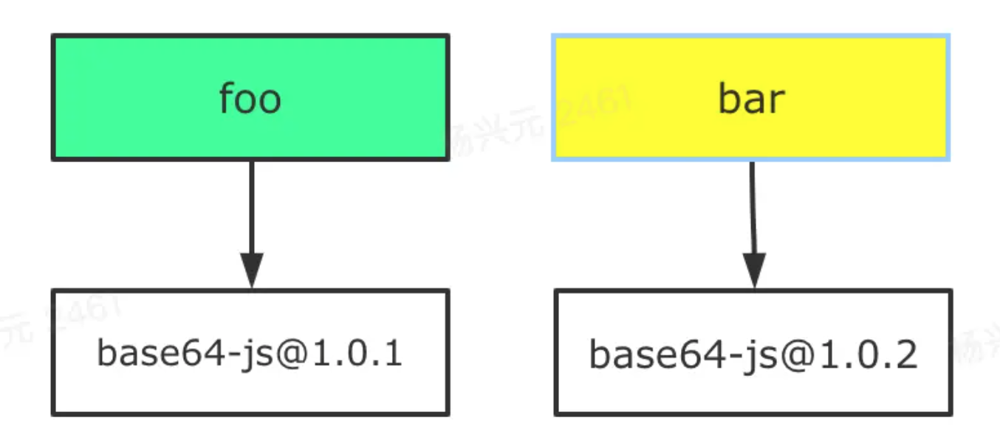
那门他会出现两种安装的可能性，取决于 foo 和 bar 在 package.json中的位置，如果 foo 声明在前面，那么就是前面的结构，否则是后面的结构
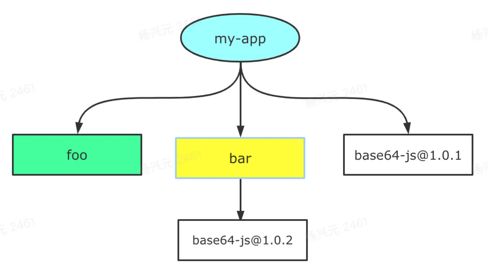
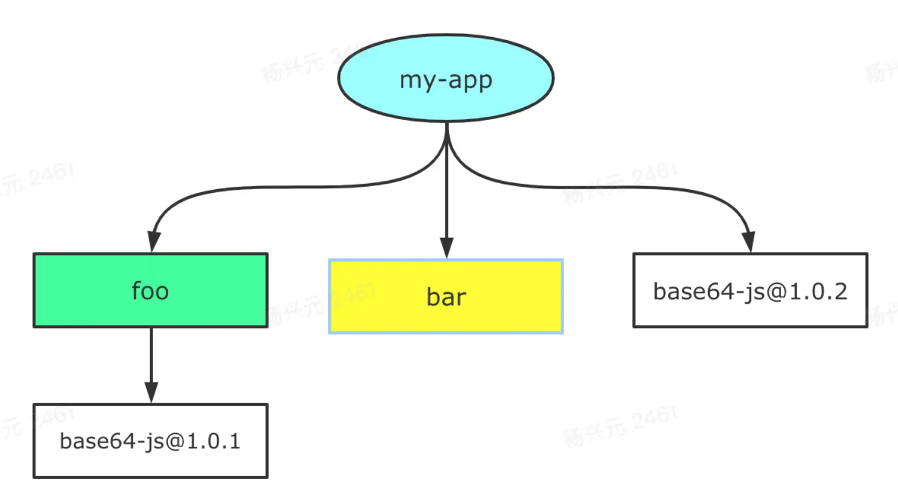
这就是为什么会产生依赖结构的不确定问题，也是 lock 文件诞生的原因，无论是package-lock.json(npm 5.x才出现)还是yarn.lock，都
是为了保证 install 之后都产生确定的node_modules结构，尽管如此，npm/yarn 本身还是存在扁平化算法复杂和package 非法访问
的问题，影响性能和安全

当npm还处于v3时期的时候,一个叫yarn的包管理工具横空出世.在2016年, npm还没有package-lock.json文件,安装的时候速度很慢,稳定
性很差,yarn的出现很好的解决了一下的一些问题:
- 确定性: 通过yarn.lock等机制,即使是不同的安装顺序,相同的依赖关系在任何的环境和容器中,都可以以相同的方式安装。(那
么,此时的npm v5之前,并没有package-lock.json机制,只有默认并不会使用 npm-shrinkwrap.json)
- 采用模块扁平化的安装模式: 将不同版本的依赖包,按照一定的策略，归结为单个版本;以避免创建多个版本造成工程的冗
余(目前版本的npm也有相同的优化)
- 网络性能更好: yarn采用了请求排队的理念,类似于并发池连接,能够更好的利用网络资源;同时也引入了一种安装失败的重试机制
采用缓存机制,实现了离线模式 (目前的npm也有类似的实现)

### pnpm的破解之道：网状 + 平铺的node_modules结构
pnpm的用户可能会发现它node_modules并不是扁平化结构，而是目录树的结构，类似npm version 2.x版本中的结构，直接列出项目下所有的依赖
包如下图所示
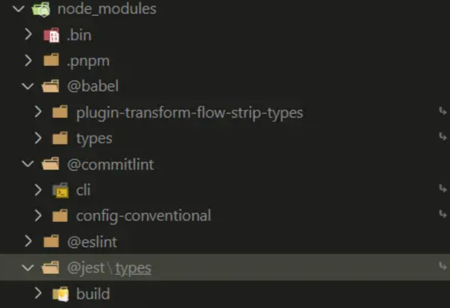
同时还有个.pnpm目录，如下图所示
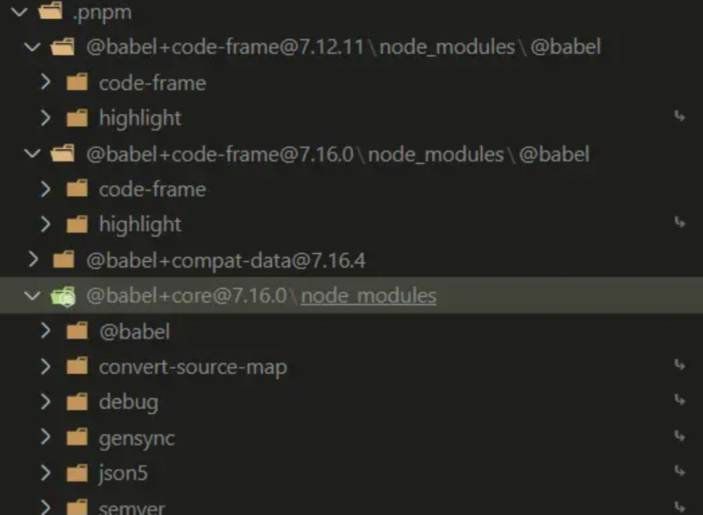
.pnpm 以平铺的形式储存着所有的包，正常的包都可以在这种命名模式的文件夹中被找到（peerDep例外）：
``` js
.pnpm/<organization-name>+<package-name>@<version>/node_modules/<name>
// 组织名(若无会省略)+包名@版本号/node_modules/名称(项目名称)
```
我们称.pnmp为虚拟存储目录，该目录通过`<package-name>@<version>`来实现相同模块不同版本之间隔离和复用，由于它只会根
据项目中的依赖生成，并不存在提升

pnpm 这种依赖管理的方式也很巧妙地规避了非法访问依赖的问题，也就是只要一个包未在 package.json 中声明依赖，那么在项目中是无法访问的

接下来我们来说下如何跟文件资源进行关联的呢？又如何被项目中使用呢？（Store + Links）

pnpm的存储使用名为 .pnpm-store的 store dir，Mac/linux中默认会设置到{home dir}>/.pnpm-store/v3；windows下会
设置到当前盘的根目录下，比如C（C/.pnpm-store/v3）、D盘（D/.pnpm-store/v3）

可以在不同的磁盘上设置同一个存储，但在这种情况下，pnpm 将复制包而不是硬链接它们，因为硬链接只能发生在同一文件系统同一分区上

pnpm install的安装过程中，我们会看到如下的信息，这个里面的Content-addressable store就是我们目前说的Store
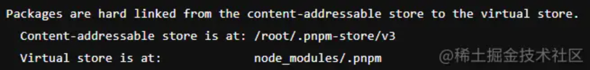
`CAS 内容寻址存储，是一种存储信息的方式，根据内容而不是位置进行检索信息的存储方式`

`Virtual store 虚拟存储，指向存储的链接的目录，所有直接和间接依赖项都链接到此目录中，项目当中的.pnpm目录`

通过hard link， 用户可以通过不同的路径引用方式去找到某个文件，需要注意的是一般用户权限下只能硬链接到文件，不能用于目录

pnpm 会在Store(上面的Store) 目录里存储项目 node_modules 文件的 hard links ，通过访问这些link直接访问文件资源

由于hark link只能用于文件不能用于目录，但是pnpm的node_modules是树形目录结构，通过symbolic link（也可称之为软链或者符号链接）来实现！
通过前面的讲解，我们知道了pnpm在全局通过Store来存储所有的node_modules依赖，并且在.pnpm/node_modules中存储项目的hard links，通过hard link来链
接真实的文件资源，项目中则通过symbolic link链接到.pnpm/node_modules目录中，依赖放置在同一级别避免了循环的软链
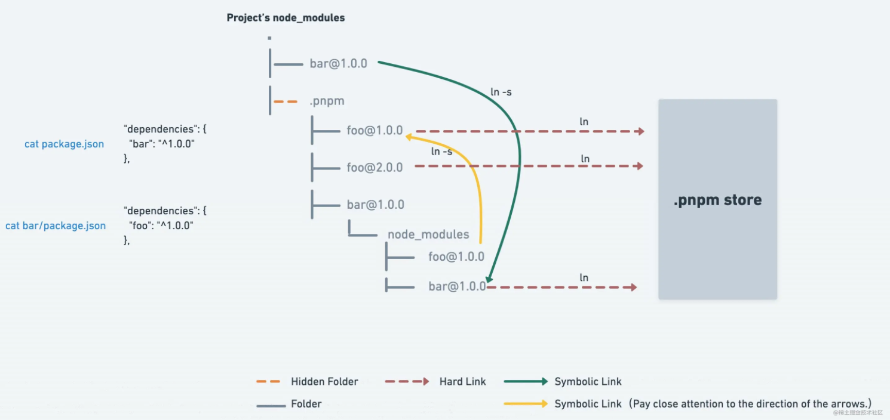

## Svelte
Svelte 和 Vue 的确都是走的模板编译的路线，只不过 Svelte 是直接将模板编译成了原生 DOM，而 Vue3 则仍然将模板编译为虚拟 DOM

### 第一：你觉得 Svelte 有 Virtual DOM 吗？
貌似 Svelte 没有 Virtual DOM 已经是共识了。的确，不较真的说， Svelte 就是没有 Virtual DOM。但是你要是说它绝对没有，那我告诉你这是*不 可 能*的
。Virtual DOM 最核心的 Diff 算法体现在两个列表间的比对，通过 Diff 算法一顿捣鼓，最后捣鼓出了高效更新 DOM 的方案。我可以明确地告诉你，Svelte 在
做两个列表间的更新时，也是需要一顿捣鼓的，它的 keyed each blocks 就相当于 Virtual DOM。你看看它源码里的 update_keyed_each() 函数：

[参考链接](https://github.com/sveltejs/svelte/blob/master/src/runtime/internal/keyed_each.ts#L24)

里面的 oldblocks 和 newblocks 就相当于 Virtual DOM 里的 oldChildren 和 newChildren。这也是没有办法的，你在编译阶段几乎是不可能知道我将会
对列表进行怎样的操作的。因此为了运行时高效，就必须做这一层 Diff

### 第二：编译到原生 DOM 比编译到 Virtual DOM 快？
比传统 Virtual DOM 快是肯定的，但你得知道传统 Virtual DOM 为什么慢？本根原因在于传统 Virtual DOM 当初就不是作为编译产物出现的，因此它无
法区分动态和静态内容。试想一下，如果 Virtual DOM 本身是知道哪些是动态的，哪些是静态的，那它就不慢了呀。Svelte 快就快在编译时就区分了静态和
动态内容，当更新的时候也只需要更新动态内容就可以了。但是谁规定 Virtual DOM 就不能区分动态和静态的内容了？Vue3 的 Virtual DOM 就可以呀

### 第三：Svelte 的更新机制你接受的了？
Svelte 的响应方案是采用一种 Bitmask-based change tracking 的机制配合赋值语句实现的。什么是 Bitmask-based change tracking ？说人话
就是把变量进行编号，然后使用二进制位来存储变量是否为脏。当检测到你脚本中出现赋值语句时，调用 makeDirty 函数将变量标记为脏，然后开启刷新队列/入
队更新操作，执行更新。但这有两个明显的问题：

1. 基于赋值语句意味着阉割的响应能力，例如数组的 push/pop 之类的，delete obj.foo 之类的，总之除了赋值啥都不行
2. 粒度不够细。即使都是赋值，也有问题，例如你有一个对象 obj，Svelte 只会给这个 obj 变量进行编号，并不会给 obj 对象下的属性编号，这意味着你
给 obj.foo 赋值和给 obj.bar 赋值对 Svelte 来说是等价的操作。对于 Svelte 来说，它也不知道变量的值到底变没变。所以你会看到 Svelte 生成
的真实代码中通常包含大量守卫代码

你看，Svelte 在更新的时候，由于它根本不知道是不是真的有值发生变化。所以它除了需要使用位运算来判断你为哪个变量“赋值”了，还要检测值是否真的发生了变化
。换句话说，即使你的模板中没有使用 obj.foo，但是模板中使用了 obj.bar，那么当你给 obj.foo 赋值时仍然会触发更新，Svelte 中通过 beforeUpdate 注
册的钩子函数仍然会执行，即使实际上根本不需要更新任何内容。朋友你要知道，就这个操作在 Vue 中都算 bug 的。我现在有时候都在想，开发者的容忍能力一定是非
常强的。不然怎么会有人能接受 Svelte 这种阉割的响应式方法。当然它这种基于位掩码的变化追踪，思路还是可以的，节省了内存占用。但我认为仍然有办法在内存
和响应能力之间找到一个更完美一点的平衡点，而且我目前也正在思考这方面的事儿。另外生成大量的守卫代码，意味着你的 bundle size 随着页面中动态绑定的
增加而增加。

### 第四：Svelte 是 no runtime ？
我其实不知道官方有没有这样宣传过的，因为说实话我根本没用过 Svelte，平时也不关注，文档也只看了前两页。我对 Svelte 
的理解都来自于它官网上的 Example，所以也不一定全都是正确地。但你要说它是 no runtime，这就很扯了。上面提到的 update_keyed_each 函数是不是运
行时？框架需要避免重复的更新 job 执行，就必须要实现一个 scheduler ，这是不是运行时？Transition 需不需要运行时？抽象一些原生的 DOM 操作是不是
运行时？Svelte 也有声明周期，组件实例的概念，这些都需要抽象最基本的运行时实现。所以怎么就 no runtime 了？实际上你把 Vue3 用于支持 Virtual DOM 
的代码去掉，剩下的代码也不见得比 Svelte 的运行时代码多多少。如果大家都到了拼运行时代码量的程度，那么基本就可以确定：*运行时代码量少，等价于功能
不全*。我在 Twitter 上见到过有人发文章，它的用词是“没有运行时系统”，你看这个就比 no runtime 要聪明的多


## pinia
采用 Pinia 的 5个重要条件：
- Pinia 的 API 设计非常接近 Vuex 5 的提案。（作者是 Vue 核心团队成员）
- 无需像 Vuex 4 自定义复杂的类型来支持 typescript，天生具备完美的类型推断。
- 模块化设计，你引入的每一个 store 在打包时都可以自动拆分他们。
- 无嵌套结构，但你可以在任意的 store 之间交叉组合使用。
- Pinia 与 Vue devtools 挂钩，不会影响 Vue 3 开发体验。

### store
在深入研究核心概念之前，我们需要知道脚手架内置了哪些 Store 和如何自定义创建 Store
``` js
// useUserStore	用户登录与信息管理
// useMenuStore	路由&菜单管理
// useLogStore	日志管理
```
Pinia 已经内置在脚手架中，并且与 vue 已经做好了关联，你可以在任何位置创建一个 store：
``` js
import { defineStore } from 'pinia'

export const useUserStore = defineStore({
  id: 'user',
  state: () =>({}),
  getters: {},
  actions: {}
})
```
这与 Vuex 有很大不同，它是标准的 Javascript 模块导出，这种方式也让开发人员和你的 IDE 更加清楚 store 来自哪里,
Pinia 与 Vuex 的区别
- id 是必要的，它将所使用 store 连接到 devtools。
- 创建方式：new Vuex.Store(...)(vuex3)，createStore(...)(vuex4)。
- 对比于 vuex3 ，state 现在是一个函数返回对象。
- 没有 mutations，不用担心，state 的变化依然记录在 devtools 中

### state
创建好 store 之后，可以在 state 中创建一些属性了
``` js
state: () => ({ name: 'codexu', age: 18 })
```
将 store 中的 state 属性设置为一个函数，该函数返回一个包含不同状态值的对象，这与我们在组件中定义数据的方式非常相似

现在我们想从 store 中获取到 name 的状态，我们只需要使用以下的方式即可：
``` js
<h1>{{userStore.name}}</h1>

const userStore = useUserStore()
return { userStore }
```
注意这里并不需要 userStore.state.name。虽然上面的写法很舒适，但是你一定不要用解构的方式去提取它内部的值，这样
做的话，会失去它的响应式

### Getters
Pinia 中的 getter 与 Vuex 中的 getter 、组件中的计算属性具有相同的功能，传统的函数声明使用 this 代替了 state 的传
参方法，但箭头函数还是要使用函数的第一个参数来获取 state ，因为箭头函数处理 this 的作用范围：
``` js
getters: {
  nameLength() {
    return this.name.length
  },
  nameLength: state => state.name.length,
  nameLength: ()=> this.name.length ❌ 
}
```

### Actions
这里与 Vuex 有极大的不同，Pinia 仅提供了一种方法来定义如何更改状态的规则，放弃 mutations 只依靠 Actions，这是一项重大的改变

- 可以通过组件或其他 action 调用
- 可以从其他 store 的 action 中调用
- 直接在商店实例上调用
- 支持同步或异步
- 有任意数量的参数
- 可以包含有关如何更改状态的逻辑（也就是 vuex 的 mutations 的作用）
- 可以 $patch 方法直接更改状态属性

``` js
actions: {
  async insertPost(data){
    await doAjaxRequest(data);
    this.name = '...';
  }
}
```

## 调试
The Vite repo is a monorepo using pnpm workspaces. The package manager used to install and link dependencies
must be [pnpm](https://pnpm.io/).

To develop and test the core `vite` package:
1. Run `pnpm i` in Vite's root folder
2. Go to `packages/vite` and run `pnpm run dev`. This starts `rollup` in watch mode.
3. 这时候会生成一个dist文件，你的每次改动，都会重新生成

当我们要debuuger的时候，可以使用vscode的launch.josn["Run and debug"](https://code.visualstudio.com/docs/editor/debugging)
我这里使用的是chrome的调试，毕竟习惯了。。。。。。

首先我们进入packages/playground/xxx，选择任意一个，每一个都是一个测试项目，进入之后我们可以看到里面的package.json文件
``` json
"scripts": {
  "dev": "vite",
  "build": "vite build",
  "debug": "node --inspect-brk ../../vite/bin/vite",
  "preview": "vite preview"
}
```
第一种我们可以使用pnpm debug命令来运行debug，此时会产生类似如下提示
``` js
Debugger listening on ws://127.0.0.1:9229/a467b75f-33eb-4e84-a6b3-50f6876c200f
For help, see: https://nodejs.org/en/docs/inspector
Debugger attached.

  vite v2.8.5 dev server running at:

  > Local: http://localhost:3000/
  > Network: use `--host` to expose
```
我们用chrome打开上面ws后面的链接，之后打开开发者模式, 页面上会出现如下图所示
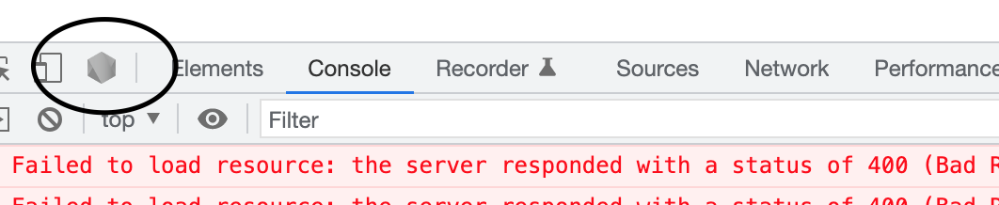
我们点击该图标会新开个调试页面出现，我们点击sources ---> fileSystem ---> Add folder to workspace ---> packages/vite文件加入
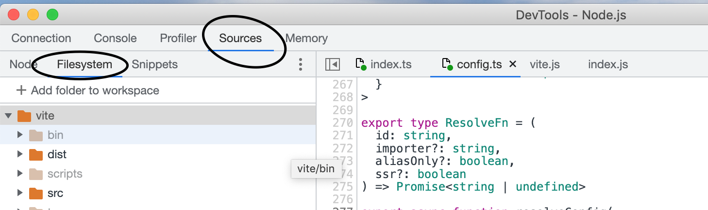
此时页面会停留在入口文件第一行，我们可以在任意地放大debug, 上面的watch会自动生成dist,而你使用的就是生成的dist, 看运行文件
`vite/bin/vite`，里面的逻辑就可以知道，他用的是打包后的dist

注意运行playground里面项目，可能会报错说找不到对应的包，例如进入playground/preload,就找不到插件`@vitejs/plugin-vue`,我们看下package.json可以知道，里面对这个开发依赖的包是workspace的，就是说用的是link到playground/plugin-vue包里面的，可以到该目录下run dev来生成dist文件，那么在playground/preload项目里面就能用到了

注意如果我们运行的是pnpm run dev，记得在vite包下面自己用pnpm link才可以

### chrome 调试快捷键
打上断点之后，需要操作对应图标进行调试，图标如下：
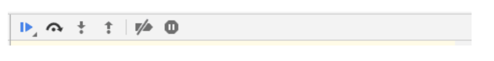
从左到右分别是：
- Pause/Resume script execution：暂停/恢复脚本执行（程序执行到下一断点停止）。
- Step over next function call：执行到下一步的函数调用（执行当前断点所在行，跳到下一行且暂停）。
- Step into next function call：进入当前函数，在第一行暂停。
- Step out of current function：跳出当前执行函数。
- Deactive/Active all breakpoints：关闭/开启所有断点（不会取消）。
- Pause on exceptions：异常情况自动断点设置

#### Pause/Resume script execution（ F8）
1. 在断点暂停后，点击恢复脚本执行，直到下一个断点为止。
2. 长按图标，会出现灰色的播放按钮，鼠标移上去再松开左键，会忽略所有的断点，强制渲染完整的页面。

#### Step over next function call （F10）
当在一行代码中暂停，代码里包含一个与正在调试的问题无关的函数时，可以点击此图标直接解析该函数，而不是进入函数内部逐行执行debug操作,
例如，当你在 debug 以下代码：
``` js
function updateHeader() {

    var day = new Date().getDay();

    var name = getName(); // A

    updateName(name); // D

}

function getName() {

var name = app.first + ' ' + app.last; // B

return name; // C

}
```
假设现在是在 A 处暂停。点击 '跳过下个函数调用' 图标，浏览器会解析被跳过的函数里的所有代码（这里是 B 和 C），然后在 D 处再次暂停

#### Step into next function call （ F11）
当断点找到了要 debug 的确切函数，点击图标进入此函数内部，逐行查看分析里面的变量值和方法
``` js
function updateHeader() {

    var day = new Date().getDay();

    var name = getName(); // A

    updateName(name); // D

};

function getName() {

    var name = app.first + ' ' + app.last; // B

    return name; // C

}
```
此时在 A 处打点暂停了，而 A 处就是与问题相关的函数，点击进入函数里，会在 B 处暂停，再次点击会在 C 处暂停，同时 B 处会显示 'name' 变量的值

#### Step out of current function （Shift + F8）
进入到一个与正在 debug 的问题无关的函数后，可以点击此图标解析函数剩下的代码，跳出函数到下一行
``` js
function updateHeader() {

var day = new Date().getDay();

    var name = getName(); // A

    updateName(name); // D

};

function getName() {

    var name = app.first + ' ' + app.last; // B

    return name; // C

}
```
现在在 B 处暂停，step out 之后，浏览器解析 getName() 函数剩下的代码（C），然后在 D 处再次暂停

在调试函数的过程中，想回到函数的开头重新 debug 的时候，可以在 Call Stack 面板中对应的函数上右键，选择 Restart Frame 而无
需在开头打断点。Call Stack 面板里是断点函数以及所涉及到的其他函数，最顶端的函数是当前的断点函数;这是老版本的，现在新版本没有该选项了，
官方解释是容易造成crash，所以只能重新运行pnpm debug从头开始调试

### vscode调试
当我们下载下来原来之后，进入代码根目录，例如这里以npm为例子,第一种是常规调试配置：

首先点击左侧的debug图标，创建一个launch.json：
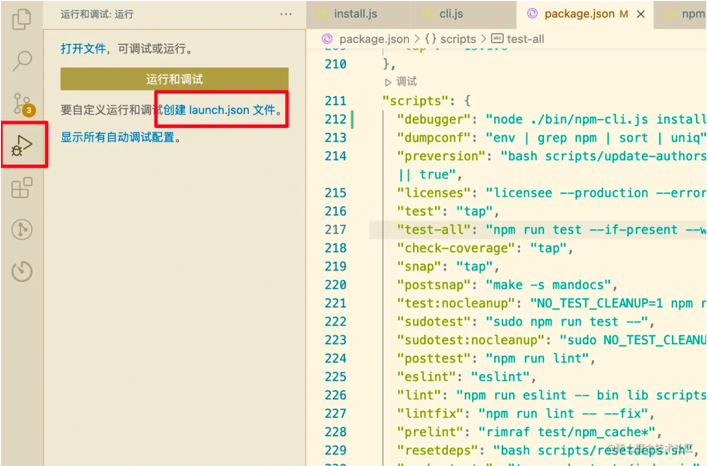
点击后VSCode会让我们选择调试运行的环境，这里我们选择Node.js：
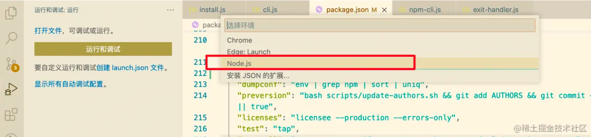
选择后，VSCode会在项目根目录生成.vscode文件夹，其中就有launch.json配置文件
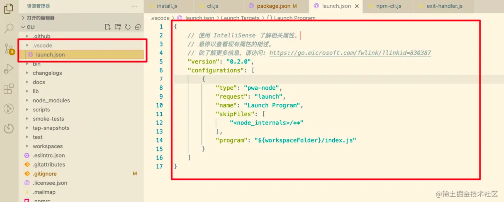
默认生成的配置文件可能不符合我们的需求，因此这里需要手动修改一些配置。在之前的部分我们已经找到了npm install的入口文件，所以这里的命令我
们修改为${workspaceFolder}/bin/npm-cli.js，args修改为install dayjs（install什么都行，只要能够触发命令就行）即可。
stopOnEntry配置为true，可以在进行debug时停留在入口
``` js
{
    // 使用 IntelliSense 了解相关属性。 
    // 悬停以查看现有属性的描述。
    // 欲了解更多信息，请访问: <https://go.microsoft.com/fwlink/?linkid=830387>
    "version": "0.2.0",
    "configurations": [
        {
            "type": "pwa-node",
            "request": "launch",
            "name": "Launch Program",
            "skipFiles": [
                "<node_internals>/**"
            ],
            "program": "${workspaceFolder}/bin/npm-cli.js",
            "args": ["install", "dayjs"],
            "stopOnEntry": true
        }
    ]
}
```
配置完成之后，我们尝试点击运行和调试按钮：
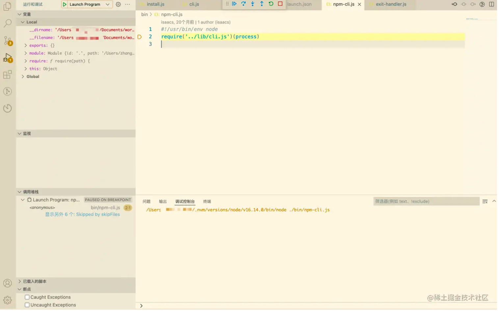
调试程序成功启动了，并且停留在了npm-cli.js文件上。接下来就可以进一步调试了。

除了上面中规中矩的调试配置外，我们还可以走些捷径，因为我们要调试的是一个npm包，所以可以使用npm命令进行调试。在package.json中添加一个
用于debug（名字叫什么都可以）的script：
``` js
"scripts": {
    "debugger": "node ./bin/npm-cli.js install dayjs",
 },
```
这相当于如下的配置：
``` js
{
  "name": "Launch via npm",
  "type": "node",
  "request": "launch",
  "cwd": "${workspaceFolder}",
  "runtimeExecutable": "npm",
  "runtimeArgs": ["run-script", "debugger"]
}
```
之后，在VScode中找到我们的package.json，直接点击调试按钮;在命令选项中选择我们配置好的debugger命令：
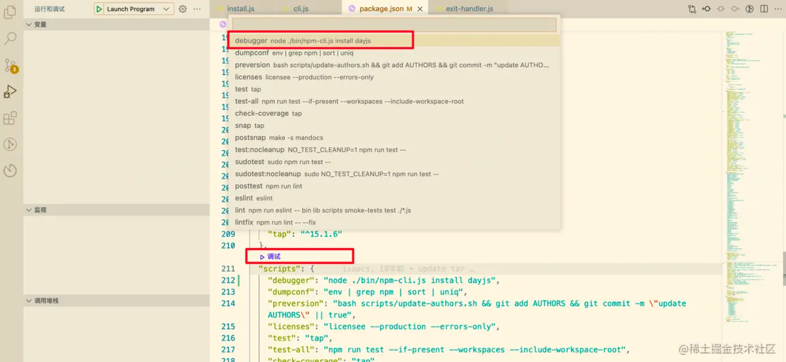


