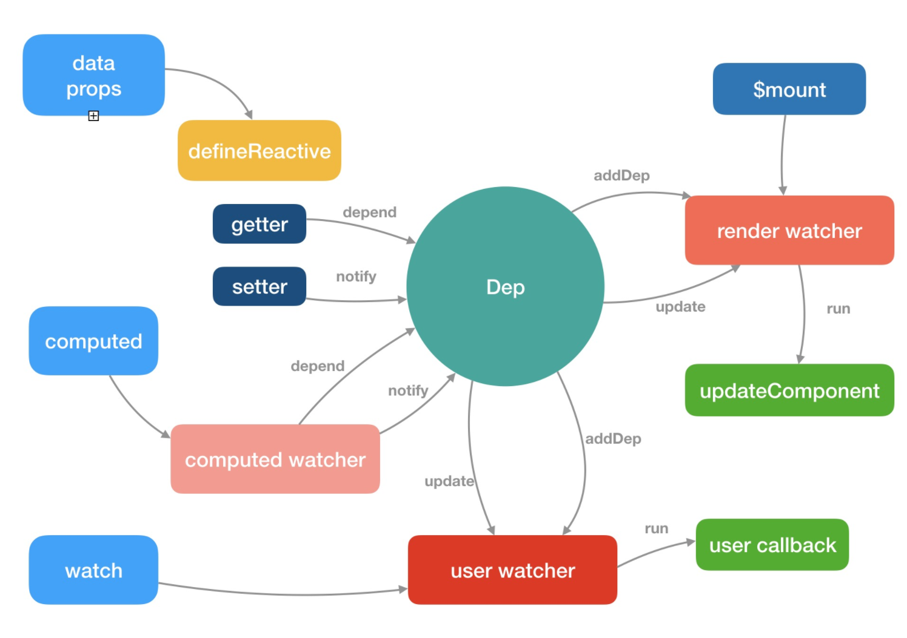

## Watcher
在vue中，共有4种情况会产生Watcher
- Vue实例对象上的watcher,观测根数据，发生变化时重新渲染组件
`updateComponent = () => {  vm._update(vm._render(), hydrating)} vm._watcher = new Watcher(vm, updateComponent, noop)`
- 用户在vue对象内用watch属性创建的watcher
- 用户在vue对象内创建的计算属性，本质上也是watcher
- 用户使用vm.$watch创建的watcher
注意每个组件也会触发$mount方法那么就会创建一个watcher,这render watcher

``` js
export default class Watcher {
  vm: Component;
  expression: string;
  cb: Function;
  id: number;
  deep: boolean;
  user: boolean;
  lazy: boolean;
  sync: boolean;
  dirty: boolean;
  active: boolean;
  deps: Array<Dep>;
  newDeps: Array<Dep>;
  depIds: SimpleSet;
  newDepIds: SimpleSet;
  before: ?Function;
  getter: Function;
  value: any;

  constructor (
    vm: Component,
    expOrFn: string | Function,
    cb: Function,
    options?: ?Object,
    isRenderWatcher?: boolean
  ) {
    this.vm = vm
    if (isRenderWatcher) {
      vm._watcher = this
    }
    vm._watchers.push(this)
    // options
    if (options) {
      this.deep = !!options.deep // 深度监听watch某个属性
      this.user = !!options.user // watch某个属性值的时候使用
      this.lazy = !!options.lazy // computed属性使用
      this.sync = !!options.sync // 同步调用的watcher
      this.before = options.before
    } else {
      this.deep = this.user = this.lazy = this.sync = false
    }

    // 当对应的值发生变化之后的回调函数例如Vue.$watch('a',function(newvalue, oldvalue))
    this.cb = cb
    this.id = ++uid // uid for batching
    this.active = true
    this.dirty = this.lazy // for lazy watchers 例如computed就是不计算值
    // this.deps 和 this.newDeps 表示 Watcher 实例持有的 Dep 实例的数组；
    // 而 this.depIds 和 this.newDepIds 分别代表 this.deps 和 this.newDeps 的 id
    this.deps = []
    this.newDeps = []
    this.depIds = new Set()
    this.newDepIds = new Set()
    this.expression = process.env.NODE_ENV !== 'production'
      ? expOrFn.toString()
      : ''
    // parse expression for getter
    if (typeof expOrFn === 'function') {
      this.getter = expOrFn
    } else {
      // $watch的键a.b.c的时候使用，返回一个能vm上取到该值的函数
      this.getter = parsePath(expOrFn)
      if (!this.getter) {
        this.getter = noop
        process.env.NODE_ENV !== 'production' && warn(
          `Failed watching path: "${expOrFn}" ` +
          'Watcher only accepts simple dot-delimited paths. ' +
          'For full control, use a function instead.',
          vm
        )
      }
    }
    this.value = this.lazy
      ? undefined
      : this.get()
  }
  get () {
    //设置Dep.target值，用以依赖收集
    pushTarget(this)
    let value
    const vm = this.vm
    try {
      // ƒ () {
      //   vm._update(vm._render(), hydrating);
      // }
      value = this.getter.call(vm, vm) // 触发跟新
    } catch (e) {
      if (this.user) {
        handleError(e, vm, `getter for watcher "${this.expression}"`)
      } else {
        throw e
      }
    } finally {
      // 深度监听
      if (this.deep) {
        traverse(value)
      }
      popTarget()
      this.cleanupDeps()
    }
    return value
  }
  // 当我们进行依赖收集的时候就是触发该方法
  addDep (dep: Dep) {
    const id = dep.id
    // 监测当前这个watcher时候已经被某个dep添加过了
    if (!this.newDepIds.has(id)) {
      // 保存哪些Dep持有了该watcher
      this.newDepIds.add(id)
      this.newDeps.push(dep)
      if (!this.depIds.has(id)) {// 如果老的dep数组中没有则添加该watcher
        dep.addSub(this)
      }
    }
  }
  // 清除deps和dep.subs 数组中 Wathcer 的订阅
  cleanupDeps () {
    let i = this.deps.length
    while (i--) {
      const dep = this.deps[i]
      // 新依赖收集结束之后，如果以前的dep在新来的中不需要了，那么就去除其watcher
      if (!this.newDepIds.has(dep.id)) {
        dep.removeSub(this)
      }
    }
    //把 newDepIds 和 depIds 交换，newDeps 和 deps 交换，并把 newDepIds 和 newDeps 清空
    let tmp = this.depIds
    this.depIds = this.newDepIds
    this.newDepIds = tmp
    this.newDepIds.clear()
    tmp = this.deps
    this.deps = this.newDeps
    this.newDeps = tmp
    this.newDeps.length = 0
  }
  update () {
    if (this.lazy) {
      this.dirty = true
    } else if (this.sync) {// 同步则直接运行
      this.run()
    } else {
      // 下一次任务队列触发
      queueWatcher(this)
    }
  }
  // 数据更新的时候最终调此方法 
  run () {
    if (this.active) {
      // 这个get方法会触发依赖收集
      const value = this.get()
      if (
        value !== this.value ||
        isObject(value) ||
        this.deep
      ) {
        const oldValue = this.value
        this.value = value
        if (this.user) {
          try {
            this.cb.call(this.vm, value, oldValue)
          } catch (e) {
            handleError(e, this.vm, `callback for watcher "${this.expression}"`)
          }
        } else {
          this.cb.call(this.vm, value, oldValue)
        }
      }
    }
  }
  // computed的时候使用
  evaluate () {
    this.value = this.get()
    this.dirty = false
  }
  // 计算属性收集所有依赖
  depend () {
    let i = this.deps.length
    while (i--) {
      this.deps[i].depend()
    }
  }
  // watch某个属性时候返回值用来清楚某个监听
  teardown () {
    if (this.active) {
      if (!this.vm._isBeingDestroyed) {
        remove(this.vm._watchers, this)
      }
      let i = this.deps.length
      while (i--) {
        this.deps[i].removeSub(this)
      }
      this.active = false
    }
  }
}
```
那么为什么需要做 deps 订阅的移除呢，在添加 deps 的订阅过程，已经能通过 id 去重避免重复订阅了?

考虑到一种场景，我们的模板会根据 v-if 去渲染不同子模板 a 和 b，当我们满足某种条件的时候渲染 a 的时候，会访问到 a 中
的数据，这时候我们对 a 使用的数据添加了 getter，做了依赖收集，那么当我们去修改 a 的数据的时候，理应通知到这些订阅者。
那么如果我们一旦改变了条件渲染了 b 模板，又会对 b 使用的数据添加了 getter，如果我们没有依赖移除的过程，那么这时候我
去修改 a 模板的数据，会通知 a 数据的订阅的回调，这显然是有浪费的。

因此 Vue 设计了在每次添加完新的订阅，会移除掉旧的订阅，这样就保证了在我们刚才的场景中，如果渲染 b 模板的时候去修改 a模
板的数据，a 数据订阅回调已经被移除了，所以不会有任何浪费，真的是非常赞叹 Vue 对一些细节上的处理

### computed属性的watcher
计算属性的初始化是发生在 Vue 实例初始化阶段的 initState 函数中，执行了`if (opts.computed) initComputed(vm, opts.computed)，initComputed`
的定义在`src/core/instance/state.js`中
``` js
const computedWatcherOptions = { lazy: true }
function initComputed (vm: Component, computed: Object) {
  const watchers = vm._computedWatchers = Object.create(null)
  const isSSR = isServerRendering()
  for (const key in computed) {
    const userDef = computed[key]
    // 是函数则直接使用函数
    const getter = typeof userDef === 'function' ? userDef : userDef.get
    if (process.env.NODE_ENV !== 'production' && getter == null) {
      warn(
        `Getter is missing for computed property "${key}".`,
        vm
      )
    }
    if (!isSSR) {
      // create internal watcher for the computed property.注意此时watcher不计算值
      // computed watcher 会并不会立刻求值，同时持有一个 dep 实例
      watchers[key] = new Watcher(
        vm,
        getter || noop,
        noop,
        computedWatcherOptions
      )
    }
    //如果key 不是 vm 的属性，则调用 defineComputed(vm, key, userDef)，否则判断计算属性对于的 key 是否已经
    // 被 data 或者 prop 所占用，如果是的话则在开发环境报相应的警告
    if (!(key in vm)) {
      defineComputed(vm, key, userDef)
    } else if (process.env.NODE_ENV !== 'production') {
      if (key in vm.$data) {
        warn(`The computed property "${key}" is already defined in data.`, vm)
      } else if (vm.$options.props && key in vm.$options.props) {
        warn(`The computed property "${key}" is already defined as a prop.`, vm)
      }
    }
  }
}
```
那么接下来需要重点关注 defineComputed 的实现
``` js
//返回一个函数 computedGetter，它就是计算属性对应的 getter
function createComputedGetter (key) {
  return function computedGetter () {
    const watcher = this._computedWatchers && this._computedWatchers[key]
    if (watcher) {
      if (watcher.dirty) {
        // 当我们计算值的时候会触发相应字段的依赖更新，此时该依赖dep会收集到当前的computed watcher
        // 此时computed watcher中的deps字段中也保存了他订阅了哪些依赖
        watcher.evaluate()
      }
      if (Dep.target) {
        // 就是触发该watcher中deps字段中所有依赖再次收集一次
        watcher.depend()
      }
      return watcher.value
    }
  }
}
export function defineComputed (
  target: any,
  key: string,
  userDef: Object | Function
) {
  const shouldCache = !isServerRendering()
  if (typeof userDef === 'function') {
    sharedPropertyDefinition.get = shouldCache
      ? createComputedGetter(key)
      : createGetterInvoker(userDef)
    sharedPropertyDefinition.set = noop
  } else {
    sharedPropertyDefinition.get = userDef.get
      ? shouldCache && userDef.cache !== false
        ? createComputedGetter(key)
        : createGetterInvoker(userDef.get)
      : noop
    sharedPropertyDefinition.set = userDef.set || noop
  }
  if (process.env.NODE_ENV !== 'production' &&
      sharedPropertyDefinition.set === noop) {
    sharedPropertyDefinition.set = function () {
      warn(
        `Computed property "${key}" was assigned to but it has no setter.`,
        this
      )
    }
  }
  Object.defineProperty(target, key, sharedPropertyDefinition)
}
```

### 侦听属性watch的初始化
发生在 Vue 的实例初始化阶段的 initState 函数中，在 computed 初始化之后，执行了
``` js
if (opts.watch && opts.watch !== nativeWatch) {
  initWatch(vm, opts.watch)
}
//来看一下 initWatch 的实现，它的定义在 src/core/instance/state.js 中
function initWatch (vm: Component, watch: Object) {
  for (const key in watch) {
    const handler = watch[key]
    // Vue 是支持 watch 的同一个 key 对应多个 handler
    if (Array.isArray(handler)) {
      for (let i = 0; i < handler.length; i++) {
        createWatcher(vm, key, handler[i])
      }
    } else {
      createWatcher(vm, key, handler)
    }
  }
}
// 可以看下watch的所有配置，这里就是做整合处理
// watch: {
//   a: function (val, oldVal) {
//     console.log('new: %s, old: %s', val, oldVal)
//   },
//   // 方法名
//   b: 'someMethod',
//   // 该回调会在任何被侦听的对象的 property 改变时被调用，不论其被嵌套多深
//   c: {
//     handler: function (val, oldVal) { /* ... */ },
//     deep: true
//   },
//   // 该回调将会在侦听开始之后被立即调用
//   d: {
//     handler: 'someMethod',
//     immediate: true
//   },
//   // 你可以传入回调数组，它们会被逐一调用
//   e: [
//     'handle1',
//     function handle2 (val, oldVal) { /* ... */ },
//     {
//       handler: function handle3 (val, oldVal) { /* ... */ },
//       /* ... */
//     }
//   ],
//   // watch vm.e.f's value: {g: 5}
//   'e.f': function (val, oldVal) { /* ... */ }
// }
function createWatcher (
  vm: Component,
  expOrFn: string | Function,
  handler: any,
  options?: Object
) {
  if (isPlainObject(handler)) {
    options = handler
    handler = handler.handler
  }
  if (typeof handler === 'string') {
    handler = vm[handler]
  }
  return vm.$watch(expOrFn, handler, options)
}
```
这里的逻辑也很简单，首先对 hanlder 的类型做判断，拿到它最终的回调函数，最后调用`vm.$watch(keyOrFn, handler, options)`
函数，$watch 是 Vue 原型上的方法，它是在执行 stateMixin 的时候定义的
``` js
Vue.prototype.$watch = function (
  expOrFn: string | Function,
  cb: any,
  options?: Object
): Function {
  const vm: Component = this
  if (isPlainObject(cb)) {
    return createWatcher(vm, expOrFn, cb, options)
  }
  options = options || {}
  options.user = true
  const watcher = new Watcher(vm, expOrFn, cb, options)
  if (options.immediate) {//如果我们设置了 immediate 为 true，则直接会执行回调函数 cb
    try {
      cb.call(vm, watcher.value)
    } catch (error) {
      handleError(error, vm, `callback for immediate watcher "${watcher.expression}"`)
    }
  }
  //vm.$watch 返回一个取消观察函数，用来停止触发回调
  return function unwatchFn () {
    watcher.teardown()
  }
}
```
通常，如果我们想对一下对象做深度观测的时候，需要设置这个属性为 true，考虑到这种情况,这个时候是不会 log 任何数据的，因为
我们是 watch 了 a 对象，只触发了 a 的 getter，并没有触发 a.b 的 getter，所以并没有订阅它的变化，导致我们对`vm.a.b = 2`
赋值的时候，虽然触发了 setter，但没有可通知的对象，所以也并不会触发 watch 的回调函数了
``` js
var vm = new Vue({
  data() {
    a: {
      b: 1
    }
  },
  watch: {
    a: {
      handler(newVal) {
        console.log(newVal)
      }
    }
  }
})
vm.a.b = 2
//而我们只需要对代码做稍稍修改，就可以观测到这个变化了
watch: {
  a: {
    deep: true,
    handler(newVal) {
      console.log(newVal)
    }
  }
}
```
这样就创建了一个 deep watcher 了，在 watcher 执行 get 求值的过程中有一段逻辑
``` js
get() {
  let value = this.getter.call(vm, vm)
  // ...
  if (this.deep) {
    traverse(value)
  }
}
```
在对 watch 的表达式或者函数求值后，会调用 traverse 函数，它的定义在`src/core/observer/traverse.js`中
``` js
export function traverse (val: any) {
  _traverse(val, seenObjects)
  seenObjects.clear()
}
//实际上就是对一个对象做深层递归遍历，因为遍历过程中就是对一个子对象的访问，会触发它们的 getter 过程，
// 这样就可以收集到依赖，也就是订阅它们变化的 watcher
function _traverse (val: any, seen: SimpleSet) {
  let i, keys
  const isA = Array.isArray(val)
  if ((!isA && !isObject(val)) || Object.isFrozen(val) || val instanceof VNode) {
    return
  }
  if (val.__ob__) {
    const depId = val.__ob__.dep.id
    if (seen.has(depId)) {
      return
    }
    //把子响应式对象通过它们的 dep id 记录到 seenObjects，避免以后重复访问
    seen.add(depId)
  }
  if (isA) {
    i = val.length
    while (i--) _traverse(val[i], seen)
  } else {
    keys = Object.keys(val)
    i = keys.length
    while (i--) _traverse(val[keys[i]], seen)
  }
}
```

## 依赖收集
通过之前分析了解Vue会把普通对象变成响应式对象，响应式对象 getter 相关的逻辑就是做依赖收集，先回顾一下getter部分逻辑
``` js
export function defineReactive (
  obj: Object,
  key: string,
  val: any,
  customSetter?: ?Function,
  shallow?: boolean
) {
  //每一个响应式的值都会，实例化一个 Dep 的实例，也就是会有很多个实例
  const dep = new Dep()
  const property = Object.getOwnPropertyDescriptor(obj, key)
  if (property && property.configurable === false) {
    return
  }
  const getter = property && property.get
  const setter = property && property.set
  if ((!getter || setter) && arguments.length === 2) {
    val = obj[key]
  }

  let childOb = !shallow && observe(val)
  Object.defineProperty(obj, key, {
    enumerable: true,
    configurable: true,
    get: function reactiveGetter () {
      const value = getter ? getter.call(obj) : val
      if (Dep.target) {
        //每一次创建vnode要取值的时候通过对应的dep.depend 做依赖收集
        dep.depend()
        if (childOb) {
          childOb.dep.depend()
          if (Array.isArray(value)) {
            dependArray(value)
          }
        }
      }
      return value
    },
    // ...
  })
}
```
Dep 是整个 getter 依赖收集的核心，它的定义在`src/core/observer/dep.js`中
``` js
import type Watcher from './watcher'
import { remove } from '../util/index'
let uid = 0
export default class Dep {
  static target: ?Watcher;
  id: number;
  subs: Array<Watcher>;
  constructor () {
    this.id = uid++
    this.subs = []
  }
  addSub (sub: Watcher) {
    this.subs.push(sub)
  }
  removeSub (sub: Watcher) {
    remove(this.subs, sub)
  }
  depend () {
    if (Dep.target) {
      Dep.target.addDep(this)
    }
  }
  notify () {
    const subs = this.subs.slice()
    for (let i = 0, l = subs.length; i < l; i++) {
      subs[i].update()
    }
  }
}
// Dep 是一个 Class，它定义了一些属性和方法，这里需要特别注意的是它有一个静态属性 target，这是一个全局唯一 Watcher，这
// 是一个非常巧妙的设计，因为在同一时间只能有一个全局的 Watcher 被计算，另外它的自身属性 subs 也是 Watcher 的数组
Dep.target = null
const targetStack = []
export function pushTarget (_target: ?Watcher) {
  if (Dep.target) targetStack.push(Dep.target)
  Dep.target = _target
}
export function popTarget () {
  Dep.target = targetStack.pop()
}
```

## 派发更新
通过上一节分析我们了解了响应式数据依赖收集过程，收集的目的就是为了当我们修改数据的时候，可以对相关的依赖派发更新，那么
这一节我们来详细分析这个过程。我们先来回顾一下 setter 部分的逻辑：
``` js
export function defineReactive (
  obj: Object,
  key: string,
  val: any,
  customSetter?: ?Function,
  shallow?: boolean
) {
  const dep = new Dep()
  const property = Object.getOwnPropertyDescriptor(obj, key)
  if (property && property.configurable === false) {
    return
  }
  const getter = property && property.get
  const setter = property && property.set
  if ((!getter || setter) && arguments.length === 2) {
    val = obj[key]
  }
  let childOb = !shallow && observe(val)
  Object.defineProperty(obj, key, {
    enumerable: true,
    configurable: true,
    // ...
    set: function reactiveSetter (newVal) {
      const value = getter ? getter.call(obj) : val
      if (newVal === value || (newVal !== newVal && value !== value)) {
        return
      }
      if (process.env.NODE_ENV !== 'production' && customSetter) {
        customSetter()
      }
      if (setter) {
        setter.call(obj, newVal)
      } else {
        val = newVal
      }
      //如果 shallow 为 false 的情况，会对新设置的值变成一个响应式对象
      childOb = !shallow && observe(newVal)
      //通知所有的订阅者
      dep.notify()
    }
  })
}
```
当我们在组件中对响应的数据做了修改，就会触发 setter 的逻辑，最后调用 dep.notify() 方法,它是 Dep 的一个实例方法，定
义在`src/core/observer/dep.js`中
``` js
class Dep {
  // ...
  notify () {
  // stabilize the subscriber list first
    const subs = this.subs.slice()
    for (let i = 0, l = subs.length; i < l; i++) {
      subs[i].update()
    }
  }
}
```
这里的逻辑非常简单，遍历所有的subs，也就是 Watcher 的实例数组，然后调用每一个 watcher 的 update 方法，它的定义
在`src/core/observer/watcher.js`中
``` js
class Watcher {
  // ...
  update () {
    /* istanbul ignore else */
    if (this.lazy) {
      this.dirty = true
    } else if (this.sync) {
      this.run()
    } else {
      queueWatcher(this)
    }
  }
}  
```
这里对于 Watcher 的不同状态，会执行不同的逻辑，computed 和 sync 等状态的分析我会之后抽一小节详细介绍，在一般组件数
据更新的场景，会走到最后一个 queueWatcher(this) 的逻辑，queueWatcher 的定义在`src/core/observer/scheduler.js`中
``` js
const queue: Array<Watcher> = []
let has: { [key: number]: ?true } = {}
let waiting = false
let flushing = false
export function queueWatcher (watcher: Watcher) {
  const id = watcher.id
  //用 has 对象保证同一个 Watcher 只添加一次
  if (has[id] == null) {
    has[id] = true
    if (!flushing) {
      queue.push(watcher)
    } else {
      // if already flushing, splice the watcher based on its id
      // if already past its id, it will be run next immediately.
      let i = queue.length - 1
      while (i > index && queue[i].id > watcher.id) {
        i--
      }
      queue.splice(i + 1, 0, watcher)
    }
    //  nextTick 的实现我之后会抽一小节专门去讲，目前就可以理解它是在下一个 tick，也就是异步的去执行 flushSchedulerQueue
    if (!waiting) {
      waiting = true
      nextTick(flushSchedulerQueue)
    }
  }
}
```
接下来我们来看 flushSchedulerQueue 的实现，它的定义在`src/core/observer/scheduler.js`中，首先我们得知道他有如下规律
- 按解析渲染的先后顺序执行，即Watcher小的先执行。Watcher里面的id是自增的，先创建的id比后创建的id小
- 组件是允许嵌套的，而且解析必然是先解析了父组件再到子组件。所以父组件的id比子组件小
- 用户创建的Watcher会比render时候创建的先解析。所以用户创建的Watcher的id比render时候创建的小
- 删除Watcher，如果一个组件的Watcher在队列中，而他的父组件被删除了，这个时候也要删掉这个Watcher
- 队列执行过程中，存一个对象circular，里面有每个watcher的执行次数，如果哪个watcher执行超过MAX_UPDATE_COUNT定义的次数就认为是死循环，不再执行，默认是100次
``` js
let flushing = false
let index = 0
function flushSchedulerQueue () {
  flushing = true
  let watcher, id
  //对队列做了从小到大的排序，这么做主要有以下要确保以下几点：
  //组件的更新由父到子；因为父组件的创建过程是先于子的，所以 watcher 的创建也是先父后子，执行顺序也应该保持先父后子
  //用户的自定义 watcher 要优先于渲染 watcher 执行；因为用户自定义 watcher 是在渲染 watcher 之前创建的
  //果一个组件在父组件的 watcher 执行期间被销毁，那么它对应的 watcher 执行都可以被跳过，所以父组件的 watcher 应该先执行
  queue.sort((a, b) => a.id - b.id)
  //遍历的时候每次都会对 queue.length 求值，因为在 watcher.run() 的时候，很可能用户会再次添加新的 watcher，这样会再次执行到queueWatcher
  // export function queueWatcher (watcher: Watcher) {
  //   const id = watcher.id
  //   if (has[id] == null) {
  //     has[id] = true
  //     if (!flushing) {
  //       queue.push(watcher)
  //     } else {
  //       可以看到，这时候 flushing 为 true，就会执行到 else 的逻辑，然后就会从后往前找，找到第一个待插入watcher
  //       的 id 比当前队列中 watcher 的 id 大的位置。把 watcher 按照 id的插入到队列中，因此 queue 的长度发生了变化
  //       let i = queue.length - 1
  //       while (i > index && queue[i].id > watcher.id) {
  //         i--
  //       }
  //       queue.splice(i + 1, 0, watcher)
  //     }
  //   }
  // }
  for (index = 0; index < queue.length; index++) {
    watcher = queue[index]
    if (watcher.before) {
      watcher.before()
    }
    id = watcher.id
    has[id] = null
    watcher.run()
    // in dev build, check and stop circular updates.
    if (process.env.NODE_ENV !== 'production' && has[id] != null) {
      circular[id] = (circular[id] || 0) + 1
      if (circular[id] > MAX_UPDATE_COUNT) {
        warn(
          'You may have an infinite update loop ' + (
            watcher.user
              ? `in watcher with expression "${watcher.expression}"`
              : `in a component render function.`
          ),
          watcher.vm
        )
        break
      }
    }
  }
  const activatedQueue = activatedChildren.slice()
  const updatedQueue = queue.slice()
  // 状态恢复,就是全部恢复初始值,把 watcher 队列清空
  // index = queue.length = activatedChildren.length = 0
  // has = {}
  // if (process.env.NODE_ENV !== 'production') {
  //   circular = {}
  // }
  // waiting = flushing = false
  resetSchedulerState()
  // call component updated and activated hooks
  callActivatedHooks(activatedQueue)
  callUpdatedHooks(updatedQueue)
  if (devtools && config.devtools) {
    devtools.emit('flush')
  }
}
```
接下来我们继续分析 watcher.run() 的逻辑，它的定义在`src/core/observer/watcher.js`中
``` js
class Watcher {
  run () {
    if (this.active) {
      this.getAndInvoke(this.cb)
    }
  }
  getAndInvoke (cb: Function) {
    //那么对于渲染 watcher 而言，它在执行 this.get() 方法求值的时候，会执行 getter 方法
    // updateComponent = () => {
    //   vm._update(vm._render(), hydrating)
    // }
    //接着就会重新执行 patch 的过程，但它和首次渲染有所不同，之后我们会花一小节去详细介绍
    const value = this.get()
    if (
      value !== this.value ||
      isObject(value) ||
      this.deep
    ) {
      // set new value
      const oldValue = this.value
      this.value = value
      this.dirty = false
      if (this.user) {
        try {
          // Vue.$watch('messa': function(newvalue, oldvlaue){})
          cb.call(this.vm, value, oldValue)
        } catch (e) {
          handleError(e, this.vm, `callback for watcher "${this.expression}"`)
        }
      } else {
        cb.call(this.vm, value, oldValue)
      }
    }
  }
}
```
run 函数实际上就是执行 this.getAndInvoke 方法，并传入 watcher 的回调函数。getAndInvoke 函数逻辑也很简单，先通
过 this.get() 得到它当前的值，然后做判断，如果满足新旧值不等、新值是对象类型、deep 模式任何一个条件，则执行 watcher
的回调，注意回调函数执行的时候会把第一个和第二个参数传入新值 value 和旧值 oldValue，这就是当我们添加自定义 watcher
的时候能在回调函数的参数中拿到新旧值的原因

### nextTick
主要就是创建一个微任务，代码在`src/core/util/next-tick.js`中
``` js
import { noop } from 'shared/util'
import { handleError } from './error'
import { isIE, isIOS, isNative } from './env'
export let isUsingMicroTask = false
const callbacks = []
let pending = false
function flushCallbacks () {
  pending = false
  const copies = callbacks.slice(0)
  callbacks.length = 0
  for (let i = 0; i < copies.length; i++) {
    copies[i]()
  }
}
let timerFunc
if (typeof Promise !== 'undefined' && isNative(Promise)) {
  // 优先使用promise
  const p = Promise.resolve()
  timerFunc = () => {
    p.then(flushCallbacks)
    if (isIOS) setTimeout(noop)
  }
  isUsingMicroTask = true
} else if (!isIE && typeof MutationObserver !== 'undefined' && (
  isNative(MutationObserver) ||
  // PhantomJS and iOS 7.x
  MutationObserver.toString() === '[object MutationObserverConstructor]'
)) {
  // 检查dom变化来创建微任务
  let counter = 1
  const observer = new MutationObserver(flushCallbacks)
  const textNode = document.createTextNode(String(counter))
  observer.observe(textNode, {
    characterData: true
  })
  timerFunc = () => {
    counter = (counter + 1) % 2
    textNode.data = String(counter)
  }
  isUsingMicroTask = true
} else if (typeof setImmediate !== 'undefined' && isNative(setImmediate)) {
  // 检测是否支持原生 setImmediate，这是一个高版本 IE 和 Edge 才支持的特性
  timerFunc = () => {
    setImmediate(flushCallbacks)
  }
} else {
  // Fallback to setTimeout.
  timerFunc = () => {
    setTimeout(flushCallbacks, 0)
  }
}

export function nextTick (cb?: Function, ctx?: Object) {
  let _resolve
  callbacks.push(() => {
    if (cb) {
      try {
        cb.call(ctx)
      } catch (e) {
        handleError(e, ctx, 'nextTick')
      }
    } else if (_resolve) {
      _resolve(ctx)
    }
  })
  //这里不是直接在 nextTick 中执行回调函数的原因是保证在同一个 tick 内多次执行 nextTick，不会开启多个异步任务，而
  // 把这些异步任务都压成一个同步任务，
  if (!pending) {
    pending = true
    timerFunc()
  }
  //这是当 nextTick 不传 cb 参数的时候，提供一个 Promise 化的调用，比如：
  // Vue.nextTick().then(() => {})
  if (!cb && typeof Promise !== 'undefined') {
    return new Promise(resolve => {
      _resolve = resolve
    })
  }
}
```

## Vue.set和vm.$set
有时候我们需要动态给数据加上新的属性就需要使用该方法，注意不能给跟data属性使用该方法会报错

### 对象添加属性
对于使用 Object.defineProperty 实现响应式的对象，当我们去给这个对象添加一个新的属性的时候，是不能够触发它的 setter 的，比如
``` js
var vm = new Vue({
  data:{
    a:1,
    msg: {
      c: 5,
    }
  }
})
// vm.b 是非响应的
vm.b = 2
vm.msg.b = 6;
// 全局 API Vue.set 方法，它在 src/core/global-api/index.js 中初始化
Vue.set = set
```
这个 set 方法的定义在`src/core/observer/index.js`中
``` js
export function set (target: Array<any> | Object, key: any, val: any): any {
  if (Array.isArray(target) && isValidArrayIndex(key)) {
    target.length = Math.max(target.length, key)
    target.splice(key, 1, val)
    return val
  }
  if (key in target && !(key in Object.prototype)) {
    target[key] = val
    return val
  }
  // 我们要设置的数据必须是Observer过的,以前代码初始化可知
  // export class Observer {
  //   value: any;
  //   dep: Dep;
  //   vmCount: number;
  //   constructor (value: any) {
  //     this.value = value
  //     this.dep = new Dep()
  //     this.vmCount = 0
  //     def(value, '__ob__', this)
  //   }
  // }
  const ob = target.__ob__
  //当前的target对象不是响应式对象，那么直接赋值返回即可
  if (!ob) {
    target[key] = val
    return val
  }
  defineReactive(ob.value, key, val)
  // msg {
  //  a: 4
  // }
  // 例如这种的话，当你设置this.msg的时候会触发其下所有的依赖收集
  // let childOb = !shallow && observe(val) // 此时childOb有值
  // Object.defineProperty(obj, key, {
  //   enumerable: true,
  //   configurable: true,
  //   get: function reactiveGetter () {
  //     const value = getter ? getter.call(obj) : val
  //     if (Dep.target) {
  //       // 触发依赖收集
  //       dep.depend()
  //       if (childOb) {
  //         // 触发子dep的依赖收集
  //         childOb.dep.depend()
  //         if (Array.isArray(value)) {
  //           dependArray(value)
  //         }
  //       }
  //     }
  //     return value
  //   },
  // 他触发的是整个对象的所有依赖更新
  ob.dep.notify()
  return val
}
```

### 数组
接着说一下数组的情况，Vue 也是不能检测到以下变动的数组：
- 当你利用索引直接设置一个项时，例如：vm.items[indexOfItem] = newValue
- 当你修改数组的长度时，例如：vm.items.length = newLength

对于第一种情况，可以使用`Vue.set(example1.items, indexOfItem, newValue)`而对于第二种情况，可以使用
`vm.items.splice(newLength)`我们刚才也分析到，对于 Vue.set 的实现，当 target 是数组的时候，也是通过
`target.splice(key, 1, val)`来添加的，那么这里的 splice 到底有什么黑魔法，能让添加的对象变成响应式的呢
``` js
export function set (target: Array<any> | Object, key: any, val: any): any {
  if (Array.isArray(target) && isValidArrayIndex(key)) {
    target.length = Math.max(target.length, key)
    target.splice(key, 1, val)
    return val
  }
}
```
之前我们也分析过，在通过 observe 方法去观察对象的时候会实例化Observer，在它的构造函数中是专门对数组做了处理，它的定
义在`src/core/observer/index.js`中
``` js
export class Observer {
  constructor (value: any) {
    this.value = value
    this.dep = new Dep()
    this.vmCount = 0
    def(value, '__ob__', this)
    if (Array.isArray(value)) {
      //hasProto 实际上就是判断对象中是否存在 __proto__
      const augment = hasProto
        ? protoAugment
        : copyAugment
      augment(value, arrayMethods, arrayKeys)
      this.observeArray(value)
    } else {
      // ...
    }
  }
}
//对于大部分现代浏览器都会走到 protoAugment
function protoAugment (target, src: Object, keys: any) {
  target.__proto__ = src
}
//遍历 keys，通过 def，也就是 Object.defineProperty 去定义它自身的属性值
function copyAugment (target: Object, src: Object, keys: Array<string>) {
  for (let i = 0, l = keys.length; i < l; i++) {
    const key = keys[i]
    def(target, key, src[key])
  }
}
```
protoAugment实际上就把 value 的原型指向了arrayMethods，arrayMethods 的定义在`src/core/observer/array.js`中
``` js
import { def } from '../util/index'
const arrayProto = Array.prototype
export const arrayMethods = Object.create(arrayProto)
const methodsToPatch = [
  'push',
  'pop',
  'shift',
  'unshift',
  'splice',
  'sort',
  'reverse'
]
methodsToPatch.forEach(function (method) {
  // cache original method
  const original = arrayProto[method]
  def(arrayMethods, method, function mutator (...args) {
    const result = original.apply(this, args)
    const ob = this.__ob__
    let inserted
    switch (method) {
      case 'push':
      case 'unshift':
        inserted = args
        break
      case 'splice':
        inserted = args.slice(2)
        break
    }
    if (inserted) ob.observeArray(inserted)
    // notify change
    ob.dep.notify()
    return result
  })
})
```
可以看到，arrayMethods 首先继承了 Array，然后对数组中所有能改变数组自身的方法，如 push、pop 等这些方法进行重写。重
写后的方法会先执行它们本身原有的逻辑，并对能增加数组长度的 3 个方法 push、unshift、splice 方法做了判断，获取到插入
的值，然后把新添加的值变成一个响应式对象，并且再调用 ob.dep.notify() 手动触发依赖通知，这就很好地解释了之前的示例中
调用`vm.items.splice(newLength)`方法可以检测到变化

## dom diff
由前面的分析我们可以知道，组件的跟新调用了vm._update方法，这个方法定义在`src/core/instance/lifecycle.js`
``` js
Vue.prototype._update = function (vnode: VNode, hydrating?: boolean) {
  const vm: Component = this
  // ...
  const prevVnode = vm._vnode
  if (!prevVnode) {
     // initial render
    vm.$el = vm.__patch__(vm.$el, vnode, hydrating, false /* removeOnly */)
  } else {
    // updates
    vm.$el = vm.__patch__(prevVnode, vnode)
  }
  // ...
}
```
组件更新的过程，会执行`vm.$el = vm.__patch__(prevVnode, vnode)`它仍然会调用patch函数`src/core/vdom/patch.js`
``` js
return function patch (oldVnode, vnode, hydrating, removeOnly) {
  if (isUndef(vnode)) {
    if (isDef(oldVnode)) invokeDestroyHook(oldVnode)
    return
  }
  let isInitialPatch = false
  const insertedVnodeQueue = []
  if (isUndef(oldVnode)) {
    // empty mount (likely as component), create new root element
    isInitialPatch = true
    createElm(vnode, insertedVnodeQueue)
  } else {
    //更新的时候oldVnode, vnode都是有值的且都是vnode(没有nodeType字段), 如果是初始渲染则oldVnode为dom节点
    const isRealElement = isDef(oldVnode.nodeType)
    //sameVnode 的逻辑非常简单，如果两个 vnode 的 key 不相等，则是不同的；否则继续判断对于同步组件，则判断
    //isComment、data、input 类型等是否相同，对于异步组件，则判断 asyncFactory 是否相同
    if (!isRealElement && sameVnode(oldVnode, vnode)) {
      patchVnode(oldVnode, vnode, insertedVnodeQueue, null, null, removeOnly)
    } else {
      if (isRealElement) {
        // mounting to a real element
        if (oldVnode.nodeType === 1 && oldVnode.hasAttribute(SSR_ATTR)) {
          oldVnode.removeAttribute(SSR_ATTR)
          hydrating = true
        }
        if (isTrue(hydrating)) {
          if (hydrate(oldVnode, vnode, insertedVnodeQueue)) {
            invokeInsertHook(vnode, insertedVnodeQueue, true)
            return oldVnode
          } else if (process.env.NODE_ENV !== 'production') {
            warn(
              'The client-side rendered virtual DOM tree is not matching ' +
              'server-rendered content. This is likely caused by incorrect ' +
              'HTML markup, for example nesting block-level elements inside ' +
              '<p>, or missing <tbody>. Bailing hydration and performing ' +
              'full client-side render.'
            )
          }
        }
        // 将节点变成vnode
        oldVnode = emptyNodeAt(oldVnode)
      }
      // 保存对应节点
      const oldElm = oldVnode.elm
      const parentElm = nodeOps.parentNode(oldElm)

      // 如果新旧 vnode 不同，那么更新的逻辑非常简单，它本质上是要替换已存在的节点，大致分为 3 步
      // 第一步创建新节点
      //以当前旧节点为参考节点，创建新的节点，并插入到 DOM 中，createElm 的逻辑我们之前分析过
      createElm(
        vnode,
        insertedVnodeQueue,
        oldElm._leaveCb ? null : parentElm,
        nodeOps.nextSibling(oldElm)
      )
      // 第二步递归更新父的占位符节点
      if (isDef(vnode.parent)) {
        let ancestor = vnode.parent
        const patchable = isPatchable(vnode)
        while (ancestor) {
          //找到当前 vnode 的父的占位符节点，先执行各个 module 的 destroy 的钩子函数
          for (let i = 0; i < cbs.destroy.length; ++i) {
            cbs.destroy[i](ancestor)
          }
          ancestor.elm = vnode.elm
          //当前占位符是一个可挂载的节点，如果有tag即表示可挂载则执行 module 的 create 钩子函数
          if (patchable) {
            for (let i = 0; i < cbs.create.length; ++i) {
              cbs.create[i](emptyNode, ancestor)
            }
            //删除旧节点
            const insert = ancestor.data.hook.insert
            if (insert.merged) {
              // start at index 1 to avoid re-invoking component mounted hook
              for (let i = 1; i < insert.fns.length; i++) {
                insert.fns[i]()
              }
            }
          } else {
            registerRef(ancestor)
          }
          ancestor = ancestor.parent
        }
      }
      //第三步删除旧节点,把 oldVnode 从当前 DOM 树中删除，如果父节点存在，则执行 removeVnodes 方法
      if (isDef(parentElm)) {
        removeVnodes([oldVnode], 0, 0)
      } else if (isDef(oldVnode.tag)) {//有tag就是可挂载就有可能会设置destroy钩子
        invokeDestroyHook(oldVnode)
      }
    }
  }
  invokeInsertHook(vnode, insertedVnodeQueue, isInitialPatch)
  return vnode.elm
}
```
我们来看下移除节点的方法
``` js
function removeVnodes (vnodes, startIdx, endIdx) {
  for (; startIdx <= endIdx; ++startIdx) {
    const ch = vnodes[startIdx]
    if (isDef(ch)) {
      if (isDef(ch.tag)) {
        removeAndInvokeRemoveHook(ch)
        invokeDestroyHook(ch)
      } else { // Text node
        removeNode(ch.elm)
      }
    }
  }
}
//从 DOM 中移除节点并执行 module 的 remove 钩子函数，并对它的子节点递归调用 removeAndInvokeRemoveHook 函数
function removeAndInvokeRemoveHook (vnode, rm) {
  if (isDef(rm) || isDef(vnode.data)) {
    let i
    const listeners = cbs.remove.length + 1
    if (isDef(rm)) {
      rm.listeners += listeners
    } else {
      // directly removing
      rm = createRmCb(vnode.elm, listeners)
    }
    // recursively invoke hooks on child component root node
    if (isDef(i = vnode.componentInstance) && isDef(i = i._vnode) && isDef(i.data)) {
      removeAndInvokeRemoveHook(i, rm)
    }
    for (i = 0; i < cbs.remove.length; ++i) {
      cbs.remove[i](vnode, rm)
    }
    if (isDef(i = vnode.data.hook) && isDef(i = i.remove)) {
      i(vnode, rm)
    } else {
      rm()
    }
  } else {
    //用平台的 DOM API 去把真正的 DOM 节点移除
    removeNode(vnode.elm)
  }
}
//执行 module 的 destory 钩子函数以及 vnode 的 destory 钩子函数，并对它的子 vnode 递归调用 invokeDestroyHook 函数
function invokeDestroyHook (vnode) {
  let i, j
  const data = vnode.data
  if (isDef(data)) {
    if (isDef(i = data.hook) && isDef(i = i.destroy)) i(vnode)
    for (i = 0; i < cbs.destroy.length; ++i) cbs.destroy[i](vnode)
  }
  if (isDef(i = vnode.children)) {
    for (j = 0; j < vnode.children.length; ++j) {
      invokeDestroyHook(vnode.children[j])
    }
  }
}
```
在之前介绍组件生命周期的时候提到 beforeDestroy & destroyed 这两个生命周期钩子函数，它们就是在执行
invokeDestroyHook 过程中，执行了 vnode 的 destory 钩子函数，它的定义在`src/core/vdom/create-component.js`
``` js
const componentVNodeHooks = {
  destroy (vnode: MountedComponentVNode) {
    const { componentInstance } = vnode
    if (!componentInstance._isDestroyed) {
      if (!vnode.data.keepAlive) {
        //当组件并不是 keepAlive 的时候，会执行 componentInstance.$destroy() 方法
        //然后就会执行 beforeDestroy & destroyed 两个钩子函数
        componentInstance.$destroy()
      } else {
        deactivateChildComponent(componentInstance, true /* direct */)
      }
    }
  }
}
```
从上面的分析可以知道根据新旧 vnode 是否为 sameVnode，会走到不同的更新逻辑，我们已经分析了新旧节点不同的情况，接下来
看下新旧节点相同的diff方法patchVnode

### 新旧节点相同
对于新旧节点不同的情况，这种创建新节点 -> 更新占位符节点 -> 删除旧节点的逻辑是很容易理解的。还有一种组件 vnode 的更新
情况是新旧节点相同，它会调用 patchVNode 方法，它的定义在`src/core/vdom/patch.js`
``` js
function patchVnode (
  oldVnode,
  vnode,
  insertedVnodeQueue,
  ownerArray,
  index,
  removeOnly
) {
  if (oldVnode === vnode) {
    return
  }
  if (isDef(vnode.elm) && isDef(ownerArray)) {
    vnode = ownerArray[index] = cloneVNode(vnode)
  }
  const elm = vnode.elm = oldVnode.elm
  if (isTrue(oldVnode.isAsyncPlaceholder)) {
    if (isDef(vnode.asyncFactory.resolved)) {
      hydrate(oldVnode.elm, vnode, insertedVnodeQueue)
    } else {
      vnode.isAsyncPlaceholder = true
    }
    return
  }
  if (isTrue(vnode.isStatic) &&
    isTrue(oldVnode.isStatic) &&
    vnode.key === oldVnode.key &&
    (isTrue(vnode.isCloned) || isTrue(vnode.isOnce))
  ) {
    vnode.componentInstance = oldVnode.componentInstance
    return
  }
  let i
  const data = vnode.data
  //当更新的 vnode 是一个组件 vnode 的时候，会执行 prepatch钩子函数，它的定义在 src/core/vdom/create-component.js 中
  // const componentVNodeHooks = {
    // prepatch (oldVnode: MountedComponentVNode, vnode: MountedComponentVNode) {
    //   const options = vnode.componentOptions
    //   const child = vnode.componentInstance = oldVnode.componentInstance
    //   // updateChildComponent 的逻辑也非常简单，由于更新了 vnode,其对应的实例 vm 的一系列属性也会发生变化，包括占
    //   // 位符 vm.$vnode 的更新、slot 的更新，listeners 的更新，props 的更新
    //   updateChildComponent(
    //     child,
    //     options.propsData, // updated props
    //     options.listeners, // updated listeners
    //     vnode, // new parent vnode
    //     options.children // new children
    //   )
    // }
  // }
  if (isDef(data) && isDef(i = data.hook) && isDef(i = i.prepatch)) {
    i(oldVnode, vnode)
  }
  const oldCh = oldVnode.children
  const ch = vnode.children
  //执行 update 钩子函数
  if (isDef(data) && isPatchable(vnode)) {
    for (i = 0; i < cbs.update.length; ++i) cbs.update[i](oldVnode, vnode)
    if (isDef(i = data.hook) && isDef(i = i.update)) i(oldVnode, vnode)
  }
  if (isUndef(vnode.text)) {
    if (isDef(oldCh) && isDef(ch)) {
      // 主要diff
      if (oldCh !== ch) updateChildren(elm, oldCh, ch, insertedVnodeQueue, removeOnly)
    } else if (isDef(ch)) {
      if (process.env.NODE_ENV !== 'production') {
        checkDuplicateKeys(ch)
      }
      //如果只有 ch 存在，表示旧节点不需要了。如果旧的节点是文本节点则先将节点的文本清除，然后通过 addVnodes 将 ch 批量插入到新节点 elm 下
      if (isDef(oldVnode.text)) nodeOps.setTextContent(elm, '')
      addVnodes(elm, null, ch, 0, ch.length - 1, insertedVnodeQueue)
    } else if (isDef(oldCh)) {
      //如果只有 oldCh 存在，表示更新的是空节点，则需要将旧的节点通过 removeVnodes 全部清除
      removeVnodes(oldCh, 0, oldCh.length - 1)
    } else if (isDef(oldVnode.text)) {
      //当只有旧节点是文本节点的时候，则清除其节点文本内容
      nodeOps.setTextContent(elm, '')
    }
  } else if (oldVnode.text !== vnode.text) {
    nodeOps.setTextContent(elm, vnode.text)
  }
  if (isDef(data)) {
    //执行 postpatch 钩子函数
    if (isDef(i = data.hook) && isDef(i = i.postpatch)) i(oldVnode, vnode)
  }
}
```
那么在整个 pathVnode 过程中，最复杂的就是 updateChildren 方法了，下面我们来单独介绍它
``` js
function updateChildren (parentElm, oldCh, newCh, insertedVnodeQueue, removeOnly) {
  let oldStartIdx = 0
  let newStartIdx = 0
  let oldEndIdx = oldCh.length - 1
  let oldStartVnode = oldCh[0]
  let oldEndVnode = oldCh[oldEndIdx]
  let newEndIdx = newCh.length - 1
  let newStartVnode = newCh[0]
  let newEndVnode = newCh[newEndIdx]
  let oldKeyToIdx, idxInOld, vnodeToMove, refElm
  const canMove = !removeOnly
  if (process.env.NODE_ENV !== 'production') {
    checkDuplicateKeys(newCh)
  }
  while (oldStartIdx <= oldEndIdx && newStartIdx <= newEndIdx) {
    if (isUndef(oldStartVnode)) {
      oldStartVnode = oldCh[++oldStartIdx] // Vnode has been moved left
    } else if (isUndef(oldEndVnode)) {
      oldEndVnode = oldCh[--oldEndIdx]
    } else if (sameVnode(oldStartVnode, newStartVnode)) {// 新旧节点头部比较
      patchVnode(oldStartVnode, newStartVnode, insertedVnodeQueue, newCh, newStartIdx)
      oldStartVnode = oldCh[++oldStartIdx]
      newStartVnode = newCh[++newStartIdx]
    } else if (sameVnode(oldEndVnode, newEndVnode)) {//新旧节点尾部比较
      patchVnode(oldEndVnode, newEndVnode, insertedVnodeQueue, newCh, newEndIdx)
      oldEndVnode = oldCh[--oldEndIdx]
      newEndVnode = newCh[--newEndIdx]
    } else if (sameVnode(oldStartVnode, newEndVnode)) { // Vnode moved right
      // 旧节点头部新节点尾部比较
      patchVnode(oldStartVnode, newEndVnode, insertedVnodeQueue, newCh, newEndIdx)
      canMove && nodeOps.insertBefore(parentElm, oldStartVnode.elm, nodeOps.nextSibling(oldEndVnode.elm))
      oldStartVnode = oldCh[++oldStartIdx]
      newEndVnode = newCh[--newEndIdx]
    } else if (sameVnode(oldEndVnode, newStartVnode)) { // Vnode moved left
      // 旧节点尾部和新节点头部比较
      patchVnode(oldEndVnode, newStartVnode, insertedVnodeQueue, newCh, newStartIdx)
      canMove && nodeOps.insertBefore(parentElm, oldEndVnode.elm, oldStartVnode.elm)
      oldEndVnode = oldCh[--oldEndIdx]
      newStartVnode = newCh[++newStartIdx]
    } else {
      // 取得旧节点所有映射key
      if (isUndef(oldKeyToIdx)) oldKeyToIdx = createKeyToOldIdx(oldCh, oldStartIdx, oldEndIdx)
      idxInOld = isDef(newStartVnode.key)
        ? oldKeyToIdx[newStartVnode.key]
        : findIdxInOld(newStartVnode, oldCh, oldStartIdx, oldEndIdx)
      // 新节点根据key来看看旧节点中是否有其映射
      if (isUndef(idxInOld)) { // 没有则说明是新增那么创建一个节点
        createElm(newStartVnode, insertedVnodeQueue, parentElm, oldStartVnode.elm, false, newCh, newStartIdx)
      } else {
        vnodeToMove = oldCh[idxInOld]
        if (sameVnode(vnodeToMove, newStartVnode)) {
          // 如果找到并且相同，则对其子节点patchVnode
          patchVnode(vnodeToMove, newStartVnode, insertedVnodeQueue, newCh, newStartIdx)
          oldCh[idxInOld] = undefined
          canMove && nodeOps.insertBefore(parentElm, vnodeToMove.elm, oldStartVnode.elm)
        } else {
          // same key but different element. treat as new element
          createElm(newStartVnode, insertedVnodeQueue, parentElm, oldStartVnode.elm, false, newCh, newStartIdx)
        }
      }
      newStartVnode = newCh[++newStartIdx]
    }
  }
  if (oldStartIdx > oldEndIdx) {
    // 如果旧节点先比完，则说明新节点有新增节点
    refElm = isUndef(newCh[newEndIdx + 1]) ? null : newCh[newEndIdx + 1].elm
    addVnodes(parentElm, refElm, newCh, newStartIdx, newEndIdx, insertedVnodeQueue)
  } else if (newStartIdx > newEndIdx) {
    // 如果新节点先比完，则说明新删除部分旧节点
    removeVnodes(oldCh, oldStartIdx, oldEndIdx)
  }
}
```

## Props
在初始化 props 之前，首先会对 props 做一次 normalize，它发生在 mergeOptions 的时候，在`src/core/util/options.js`中
``` js
export function mergeOptions (
  parent: Object,
  child: Object,
  vm?: Component
): Object {
  // ...
  normalizeProps(child, vm)
  // ...
}

function normalizeProps (options: Object, vm: ?Component) {
  const props = options.props
  if (!props) return
  const res = {}
  let i, val, name
  if (Array.isArray(props)) {
    i = props.length
    while (i--) {
      val = props[i]
      if (typeof val === 'string') {
        // 驼峰式转换
        name = camelize(val)
        res[name] = { type: null }
      } else if (process.env.NODE_ENV !== 'production') {
        warn('props must be strings when using array syntax.')
      }
    }
  } else if (isPlainObject(props)) {
    for (const key in props) {
      val = props[key]
      name = camelize(key)
      res[name] = isPlainObject(val)
        ? val
        : { type: val }
    }
  } else if (process.env.NODE_ENV !== 'production') {
    warn(
      `Invalid value for option "props": expected an Array or an Object, ` +
      `but got ${toRawType(props)}.`,
      vm
    )
  }
  options.props = res
}
// 我们可以举个数组或者对象的例子，看下转换
export default {
  props: ['name', 'nick-name']
}
export default {
  props: {
    name: String,
    nickName: {
      type: Boolean
    }
  }
}
options.props = {
  name: { type: null },
  nickName: { type: null }
}
options.props = {
  name: { type: String },
  nickName: { type: Boolean }
}
```
Props 的初始化主要发生在 new Vue 中的 initState 阶段，在`src/core/instance/state.js`中
``` js
export function initState (vm: Component) {
  // ....
  const opts = vm.$options
  if (opts.props) initProps(vm, opts.props)
  // ...
}
//initProps 主要做 3 件事情：校验、响应式和代理
function initProps (vm: Component, propsOptions: Object) {
  const propsData = vm.$options.propsData || {}
  const props = vm._props = {}
  // cache prop keys so that future props updates can iterate using Array
  // instead of dynamic object key enumeration.
  const keys = vm.$options._propKeys = []
  const isRoot = !vm.$parent
  // 关于 prop 的响应式有一点不同的是当 vm 是非根实例的时候，会先执行 toggleObserving(false)，它的目的是为了响应式的优化
  //对于对象的 prop 值，子组件的 prop 值始终指向父组件的 prop 值，只要父组件的 prop 值变化，就会触发子组件的重新渲染，所以这个 observe 过程是可以省略的
  if (!isRoot) {
    toggleObserving(false)
  }
  for (const key in propsOptions) {
    keys.push(key)
    //处理 Boolean 类型的数据，处理默认数据，prop 断言，并最终返回 prop 的值
    const value = validateProp(key, propsOptions, propsData, vm)
    /* istanbul ignore else */
    if (process.env.NODE_ENV !== 'production') {
      const hyphenatedKey = hyphenate(key)
      if (isReservedAttribute(hyphenatedKey) ||
          config.isReservedAttr(hyphenatedKey)) {
        warn(
          `"${hyphenatedKey}" is a reserved attribute and cannot be used as component prop.`,
          vm
        )
      }
      // 响应式处理
      defineReactive(props, key, value, () => {
        if (!isRoot && !isUpdatingChildComponent) {
          warn(
            `Avoid mutating a prop directly since the value will be ` +
            `overwritten whenever the parent component re-renders. ` +
            `Instead, use a data or computed property based on the prop's ` +
            `value. Prop being mutated: "${key}"`,
            vm
          )
        }
      })
    } else {
      defineReactive(props, key, value)
    }
    // 在经过响应式处理后，我们会把 prop 的值添加到 vm._props 中，比如 key 为 name 的 prop，它的值保存在
    // vm._props.name 中，但是我们在组件中可以通过 this.name 访问到这个 prop，这就是代理做的事情
    if (!(key in vm)) {
      proxy(vm, `_props`, key)
    }
  }
  toggleObserving(true)
}
```
在 validateProp 的过程中
``` js
if (value === undefined) {
  // 这种是父组件没有传递 prop 值对默认值的处理逻辑，因为这个值是一个拷贝，所以我们需要toggleObserving(true)，然
  // 后执行 observe(value) 把值变成响应式
  value = getPropDefaultValue(vm, prop, key)
  const prevShouldObserve = shouldObserve
  toggleObserving(true)
  observe(value)
  toggleObserving(prevShouldObserve)
}
```

### Props 更新
首先，prop 数据的值变化在父组件，我们知道在父组件的 render 过程中会访问到这个 prop 数据，所以当 prop 数据变化一定会
触发父组件的重新渲染，在父组件重新渲染的最后，会执行 patch 过程，进而执行 patchVnode 函数，patchVnode 通常是一个递
归过程，当它遇到组件 vnode 的时候，会执行组件更新过程的 prepatch 钩子函数，在`src/core/vdom/patch.js`中
``` js
function patchVnode (
  oldVnode,
  vnode,
  insertedVnodeQueue,
  ownerArray,
  index,
  removeOnly
) {
  // ...

  let i
  const data = vnode.data
  if (isDef(data) && isDef(i = data.hook) && isDef(i = i.prepatch)) {
    i(oldVnode, vnode)
  }
  // ...
}
```
prepatch 函数定义在`src/core/vdom/create-component.js`中
``` js
prepatch (oldVnode: MountedComponentVNode, vnode: MountedComponentVNode) {
  const options = vnode.componentOptions
  const child = vnode.componentInstance = oldVnode.componentInstance
  updateChildComponent(
    child,
    options.propsData, // updated props
    options.listeners, // updated listeners
    vnode, // new parent vnode
    options.children // new children
  )
}
```
内部会调用 updateChildComponent 方法来更新 props，注意第二个参数就是父组件的 propData，因为在组件的 render 过
程中，对于组件节点会通过 createComponent 方法来创建组件 vnode
``` js
export function createComponent (
  Ctor: Class<Component> | Function | Object | void,
  data: ?VNodeData,
  context: Component,
  children: ?Array<VNode>,
  tag?: string
): VNode | Array<VNode> | void {
  // ...

  // extract props
  const propsData = extractPropsFromVNodeData(data, Ctor, tag)

  // ...
  
  const vnode = new VNode(
    `vue-component-${Ctor.cid}${name ? `-${name}` : ''}`,
    data, undefined, undefined, undefined, context,
    { Ctor, propsData, listeners, tag, children },
    asyncFactory
  )

  // ...
  
  return vnode
}
```
在创建组件 vnode 的过程中，首先从 data 中提取出 propData，然后在 new VNode 的时候，作为第七个参数VNodeComponentOptions
中的一个属性传入，所以我们可以通过 vnode.componentOptions.propsData 拿到 prop 数据
接着看 updateChildComponent 函数，它的定义在`src/core/instance/lifecycle.js`中
``` js
export function updateChildComponent (
  vm: Component, //子组件的实例
  propsData: ?Object, //父组件传递的 props 数据
  listeners: ?Object,
  parentVnode: MountedComponentVNode,
  renderChildren: ?Array<VNode>
) {
  // update props
  if (propsData && vm.$options.props) {
    toggleObserving(false)
    const props = vm._props //指向的就是子组件的 props 值
    const propKeys = vm.$options._propKeys || []
    for (let i = 0; i < propKeys.length; i++) {
      const key = propKeys[i]
      const propOptions: any = vm.$options.props
      //重新验证和计算新的 prop 数据，更新 vm._props
      props[key] = validateProp(key, propOptions, propsData, vm)
    }
    toggleObserving(true)
    // keep a copy of raw propsData
    vm.$options.propsData = propsData
  }
  // ...
}
```
其实子组件的重新渲染有 2 种情况，一个是 prop 值被修改，另一个是对象类型的 prop 内部属性的变化

- prop 值被修改的情况，当执行`props[key] = validateProp(key, propOptions, propsData, vm)`更新子组件prop的
时候，会触发 prop 的 setter 过程，只要在渲染子组件的时候访问过这个 prop 值，那么根据响应式原理，就会触发子组件的重新渲染

- 当对象类型的 prop 的内部属性发生变化的时候，这个时候其实并没有触发子组件 prop 的更新。但是在子组件的渲染过程中，访问过
这个对象 prop，所以这个对象 prop 在触发 getter 的时候会把子组件的 render watcher 收集到依赖中，然后当我们在父组件更
新这个对象 prop 的某个属性的时候，会触发 setter 过程，也就会通知子组件 render watcher 的 update，进而触发子组件的重新渲染
