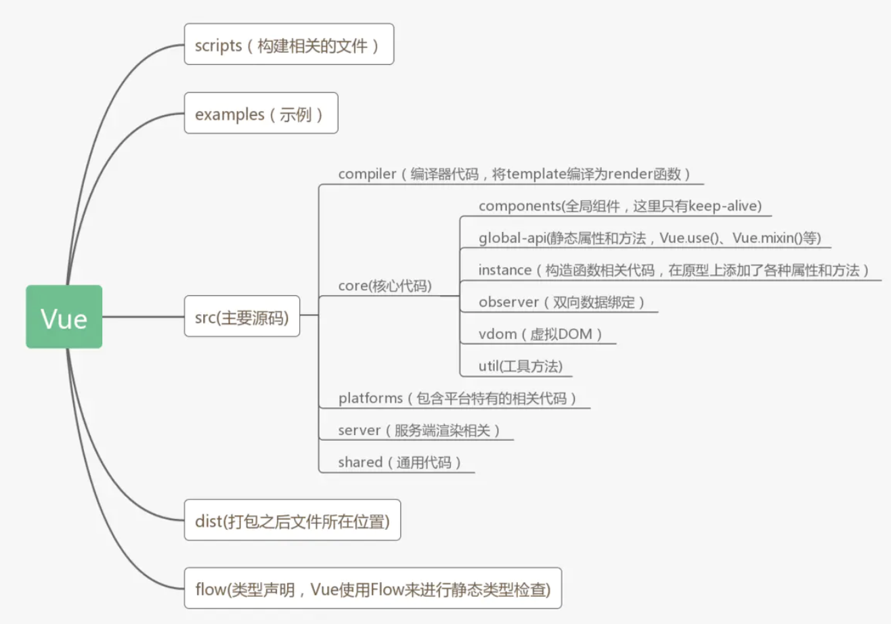
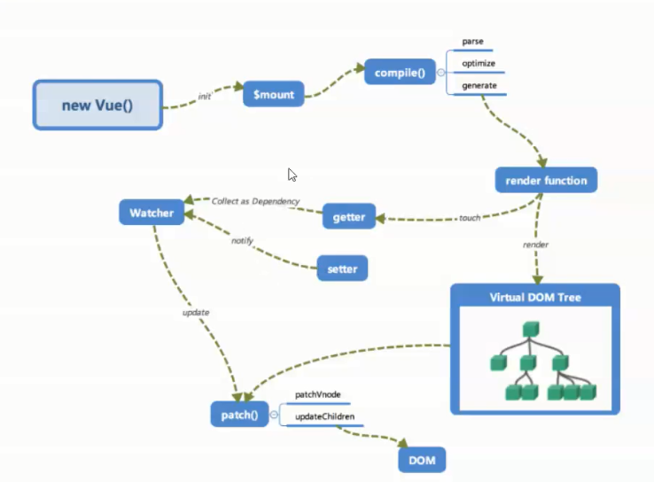
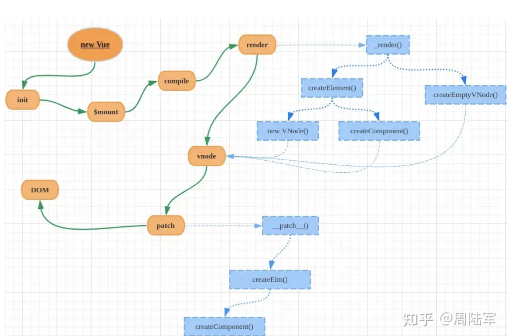

## 骨架梳理
本次分析版本2.6.11,首先看下项目目录，大致知道每个文件夹下面都是干什么的

注意下platform目录，Vue.js 是一个跨平台的MVVM框架，它可以跑在web上，也可以配合weex跑在natvie客户端上，而platform
是 Vue.js的入口，2个目录代表2个主要入口，分别打包成运行在 web 上和 weex 上的 Vue.js。比如现在比较火热的mpvue框架其
实就是在这个目录下面多了一个小程序的运行平台相关内容

当我们执行npm run dev命令时
``` js
"dev": "rollup -w -c scripts/config.js --environment TARGET:web-full-dev"
```
可以看到配置文件是scripts/config.js，传给配置文件的TARGET变量的值是‘web-full-dev’,在配置文件的最后一段代码：
``` js
if (process.env.TARGET) {
  module.exports = genConfig(process.env.TARGET)
} else {
  exports.getBuild = genConfig
  exports.getAllBuilds = () => Object.keys(builds).map(genConfig)
}
```
因为process.env.TARGET有值，根据process.env.TARGET === 'web-full-dev', 我们看到这样一段配置：
``` js
// Runtime+compiler development build (Browser)
'web-full-dev': {
  entry: resolve('web/entry-runtime-with-compiler.js'), // 入口文件
  dest: resolve('dist/vue.js'), // 最终输出文件
  format: 'umd', // umd模块
  env: 'development',
  alias: { he: './entity-decoder' },
  banner
},
```
现在我们知道了入口文件是'web/entry-runtime-with-compiler.js'，但是web是指的哪一个目录呢？在scripts下面有一
个alias.js文件，里面定义了一些别名：
``` js
module.exports = {
  vue: resolve('src/platforms/web/entry-runtime-with-compiler'),
  compiler: resolve('src/compiler'),
  core: resolve('src/core'),
  shared: resolve('src/shared'),
  web: resolve('src/platforms/web'), //指定了web目录
  weex: resolve('src/platforms/weex'),
  server: resolve('src/server'),
  entries: resolve('src/entries'),
  sfc: resolve('src/sfc')
}
```
所以最终的打包的入口文件是src/platforms/web/entry-runtime-with-compiler.js，打开入口文件一步步寻找vue的构造
函数最终找到其路径为`src/core/instance/index.js`看下里面的代码
``` js
/**
 * 在原型上添加了各种属性和方法
 */
import { initMixin } from './init'
import { stateMixin } from './state'
import { renderMixin } from './render'
import { eventsMixin } from './events'
import { lifecycleMixin } from './lifecycle'
import { warn } from '../util/index'

// 定义Vue构造函数
function Vue (options) {
  if (process.env.NODE_ENV !== 'production' &&
    !(this instanceof Vue)
  ) {
    warn('Vue is a constructor and should be called with the `new` keyword')
  }
  this._init(options)
}

initMixin(Vue)
// 在Vue的原型上添加了_init方法。在执行new Vue()的时候，this._init(options)被执行
stateMixin(Vue)
// 在vue的原型上定义了属性: $data、$props，方法：$set、$delete、$watch
eventsMixin(Vue)
// 在原型上添加了四个方法: $on $once $off $emit
lifecycleMixin(Vue)
// 在Vue.prototye上添加了三个方法：_update $forceUpdate $destory
renderMixin(Vue)
// 在原型上添加了方法：$nextTick _render _o _n _s _l _t _q _i _m _f _k _b _v _e _u _g _d _p

export default Vue
```
接下来看下vue构造函数挂载全局api的文件`/src/core/index`
``` js
/** 
* 添加全局API，在原型上添加了两个属性$isServer和$ssrContext，加了version版本属性
*/
import Vue from './instance/index'
import { initGlobalAPI } from './global-api/index'
import { isServerRendering } from 'core/util/env'
import { FunctionalRenderContext } from 'core/vdom/create-functional-component'

// 在 Vue 构造函数上添加全局的API
initGlobalAPI(Vue)

Object.defineProperty(Vue.prototype, '$isServer', {
  get: isServerRendering
})

Object.defineProperty(Vue.prototype, '$ssrContext', {
  get () {
    /* istanbul ignore next */
    return this.$vnode && this.$vnode.ssrContext
  }
})

// expose FunctionalRenderContext for ssr runtime helper installation
Object.defineProperty(Vue, 'FunctionalRenderContext', {
  value: FunctionalRenderContext
})

// 存储了当前Vue的版本号
Vue.version = '__VERSION__'

export default Vue
```
重点看一下initGlobalAPI函数，它会去挂载全局api
``` js
const configDef = {}
configDef.get = () => config
if (process.env.NODE_ENV !== 'production') {
  configDef.set = () => {
    warn(
      'Do not replace the Vue.config object, set individual fields instead.'
    )
  }
}
Object.defineProperty(Vue, 'config', configDef) // 只读属性
// 轻易不要用，有风险
Vue.util = {
  warn,
  extend,
  mergeOptions,
  defineReactive
}
// 在Vue上添加了四个属性：set、delete、nextTick、observable
Vue.set = set
Vue.delete = del
Vue.nextTick = nextTick
// 2.6 explicit observable API
Vue.observable = {
  observe(obj)
  return obj
}
Vue.options = Object.create(null)
// ASSET_TYPES的值通过查找对应文件后知道为['component', 'directive', 'filter']，所以循环之后options对象变为：
// Vue.options = {
//   components: Object.create(null),
//   directives: Object.create(null),
//   filters: Object.create(null)
// }
ASSET_TYPES.forEach(type => {
  Vue.options[type + 's'] = Object.create(null)
})
Vue.options._base = Vue
// 将builtInComponents的属性混合到Vue.options.components中
extend(Vue.options.components, builtInComponents)
// 现在为止，Vue.options变成
// Vue.options = {
//   components: {
//       KeepAlive
//   },
//   directives: Object.create(null),
//   filters: Object.create(null),
//   _base: Vue
// }
// 在Vue构造函数上添加use方法，Vue.use()用来安装Vue插件
initUse(Vue)
// 添加全局API：Vue.mixin()
initMixin(Vue)
// 添加Vue.extend 静态方法
initExtend(Vue)
// 添加静态方法：Vue.component Vue.directive Vue.filter
// 全局注册组件、指令、过滤器
initAssetRegisters(Vue)
```
第二个阶段大体就了解完了，就是挂载静态属性和方法

### Vue平台化包装
接下来来看 `platforms/web/runtime/index.js`文件，我们之前看的两个文件是在core目录下的，是Vue的核心文件，与平台
无关的。platforms下面的就是针对特定平台对Vue进行包装。主要分两个平台：web和weex, 我们看的是web平台下的内容
``` js
// 安装特定平台的工具函数
Vue.config.mustUseProp = mustUseProp
Vue.config.isReservedTag = isReservedTag
Vue.config.isReservedAttr = isReservedAttr
Vue.config.getTagNamespace = getTagNamespace
Vue.config.isUnknownElement = isUnknownElement
// install platform runtime directives & components
extend(Vue.options.directives, platformDirectives)
extend(Vue.options.components, platformComponents)
// 这是安装平台运行时的指令和组件。extend的作用我们都已经知道了。来看一下platformDirectives和platformComponents的内容
// platformDirectives如下
import model from './model'
import show from './show'
export default {
  model,
  show
}
// platformComponents如下
import Transition from './transition'
import TransitionGroup from './transition-group'
export default {
  Transition,
  TransitionGroup
}
// Vue.options之前已经有过包装，经过这两句代码之后变成：
// Vue.options = {
//     components: {
//         KeepAlive,
//         Transition,
//         TransitionGroup
//     },
//     directives: {
//         model,
//         show
//     },
//     filters: Object.create(null),
//     _base: Vue
// }
```
继续下面的代码
``` js
// 这是添加了两个实例方法：__patch__ 和 $mount
Vue.prototype.__patch__ = inBrowser ? patch : noop

// public mount method
Vue.prototype.$mount = function (
  el?: string | Element,
  hydrating?: boolean
): Component {
  el = el && inBrowser ? query(el) : undefined
  return mountComponent(this, el, hydrating)
}
```
看完之后我们就知道了该文件的作用
- 设置平台化的Vue.config
- 在Vue.options上混合了两个指令：model 和 show
- 在Vue.options上混合了两个组件：Transition 和 TransitionGroup
- 在Vue.prototye上添加了两个方法：__patch__ 和 $mount

## new Vue()做了什么
vue实例化时候的渲染流程大概如下图

从前面的分析我们可以看到Vue通过new关键字初始化，然后会调用this._init 方法，该方法在 src/core/instance/init.js中
``` js
Vue.prototype._init = function (options?: Object) {
  const vm: Component = this
  // a uid
  vm._uid = uid++
  let startTag, endTag
  /* 统计首屏加载时长等 */
  if (process.env.NODE_ENV !== 'production' && config.performance && mark) {
    startTag = `vue-perf-start:${vm._uid}`
    endTag = `vue-perf-end:${vm._uid}`
    mark(startTag)
  }
  vm._isVue = true
  if (options && options._isComponent) {
    // 参数的合并很慢，对内部组件使用特别的合并方式
    initInternalComponent(vm, options)
  } else {
    // 对参数合并处理并挂载到$options,参数中组件的生命周期也会变成数组形式,如beforeCreate: [ƒ]形式
    vm.$options = mergeOptions(
      resolveConstructorOptions(vm.constructor),
      options || {},
      vm
    )
  }
  vm._self = vm
  if (process.env.NODE_ENV !== 'production') {
    // 内部其实也是一个vm._renderProxy = vm,只是他对vm整个做了proxy用来给_data、$data等做warning
    initProxy(vm)
  } else {
    vm._renderProxy = vm
  }
  // 初始化一些组件的参数在vm上挂载如下
  // vm._watcher = null
  // vm._inactive = null
  // vm._directInactive = false
  // vm._isMounted = false
  // vm._isDestroyed = false
  // vm._isBeingDestroyed = false
  initLifecycle(vm)
  // 初始化自定义事件的变量如_events 给$off、$emit等使用
  initEvents(vm)
  // 在vm上给$attrs、$listeners定义成响应式的，这两个高级组件方法如何使用查vue文档即可
  // 给render函数使用的$createElement 和 _c等方法
  initRender(vm)
  // 触发对应钩子，其实是从vm.$options取出对应钩子数组执行之
  callHook(vm, 'beforeCreate')
  // 在处理data/props之前处理依赖的注入，可看下一章节对其详细介绍
  initInjections(vm)
  // 对计算属性、函数methods、props、watch做处理，使data变成响应式的
  initState(vm)
  // resolve provide after data/props
  initProvide(vm)
  callHook(vm, 'created')

  /* istanbul ignore if */
  if (process.env.NODE_ENV !== 'production' && config.performance && mark) {
    vm._name = formatComponentName(vm, false)
    mark(endTag)
    measure(`vue ${vm._name} init`, startTag, endTag)
  }

  if (vm.$options.el) {
    vm.$mount(vm.$options.el)
  }
}
```

## vue的provide/inject
vue为了解决跨多层父子组件传值的问题，使用了依赖注入provide/inject，他不同于Vuex中的全局状态，vuex的每次修改是可以追
踪回溯的，而 provide/inject 中变量的修改是无法控制的，换句话说，你不知道是哪个组件修改了这个全局状态
``` js
export function initInjections (vm: Component) {
  const result = resolveInject(vm.$options.inject, vm)
  if (result) {
    toggleObserving(false) // shouldObserve = false
    Object.keys(result).forEach(key => {
      /* istanbul ignore else */
      if (process.env.NODE_ENV !== 'production') {
        defineReactive(vm, key, result[key], () => {
          warn(
            `Avoid mutating an injected value directly since the changes will be ` +
            `overwritten whenever the provided component re-renders. ` +
            `injection being mutated: "${key}"`,
            vm
          )
        })
      } else {
        defineReactive(vm, key, result[key])
      }
    })
    toggleObserving(true) //shouldObserve = true
  }
}
export function resolveInject (inject: any, vm: Component): ?Object {
  if (inject) {
    const result = Object.create(null)
    const keys = hasSymbol
      ? Reflect.ownKeys(inject)
      : Object.keys(inject)

    for (let i = 0; i < keys.length; i++) {
      const key = keys[i]
      // 已经监听的对象不做处理
      if (key === '__ob__') continue
      const provideKey = inject[key].from
      let source = vm
      // 不停的一层层循环从父实例的_provided中取到值，给result对象
      while (source) {
        if (source._provided && hasOwn(source._provided, provideKey)) {
          // 如果找到则跳出本次for循环，进入下一次循环
          result[key] = source._provided[provideKey]
          break
        }
        // 没找到取其父组件
        source = source.$parent
      }
      // 如果该值没有都没找到，则看有没有默认的键值default，如果没有则提示
      if (!source) {
        if ('default' in inject[key]) {
          const provideDefault = inject[key].default
          result[key] = typeof provideDefault === 'function'
            ? provideDefault.call(vm)
            : provideDefault
        } else if (process.env.NODE_ENV !== 'production') {
          warn(`Injection "${key}" not found`, vm)
        }
      }
    }
    return result
  }
}
```
可以简单看下defineReactive方法如何来做响应式
``` js
export class Observer {
  value: any;
  dep: Dep;
  vmCount: number;
  constructor (value: any) {
    this.value = value
    this.dep = new Dep()
    this.vmCount = 0
    def(value, '__ob__', this)
    if (Array.isArray(value)) {
      if (hasProto) {
        protoAugment(value, arrayMethods)
      } else {
        copyAugment(value, arrayMethods, arrayKeys)
      }
      this.observeArray(value)
    } else {
      this.walk(value)
    }
  }
  walk (obj: Object) {
    const keys = Object.keys(obj)
    for (let i = 0; i < keys.length; i++) {
      defineReactive(obj, keys[i])
    }
  }
  observeArray (items: Array<any>) {
    for (let i = 0, l = items.length; i < l; i++) {
      observe(items[i])
    }
  }
}
export function observe (value: any, asRootData: ?boolean): Observer | void {
  if (!isObject(value) || value instanceof VNode) {
    return
  }
  let ob: Observer | void
  if (hasOwn(value, '__ob__') && value.__ob__ instanceof Observer) {
    ob = value.__ob__
  } else if (
    shouldObserve &&
    !isServerRendering() &&
    (Array.isArray(value) || isPlainObject(value)) &&
    Object.isExtensible(value) &&
    !value._isVue
  ) {
    ob = new Observer(value)
  }
  if (asRootData && ob) {
    ob.vmCount++
  }
  return ob
}
export function defineReactive (
  obj: Object,
  key: string,
  val: any,
  customSetter?: ?Function,
  shallow?: boolean
) {
  const dep = new Dep()

  const property = Object.getOwnPropertyDescriptor(obj, key)
  if (property && property.configurable === false) {
    return
  }
  // 取到_provided中的对应的get、set
  const getter = property && property.get
  const setter = property && property.set
  if ((!getter || setter) && arguments.length === 2) {
    val = obj[key]
  }
  // shouldObserve为false所以这里返回为空
  // 从这里可以知道provide和inject绑定并不是可响应的，但传入了一个可监听的对象，那么其对象的property还是可响应的
  // 注意这里，如果你的这次响应式的是一个对象，那么其内部的键值会接着设置响应式，这时候childOb就有值了
  // msg {
  //  a: 4
  // }
  // 例如这种的话，当你设置this.msg的时候会触发其下所有的依赖收集
  let childOb = !shallow && observe(val)
  Object.defineProperty(obj, key, {
    enumerable: true,
    configurable: true,
    get: function reactiveGetter () {
      const value = getter ? getter.call(obj) : val
      if (Dep.target) {
        // 触发依赖收集
        dep.depend()
        if (childOb) {
          // 触发子dep的依赖收集
          childOb.dep.depend()
          if (Array.isArray(value)) {
            dependArray(value)
          }
        }
      }
      return value
    },
    set: function reactiveSetter (newVal) {
      const value = getter ? getter.call(obj) : val
      if (newVal === value || (newVal !== newVal && value !== value)) {
        return
      }
      // warning提示
      if (process.env.NODE_ENV !== 'production' && customSetter) {
        customSetter()
      }
      if (getter && !setter) return
      if (setter) {
        setter.call(obj, newVal)
      } else {
        val = newVal
      }
      childOb = !shallow && observe(newVal)
      dep.notify()
    }
  })
}
```

## 初始化initState
该方法主要用来让数据变成响应式的并绑定到实例的_data属性上
``` js
export function initState (vm: Component) {
  vm._watchers = []
  const opts = vm.$options
  // 对props做处理，并绑定到实例的_props上
  if (opts.props) initProps(vm, opts.props)
  // 对methods里的方法做处理，并将每个方法都直接绑定到实例上
  if (opts.methods) initMethods(vm, opts.methods)
  if (opts.data) {
    initData(vm)
  } else {
    observe(vm._data = {}, true /* asRootData */)
  }
  if (opts.computed) initComputed(vm, opts.computed)
  if (opts.watch && opts.watch !== nativeWatch) {
    initWatch(vm, opts.watch)
  }
}
function initData (vm: Component) {
  let data = vm.$options.data
  data = vm._data = typeof data === 'function'
    ? getData(data, vm)
    : data || {}
  if (!isPlainObject(data)) {
    data = {}
    process.env.NODE_ENV !== 'production' && warn(
      'data functions should return an object:\n' +
      'https://vuejs.org/v2/guide/components.html#data-Must-Be-a-Function',
      vm
    )
  }
  const keys = Object.keys(data)
  const props = vm.$options.props
  const methods = vm.$options.methods
  let i = keys.length
  // 就是做一些提示
  while (i--) {
    const key = keys[i]
    if (process.env.NODE_ENV !== 'production') {
      if (methods && hasOwn(methods, key)) {
        warn(
          `Method "${key}" has already been defined as a data property.`,
          vm
        )
      }
    }
    if (props && hasOwn(props, key)) {
      process.env.NODE_ENV !== 'production' && warn(
        `The data property "${key}" is already declared as a prop. ` +
        `Use prop default value instead.`,
        vm
      )
    } else if (!isReserved(key)) { // 不以$和_开头的字符串
      // 做代理，可以让vm.a时候直接映射到vm_data.a
      proxy(vm, `_data`, key)
    }
  }
  // 给data对象做响应式
  observe(data, true /* asRootData */)
}
export function proxy (target: Object, sourceKey: string, key: string) {
  sharedPropertyDefinition.get = function proxyGetter () {
    return this[sourceKey][key]
  }
  sharedPropertyDefinition.set = function proxySetter (val) {
    this[sourceKey][key] = val
  }
  Object.defineProperty(target, key, sharedPropertyDefinition)
}
function initProps (vm: Component, propsOptions: Object) {
  const propsData = vm.$options.propsData || {}
  const props = vm._props = {}
  // 调用defineReactive 方法把每个 prop 对应的值变成响应式，可以通过 vm._props.xxx 访问到定义 props 中对应的属性
  const keys = vm.$options._propKeys = []
  const isRoot = !vm.$parent
  if (!isRoot) {
    toggleObserving(false)
  }
  for (const key in propsOptions) {
    keys.push(key)
    const value = validateProp(key, propsOptions, propsData, vm)
    if (process.env.NODE_ENV !== 'production') {
      const hyphenatedKey = hyphenate(key)
      if (isReservedAttribute(hyphenatedKey) ||
          config.isReservedAttr(hyphenatedKey)) {
        warn(
          `"${hyphenatedKey}" is a reserved attribute and cannot be used as component prop.`,
          vm
        )
      }
      defineReactive(props, key, value, () => {
        if (!isRoot && !isUpdatingChildComponent) {
          warn(
            `Avoid mutating a prop directly since the value will be ` +
            `overwritten whenever the parent component re-renders. ` +
            `Instead, use a data or computed property based on the prop's ` +
            `value. Prop being mutated: "${key}"`,
            vm
          )
        }
      })
    } else {
      defineReactive(props, key, value)
    }
    // 通过 proxy 把 vm._props.xxx 的访问代理到 vm.xxx 上
    if (!(key in vm)) {
      proxy(vm, `_props`, key)
    }
  }
  toggleObserving(true)
}
```

## Vue 实例挂载的实现
Vue 中我们是通过 $mount 实例方法去挂载 vm 的，$mount 方法在多个文件中都有定义，如
`src/platform/web/entry-runtime-with-compiler.js、src/platform/web/runtime/index.js、src/platform/weex/runtime/index.js`
因为 $mount 这个方法的实现是和平台、构建方式都相关的。接下来我们重点分析带 compiler 版本的 $mount 实现，因为抛开
webpack 的 vue-loader，我们在纯前端浏览器环境分析 Vue 的工作原理，有助于我们对原理理解的深入。

compiler 版本的 $mount 实现非常有意思，先来看一下`src/platform/web/entry-runtime-with-compiler.js`文件中定义：
``` js
const mount = Vue.prototype.$mount
Vue.prototype.$mount = function (
  el?: string | Element,
  hydrating?: boolean
): Component {
  el = el && query(el)
  //Vue 不能挂载在 body、html 这样的根节点上
  if (el === document.body || el === document.documentElement) {
    process.env.NODE_ENV !== 'production' && warn(
      `Do not mount Vue to <html> or <body> - mount to normal elements instead.`
    )
    return this
  }

  const options = this.$options
  if (!options.render) {
    // 如果没有定义 render 方法，则会把 el 或者 template 字符串转换成 render 方法
    let template = options.template
    if (template) {
      if (typeof template === 'string') {
        if (template.charAt(0) === '#') {
          template = idToTemplate(template)
          /* istanbul ignore if */
          if (process.env.NODE_ENV !== 'production' && !template) {
            warn(
              `Template element not found or is empty: ${options.template}`,
              this
            )
          }
        }
      } else if (template.nodeType) {
        template = template.innerHTML
      } else {
        if (process.env.NODE_ENV !== 'production') {
          warn('invalid template option:' + template, this)
        }
        return this
      }
    } else if (el) {
      template = getOuterHTML(el)
    }
    if (template) {
      /* istanbul ignore if */
      if (process.env.NODE_ENV !== 'production' && config.performance && mark) {
        mark('compile')
      }
      // 通过compileToFunctions编译出render方法, render方法可用来产生vnode
      const { render, staticRenderFns } = compileToFunctions(template, {
        outputSourceRange: process.env.NODE_ENV !== 'production',
        shouldDecodeNewlines,
        shouldDecodeNewlinesForHref,
        delimiters: options.delimiters,
        comments: options.comments
      }, this)
      options.render = render
      options.staticRenderFns = staticRenderFns

      /* istanbul ignore if */
      if (process.env.NODE_ENV !== 'production' && config.performance && mark) {
        mark('compile end')
        measure(`vue ${this._name} compile`, 'compile', 'compile end')
      }
    }
  }
  return mount.call(this, el, hydrating)
}
```
原先原型上的 $mount 方法在`src/platform/web/runtime/index.js`中定义，之所以这么设计完全是为了复用，因为它是
可以被 runtime only 版本的 Vue 直接使用的
``` js
Vue.prototype.$mount = function (
  el?: string | Element,
  hydrating?: boolean //第二个参数是和服务端渲染相关，在浏览器环境下我们不需要传第二个参数
): Component {
  el = el && inBrowser ? query(el) : undefined
  return mountComponent(this, el, hydrating)
}
```
$mount 方法实际上会去调用mountComponent方法，这个方法定义在`src/core/instance/lifecycle.js`文件中
``` js
export function mountComponent (
  vm: Component,
  el: ?Element,
  hydrating?: boolean
): Component {
  vm.$el = el
  if (!vm.$options.render) {
    // 生成空的vnode节点
    vm.$options.render = createEmptyVNode
    if (process.env.NODE_ENV !== 'production') {
      /* istanbul ignore if */
      if ((vm.$options.template && vm.$options.template.charAt(0) !== '#') ||
        vm.$options.el || el) {
        warn(
          'You are using the runtime-only build of Vue where the template ' +
          'compiler is not available. Either pre-compile the templates into ' +
          'render functions, or use the compiler-included build.',
          vm
        )
      } else {
        warn(
          'Failed to mount component: template or render function not defined.',
          vm
        )
      }
    }
  }
  // 调用钩子
  callHook(vm, 'beforeMount')
  let updateComponent
  if (process.env.NODE_ENV !== 'production' && config.performance && mark) {
    updateComponent = () => {
      const name = vm._name
      const id = vm._uid
      const startTag = `vue-perf-start:${id}`
      const endTag = `vue-perf-end:${id}`

      mark(startTag)
      const vnode = vm._render()
      mark(endTag)
      measure(`vue ${name} render`, startTag, endTag)

      mark(startTag)
      vm._update(vnode, hydrating)
      mark(endTag)
      measure(`vue ${name} patch`, startTag, endTag)
    }
  } else {
    updateComponent = () => {
      vm._update(vm._render(), hydrating)
    }
  }
  // 先实例化一个渲染Watcher，在它的回调函数中会调用 updateComponent 方法，在此方法中调用
  // vm._render 方法先生成虚拟 Node，最终调用 vm._update 更新 DOM
  // Watcher 在这里起到两个作用，一个是初始化的时候会执行回调函数updateComponent，另一个是
  // 当 vm 实例中的监测的数据发生变化的时候执行回调函数
  new Watcher(vm, updateComponent, noop, {
    before () {
      if (vm._isMounted && !vm._isDestroyed) {
        callHook(vm, 'beforeUpdate')
      }
    }
  }, true /* isRenderWatcher */)
  hydrating = false
  // 根节点挂载完成调用钩子
  if (vm.$vnode == null) {
    vm._isMounted = true
    callHook(vm, 'mounted')
  }
  return vm
}
```

## 渲染到页面_render、_update
上面我们分析到会执行`vm._update(vm._render(), hydrating)`方法来跟新渲染组件到页面，我们先分析_render方法,该方
法是实例的一个私有方法，它用来把实例渲染成一个虚拟Node。它的定义在 src/core/instance/render.js文件中主要部分如下
``` js
Vue.prototype._render = function (): VNode {
  const vm: Component = this
  const { render, _parentVnode } = vm.$options
  // .............
  vm.$vnode = _parentVnode
  let vnode
  try {
    // 调用render函数去生成vnode(virtual dom)
    currentRenderingInstance = vm
    vnode = render.call(vm._renderProxy, vm.$createElement)
  } catch (e) {
  // .........
  }
  // set parent
  vnode.parent = _parentVnode
  return vnode
}
```
这段代码最关键的是 render 方法的调用，我们在平时的开发工作中手写 render 方法的场景比较少，而写的比较多的是template
模板，在之前的 mounted 方法的实现中，会把 template 编译成 render 方法，但这个编译过程是非常复杂的，我们不打算在这
里展开讲，之后会专门花一个章节来分析 Vue 的编译过程

在 Vue 的官方文档中介绍了 render 函数的第一个参数是 createElement(就是 vm.$createElement 方法)
``` js
<div id="app">
  {{ message }}
</div>
//相当于我们编写如下 render 函数
render: function (createElement) {
  return createElement('div', {
     attrs: {
        id: 'app'
      },
  }, this.message)
}
export function initRender (vm: Component) {
  //被模板编译成的 render 函数使用
  vm._c = (a, b, c, d) => createElement(vm, a, b, c, d, false)
  // 是用户手写 render 方法使用的，
  vm.$createElement = (a, b, c, d) => createElement(vm, a, b, c, d, true)
}
```

Vue.js 利用 createElement 方法创建 VNode，它定义在`src/core/vdom/create-elemenet.js`中
``` js
export function createElement (
  context: Component,
  tag: any,
  data: any,
  children: any,
  normalizationType: any,
  alwaysNormalize: boolean
): VNode | Array<VNode> {
  if (Array.isArray(data) || isPrimitive(data)) {
    normalizationType = children
    children = data
    data = undefined
  }
  if (isTrue(alwaysNormalize)) {
    normalizationType = ALWAYS_NORMALIZE
  }
  return _createElement(context, tag, data, children, normalizationType)
}
// createElement 方法实际上是对 _createElement 方法的封装，它允许传入的参数更加灵活，在处理这些参
// 数后，调用真正创建 VNode 的函数 _createElement
//创建 VNode 的过程，每个 VNode 有 children，children 每个元素也是一个 VNode，这样就形成了一个 VNode Tree
export function _createElement (
  context: Component,
  tag?: string | Class<Component> | Function | Object,
  data?: VNodeData,
  children?: any,
  normalizationType?: number
): VNode | Array<VNode> {
  // ............
  //由于 Virtual DOM 实际上是一个树状结构，每一个 VNode 可能会有若干个子节点，这些子节点应该也是 VNode 的类型
  // _createElement 接收的第 4 个参数 children 是任意类型的，因此我们需要把它们规范成 VNode 类型
  if (normalizationType === ALWAYS_NORMALIZE) {
    children = normalizeChildren(children)
  } else if (normalizationType === SIMPLE_NORMALIZE) {
    children = simpleNormalizeChildren(children)
  }
  let vnode, ns
  if (typeof tag === 'string') {
    let Ctor
    ns = (context.$vnode && context.$vnode.ns) || config.getTagNamespace(tag)
    if (config.isReservedTag(tag)) {
      // platform built-in elements
      if (process.env.NODE_ENV !== 'production' && isDef(data) && isDef(data.nativeOn)) {
        warn(
          `The .native modifier for v-on is only valid on components but it was used on <${tag}>.`,
          context
        )
      }
      vnode = new VNode(
        config.parsePlatformTagName(tag), data, children,
        undefined, undefined, context
      )
    } else if ((!data || !data.pre) && isDef(Ctor = resolveAsset(context.$options, 'components', tag))) {
      // 果是为已注册的组件名，则通过 createComponent 创建一个组件类型的 VNode
      vnode = createComponent(Ctor, data, context, children, tag)
    } else {
      //创建一个未知的标签的 VNode
      vnode = new VNode(
        tag, data, children,
        undefined, undefined, context
      )
    }
  } else {
    // direct component options / constructor
    vnode = createComponent(tag, data, context, children)
  }
  // ............
}
```

Vue 的 _update 是实例的一个私有方法，它被调用的时机有2个，一个是首次渲染，一个是数据更新的时候；由于我们这一章节只分
析首次渲染部分，数据更新部分会在之后分析响应式原理的时候涉及。_update 方法的作用是把 VNode 渲染成真实的 DOM，它的
定义在`src/core/instance/lifecycle.js`中
``` js
Vue.prototype._update = function (vnode: VNode, hydrating?: boolean) {
  const vm: Component = this
  const prevEl = vm.$el
  const prevVnode = vm._vnode
  const restoreActiveInstance = setActiveInstance(vm)
  vm._vnode = vnode
  // Vue.prototype.__patch__ is injected in entry points
  // based on the rendering backend used.
  if (!prevVnode) {
    // initial render
    vm.$el = vm.__patch__(vm.$el, vnode, hydrating, false /* removeOnly */)
  } else {
    // updates
    vm.$el = vm.__patch__(prevVnode, vnode)
  }
  restoreActiveInstance()
  // update __vue__ reference
  if (prevEl) {
    prevEl.__vue__ = null
  }
  if (vm.$el) {
    vm.$el.__vue__ = vm
  }
  // if parent is an HOC, update its $el as well
  if (vm.$vnode && vm.$parent && vm.$vnode === vm.$parent._vnode) {
    vm.$parent.$el = vm.$el
  }
  // updated hook is called by the scheduler to ensure that children are
  // updated in a parent's updated hook.
}
```
_update 的核心就是调用`vm.__patch__ `方法，这个方法实际上在不同的平台，比如 web 和 weex 上的定义是不一样的，因此
在 web 平台中它的定义在`src/platforms/web/runtime/index.js`中
``` js
Vue.prototype.__patch__ = inBrowser ? patch : noop
```
可以看到，甚至在 web 平台上，是否是服务端渲染也会对这个方法产生影响。因为在服务端渲染中，没有真实的浏览器 DOM 环境，所
以不需要把 VNode 最终转换成 DOM，因此是一个空函数，而在浏览器端渲染中，它指向了 patch 方法，它的定义在
`src/platforms/web/runtime/patch.js`中
``` js
import * as nodeOps from 'web/runtime/node-ops'
import { createPatchFunction } from 'core/vdom/patch'
import baseModules from 'core/vdom/modules/index'
import platformModules from 'web/runtime/modules/index'
const modules = platformModules.concat(baseModules)
export const patch: Function = createPatchFunction({ nodeOps, modules })
```
该方法的定义是调用 createPatchFunction 方法的返回值，这里传入了一个对象，包含 nodeOps 参数和 modules 参数。其中，
nodeOps 封装了一系列 DOM 操作的方法，modules 定义了一些模块的钩子函数的实现，我们这里先不详细介绍，来看一下
createPatchFunction 的实现，它定义在`src/core/vdom/patch.js`中
``` js
export function createPatchFunction (backend) {
  let i, j
  const cbs = {}

  const { modules, nodeOps } = backend

  for (i = 0; i < hooks.length; ++i) {
    cbs[hooks[i]] = []
    for (j = 0; j < modules.length; ++j) {
      if (isDef(modules[j][hooks[i]])) {
        cbs[hooks[i]].push(modules[j][hooks[i]])
      }
    }
  }
  // ........一堆内容
  //最终返回了一个 patch 方法给了 vm._update 函数里调用的 vm.__patch__
  return function patch (oldVnode, vnode, hydrating, removeOnly) {
    // oldVnode 表示旧的 VNode 节点，它也可以不存在或者是一个 DOM 对象；
    // vnode 表示执行 _render 后返回的 VNode 的节点；
    // hydrating 表示是否是服务端渲染；
    //removeOnly 是给 transition-group 用的
  }
}
```
对于path方法我们可以简单搞个例子试试
``` js
var app = new Vue({
  el: '#app',
  render: function (createElement) {
    return createElement('div', {
      attrs: {
        id: 'app'
      },
    }, this.message)
  },
  data: {
    message: 'Hello Vue!'
  }
})
// 使用上面的例子，初次渲染时候在执行 patch 函数的时候，传入的 vm.$el 对应的是例子中 id 为 app 的 DOM 对象，这个也
// 就是我们在 index.html 模板中写的 <div id="app">， vm.$el 的赋值是在之前 mountComponent 函数做的，vnode 对
// 应的是调用 render 函数的返回值，hydrating 在非服务端渲染情况下为 false，removeOnly 为 false
function patch (oldVnode, vnode, hydrating, removeOnly) {
  if (isUndef(vnode)) {
    if (isDef(oldVnode)) invokeDestroyHook(oldVnode)
    return
  }

  let isInitialPatch = false
  const insertedVnodeQueue = []

  if (isUndef(oldVnode)) {
    // empty mount (likely as component), create new root element
    isInitialPatch = true
    createElm(vnode, insertedVnodeQueue)
  } else {
    //由于我们传入的 oldVnode 实际上是一个 DOM container，所以 isRealElement 为 true
    const isRealElement = isDef(oldVnode.nodeType)
    if (!isRealElement && sameVnode(oldVnode, vnode)) {
      patchVnode(oldVnode, vnode, insertedVnodeQueue, null, null, removeOnly)
    } else {
      if (isRealElement) {
        if (oldVnode.nodeType === 1 && oldVnode.hasAttribute(SSR_ATTR)) {
          oldVnode.removeAttribute(SSR_ATTR)
          hydrating = true
        }
        if (isTrue(hydrating)) {
          if (hydrate(oldVnode, vnode, insertedVnodeQueue)) {
            invokeInsertHook(vnode, insertedVnodeQueue, true)
            return oldVnode
          } else if (process.env.NODE_ENV !== 'production') {
            warn(
              'The client-side rendered virtual DOM tree is not matching ' +
              'server-rendered content. This is likely caused by incorrect ' +
              'HTML markup, for example nesting block-level elements inside ' +
              '<p>, or missing <tbody>. Bailing hydration and performing ' +
              'full client-side render.'
            )
          }
        }
        // 通过 emptyNodeAt 方法把 oldVnode 转换成 VNode 对象
        oldVnode = emptyNodeAt(oldVnode)
      }

      // replacing existing element
      const oldElm = oldVnode.elm
      const parentElm = nodeOps.parentNode(oldElm)

      // 该方法会在页面上插入新dom的节点,此时页面上存在新旧两个dom节点
      createElm(
        vnode,
        insertedVnodeQueue,
        oldElm._leaveCb ? null : parentElm,
        nodeOps.nextSibling(oldElm)
      )
      // update parent placeholder node element, recursively
      if (isDef(vnode.parent)) {
        let ancestor = vnode.parent
        const patchable = isPatchable(vnode)
        while (ancestor) {
          for (let i = 0; i < cbs.destroy.length; ++i) {
            cbs.destroy[i](ancestor)
          }
          ancestor.elm = vnode.elm
          if (patchable) {
            for (let i = 0; i < cbs.create.length; ++i) {
              cbs.create[i](emptyNode, ancestor)
            }
            // #6513
            // invoke insert hooks that may have been merged by create hooks.
            // e.g. for directives that uses the "inserted" hook.
            const insert = ancestor.data.hook.insert
            if (insert.merged) {
              // start at index 1 to avoid re-invoking component mounted hook
              for (let i = 1; i < insert.fns.length; i++) {
                insert.fns[i]()
              }
            }
          } else {
            registerRef(ancestor)
          }
          ancestor = ancestor.parent
        }
      }

      // 删除老的页面上的节点
      if (isDef(parentElm)) {
        removeVnodes([oldVnode], 0, 0)
      } else if (isDef(oldVnode.tag)) {
        invokeDestroyHook(oldVnode)
      }
    }
  }
  // 触发insert钩子
  invokeInsertHook(vnode, insertedVnodeQueue, isInitialPatch)
  return vnode.elm
}
```
createElm 的作用是通过虚拟节点创建真实的 DOM 并插入到它的父节点中。 我们来看一下它的一些关键逻辑，createComponent
方法目的是尝试创建子组件，这个逻辑在之后组件的章节会详细介绍，在当前这个 case 下它的返回值为 false
``` js
function createElm (
  vnode,
  insertedVnodeQueue,
  parentElm,
  refElm,
  nested,
  ownerArray,
  index
) {
  if (isDef(vnode.elm) && isDef(ownerArray)) {
    // This vnode was used in a previous render!
    // now it's used as a new node, overwriting its elm would cause
    // potential patch errors down the road when it's used as an insertion
    // reference node. Instead, we clone the node on-demand before creating
    // associated DOM element for it.
    vnode = ownerArray[index] = cloneVNode(vnode)
  }

  vnode.isRootInsert = !nested // for transition enter check
  if (createComponent(vnode, insertedVnodeQueue, parentElm, refElm)) {
    return
  }

  const data = vnode.data
  const children = vnode.children
  const tag = vnode.tag
  if (isDef(tag)) {
    if (process.env.NODE_ENV !== 'production') {
      if (data && data.pre) {
        creatingElmInVPre++
      }
      // tag 的合法性在非生产环境下做校验，看是否是一个合法标签
      if (isUnknownElement(vnode, creatingElmInVPre)) {
        warn(
          'Unknown custom element: <' + tag + '> - did you ' +
          'register the component correctly? For recursive components, ' +
          'make sure to provide the "name" option.',
          vnode.context
        )
      }
    }
    //然后再去调用平台 DOM 的操作去创建一个对应tag节点的dom
    vnode.elm = vnode.ns
      ? nodeOps.createElementNS(vnode.ns, tag)
      : nodeOps.createElement(tag, vnode)
    setScope(vnode)

    /* istanbul ignore if */
    if (__WEEX__) {
      // ...
    } else {
      // 创建子元素节点，从内部开始循环往外部插入
      createChildren(vnode, children, insertedVnodeQueue)
      // 从内到外触发create钩子,方法在下面
      if (isDef(data)) {
        invokeCreateHooks(vnode, insertedVnodeQueue)
      }
      // 此时整个vonde.ele就是我们的实际有值的dom节点，将其整个插入页面，此时页面会存在老得dom节点和新的两个
      insert(parentElm, vnode.elm, refElm)
    }

    if (process.env.NODE_ENV !== 'production' && data && data.pre) {
      creatingElmInVPre--
    }
  } else if (isTrue(vnode.isComment)) {
    vnode.elm = nodeOps.createComment(vnode.text)
    insert(parentElm, vnode.elm, refElm)
  } else {
    // 最后使用他来插入文本节点等
    vnode.elm = nodeOps.createTextNode(vnode.text)
    insert(parentElm, vnode.elm, refElm)
  }
}
//遍历子虚拟节点，递归调用 createElm，这是一种常用的深度优先的遍历算法，这里要注意的一点是在遍历过程中会把
// vnode.elm 作为父容器的 DOM 节点占位符传入
function createChildren (vnode, children, insertedVnodeQueue) {
  if (Array.isArray(children)) {
    if (process.env.NODE_ENV !== 'production') {
      checkDuplicateKeys(children)
    }
    for (let i = 0; i < children.length; ++i) {
      createElm(children[i], insertedVnodeQueue, vnode.elm, null, true, children, i)
    }
  } else if (isPrimitive(vnode.text)) {
    nodeOps.appendChild(vnode.elm, nodeOps.createTextNode(String(vnode.text)))
  }
}
function invokeCreateHooks (vnode, insertedVnodeQueue) {
  for (let i = 0; i < cbs.create.length; ++i) {
    cbs.create[i](emptyNode, vnode)
  }
  i = vnode.data.hook // Reuse variable
  if (isDef(i)) {
    if (isDef(i.create)) i.create(emptyNode, vnode)
    // 保存到insertedVnodeQueue，用来后面触发insert钩子
    if (isDef(i.insert)) insertedVnodeQueue.push(vnode)
  }
}
```

## vue2 keep-alive
不会在DOM树中渲染(真实或者虚拟都不会)，不会渲染为一个DOM元素，也不会出现在父组件链中——你永远在 this.$parent 中找不到
它有一个属性 abstract 为 true，表明是它一个抽象组件
``` js
export default {
    name: 'abstractCompDemo',
    abstract: true, //标记为抽象组件
}
```
Vue组件在初始化阶段会调用initLifecycle，里面判断父级是否为抽象组件，如果是抽象组件，就选取抽象组件的上一级作为父级，忽略
与抽象组件和子组件之间的层级关系
``` js
// 源码位置： src/core/instance/lifecycle.js 32行
export function initLifecycle (vm: Component) {
  const options = vm.$options

  // locate first non-abstract parent
  let parent = options.parent
  if (parent && !options.abstract) {
    while (parent.$options.abstract && parent.$parent) {
      parent = parent.$parent
    }
    parent.$children.push(vm)
  }
  vm.$parent = parent
  // ...
}
```
组件实例建立父子关系会根据abstract属性决定是否忽略某个组件。在keep-alive中，设置了`abstract: true`那Vue就会跳过该组件实例。
最后构建的组件树中就不会包含keep-alive组件，那么由组件树渲染成的DOM树自然也不会有keep-alive相关的节点了

LRU缓存策略（Least recently used）从内存中找出最久未使用的数据置换新的数据.算法根据数据的历史访问记录来进行淘汰数据，其核心思想是如果数据最近被访问过，那么将来被
访问的几率也更高keep-alive 缓存机制便是根据LRU策略来设置缓存组件新鲜度，将很久未访问的组件从缓存中删除
``` js
// src/core/components/keep-alive.js
export default {
  name: 'keep-alive',
  abstract: true, // 判断当前组件虚拟dom是否渲染成真实dom的关键
  props: {
      include: patternTypes, // 缓存白名单
      exclude: patternTypes, // 缓存黑名单
      max: [String, Number] // 缓存的组件上限
  },
  created() {
     this.cache = Object.create(null) // 缓存虚拟dom
     this.keys = [] // 缓存的虚拟dom的键集合
  },
  destroyed() {
    for (const key in this.cache) {
       // 删除所有的缓存
       pruneCacheEntry(this.cache, key, this.keys)
    }
  },
 mounted() {
   // 实时监听黑白名单的变动
   this.$watch('include', val => {
       // 该方法也会调用pruneCacheEntry
       pruneCache(this, name => matched(val, name))
   })
   this.$watch('exclude', val => {
       pruneCache(this, name => !matches(val, name))
   })
 },

 render() {
    // 先省略...
 }}
}
// 删除this.cache中缓存的VNode实例。我们留意到，这不是简单地将this.cache置为null，而是遍历调用pruneCacheEntry函数删除。
// src/core/components/keep-alive.js 43行
function pruneCacheEntry (
    cache: VNodeCache,
    key: string,
    keys: Array<string>,
    current?: VNode
) {
    const cached = cache[key]
    if (cached && (!current || cached.tag !== current.tag)) {
        cached.componentInstance.$destroyed() // 执行组件的destroy钩子函数
    }
    cache[key] = null
    remove(keys, key)
}
function pruneCache (keepAliveInstance: any, filter: Function) {
  const { cache, keys, _vnode } = keepAliveInstance
  for (const key in cache) {
    const cachedNode: ?VNode = cache[key]
    if (cachedNode) {
      const name: ?string = getComponentName(cachedNode.componentOptions)
      if (name && !filter(name)) {
        pruneCacheEntry(cache, key, keys, _vnode)
      }
    }
  }
}
```
render 函数决定渲染结果。在开头会获取插槽内的子元素，调用 getFirstComponentChild 获取到第一个子元素的 VNode——如果 keep-alive 存在多个子元
素，keep-alive 要求同时只有一个子元素被渲染。所以在开头会获取插槽内的子元素，调用 getFirstComponentChild 获取到第一个子元素的 VNode
``` js
render () {
  const slot = this.$slots.defalut
  const vnode: VNode = getFirstComponentChild(slot) // 找到第一个子组件对象
  const componentOptions : ?VNodeComponentOptions = vnode && vnode.componentOptions
  if (componentOptions) { // 存在组件参数
    // check pattern
    const name: ?string = getComponentName(componentOptions) // 组件名
    const { include, exclude } = this
    if (// 条件匹配，不匹配直接退出
      // not included
      （include && (!name || !matches(include, name))）||
      // excluded
        (exclude && name && matches(exclude, name))
    ) {
        return vnode
    }
    const { cache, keys } = this
    // 定义组件的缓存key
    const key: ?string = vnode.key === null ? componentOptions.Ctor.cid + (componentOptions.tag ? `::${componentOptions.tag}` : '') : vnode.key
    if (cache[key]) { // 已经缓存过该组件
        vnode.componentInstance = cache[key].componentInstance
        remove(keys, key)
        keys.push(key) // 调整key排序
     } else {
        cache[key] = vnode //缓存组件对象
        keys.push(key)
        if (this.max && keys.length > parseInt(this.max)) {
          //超过缓存数限制，将第一个删除
          pruneCacheEntry(cahce, keys[0], keys, this._vnode)
        }
     }
     vnode.data.keepAlive = true //渲染和执行被包裹组件的钩子函数需要用到
 }
 return vnode || (slot && slot[0])
}
```
Node构建完成后，最终会被转换成真实dom，而 patch 是必经的过程。Vue的渲染是从图中render阶段开始的，但keep-alive的渲染是在patch阶段，这是构
建组件树（虚拟DOM树），并将VNode转换成真正DOM节点的过程

- Vue在渲染的时候先调用原型上的_render函数将组件对象转化成一个VNode实例；而_render是通过调用createElement和createEmptyVNode两个函数进行转化；
- createElement的转化过程会根据不同的情形选择new VNode或者调用createComponent函数做VNode实例化；
- 完成VNode实例化后，这时候Vue调用原型上的_update函数把VNode渲染成真实DOM，这个过程又是通过调用patch函数完成的（这就是patch阶段了）
``` js
// src/core/vdom/patch.js 在patch阶段，会执行createComponent函数：
function createComponent (vnode, insertedVnodeQueue, parentElm, refElm) {
  let i = vnode.data
  if (isDef(i)) {
    // isReactivated 标识组件是否重新激活 isDef =(v)=>v !== undefined && v !== null
    const isReactivated = isDef(vnode.componentInstance) && i.keepAlive
    // 在首次加载被包裹组件时，组件还没有初始化构造完成，vnode.componentInstance的值是undefined，keepAlive的值是true。因此isReactivated值
    // 为false。因为keep-alive组件作为父组件，它的render函数会先于被包裹组件执行；那么就只执行到i(vnode, false /* hydrating */)，后面的逻辑不再执行；

    // 再次访问被包裹组件时，vnode.componentInstance的值就是已经缓存的组件实例，那么会执行insert(parentElm, vnode.elm, refElm)逻辑，这样就
    // 直接把上一次的DOM插入到了父元素中
    if (isDef(i = i.hook) && isDef(i = i.init)) { // 调用init方法
      i(vnode, false /* hydrating */)
    }
    if (isDef(vnode.componentInstance)) {
      // initComponent 将 vnode.elm 赋值为真实dom
      initComponent(vnode, insertedVnodeQueue)
      // insert 将组件的真实dom插入到父元素中。
      insert(parentElm, vnode.elm, refElm)
      if (isTrue(isReactivated)) {
        reactivateComponent(vnode, insertedVnodeQueue, parentElm, refElm)
      }
      return true
    }
  }
}
// 源码位置：src/core/vdom/create-component.js
const componentVNodeHooks = {
  init (vnode: VNodeWithData, hydrating: boolean): ?boolean {
    if (
      vnode.componentInstance &&
      !vnode.componentInstance._isDestroyed &&
      vnode.data.keepAlive
    ) {
      // kept-alive components, treat as a patch
      const mountedNode: any = vnode // work around flow
      componentVNodeHooks.prepatch(mountedNode, mountedNode)
    } else {
      // 初次包裹走到这里，直接mount，会出发相应mount钩子
      const child = vnode.componentInstance = createComponentInstanceForVnode(
        vnode,
        activeInstance
      )
      child.$mount(hydrating ? vnode.elm : undefined, hydrating)
    }
  },
  // ...
}
```
如果说一个组件切换走了，又再次切换回来如何更新呢，组件的更新走的是patchnode方法来对比
``` js
// src/core/vdom/patch.js
const isRealElement = isDef(oldVnode.nodeType)
if (!isRealElement && sameVnode(oldVnode, vnode)) {
  // patch existing root node
  patchVnode(oldVnode, vnode, insertedVnodeQueue, null, null, removeOnly)
}
// 源码位置：src/core/vdom/patch.js
function patchVnode (
  oldVnode,
  vnode,
  insertedVnodeQueue,
  ownerArray,
  index,
  removeOnly
) {
  let i
  const data = vnode.data
  if (isDef(data) && isDef(i = data.hook) && isDef(i = i.prepatch)) {
    i(oldVnode, vnode)
  }
// src/core/vdom/create-component.js
prepatch (oldVnode: MountedComponentVNode, vnode: MountedComponentVNode) {
  const options = vnode.componentOptions
  const child = vnode.componentInstance = oldVnode.componentInstance
  updateChildComponent(
    child,
    options.propsData, // updated props
    options.listeners, // updated listeners
    vnode, // new parent vnode
    options.children // new children
  )
},
// src/core/instance/lifecycle.js
export function updateChildComponent (
  vm: Component,
  propsData: ?Object,
  listeners: ?Object,
  parentVnode: MountedComponentVNode,
  renderChildren: ?Array<VNode>
) {
  // Any static slot children from the parent may have changed during parent's
  // update. Dynamic scoped slots may also have changed. In such cases, a forced
  // update is necessary to ensure correctness.
  const needsForceUpdate = !!(
    renderChildren ||               // has new static slots
    vm.$options._renderChildren ||  // has old static slots
    hasDynamicScopedSlot
  )
  // keep-alive 会走强制更新 resolve slots + force update if has children
  if (needsForceUpdate) {
    // resolveSlots 更新 keep-alive 的插槽
    vm.$slots = resolveSlots(renderChildren, parentVnode.context)
    // 让 keep-alive 重新渲染，再走一遍 render
    vm.$forceUpdate()
  }
}
Vue.prototype.$forceUpdate = function () {
  const vm: Component = this
  if (vm._watcher) {
    // 这里最终会执行 vm._update(vm._render)
    vm._watcher.update()
  }
}
```
因为A组件在初始化已经缓存了，keep-alive 直接返回缓存好的A组件 VNode。VNode 准备好后，又来到了 patch 阶段,A组件再次经历
createComponent 的过程，调用 init,由上面的分析可知这时将不再走 $mount 的逻辑，只调用 prepatch 更新实例属性。所以在缓存
组件被激活时，不会执行 created 和 mounted 的生命周期函数

回到 createComponent，此时的 isReactivated 为 true，调用 reactivateComponent

``` js
function reactivateComponent (vnode, insertedVnodeQueue, parentElm, refElm) {
  let i
  // hack for #4339: a reactivated component with inner transition
  // does not trigger because the inner node's created hooks are not called
  // again. It's not ideal to involve module-specific logic in here but
  // there doesn't seem to be a better way to do it.
  let innerNode = vnode
  while (innerNode.componentInstance) {
    innerNode = innerNode.componentInstance._vnode
    if (isDef(i = innerNode.data) && isDef(i = i.transition)) {
      for (i = 0; i < cbs.activate.length; ++i) {
        cbs.activate[i](emptyNode, innerNode)
      }
      insertedVnodeQueue.push(innerNode)
      break
    }
  }
  // unlike a newly created component,
  // a reactivated keep-alive component doesn't insert itself
  // 调用 insert 插入组件的dom节点，至此缓存渲染流程完成
  insert(parentElm, vnode.elm, refElm)
}
```
接下来看看激活钩子的实现actived,分析可知最后走的是invokeInsertHook方法
``` js
// src/core/vdom/patch.js
function invokeInsertHook (vnode, queue, initial) {
    if (isTrue(initial) && isDef(vnode.parent)) {
        vnode.parent.data.pendingInsert = queue
    } else {
        for (let i = 0; i < queue.length; ++i) {
        queue[i].data.hook.insert(queue[i])  // 调用VNode自身的insert钩子函数
        }
    }
}
// insert钩子实现 src/core/vdom/create-component.js
const componentVNodeHooks = {
  // init()
  insert (vnode: MountedComponentVNode) {
    const { context, componentInstance } = vnode
    if (!componentInstance._isMounted) {
      componentInstance._isMounted = true
      callHook(componentInstance, 'mounted')
    }
    if (vnode.data.keepAlive) {
      if (context._isMounted) {
        queueActivatedComponent(componentInstance)
      } else {
        // activateChildComponent函数递归地去执行所有子组件的activated钩子函数
        activateChildComponent(componentInstance, true /* direct */)
      }
    }
  // ...
}
```
相反地，deactivated钩子函数也是一样的原理，在组件实例（VNode）的destroy钩子函数中调用deactivateChildComponent函数
``` js
// src/core/instance/lifecycle.js
export function activateChildComponent (vm: Component, direct?: boolean) {
  if (direct) {
    vm._directInactive = false
    if (isInInactiveTree(vm)) {
      return
    }
  } else if (vm._directInactive) {
    return
  }
  if (vm._inactive || vm._inactive === null) {
    vm._inactive = false
    for (let i = 0; i < vm.$children.length; i++) {
      activateChildComponent(vm.$children[i])
    }
    callHook(vm, 'activated')
  }
}
```
