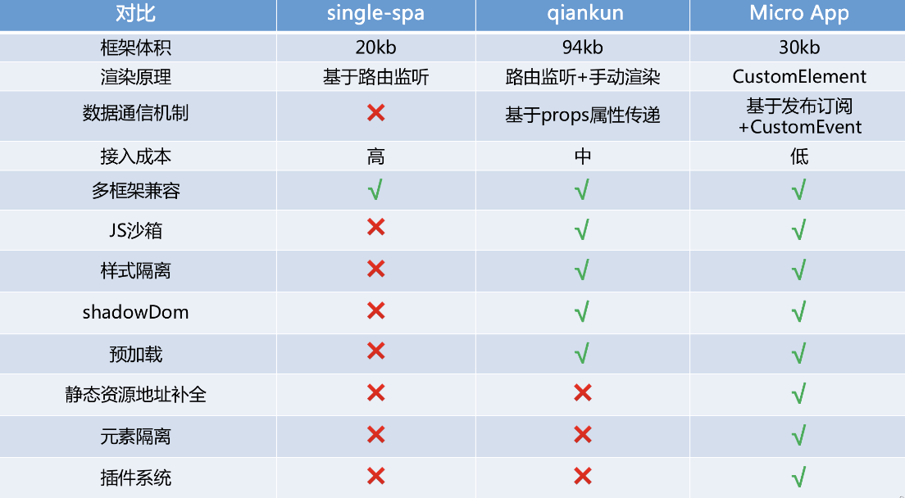

## 选型
微前端不是一个库，是一种前端架构的设计思路，要实现微前端，本质上就是在运行时远程加载应用。实现微前端，有几个思路，从构建的角度来看有两种，编译时构建微前端和
运行时构建微前端：
- 编译时微前端，通常将第三方库中的组件作为包，在构建时引入依赖。这种实现引入新的微前端需要重新编译，不够灵活。编译时的微前端可以通过Web Components，Monorepo等
方式来实现。其中Monorepo非常流行，常见的工具有nx，rush，lerna等
- 运行时微前端，是一次加载或通过延迟加载按需动态将微型前端注入到容器应用程序中时。当引入新的微前端的时候，不需要构建，可以动态在代码中定义加载。我眼中的微前端更多是
指这种运行时加载的微前端，因为独立构建，部署和测试是我们对于“微”的定义

微前端并非只能在客户端来实现，类似于服务端渲染，同样可以通过服务端来实现，服务端微前端的支持工具有：Mosaic，PuzzleJs，Podium，Micromono等

市面上实现微前端的框架，可供选择的有iframe、sigle-spa、web components、webpack5 module federation、无界方案、qiankun和microApp
1. single-spa太过于基础，对原有项目的改造过多，成本太高
2. iframe在所有微前端方案中是最稳定的、上手难度最低的，但它有一些无法解决的问题，例如性能低、通信复杂、双滚动条、弹窗无法全局
覆盖，它的成长性不高，只适合简单的页面渲染
3. web components 不推荐，无法提供模块化功能，项目越大，越容易失控，web component 本质是封装自定义的 html,想想jQuery的问题
4. webpack5 module federation，webpack5全新思路，而且可以导出某个项目的某个组件，不能限制子项目的使用工具是基本原则，而且没有有效的 css 沙箱和 js 沙箱，
需要靠用户自觉,多应用激活无法实现
5. 当然还有微盟、头条等很多大厂均会有自己的框架，来完美切合自己项目的需求，没有真完美微前端方案，无论什么方案在复杂的浏览器加载环境，运行环境下终会出错
6. 无界方案个人比较看好的方案，但是生态不够

剩下的市面上就只有两种，就看自己选择了qiankun和microApp，我选择的理由，只可以讲符合我个人想法

[microApp](https://micro-zoe.github.io/micro-app/docs.html#/) [qiankun](https://qiankun.umijs.org/zh/guide)

上面是网上给的图可以知道他们大概的不同，就说几点通信机制props和发布订阅各有利弊不该作为分割标准，接入其实都很简单，至于静态资源的路径自动补全，怎么说呢不太需要，大多情况我们
都是都过publicpath的配置来解决，qiankun还能支持ie给他打polyfill即可

说说我看中的点：
1. 基于路由的监听真的合理么？各个子项目同时出现该当如何？未来的应用不断扩大的话，子应用并存同一个页面，子应用互相嵌套该怎么办，这其实很常见，试想如果一个超大的机器人对话模块，
他不可能是个组件，那这个模块就是需要在各个子应用种都能跑；
2. 我个人认为一个子项目就应该是个组件哪里都能用，这符合前端的思维，只是这个组件是我们自定义的customelement,这符合xml，也是万维网支持的
3. 当某些模块如果需要保存其状态，频繁的加载卸载真的合理么，是否能像vue 一样keep alive呢?
4. 完全的js沙箱隔离是合理的么？子项目对所全局对象都得隔离了，如果说主项目加载了个三方埋点插件什么的，他全局挂载了个变量方法，子项目得使用该变量方法来发送埋点，隔离之后就无法反问，是否可以加些
配置让子项目可以反问呢，控制开发给子项目哪些变量，哪些变量可以逃逸到外部window上不是更松散更香，但是这是双刃剑，不可随意使用,单有奇效
5. 自定义的fetch,我们知道无论是哪种框架最终都要fetch子项目的资源，我们主项目是否可以对这些资源做些劫持过滤呢，假设我有一些子应用加载了elementui,我现在想升级，难度我就只能一个个改么，我完全
可以劫持加载的静态资源方式，把他打到我想让他加载的资源上,甚至还可以根据需要未每个拉取的资源带上cookie
6. 元素隔离的概念来自ShadowDom，即ShadowDom中的元素可以和外部的元素重复但不会冲突，micro-app模拟实现了类似ShadowDom的功能，元素不会逃离`<micro-app>`元素边界，子应用只能对自身的元素
进行增、删、改、查的操作

我们不知道主应用有哪些dom，也不知道多个自已用有哪些dom,如果直接操作某个dom消失，假设其他应用也有改dom，则会导致错误

简单来说基座应用和子应用都有一个元素`<div id='root'></div>`，此时子应用通过document.querySelector('#root')获取到的是自己内部的#root元素，而不是基座应用的

#### 综上对与我们的项目，任意子项目可能组合，静态资源不规范每个人都会根据情况胡乱升级改版本例如elementui,技术上想保持多元化，接入上想尽量简单不用装什么包等，还是玩玩mircoapp吧
同样的他所面临的问题也不少，例如css 沙箱依然无法绝对的隔离，js 沙箱做全局变量查找缓存，性能有所优化；虽然支持 vite 运行，但必须使用 plugin 改
造子应用，且 js 代码没办法做沙箱隔离；对于不支持 webcompnent 的浏览器没有做降级处理等等

#### 无界方案
无界微前端方案基于 webcomponent 容器 + iframe 沙箱，能够完善的解决适配成本、样式隔离、运行性能、页面白屏、子应用通信、子应用保活、多应用激活、vite 框架支持、应用共享等用户的核心诉求

1. 无界微前端非常快，主要体现在首屏·打开快、运行速度快两个方面
2. 目前大部分微前端只能做到静态资源预加载，但是就算子应用所有资源都预加载完毕，等到子应用打开时页面仍然有不短的白屏时间，这部分白屏时间主要是子应用 js 的解析和执行
3. 无界微前端不仅能够做到静态资源的预加载，还可以做到子应用的预执行
4. 预执行会阻塞主应用的执行线程，所以无界提供 fiber 执行模式，采取类似 react fiber 的方式间断执行 js，每个 js 文件的执行都包裹在 requestidlecallback 中，每执行一个 js 可以返回响
应外部的输入，但是这个颗粒度是 js 文件，如果子应用单个 js 文件过大，可以通过拆包的方式降低体积达到 fiber 执行模式效益最大化
5. 子应用的 js 在 iframe 内运行，由于 iframe 是一个天然的 js 运行沙箱，所以无需采用 with ( fakewindow ) 这种方式来指定子应用的执行上下文，从而避免由于采用 with 语句执行子应用代码
而导致的性能下降，整体的运行性能和原生性能差别不大
6. 无界微前端实现了 css 沙箱和 js 沙箱的原生隔离，子应用不用担心污染问题
7. 无界子应用运行在 iframe 中原生支持 esm 的脚本，而且不用担心子应用运行的上下文问题，因为子应用读取的就是 iframe 的 window 上下文，所以无界微前端原生支持 vite 框架
不做过多介绍了，大家直接看文档[wujie](https://wujie-micro.github.io/doc/guide/)

## 渲染篇
和micro-app一样，我们的简易微前端框架设计思路是像使用iframe一样简单，而又可以避免iframe存在的问题，其使用方式如下：

最终效果也有点类似，整个微前端应用都被封装在自定义标签micro-app中，渲染后效果如下图：

所以我们整体架构思路为：CustomElement + HTMLEntry, HTMLEntry就是以html文件作为入口地址进行渲染，入上图
中的http://localhost:3000/就是一个html地址


### 前置工作
在正式开始之前，我们需要搭建一个开发环境，创建一个代码仓库simple-micro-app,代码结构如下

代码仓库主要分为src主目录和examples案例目录，vue2为基座应用，react17为子应用，两个项目都是使用官方脚手架创建的，构建工具使用rollup

在vue2项目中，配置resolve.alias，将simple-micro-app指向src目录的index.js
``` js
// vue.config.js
...
chainWebpack: config => {
    config.resolve.alias
        .set("simple-micro-app", path.join(__dirname, '../../src/index.js'))
},
```
在react17的webpack-dev-server中配置静态资源支持跨域访问
``` js
// config/webpackDevServer.config.js
...
headers: {
  'Access-Control-Allow-Origin': '*',
},
```

### 创建容器
微前端的渲染是将子应用的js、css等静态资源加载到基座应用中执行，所以基座应用和子应用本质是同一个页面。这不同于iframe，iframe则是创建一个新
的窗口，由于每次加载都要初始化整个窗口信息，所以iframe的性能不高

如同每个前端框架在渲染时都要指定一个根元素，微前端渲染时也需要指定一个根元素作为容器，这个根元素可以是一个div或其它元素

这里我们使用的是通过customElements创建的自定义元素，因为它不仅提供一个元素容器，还自带了生命周期函数，我们可以在这些钩子函数中进行加载
渲染等操作，从而简化步骤
``` js
// /src/element.js

// 自定义元素
class MyElement extends HTMLElement {
  // 声明需要监听的属性名，只有这些属性变化时才会触发attributeChangedCallback
  static get observedAttributes () {
    return ['name', 'url']
  }

  constructor() {
    super();
  }

  connectedCallback() {
    // 元素被插入到DOM时执行，此时去加载子应用的静态资源并渲染
    console.log('micro-app is connected')
  }

  disconnectedCallback () {
    // 元素从DOM中删除时执行，此时进行一些卸载操作
    console.log('micro-app has disconnected')
  }

  attributeChangedCallback (attr, oldVal, newVal) {
    // 元素属性发生变化时执行，可以获取name、url等属性的值
    console.log(`attribute ${attrName}: ${newVal}`)
  }
}

/**
 * 注册元素
 * 注册后，就可以像普通元素一样使用micro-app，当micro-app元素被插入或删除DOM时即可触发相应的生命周期函数。
 */
window.customElements.define('micro-app', MyElement)
```
micro-app元素可能存在重复定义的情况，所以我们加一层判断，并放入函数中
``` js
// /src/element.js
export function defineElement () {
  // 如果已经定义过，则忽略
  if (!window.customElements.get('micro-app')) {
    window.customElements.define('micro-app', MyElement)
  }
}
```
在/src/index.js中定义默认对象SimpleMicroApp，引入并执行defineElement函数
``` js
// /src/index.js
import { defineElement } from './element'
const SimpleMicroApp = {
  start () {
    defineElement()
  }
}
export default SimpleMicroApp
```
在vue2项目的main.js中引入simple-micro-app，执行start函数进行初始化
``` js
// vue2/src/main.js
import SimpleMicroApp from 'simple-micro-app'
SimpleMicroApp.start()

// 然后就可以在vue2项目中的任何位置使用micro-app标签
<template>
  <div>
    <micro-app name='app' url='http://localhost:3001/'></micro-app>
  </div>
</template>
```
插入micro-app标签后，就可以看到控制台打印的钩子信息

以上我们就完成了容器元素的初始化，子应用的所有元素都会放入到这个容器中。接下来我们就需要完成子应用的静态资源加载及渲染

### 创建微应用实例
很显然，初始化的操作要放在connectedCallback 中执行。我们声明一个类，它的每一个实例都对应一个微应用，用于控制微应用的资源加载、渲染、卸载等
``` js
// /src/app.js

// 创建微应用
export default class CreateApp {
    // 在初始化实例时，根据传入的参数请求静态资源
  constructor ({ name, url, container }) {
    this.name = name // 应用名称
    this.url = url  // url地址
    this.container = container // micro-app元素
    this.status = 'loading'
    loadHtml(this)
  }

  status = 'created' // 组件状态，包括 created/loading/mount/unmount

  // 存放应用的静态资源
  source = { 
    links: new Map(), // link元素对应的静态资源
    scripts: new Map(), // script元素对应的静态资源
  }

  // 资源加载完时执行
  onLoad () {}

  /**
   * 资源加载完成后进行渲染
   */
  mount () {}

  /**
   * 卸载应用
   * 执行关闭沙箱，清空缓存等操作
   */
  unmount () {}
}
```
我们在connectedCallback函数中初始化实例，将name、url及元素自身作为参数传入，在CreateApp的constructor中记录这些值，并根据url地址请求html
``` js
// /src/element.js
import CreateApp, { appInstanceMap } from './app'
...
connectedCallback () {
  // 创建微应用实例,内部会下载html使用的是loadHtml
  const app = new CreateApp({
    name: this.name,
    url: this.url,
    container: this,
  })

  // 记入缓存，用于后续功能
  appInstanceMap.set(this.name, app)
}

attributeChangedCallback (attrName, oldVal, newVal) {
  // 分别记录name及url的值
  if (attrName === 'name' && !this.name && newVal) {
    this.name = newVal
  } else if (attrName === 'url' && !this.url && newVal) {
    this.url = newVal
  }
}
...
```
需要对获取的html做处理
``` js
// src/source.js
import { fetchSource } from './utils'

export default function loadHtml (app) {
  fetchSource(app.url).then((html) => {
    html = html
      .replace(/<head[^>]*>[\s\S]*?<\/head>/i, (match) => {
        // 将head标签替换为micro-app-head，因为web页面只允许有一个head标签
        return match
          .replace(/<head/i, '<micro-app-head')
          .replace(/<\/head>/i, '</micro-app-head>')
      })
      .replace(/<body[^>]*>[\s\S]*?<\/body>/i, (match) => {
        // 将body标签替换为micro-app-body，防止与基座应用的body标签重复导致的问题。
        return match
          .replace(/<body/i, '<micro-app-body')
          .replace(/<\/body>/i, '</micro-app-body>')
      })

    // 将html字符串转化为DOM结构
    const htmlDom = document.createElement('div')
    htmlDom.innerHTML = html
    console.log('html:', htmlDom)

    // 进一步提取和处理js、css等静态资源
    extractSourceDom(htmlDom, app)
  }).catch((e) => {
    console.error('加载html出错', e)
  })
}
```
html格式化后，我们就可以得到一个DOM结构。从下图可以看到，这个DOM结构包含link、style、script等标签，接下来就需要对这个DOM做进一步处理


### 提取js、css等静态资源地址
我们在extractSourceDom方法中循环递归处理每一个DOM节点，查询到所有link、style、script标签，提取静态资源地址并格式化标签
``` js
// src/source.js

/**
 * 递归处理每一个子元素
 * @param parent 父元素
 * @param app 应用实例
 */
function extractSourceDom(parent, app) {
  const children = Array.from(parent.children)
  
  // 递归每一个子元素
  children.length && children.forEach((child) => {
    extractSourceDom(child, app)
  })

  for (const dom of children) {
    if (dom instanceof HTMLLinkElement) {
      // 提取css地址
      const href = dom.getAttribute('href')
      if (dom.getAttribute('rel') === 'stylesheet' && href) {
        // 计入source缓存中
        app.source.links.set(href, {
          code: '', // 代码内容
        })
      }
      // 删除原有元素
      parent.removeChild(dom)
    } else if (dom instanceof HTMLScriptElement) {
      // 并提取js地址
      const src = dom.getAttribute('src')
      if (src) { // 远程script
        app.source.scripts.set(src, {
          code: '', // 代码内容
          isExternal: true, // 是否远程script
        })
      } else if (dom.textContent) { // 内联script
        const nonceStr = Math.random().toString(36).substr(2, 15)
        app.source.scripts.set(nonceStr, {
          code: dom.textContent, // 代码内容
          isExternal: false, // 是否远程script
        })
      }

      parent.removeChild(dom)
    } else if (dom instanceof HTMLStyleElement) {
      // 进行样式隔离
    }
  }
}
```
### 请求静态资源
上面已经拿到了html中的css、js等静态资源的地址，接下来就是请求这些地址，拿到资源的内容。接着完善loadHtml，在extractSourceDom下面
添加请求资源的方法。
``` js
// src/source.js
...
export default function loadHtml (app) {
  ...
  // 进一步提取和处理js、css等静态资源
  extractSourceDom(htmlDom, app)

  // 获取micro-app-head元素
  const microAppHead = htmlDom.querySelector('micro-app-head')
  // 如果有远程css资源，则通过fetch请求
  if (app.source.links.size) {
    fetchLinksFromHtml(app, microAppHead, htmlDom)
  } else {
    app.onLoad(htmlDom)
  }

  // 如果有远程js资源，则通过fetch请求
  if (app.source.scripts.size) {
    fetchScriptsFromHtml(app, htmlDom)
  } else {
    app.onLoad(htmlDom)
  }
}
```
fetchLinksFromHtml和fetchScriptsFromHtml分别请求css和js资源，请求资源后的处理方式不同，css资源会转化为style标签插入DOM中，而js不会立即执
行，我们会在应用的mount方法中执行js
``` js
// src/source.js
/**
 * 获取link远程资源
 * @param app 应用实例
 * @param microAppHead micro-app-head
 * @param htmlDom html DOM结构
 */
 export function fetchLinksFromHtml (app, microAppHead, htmlDom) {
  const linkEntries = Array.from(app.source.links.entries())
  // 通过fetch请求所有css资源
  const fetchLinkPromise = []
  for (const [url] of linkEntries) {
    fetchLinkPromise.push(fetchSource(url))
  }

  Promise.all(fetchLinkPromise).then((res) => {
    for (let i = 0; i < res.length; i++) {
      const code = res[i]
      // 拿到css资源后放入style元素并插入到micro-app-head中
      const link2Style = document.createElement('style')
      link2Style.textContent = code
      microAppHead.appendChild(link2Style)

      // 将代码放入缓存，再次渲染时可以从缓存中获取
      linkEntries[i][1].code = code
    }

    // 处理完成后执行onLoad方法
    app.onLoad(htmlDom)
  }).catch((e) => {
    console.error('加载css出错', e)
  })
}

/**
 * 获取js远程资源
 * @param app 应用实例
 * @param htmlDom html DOM结构
 */
 export function fetchScriptsFromHtml (app, htmlDom) {
  const scriptEntries = Array.from(app.source.scripts.entries())
  // 通过fetch请求所有js资源
  const fetchScriptPromise = []
  for (const [url, info] of scriptEntries) {
    // 如果是内联script，则不需要请求资源
    fetchScriptPromise.push(info.code ? Promise.resolve(info.code) :  fetchSource(url))
  }

  Promise.all(fetchScriptPromise).then((res) => {
    for (let i = 0; i < res.length; i++) {
      const code = res[i]
      // 将代码放入缓存，再次渲染时可以从缓存中获取
      scriptEntries[i][1].code = code
    }

    // 处理完成后执行onLoad方法
    app.onLoad(htmlDom)
  }).catch((e) => {
    console.error('加载js出错', e)
  })
}
```
上面可以看到，css和js加载完成后都执行了onLoad方法，所以onLoad方法被执行了两次，接下来我们就要完善onLoad方法并渲染微应用

### 渲染
因为onLoad被执行了两次，所以我们进行标记，当第二次执行时说明所有资源都加载完成，然后进行渲染操作
``` js
// /src/app.js

// 创建微应用
export default class CreateApp {
  ...
  // 资源加载完时执行
  onLoad (htmlDom) {
    this.loadCount = this.loadCount ? this.loadCount + 1 : 1
    // 第二次执行且组件未卸载时执行渲染
    if (this.loadCount === 2 && this.status !== 'unmount') {
      // 记录DOM结构用于后续操作
      this.source.html = htmlDom
      // 执行mount方法
      this.mount()
    }
  }
  ...
}
```
在mount方法中将DOM结构插入文档中，然后执行js文件进行渲染操作，此时微应用即可完成基本的渲染
``` js
// /src/app.js

// 创建微应用
export default class CreateApp {
  ...
  /**
   * 资源加载完成后进行渲染
   */
  mount () {
    // 克隆DOM节点
    const cloneHtml = this.source.html.cloneNode(true)
    // 创建一个fragment节点作为模版，这样不会产生冗余的元素
    const fragment = document.createDocumentFragment()
    Array.from(cloneHtml.childNodes).forEach((node) => {
      fragment.appendChild(node)
    })

    // 将格式化后的DOM结构插入到容器中
    this.container.appendChild(fragment)

    // 执行js
    this.source.scripts.forEach((info) => {
      (0, eval)(info.code)
    })

    // 标记应用为已渲染
    this.status = 'mounted'
  }
  ...
}
```

### 卸载
当micro-app元素被删除时会自动执行生命周期函数disconnectedCallback，我们在此处执行卸载相关操作
``` js
// /src/element.js

class MyElement extends HTMLElement {
  ...
  disconnectedCallback () {
    // 获取应用实例
    const app = appInstanceMap.get(this.name)
    // 如果有属性destory，则完全卸载应用包括缓存的文件
    app.unmount(this.hasAttribute('destory'))
  }
}
```
接下来完善应用的unmount方法：
``` js
// /src/app.js
// 当destory为true时，删除应用的实例，此时所有静态资源失去了引用，自动被浏览器回收
export default class CreateApp {
  ...
  /**
   * 卸载应用
   * @param destory 是否完全销毁，删除缓存资源
   */
  unmount (destory) {
    // 更新状态
    this.status = 'unmount'
    // 清空容器
    this.container = null
    // destory为true，则删除应用
    if (destory) {
      appInstanceMap.delete(this.name)
    }
  }
}
```

## 沙箱篇
我们列出了两个具体的问题，然后通过创建沙箱来解决
1. 子应用向window上添加一个全局变量：globalStr='child'，如果此时基座应用也有一个相同的全局变量：globalStr='parent'，此时就产生了变量冲突，基座应用的变量会被覆盖
2. 子应用渲染后通过监听scroll添加了一个全局监听事件
``` js
window.addEventListener('scroll', () => {
  console.log('scroll')
})
```
当子应用被卸载时，监听函数却没有解除绑定，对页面滚动的监听一直存在。如果子应用二次渲染，监听函数会绑定两次，这显然是错误的, 接下来我们就通过给微前端创建一个JS沙箱环
境，隔离基座应用和子应用的JS，从而解决这两个典型的问题

### 创建沙箱
由于每个子应用都需要一个独立的沙箱，所以我们通过class创建一个类：SandBox，当一个新的子应用被创建时，就创建一个新的沙箱与其绑定
``` js
// /src/sandbox.js
export default class SandBox {
  active = false // 沙箱是否在运行
  microWindow = {} // // 代理的对象
  injectedKeys = new Set() // 新添加的属性，在卸载时清空

  constructor () {}

  // 启动
  start () {}

  // 停止
  stop () {}
}
```
我们使用Proxy进行代理操作，代理对象为空对象microWindow，得益于Proxy强大的功能，实现沙箱变得简单且高效。

在constructor中进行代理相关操作，通过Proxy代理microWindow，设置get、set、deleteProperty三个拦截器，此时子应用对window的操作基本上可以覆盖
``` js
// /src/sandbox.js
export default class SandBox {
  active = false // 沙箱是否在运行
  microWindow = {} // // 代理的对象
  injectedKeys = new Set() // 新添加的属性，在卸载时清空

  constructor () {
    this.proxyWindow = new Proxy(this.microWindow, {
      // 取值
      get: (target, key) => {
        // 优先从代理对象上取值
        if (Reflect.has(target, key)) {
          return Reflect.get(target, key)
        }

        // 否则兜底到window对象上取值
        const rawValue = Reflect.get(window, key)

        // 如果兜底的值为函数，则需要绑定window对象，如：console、alert等
        if (typeof rawValue === 'function') {
          const valueStr = rawValue.toString()
          // 排除构造函数
          if (!/^function\s+[A-Z]/.test(valueStr) && !/^class\s+/.test(valueStr)) {
            return rawValue.bind(window)
          }
        }

        // 其它情况直接返回
        return rawValue
      },
      // 设置变量
      set: (target, key, value) => {
        // 沙箱只有在运行时可以设置变量
        if (this.active) {
          Reflect.set(target, key, value)

          // 记录添加的变量，用于后续清空操作
          this.injectedKeys.add(key)
        }

        return true
      },
      deleteProperty: (target, key) => {
        // 当前key存在于代理对象上时才满足删除条件
        if (target.hasOwnProperty(key)) {
          return Reflect.deleteProperty(target, key)
        }
        return true
      },
    })
  }

  ...
}
```
创建完代理后，我们接着完善start和stop两个方法，实现方式也非常简单，具体如下：
``` js
// /src/sandbox.js
export default class SandBox {
  ...
  // 启动
  start () {
    if (!this.active) {
      this.active = true
    }
  }

  // 停止
  stop () {
    if (this.active) {
      this.active = false

      // 清空变量
      this.injectedKeys.forEach((key) => {
        Reflect.deleteProperty(this.microWindow, key)
      })
      this.injectedKeys.clear()
    }
  }
}
```

### 使用沙箱 
在src/app.js中引入沙箱，在CreateApp的构造函数中创建沙箱实例，并在mount方法中执行沙箱的start方法，在unmount方法中执行沙箱的stop方法
``` js
// /src/app.js
import loadHtml from './source'
+ import Sandbox from './sandbox'

export default class CreateApp {
  constructor ({ name, url, container }) {
    ...
+    this.sandbox = new Sandbox(name)
  }

  ...
  mount () {
    ...
+    this.sandbox.start()
    // 执行js
    this.source.scripts.forEach((info) => {
      (0, eval)(info.code)
    })
  }

  /**
   * 卸载应用
   * @param destory 是否完全销毁，删除缓存资源
   */
  unmount (destory) {
    ...
+    this.sandbox.stop()
    // destory为true，则删除应用
    if (destory) {
      appInstanceMap.delete(this.name)
    }
  }
}
```
我们还需要将子应用的js通过一个with函数包裹，修改js作用域，将子应用的window指向代理的对象。形式如：
``` js
(function(window, self) {
  with(window) {
    子应用的js代码
  }
}).call(代理对象, 代理对象, 代理对象)
```
在sandbox中添加方法bindScope，修改js作用域：
``` js
// /src/sandbox.js

export default class SandBox {
  ...
  // 修改js作用域
  bindScope (code) {
    window.proxyWindow = this.proxyWindow
    return `;(function(window, self){with(window){;${code}\n}}).call(window.proxyWindow, window.proxyWindow, window.proxyWindow);`
  }
}
```
然后在mount方法中添加对bindScope的使用
``` js
// /src/app.js
export default class CreateApp {
  mount () {
    ...
    // 执行js
    this.source.scripts.forEach((info) => {
      (0, eval)(this.sandbox.bindScope(info.code))
    })
  }
}
```

### 重写全局事件
再来回顾一下第二个问题，错误的原因是在子应用卸载时没有清空事件监听，如果子应用知道自己将要被卸载，主动清空事件监听，这个问题可以避免，但这是理想情况，一是子应用
不知道自己何时被卸载，二是很多第三方库也有一些全局的监听事件，子应用无法全部控制。所以我们需要在子应用卸载时，自动将子应用残余的全局监听事件进行清空

我们在沙箱中重写window.addEventListener和window.removeEventListener，记录所有全局监听事件，在应用卸载时如果有残余的全局监听事件则进行清空
``` js
// /src/sandbox.js

// 记录addEventListener、removeEventListener原生方法
const rawWindowAddEventListener = window.addEventListener
const rawWindowRemoveEventListener = window.removeEventListener

/**
 * 重写全局事件的监听和解绑
 * @param microWindow 原型对象
 */
 function effect (microWindow) {
  // 使用Map记录全局事件
  const eventListenerMap = new Map()

  // 重写addEventListener
  microWindow.addEventListener = function (type, listener, options) {
    const listenerList = eventListenerMap.get(type)
    // 当前事件非第一次监听，则添加缓存
    if (listenerList) {
      listenerList.add(listener)
    } else {
      // 当前事件第一次监听，则初始化数据
      eventListenerMap.set(type, new Set([listener]))
    }
    // 执行原生监听函数
    return rawWindowAddEventListener.call(window, type, listener, options)
  }

  // 重写removeEventListener
  microWindow.removeEventListener = function (type, listener, options) {
    const listenerList = eventListenerMap.get(type)
    // 从缓存中删除监听函数
    if (listenerList?.size && listenerList.has(listener)) {
      listenerList.delete(listener)
    }
    // 执行原生解绑函数
    return rawWindowRemoveEventListener.call(window, type, listener, options)
  }

  // 清空残余事件
  return () => {
    console.log('需要卸载的全局事件', eventListenerMap)
    // 清空window绑定事件
    if (eventListenerMap.size) {
      // 将残余的没有解绑的函数依次解绑
      eventListenerMap.forEach((listenerList, type) => {
        if (listenerList.size) {
          for (const listener of listenerList) {
            rawWindowRemoveEventListener.call(window, type, listener)
          }
        }
      })
      eventListenerMap.clear()
    }
  }
}
```
在沙箱的构造函数中执行effect方法，得到卸载的钩子函数releaseEffect，在沙箱关闭时执行卸载操作，也就是在stop方法中执行releaseEffect函数
``` js
// /src/sandbox.js
export default class SandBox {
  ...
  // 修改js作用域
  constructor () {
    // 卸载钩子
+   this.releaseEffect = effect(this.microWindow)
    ...
  }

  stop () {
    if (this.active) {
      this.active = false

      // 清空变量
      this.injectedKeys.forEach((key) => {
        Reflect.deleteProperty(this.microWindow, key)
      })
      this.injectedKeys.clear()
      
      // 卸载全局事件
+      this.releaseEffect()
    }
  }
}

```

## 样式隔离篇
要实现样式隔离必须对应用的css进行改造，因为基座应用无法控制，我们只能对子应用进行修改

1. 子应用的所有元素都被插入到micro-app标签中，且micro-app标签具有唯一的name值，所以通过添加属性选择器前缀micro-app[name=xxx]可以让css样式在指定的micro-app内生效

2. 渲染篇中我们将link标签引入的远程css文件转换为style标签，所以子应用只会存在style标签，实现样式隔离的方式就是在style标签的每一个CSS规则前面加上
micro-app[name=xxx]的前缀，让所有CSS规则都只能影响到指定元素内部

3. 通过style.textContent获取样式内容是最简单的，但textContent拿到的是所有css内容的字符串，这样无法针对单独规则进行处理，所以我们要通过另外一种方式：CSSRules

4. 当style元素被插入到文档中时，浏览器会自动为style元素创建CSSStyleSheet样式表，一个 CSS 样式表包含了一组表示规则的 CSSRule 对象。每条 CSS 规则可以通过与之相关
联的对象进行操作，这些规则被包含在 CSSRuleList 内，可以通过样式表的 cssRules 属性获取

所以cssRules就是由单个CSS规则组成的列表，我们只需要遍历规则列表，并在每个规则的选择器前加上前缀micro-app[name=xxx]，就可以将当前style样式的影响限制在micro-app元素内部

我们上面提到过，style元素插入到文档后会创建css样式表，但有些style元素(比如动态创建的style)在执行样式隔离时还没插入到文档中，此时样式表还没生成。所以我们需要创建一个模版
style元素，它用于处理这种特殊情况，模版style只作为格式化工具，不会对页面产生影响

还有一种情况需要特殊处理：style元素被插入到文档中后再添加样式内容。这种情况常见于开发环境，通过style-loader插件创建的style元素。对于这种情况可以通过MutationObserver监
听style元素的变化，当style插入新的样式时再进行隔离处理
``` js
// /src/scopedcss.js

let templateStyle // 模版sytle

/**
 * 进行样式隔离
 * @param {HTMLStyleElement} styleElement style元素
 * @param {string} appName 应用名称
 */
export default function scopedCSS (styleElement, appName) {
  // 前缀
  const prefix = `micro-app[name=${appName}]`

  // 初始化时创建模版标签
  if (!templateStyle) {
    templateStyle = document.createElement('style')
    document.body.appendChild(templateStyle)
    // 设置样式表无效，防止对应用造成影响
    templateStyle.sheet.disabled = true
  }

  if (styleElement.textContent) {
    // 将元素的内容赋值给模版元素
    templateStyle.textContent = styleElement.textContent
    // 格式化规则，并将格式化后的规则赋值给style元素
    styleElement.textContent = scopedRule(Array.from(templateStyle.sheet?.cssRules ?? []), prefix)
    // 清空模版style内容
    templateStyle.textContent = ''
  } else {
    // 监听动态添加内容的style元素
    const observer = new MutationObserver(function () {
      // 断开监听
      observer.disconnect()
      // 格式化规则，并将格式化后的规则赋值给style元素
      styleElement.textContent = scopedRule(Array.from(styleElement.sheet?.cssRules ?? []), prefix)
    })

    // 监听style元素的内容是否变化
    observer.observe(styleElement, { childList: true })
  }
}
```
scopedRule方法主要进行CSSRule.type的判断和处理，CSSRule.type类型有数十种，我们只处理STYLE_RULE、MEDIA_RULE、SUPPORTS_RULE三种
类型，它们分别对应的type值为：1、4、12，其它类型type不做处理
``` js
// /src/scopedcss.js

/**
 * 依次处理每个cssRule
 * @param rules cssRule
 * @param prefix 前缀
 */
 function scopedRule (rules, prefix) {
  let result = ''
  // 遍历rules，处理每一条规则
  for (const rule of rules) {
    switch (rule.type) {
      case 1: // STYLE_RULE
        result += scopedStyleRule(rule, prefix)
        break
      case 4: // MEDIA_RULE
        result += scopedPackRule(rule, prefix, 'media')
        break
      case 12: // SUPPORTS_RULE
        result += scopedPackRule(rule, prefix, 'supports')
        break
      default:
        result += rule.cssText
        break
    }
  }

  return result
}
```
在scopedPackRule方法种对media和supports两种类型做进一步处理，因为它们包含子规则，我们需要递归处理它们的子规则。如：
``` css
@media screen and (max-width: 300px) {
  .test {
    background-color:lightblue;
  }
}
/* 需变成这样 */
@media screen and (max-width: 300px) {
  micro-app[name=xxx] .test {
    background-color:lightblue;
  }
}

```
处理方式也十分简单：获取它们的子规则列表，递归执行方法scopedRule
``` js
// /src/scopedcss.js

// 处理media 和 supports
function scopedPackRule (rule, prefix, packName) {
  // 递归执行scopedRule，处理media 和 supports内部规则
  const result = scopedRule(Array.from(rule.cssRules), prefix)
  return `@${packName} ${rule.conditionText} {${result}}`
}
```
最后实现scopedStyleRule方法，这里进行具体的CSS规则修改。修改规则的方式主要通过正则匹配，查询每个规则的选择器，在选择前加上前缀
``` js
// /src/scopedcss.js

/**
 * 修改CSS规则，添加前缀
 * @param {CSSRule} rule css规则
 * @param {string} prefix 前缀
 */
function scopedStyleRule (rule, prefix) {
  // 获取CSS规则对象的选择和内容
  const { selectorText, cssText } = rule

  // 处理顶层选择器，如 body，html 都转换为 micro-app[name=xxx]
  if (/^((html[\s>~,]+body)|(html|body|:root))$/.test(selectorText)) {
    return cssText.replace(/^((html[\s>~,]+body)|(html|body|:root))/, prefix)
  } else if (selectorText === '*') {
    // 选择器 * 替换为 micro-app[name=xxx] *
    return cssText.replace('*', `${prefix} *`)
  }

  const builtInRootSelectorRE = /(^|\s+)((html[\s>~]+body)|(html|body|:root))(?=[\s>~]+|$)/

  // 匹配查询选择器
  return cssText.replace(/^[\s\S]+{/, (selectors) => {
    return selectors.replace(/(^|,)([^,]+)/g, (all, $1, $2) => {
      // 如果含有顶层选择器，需要单独处理
      if (builtInRootSelectorRE.test($2)) {
        // body[name=xx]|body.xx|body#xx 等都不需要转换
        return all.replace(builtInRootSelectorRE, prefix)
      }
      // 在选择器前加上前缀
      return `${$1} ${prefix} ${$2.replace(/^\s*/, '')}`
    })
  })
}
```
在渲染篇中，我们有两处涉及到style元素的处理，一个是html字符串转换为DOM结构后的递归循环，一次是将link元素转换为style元素。所以我们需要在
这两个地方调用scopedCSS方法，并将style元素作为参数传入
``` js
// /src/source.js

/**
 * 递归处理每一个子元素
 * @param parent 父元素
 * @param app 应用实例
 */
 function extractSourceDom(parent, app) {
  ...
  for (const dom of children) {
    if (dom instanceof HTMLLinkElement) {
      ...
    } else if (dom instanceof HTMLStyleElement) {
      // 执行样式隔离
+      scopedCSS(dom, app.name)
    } else if (dom instanceof HTMLScriptElement) {
      ...
    }
  }
}

/**
 * 获取link远程资源
 * @param app 应用实例
 * @param microAppHead micro-app-head
 * @param htmlDom html DOM结构
 */
export function fetchLinksFromHtml (app, microAppHead, htmlDom) {
  ...
  Promise.all(fetchLinkPromise).then((res) => {
    for (let i = 0; i < res.length; i++) {
      const code = res[i]
      // 拿到css资源后放入style元素并插入到micro-app-head中
      const link2Style = document.createElement('style')
      link2Style.textContent = code
+      scopedCSS(link2Style, app.name)
      ...
    }

    ...
  }).catch((e) => {
    console.error('加载css出错', e)
  })
}
```

## 数据通信篇
微前端各个应用本身是独立运行的，通信系统不应该对应用侵入太深，所以我们采用发布订阅系统。但是由于子应用封装在micro-app标签内，作为一个类webComponents的
组件，发布订阅系统的弱绑定和它格格不入

最好的方式是像普通属性一样通过micro-app元素传递数据。但自定义元素无法支持对象类型的属性，只能传递字符串，例如
`<micro-app data={x: 1}></micro-app> 会转换为 <micro-app data='[object Object]'></micro-app>`想要以组件化形式进行数据通信必须让元素支持对象
类型属性，为此我们需要重写micro-app原型链上setAttribute方法处理对象类型属性


发布订阅系统有很多可以自己实现，也很很灵活，但太过于灵活可能会导致数据传输的混乱，必须定义一套清晰的数据流。所以我们要进行数据绑定，基座应用一次只能向指定
的子应用发送数据，子应用只能发送数据到基座应用，至于子应用之间的数据通信则通过基座应用进行控制，这样数据流就会变得清晰

由于基座应用和子应用的数据通信方式不同，我们分开定义
``` js
// 通过格式化订阅名称来进行数据的绑定通信
/**
 * 格式化事件名称，保证基座应用和子应用的绑定通信
 * @param appName 应用名称
 * @param fromBaseApp 是否从基座应用发送数据
 */
 function formatEventName (appName, fromBaseApp) {
  if (typeof appName !== 'string' || !appName) return ''
  return fromBaseApp ? `__from_base_app_${appName}__` : `__from_micro_app_${appName}__`
}

// /src/data.js

// 基座应用的数据通信方法集合
export class EventCenterForBaseApp {
  /**
   * 向指定子应用发送数据
   * @param appName 子应用名称
   * @param data 对象数据
   */
  setData (appName, data) {
    eventCenter.dispatch(formatEventName(appName, true), data)
  }

  /**
   * 清空某个应用的监听函数
   * @param appName 子应用名称
   */
  clearDataListener (appName) {
    eventCenter.off(formatEventName(appName, false))
  }
}

// 子应用的数据通信方法集合
export class EventCenterForMicroApp {
  constructor (appName) {
    this.appName = appName
  }

  /**
   * 监听基座应用发送的数据
   * @param cb 绑定函数
   */
  addDataListener (cb) {
    eventCenter.on(formatEventName(this.appName, true), cb)
  }

  /**
   * 解除监听函数
   * @param cb 绑定函数
   */
  removeDataListener (cb) {
    if (typeof cb === 'function') {
      eventCenter.off(formatEventName(this.appName, true), cb)
    }
  }

  /**
   * 向基座应用发送数据
   * @param data 对象数据
   */
  dispatch (data) {
    const app = appInstanceMap.get(this.appName)
    if (app?.container) {
      // 子应用以自定义事件的形式发送数据
      const event = new CustomEvent('datachange', {
        detail: {
          data,
        }
      })

      app.container.dispatchEvent(event)
    }
  }

  /**
   * 清空当前子应用绑定的所有监听函数
   */
  clearDataListener () {
    eventCenter.off(formatEventName(this.appName, true))
  }
}
```
在入口文件中创建基座应用通信对象。
``` js
// /src/index.js
import { EventCenterForBaseApp } from './data'
const BaseAppData = new EventCenterForBaseApp()
```
在沙箱中创建子应用的通信对象，并在沙箱关闭时清空所有绑定的事件
``` js
// /src/sandbox.js

import { EventCenterForMicroApp } from './data'

export default class SandBox {
  constructor (appName) {
    // 创建数据通信对象
    this.microWindow.microApp = new EventCenterForMicroApp(appName)
    ...
  }

  stop () {
    ...
    // 清空所有绑定函数
    this.microWindow.microApp.clearDataListener()
  }
}
```
到这里，数据通信大部分功能都完成了，但还缺少一点，就是对micro-app元素对象类型属性的支持。我们重写Element原型链上setAttribute方法，
当micro-app元素设置data属性时进行特殊处理
``` js
// /src/index.js

// 记录原生方法
const rawSetAttribute = Element.prototype.setAttribute

// 重写setAttribute
Element.prototype.setAttribute = function setAttribute (key, value) {
  // 目标为micro-app标签且属性名称为data时进行处理
  if (/^micro-app/i.test(this.tagName) && key === 'data') {
    if (toString.call(value) === '[object Object]') {
      // 克隆一个新的对象
      const cloneValue = {}
      Object.getOwnPropertyNames(value).forEach((propertyKey) => {
        // 过滤vue框架注入的数据
        if (!(typeof propertyKey === 'string' && propertyKey.indexOf('__') === 0)) {
          cloneValue[propertyKey] = value[propertyKey]
        }
      })
      // 发送数据
      BaseAppData.setData(this.getAttribute('name'), cloneValue)
    }
  } else {
    rawSetAttribute.call(this, key, value)
  }
}
```


