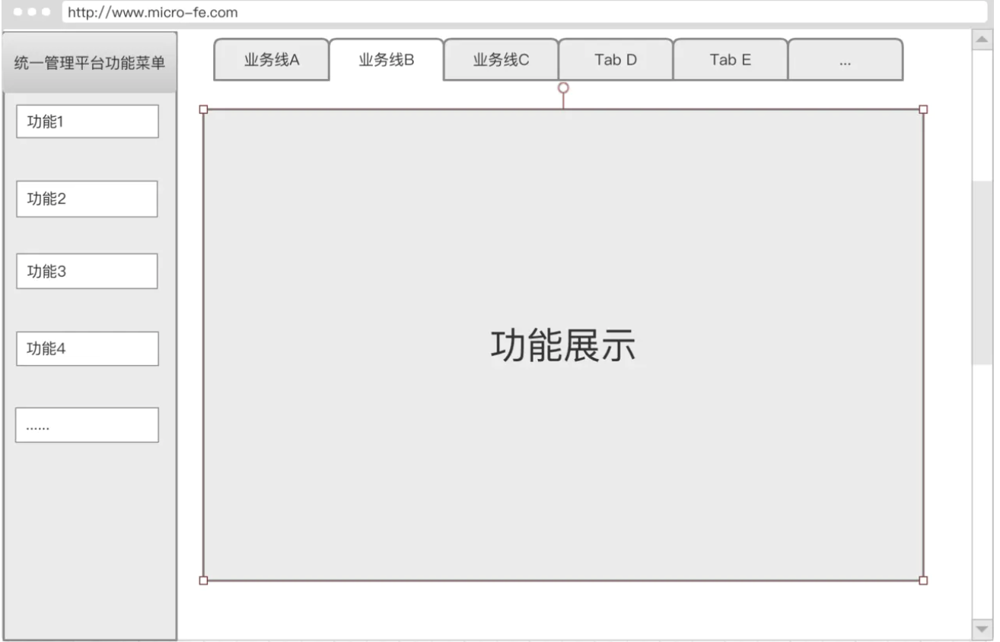
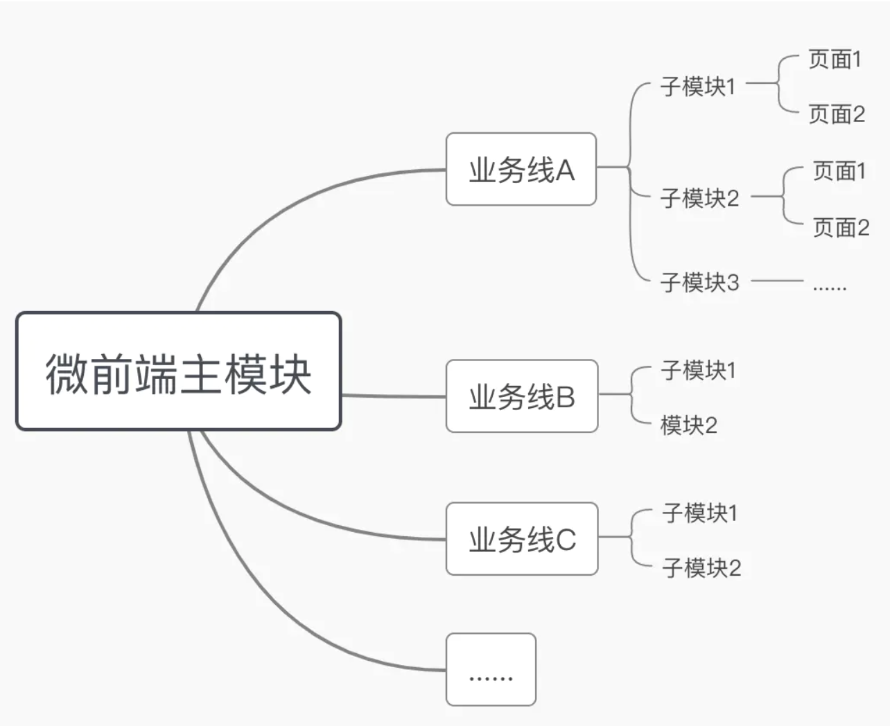

## 为什么要使用微前端架构

假设我们现在有一个运营后台，随着公司发展出现了很多新的业务线，每个业务线都有自己需要的定制的运营功能，为了满足
这些新业务线的运营需求，我们要做的就是：
- 将原有的运营后台加入切换业务线的功能
- 将分散在其他平台的运营功能迁移过来
- 为每个业务线开发定制的功能并能够根据业务线展示
- 对于业务线定制的功能，会尽量交给各个业务线负责，这就要求各个业务线都要用统一的技术栈来开发,大概就下面这个流程



按照传统方案的设计就是这样，然而这样的话将会造成以下问题：
- 原有的运营后台需要重构，主要重构点是鉴权和业务线切换这块，当然后端的某些接口也要做一些处理
- 其他平台功能的迁移成本有点高，因为用的是不同的技术栈
- 运营需求越来越多，平台就会越来越庞大，会使维护成本越来越高，迭代不够灵活，多人协作造成各种冲突
- 某一个模块出了bug有可能造成整个系统崩溃

为了解决上述问题，微前端的方案是指将系统的每个模块都拆分出来，独立开发、独立部署，然后将所有功能集
成在一起，而这些功能模块完全解耦，甚至模块之间可以使用不同的技术栈来实现，老平台功能就可以平滑迁移，流程就变成
下面这样



接下来我们使用Vue+single-spa实现一个微前端系统，你就可以理解微前端的原理了。

## 主项目接入微前端系统
按照上述的微前端的原理和流程图，我将以single-spa+Vue+Element带领大家分别构建出主项目和子项目，进而完成一个
真正的微前端应用。为了方便大家的理解，此次讲解先不加入切换业务线的功能，这个功能重要但是实现起来不麻烦，同学们
构建起微前端之后可以自行加入这个逻辑。

首先我们来看下项目的入口文件main.js，和传统的vue项目一样是完成Vue对象的初始化工作
``` js
import Vue from 'vue';
import ElementUI from 'element-ui';
import 'element-ui/lib/theme-chalk/index.css';
import Router from 'vue-router';
import routerMap from './router/index';
import App from './App';
import util from '@/common/js/util';
Vue.use(ElementUI);
Vue.use(Router);

// 绑定路由
const router = new Router(routerMap);

router.beforeEach((to, from, next) => {
    if (to.fullPath === '/login' || from.fullPath === '/login') {
        next();
    } else {
        // 判断是否登录
        if (!util.login()) {
            login(); // 登录
        } else {
            next();
        }
    }
});

new Vue({
    router,
    render: h => h(App)
}).$mount('#app');
```
然后你需要在main.js中将子模块的配置引入进来，我们会在加载器注册子模块时用到，配置文件参考如下：
``` js
export default {
    test: {
        id: 1,
        parent: {
            id: 1,
            name: 'test管理'
        },
        name: 'test模块',
        path: 'http://xxx.com/app.js',
        router: '/test'
    },
    demo: {
        id: 2,
        parent: {
            id: 1,
            name: 'demo管理'
        },
        name: 'demo模块',
        // 这个就是我们子项目打包生成文件发布dist之后的静态入口文件
        // 在主项目需要加载此模块的时候,就这加载这个js文件，这个文件会生成相应页面
        path: 'http://xxx.com/app.js',
        router: '/demo'
    }
};
```
然后将其引入进来并存储，在main.js中添加
``` js
import appList from './appList'
util.setCache('appList', appList);
```

这里需要注意的是关于路由的配置，主项目中提供首页、菜单、登录、404等公共部分逻辑和相关页面，菜单我们使用Elemnet的
NavMenu组件，另外就是加载器的逻辑和页面（Portal页面）。所以路由应该是这样的：
``` js
import Home from '@/views/Home';
import Portal from '@/views/Portal'; // 加载器
import Login from '@/views/Login';
import NotFound from '@/views/404';
export default {
		routes: [
  			{
            path: '/',
          	redirect: '/portal',
            component: Home,
            children: [
                {
                    name: 'Portal',
                    path: `/portal*`,    
                    component: Portal, // 加载模块
                }
            ]
        },
        {
            path: '/login',
            component: Login,
            meta: {
                label: '登录',
                hidden: true
            }
        },
        {
            path: '/404',
            component: NotFound,
            meta: {
                label: '404',
                hidden: true
            }
        },
        {
            path: '*',
            redirect: '/404',
            meta: {
                hidden: true
            }
        }
    ]
}
```
404和login页面大家可以自行设计。接下来的重点是重头戏 Portal 页面的实现，这个页面实际上就是各个子项目的
入口，其主要逻辑就是加载器的实现，接下来直接上代码，我们对着代码一步步理解
``` js
//portal页面的HTML部分只有一个id为MICRO-APP的根元素，它作为子项目的容器，我们会在子模块中进行配置
<template>
    <div id="MICRO-APP"></div>
</template>
<script>
/* eslint-disable */
import util from '@/common/js/util';
import { registerApplication, start, getAppNames,
getAppStatus, unloadApplication } from 'single-spa';

export default {
    data() {
        return {};
    },
    methods: {
        registry(key, app) {
            // 去重
            if (getAppNames().includes(key)) {
                return;
            }
            // registerApplication 用于注册我们的子项目，第一个参数为项目名称（唯一即可），
            // 第二个参数为项目地址，第三个参数为匹配的路由，第四参数为初始化传值。
            registerApplication(
                key,
                () => {
                    const render = () => {
                        // 渲染
                        return window.System.import(app.path).then(res => {
                            if (res) {
                                return res;
                            } else {
                                return render();
                            }
                        });
                    };
                    return render();
                },
                location => {
                    if (location.pathname.indexOf(app.router) !== -1) {
                        return true;
                    } else {
                        return false;
                    }
                }
            );
        },
        // 注册模块
        async registerApp() {
            const appList = util.getCache('appList');
            for (const key in appList) {
                if (appList.hasOwnProperty(key)) {
                    const app = appList[key];
                    this.registry(key, app);
                }
            }
        }
    },
    mounted() {
        start();   //  启动项目
        this.registerApp();// 注册模块
    }
};
</script>
<style lang="less" scoped>
#MICRO-APP {
    position: relative;
    width: 100%;
    height: 100%;
    z-index: 10;
}
</style>
```

在讲解registerApplication之前，我们首先对注册子模块的生命周期做一个介绍，这将帮助你可以更加深刻的理解加载器的原理和
注册的过程。需要注意的是，我说的生命周期指的是注册子模块这个过程的生命周期，而不是这个页面的生命周期。

注册的子模块会经过下载(loaded)、初始化(initialized)、被挂载(mounted)、卸载(unmounted)和unloaded（被移除）等
过程。single-spa会通过“生命周期”为这些过程提供钩子函数。这些钩子函数包括：

- bootstrap：这个生命周期函数会在子模块第一次挂载前执行一次

- mount：在注册某个子模块过程中，当 activityFunction（registerApplication的第三个参数）返回为真，且该子模块处于
未挂载状态时，mount生命周期函数就会被调用。调用时，函数会根据URL来确定当前被激活的路由，创建DOM元素、监听DOM事件等
以向用户呈现渲染的内容。挂载过之后，接下来任何子路由的改变（如hashchange或popstate等）不会再次触发mount，需
要各模块自行处理

- unmount：每当应用的 activityFunction 返回假值，但该应用已挂载时，卸载的生命周期函数就会被调用。卸载函数被调用
时，会清理在挂载应用时被创建的DOM元素、事件监听、内存、全局变量和消息订阅等

另外还需要注意：这些生命周期函数的调用是需要在各个子模块的入口文件中实现的，我们在讲到子模块的时候在给大家介绍如何实现
registerApplication方法
``` js
singleSpa.registerApplication(
  app.key,
  loadingFunction(app.path), 
  activityFunction(app.router),   
  { access_token: 'asnjknfjkds' }
);
function loadingFunction(path) {
  return import(path);
}
function activityFunction(location,router) {
  return location.pathname.indexOf(router) !== -1;
}
```
- 第一个参数是一个key值，需要唯一
- 第二个参数是一个回调函数，必须是返回promise的函数(或"async function"方法)。这个函数没有入参，会在子模块第一次
被下载时调用。返回的Promise resolve之后的结果必须是一个可以被解析的子模块。常见的实现方法是使用import加
载：() => import('/path/to/application.js')，为了能够独立部署各个应用，这里的import使用的是 SystemJS
- 第三个参数也是一个函数，返回bool值，window.location会作为第一个参数被调用，当函数返回的值为真(truthy)值，应
用会被激活，通常情况下，Activity function会根据window.location/后面的path来决定该应用是否需要被激活。激活后
如果子模块未挂载，则会执行mount生命周期。
- 第四个参数属于自定义参数，，然后我们可以在各个生命周期函数中通过props**.**customProps接收到这个参数这个
参数也许会很有用，比如以下场景：

  1. 各个应用共享一个公共的 参数，比如：access_token
  2. 下发初始化信息，如渲染目标
  3. 传递对事件总线（eventBus）的引用，方便各应用之间进行通信


## 子项目接入微前端
子项目原则上可以采用任何技术栈，这里我以Vue为例和大家一起实现一个子模块,完成了主项目之后，子项目的实现也就非常
简单了，这里主要用到的一个东西就是 single-spa-vue，singleSpaVue 是 single-spa 结合 vue 的方法，我们使
用它来实现已经注册该子模块的生命周期逻辑。它的第一个参数是 vue，第二个参数 appOptions 就是我们平时传入的vue配置
``` js
// 子项目入口文件
import Vue from 'vue';
import Router from 'vue-router';
import App from './App';
import ElementUI from 'element-ui';
import 'element-ui/lib/theme-chalk/index.css';
import routerMap from './router';
import store from './store';
import singleSpaVue from 'single-spa-vue';

Vue.use(ElementUI);
Vue.use(Router);

const router = new Router(routerMap);
const vueLifecycles = singleSpaVue({
    Vue,
    appOptions: {
        router,
        store,
        render: h => h(App),
        el:'#MICRO-APP'     // Portal页面中的子模块容器，子模块会被插入到该元素中
    }
});

export const bootstrap = vueLifecycles.bootstrap;
export const mount = vueLifecycles.mount;
export const unmount = vueLifecycles.unmount;

//如果你想在生命周期函数之后做些事情可以向下边这样做
const vueLifecycles = singleSpaVue({...})
export const mount = props => vueLifecycles.mount(props).then(instance => {
  // do what you want with the Vue instance
  ...
})
```
接下来我们来看看路由的配置，和常规配置一样，只要注意base的设置即可
``` js
import List from '../views/List.vue';
export default {
    mode: 'history',
    base: '/portal',
    routes: [
        {
            path: '/demo',
            redirect: '/demo/list',
            component: List
        },
        {
            name: 'List',
            path: '/demo/list',
            component: List
        }
    ]
};
```

## single-spa-vue源码

这个包其实就是定义下我们需要的mount等方法，可看下源码很简单
``` js
import "css.escape";

const defaultOpts = {
  // required opts
  Vue: null,
  appOptions: null,
  template: null
};

export default function singleSpaVue(userOpts) {
  if (typeof userOpts !== "object") {
    throw new Error(`single-spa-vue requires a configuration object`);
  }

  const opts = {
    ...defaultOpts,
    ...userOpts
  };

  if (!opts.Vue) {
    throw Error("single-spa-vue must be passed opts.Vue");
  }

  if (!opts.appOptions) {
    throw Error("single-spa-vue must be passed opts.appOptions");
  }

  if (
    opts.appOptions.el &&
    typeof opts.appOptions.el !== "string" &&
    !(opts.appOptions.el instanceof HTMLElement)
  ) {
    throw Error(
      `single-spa-vue: appOptions.el must be a string CSS selector, an 
      HTMLElement, or not provided at all. Was given ${typeof opts
        .appOptions.el}`
    );
  }

  let mountedInstances = {};

  return {
    bootstrap: bootstrap.bind(null, opts, mountedInstances),
    mount: mount.bind(null, opts, mountedInstances),
    unmount: unmount.bind(null, opts, mountedInstances),
    update: update.bind(null, opts, mountedInstances)
  };
}

function bootstrap(opts) {
  if (opts.loadRootComponent) {
    return opts.loadRootComponent().then(root => (opts.rootComponent = root));
  } else {
    return Promise.resolve();
  }
}

function mount(opts, mountedInstances, props) {
  const instance = {};
  return Promise.resolve().then(() => {
    const appOptions = { ...opts.appOptions };
    if (props.domElement && !appOptions.el) {
      appOptions.el = props.domElement;
    }

    let domEl;
    if (appOptions.el) {
      if (typeof appOptions.el === "string") {
        domEl = document.querySelector(appOptions.el);
        if (!domEl) {
          throw Error(
            `If appOptions.el is provided to single-spa-vue, the dom 
            element must exist in the dom. Was provided as ${appOptions.el}`
          );
        }
      } else {
        domEl = appOptions.el;
        if (!domEl.id) {
          domEl.id = `single-spa-application:${props.name}`;
        }
        appOptions.el = `#${CSS.escape(domEl.id)}`;
      }
    } else {
      const htmlId = `single-spa-application:${props.name}`;
      appOptions.el = `#${CSS.escape(htmlId)}`;
      domEl = document.getElementById(htmlId);
      if (!domEl) {
        domEl = document.createElement("div");
        domEl.id = htmlId;
        document.body.appendChild(domEl);
      }
    }

    appOptions.el = appOptions.el + " .single-spa-container";

    // single-spa-vue@>=2 always REPLACES the `el` instead of appending to it.
    // We want domEl to stick around and not be replaced. So we tell Vue to mount
    // into a container div inside of the main domEl
    if (!domEl.querySelector(".single-spa-container")) {
      const singleSpaContainer = document.createElement("div");
      singleSpaContainer.className = "single-spa-container";
      domEl.appendChild(singleSpaContainer);
    }

    instance.domEl = domEl;

    if (!appOptions.render && !appOptions.template && opts.rootComponent) {
      appOptions.render = h => h(opts.rootComponent);
    }

    if (!appOptions.data) {
      appOptions.data = {};
    }

    appOptions.data = { ...appOptions.data, ...props };

    instance.vueInstance = new opts.Vue(appOptions);
    if (instance.vueInstance.bind) {
      instance.vueInstance = instance.vueInstance.bind(instance.vueInstance);
    }

    mountedInstances[props.name] = instance;

    return instance.vueInstance;
  });
}

function update(opts, mountedInstances, props) {
  return Promise.resolve().then(() => {
    const instance = mountedInstances[props.name];
    const data = {
      ...(opts.appOptions.data || {}),
      ...props
    };
    for (let prop in data) {
      instance.vueInstance[prop] = data[prop];
    }
  });
}

function unmount(opts, mountedInstances, props) {
  return Promise.resolve().then(() => {
    const instance = mountedInstances[props.name];
    instance.vueInstance.$destroy();
    instance.vueInstance.$el.innerHTML = "";
    delete instance.vueInstance;

    if (instance.domEl) {
      instance.domEl.innerHTML = "";
      delete instance.domEl;
    }
  });
}
```

[参考项目](https://github.com/hui-fly/micro-fe)


