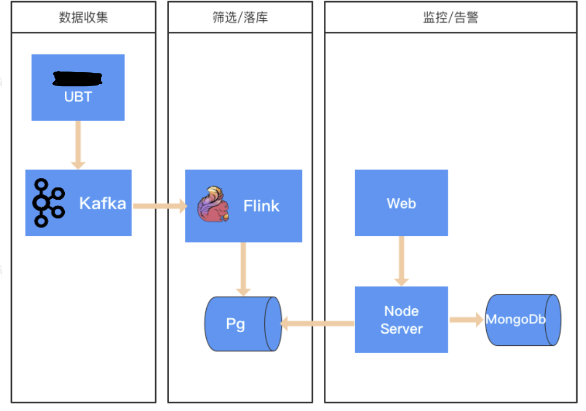
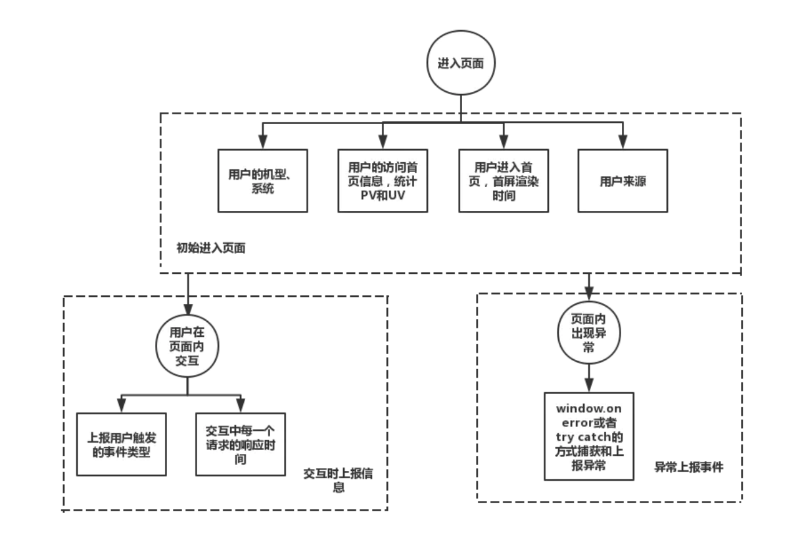
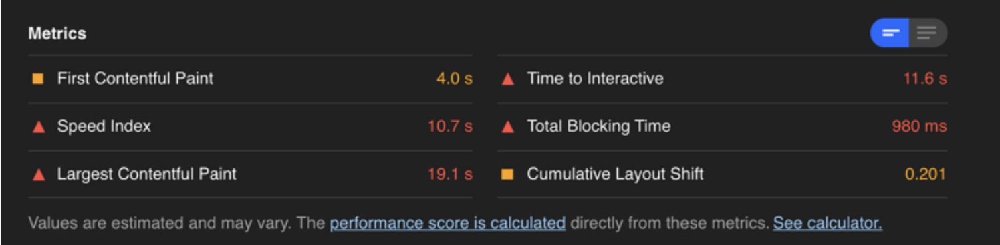
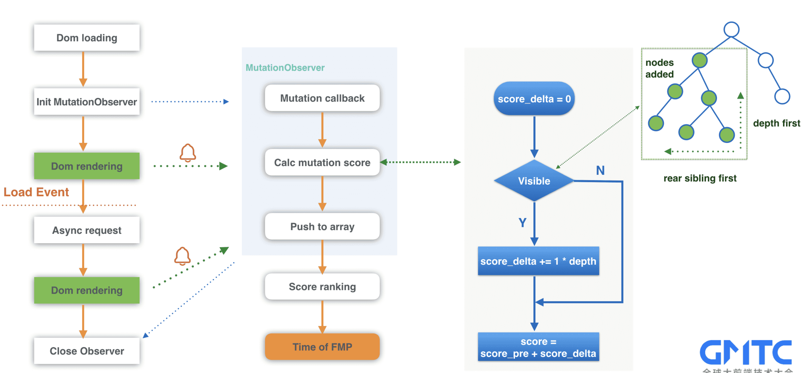

## 前言

### 背景
1. 研发人员对业务了解不够深入，对核心数据概念模糊
2. 研发人员对自己负责需求的意义、目的、效果等方面不够熟悉
3. 页面性能对用户体验而言十分关键。每次重构对页面性能的提升，仅靠工程师开发设备的测试数据是没有说服力的，需要有大量的真实数据用于验证
4. 资源挂了、加载出现异常，不能总靠用户投诉才后知后觉，需要主动报警

### 流程


kafka是一种高吞吐量的分布式发布订阅消息系统，她有如下特性：
- 通过O(1)的磁盘数据结构提供消息的持久化，这种结构对于即使数以TB的消息存储也能够保持长时间的稳定性能
- 高吞吐量：即使是非常普通的硬件kafka也可以支持每秒数十万的消息
- 支持通过kafka服务器和消费机集群来分区消息
- 支持Hadoop并行数据加载
卡夫卡的目的是提供一个发布订阅解决方案，它可以处理消费者规模的网站中的所有动作流数据。 这种动作（网页浏览，搜索和其他
用户的行动）是在现代网络上的许多社会功能的一个关键因素。 这些数据通常是由于吞吐量的要求而通过处理日志和日志聚合来解决。
 对于像Hadoop的一样的日志数据和离线分析系统，但又要求实时处理的限制，这是一个可行的解决方案。kafka的目的是通过Hadoop
 的并行加载机制来统一线上和离线的消息处理，也是为了通过集群机来提供实时的消费


Apache Flink是由Apache软件基金会开发的开源流处理框架，其核心是用Java和Scala编写的分布式流数据流引擎。Flink以数据
并行和流水线方式执行任意流数据程序，Flink的流水线运行时系统可以执行批处理和流处理程序。此外，Flink的运行时本身也支持
迭代算法的执行:
- Flink提供现成的源和接收连接器，包括Apache Kafka、Amazon Kinesis、HDFS和Apache Cassandra等
- Flink程序可以作为集群内的分布式系统运行，也可以以独立模式或在YARN、Mesos、基于Docker的环境和其他资源管理框架下进行部署
- 数据处理完成之后，我们还要为它指定数据的存储。我们可以从外部系统导入数据，亦可以将处理完的数据导入到外部系统，这个过程
称为Sink。同Connector类似，Flink官方提供了很多的Sink供用户使用，用户也可以通过实现接口自定义Sink

### 监控数据
首先我们需要明确一个产品或者网页，普遍需要监控和上报的数据。监控的分为三个阶段：用户进入网页首页、用户在网页内部交互和交
互中报错。每一个阶段需要监控和上报的数据如下图所示



## 监控页面性能
对于一个页面的性能采集我们主要关注两点
1. 首屏：页面首次开始渲染的时间
2. 白屏：用户可以消费页面内容的时间

### PerformanceTiming API
一个支持IE9以上及webkit内核浏览器中用于记录页面加载和解析过程中关键时间点的机制
``` js
// 内部属性
var performance = {  
    // memory 内存是非标准属性，只在 Chrome 有
    memory: {
        usedJSHeapSize:  16100000, // JS 对象（包括V8引擎内部对象）占用的内存，一定小于 totalJSHeapSize
        totalJSHeapSize: 35100000, // 可使用的内存
        jsHeapSizeLimit: 793000000 // 内存大小限制
    },
    navigation: {
        redirectCount: 0, // 如果有重定向的话，页面通过几次重定向跳转而来
        type: 0
        // 0   即 TYPE_NAVIGATENEXT 正常进入的页面（非刷新、非重定向等）
        // 1   即 TYPE_RELOAD       通过 window.location.reload() 刷新的页面
        // 2   即 TYPE_BACK_FORWARD 通过浏览器的前进后退按钮进入的页面（历史记录）
        // 255 即 TYPE_UNDEFINED    非以上方式进入的页面
    },
    timing: {
        // 在同一个浏览器上下文中，前一个网页（与当前页面不一定同域）unload 的时间戳，如果无前一个网页 unload ，则与 fetchStart 值相等
        navigationStart: 1441112691935,
 
        // 前一个网页（与当前页面同域）unload 的时间戳，如果无前一个网页 unload 或者前一个网页与当前页面不同域，则值为 0
        unloadEventStart: 0,
 
        // 和 unloadEventStart 相对应，返回前一个网页 unload 事件绑定的回调函数执行完毕的时间戳
        unloadEventEnd: 0,
        // ...........
    }
}
```
该属性的兼容性很好，但是在spa场景无法获取正确的首屏，spa页面在触发onload事件的时候只是渲染了一个空壳骨架屏

### FCP
首次内容绘制，FCP（First Contentful Paint），这个指标用于记录页面首次绘制文本、图片、非空白 Canvas 或 SVG 的时间
``` js
// 使用
var observer = new PerformanceObserver(function(list, obj) {
  var entries = list.getEntries();
  for (var i=0; i < entries.length; i++) {
    // Process "mark" and "frame" events
  }
});
observer.observe({entryTypes: ["paint"]});
```

### LCP
最大内容绘制，LCP（Largest Contentful Paint），用于记录视窗内最大的元素绘制的时间，该时间会随着页面渲染变化而变
化，因为页面中的最大元素在渲染过程中可能会发生改变，另外该指标会在用户第一次交互后停止记录
``` js
// 使用
var observer = new PerformanceObserver(function(list, obj) {
  var entries = list.getEntries();
  const lastentry = entries[entries.length -1];
  // 一些加载跨域图片资源的时候renderTime可能不存在
  lcp = lastentry.renderTime || lastentry.loadTime
});
observer.observe({type: 'largest-contentful-paint', buffered: true});
```

### TTI
首次可交互时间，TTI（Time to Interactive）。这个指标计算过程略微复杂，它需要满足以下几个条件
1. 从 FCP 指标后开始计算
2. 持续 5 秒内无长任务（执行时间超过 50 ms）且无两个以上正在进行中的 GET 请求
3. 往前回溯至 5 秒前的最后一个长任务结束的时间
对于用户交互（比如点击事件），推荐的响应时间是 100ms 以内。那么为了达成这个目标，推荐在空闲时间里执行任务不超过 50ms
（W3C 也有这样的标准规定），这样能在用户无感知的情况下响应用户的交互，否则就会造成延迟感

TTI 主要是通过跟踪耗时较长的任务来确定，设置PerformanceObserver观察类型为 longtask 的条目，然后可以根据耗时较长
的条目的startTime和duration，来大致确认页面处于idle的时间，从而确定 TTI 指标。Google希望将 TTI 指标标准化，并通
过 PerformanceObserver 在浏览器中公开，但目前并不支持。目前只能通过一个 polyfill，检测目前的 TTI，适用于所有支持
Long Tasks API 的浏览器。该 polyfill 公开 getFirstConsistentlyInteractive() 方法，后者返回使用 TTI 值进行
解析的 promise。用法如下所示：
``` js
// 首先是在首页头部head标签中设置PerformanceObserver，并指定监控类型为longtask
// collect the longtask
if (PerformanceLongTaskTiming) {
    window.__tti = {e: []};
    const observer = new PerformanceObserver((list) => {
        for (const entry of list.getEntries()) {
            // observe the longtask to get the time to interactive (TTI)
            if (entry.entryType === 'longtask') {
                window.__tti.e.concat(entry);
            }
        }
    });
    observer.observe({entryTypes: ['longtask']});
}
// 然后引入tti-polyfill.js(可通过npm包获取)，获取到tti的值
import ttiPolyfill from './path/to/tti-polyfill.js';
ttiPolyfill.getFirstConsistentlyInteractive().then((tti) => {
  // ...
});
```

你可以通过安装 Lighthouse 插件来获取如下指标


### FMP
针对这种情况Google lighthouse提出了FMP的概念，first meaning paint, 也就是主要内容(页面渲染过中元素增量最大的点)可见时间
根据这个我们可以分步骤实现：
- 通过MutationObserver监听页面元素变化
- 遍历每次新增的元素，并计算这些元素的得分总和
- 如果元素可见，得分为 1 * weight(权重), 如果元素不可见，得分为0
- 根据不同标签给出不同权重
``` js
function getElementImportanceWeight(node: Element) {
  if (node) {
    const ignoreContentTagNameList = ['SCRIPT', 'STYLE', 'META', 'HEAD']
    const vitalContentTagNameList = ['CANVAS', 'OBJECT', 'EMBED', 'VIDEO', 'SVG', 'IMG', 'IMAGE']
    if (ignoreContentTagNameList.indexOf(node.tagName) > -1) {
      return 0
    } else if (vitalContentTagNameList.indexOf(node.tagName) > -1) {
      return 2
    } else if (node.textContent) {
      return 1
    }
  }
  return 0
}
```
大体计算思路如下图，采用的是深度优先算法，如果子元素可见，那父元素可见，不再计算。 同样的，如果最后一个元素可见，那前
面的兄弟元素也可见。通过深度优先算法，性能有了大幅的提升


### 特殊情况
1. 如果页面还未渲染完成前用户进行了点击、滑动等交互，或者页面发生了切换，则视为页面渲染过程中出现了噪音、不上报性能
数据、只上报一个pv事件

2. 对于微信小程序或者支付宝小程序这种他们本身就没有dom元素我们可以通过对其触发渲染的方法setDate和requset做aop切面
统计在200ms内没有正在进行的请求并且没有页面渲染更新

3. 我们可以在小程序的page对象上进行封装，页面初始化的时候使用我们封装的方法来初始化，捕获原生request对其参数做处理，
处理的函数可单独抽离到埋点包中暴露出来例如trackHttp(req)

## 监控js异常

- 对于h5监控error、unhandledrejection事件
- 对于框架类型h5我们无法捕获到上面的事件，例如vue他自身内部对所有错误处理了都走到自己的errorhandle方法不会去触发错误，
我们可以通过vue.config.errorHandler配置错误事件处理也可以通过劫持console.error来处理
- 对于支付宝小程序微信小程序他们各自都有自己的全局错误捕获钩子可以在里面直接发送埋点记录处理，例如支付宝小程序有my.onError、
my.onUnhandledRejection 等监听事件

对于监控到的错误我们可以开始发送日志进行上报，可以对错误进行再次组装成新的格式上报方便后期处理过滤分类


## 网络监控
对h5页面的open、send、fetch等方法做切面，让每个请求都带上requestId方便后续链路追踪，这个由前端生产可以使用现有的包；

js-shortid是一个基于node.js的开源短ID的产生器， 其生成的短ID满足无序、不可预测、URL地址友好以及足够短且据有唯一的
基本特征，他由两个字符串构成—— 时间序号和多个随机数；

这时候我们也可以对请求成功后使用`window.performance.getEntriesByName(networkUrl)`来获取ssl等时间，加上requestid
一起进行埋点上报


## 埋点
上面介绍了前端监控的作用，那么如何实现前端监控呢，实现前端监控的步骤为：前端埋点和上报、数据处理和数据分析。首要的步骤就
是前端埋点和上报，也就是数据的收集阶段。数据收集的丰富性和准确性会影响对产品线上效果的判别结果，目前埋点主要有三种方式

1. 代码埋点，就是以嵌入代码的形式进行埋点，比如需要监控用户的点击事件，会选择在用户点击时，插入一段代码，保存这个监听行
为或者直接将监听行为以某一种数据格式直接传递给server端。此外比如需要统计产品的PV和UV的时候，需要在网页的初始化时，发送
用户的访问信息等（优点：可以在任意时刻，精确的发送或保存所需要的数据信息； 缺点： 工作量较大，每一个组件的埋点都需要添加相应的代码）

2. 可视化埋点，通过可视化交互的手段，代替代码埋点。将业务代码和埋点代码分离，提供一个可视化交互的页面，输入为业务代码，通
过这个可视化系统，可以在业务代码中自定义的增加埋点事件等等，最后输出的代码耦合了业务代码和埋点代码（可视化埋点可以埋点的控件有限，不能手动定制）

3. 无埋点并不是说不需要埋点，而是全部埋点，前端的任意一个事件都被绑定一个标识，所有的事件都别记录下来。通过定期上传记录
文件，配合文件解析，解析出来我们想要的数据，并生成可视化报告供专业人员分析因此实现“无埋点”统计（优点： 由于采集的是全量
数据，所以产品迭代过程中是不需要关注埋点逻辑的，也不会出现漏埋、误埋等现象； 缺点：无埋点采集全量数据，给数据传输和服务
器增加压力而且无法灵活的定制各个事件所需要上传的数据）


### 上报哪些数据
提供一个大概的数据格式
``` js
{
	info = [
    {
      logerType: "network",		 										// 标示日志类型
      timestamp: { // 时间戳，格式后端要求
      	seconds: 1569386598, 									// 单位秒
        nanos: 0, 														// 纳秒，获取不到统一为 0
      }, 
      logid: "ididiidididiid", // 随机 id表示此次日志的唯一性 
      info: {
        eventId: "eventid",									// 事件标识,我们可以标记为页面埋点，按钮埋点或者自定义的
        sessionId: "ididiidididiid", // 会话 id
        sequenceId: "1", 											// 序列 id，自增，后面可以更多参数
      },
      baseparams: { 													// 字段值必须字符串
        appName: "limingkang",        	//应用名称
        appVersion: "1.0.0",                 //APP版本
        platform: "alipay",										// 应用程序的终端类型
        os: "iOS",                            // 设备操作系统类型，iOS，Android
        osVersion: "6.0.1",                   // 设备系统版本
        manufacturer: "IPHONE",           	  // 设备品牌
        deviceModel: "iPhone 6",        		  // 设备类型
        network: "WIFI",                   	  // APP运行的网络环境，2G，3G，4G，WIFI
        carrier: "中国移动",,                   // 电信运营商
        userGuid: "标示用户唯一id", //用户id
        sdkVersion: "1.19.0",                 // UBT的SDK版本
        screenHeight: "603",               	  // 屏幕高度
        screenWidth: "375",                	  // 屏幕宽度
        adCode: "330106", 										// GPS定位县级code
        cityCode: "0571", 										// GPS定位城市code
        latitude: "30.274108", 								// GPS定位纬度
        longitude: "120.128961", 							// GPS定位经度
        ip: "43.254.220.32",									// 访问用户的IP地址
        language: "zh-Hans",									// 语言
        releaseVersion: "20190831",						// 发布版本(仅支付宝小程序)
        ssid: "uuid_2019-09-26", // 唯一用户设备标识, 写入缓存每次都取他
        url: "www.a.c/c", 						// 用户访问页面的URL
        version: "10.1.55", 									// 系统版本
      },
    }
  ]
}
```
同时我们的埋点库也会暴露一些方法，支持绑定一些其他想要自定义的值，从而更好的增加可拓展性


### 数据上报
sentry是一个实时事件日志记录和聚合平台，我们这边采取自定义的方式，使用自己的方法去发送，首先我们得结局数据持久化的问题，
不能用户每一个操作后，就立即将该行为日志传到服务器，对于具有大量用户同时在线的应用，如果用户一操作就立即上传日志，无异
于对日志服务器进行DDOS攻击。因此，我们先将这些日志存储在用户客户端本地，达到一定条件之后，再同时打包上传一组日志，目前可
用的持久化方案可选项也比较多了，主要有`Cookie、localStorage、sessionStorage、IndexedDB、webSQL 、FileSystem`等
|  存储方式   | cookie  | localStorage  | sessionStorage  | IndexedDB  | webSQL  | FileSystem  |
|  ----  | ----  | ----  | ----  | ----  | ----  | ----  |
| 类型  | key-value | key-value | NoSQL | SQL |  |  |
| 数据格式  | string | string | string | object |  |  |
| 容量  | 4k | 5M | 5M | 500M | 60M |  |
| 进程  | 同步 | 同步 | 同步 | 异步 | 异步 |  |
| 检索  |  | key | key,index | field | field |  |
| 性能  |  | 读快写慢 |  | 读快写慢 |  |  |
- 综合之后，IndexedDB是最好的选择，它具有容量大、异步的优势，异步的特性保证它不会对界面的渲染产生阻塞。而且IndexedDB是分
库的，每个库又分store，还能按照索引进行查询，具有完整的数据库管理思维，比localStorage更适合做结构化数据管理。但是它有
一个缺点，就是api非常复杂，不像localStorage那么简单直接。针对这一点，我们可以使用hello-indexeddb这个工具，它用
Promise对复杂api进行来封装，简化操作，使IndexedDB的使用也能做到localStorage一样便捷。另外，IndexedDB是被广泛支
持的HTML5标准，兼容大部分浏览器，因此不用担心它的发展前景

- 对于小程序这种我们只能通过写入localStorage来实现，注意要加上节流，否则写入太多此会导致手机耗电很快

- 我们对于不同类型的日志采用不同的上报策略，像网络异常、js error这些日志需要立即上报，对于页面埋点性能埋点我们采用合并上
报的策略，一个是每隔30s发送数据，另一个是队列里超过10条也会上报，我们可以暴露方法，让使用者可以自由配置这个时间和条数

- 对于性能采集库我们在初始化的时候可以先请求cdn上一个配置文件（该文件采用协商缓存），该文件里面有采样率，前端生产随机数
比较采样率来确定是否上报数据，因为我们只是关注总体的性能，不必每个人每次都上报


